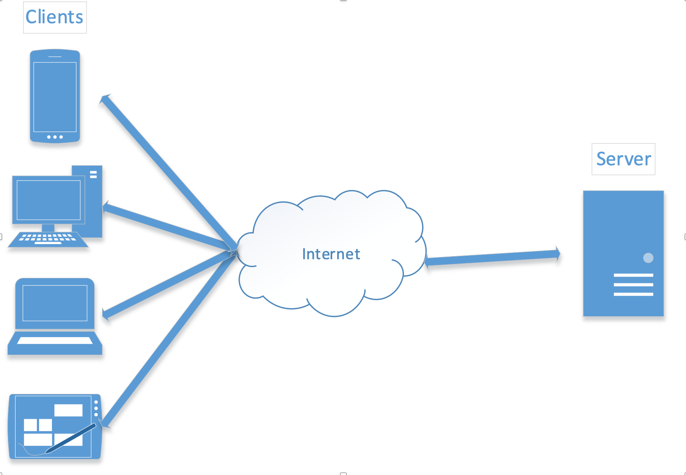

# 1

# Overview of Network Programming

As we embark on the journey through the intricate landscape of network programming within the realm of C#, let us pause to appreciate the robust foundation and tools at our disposal. Network programming is the cornerstone of the interconnected world we navigate daily, from browsing web pages and sending emails to streaming multimedia and beyond. In this chapter, "Overview of Network Programming," we aim to demystify the complexities and equip you with the fundamental knowledge and skills necessary to harness the full potential of network applications in C#.

We introduce you to the core concepts of network programming, guiding you through the essential terminology and principles that form the bedrock of all networked systems. As we delve into the myriad of network protocols, you will gain insight into the conventions governing communication across disparate devices and applications, understanding how these invisible pathways facilitate seamless data exchange.

Moving forward, we will explore the client-server architecture, a pervasive paradigm that underpins much of the internet and many intranet applications you will interact with as a network programmer. Here, you will learn how clients and servers communicate, the role each plays, and how to effectively implement their interactions.

In the segment on socket programming basics, the abstractions fade to reveal the gears of network communication—sockets. You will learn how these endpoints for sending and receiving data operate and how they establish connections and facilitate communication over a network.

As you progress through this chapter, remember the practical applications of each concept and how they come together to form the larger picture of network programming within the C# ecosystem. Let's embark on this journey to unlock the powerful capabilities of networked applications, ready to connect systems and people across the globe.

In this chapter, we are going to cover the following main topics:

- Introduction to network programming
- Network protocols and communication
- Client-server architecture
- Socket programming basics
- Network programming in C# and .NET

# Technical requirements

A foundational understanding of C# and .NET is essential to grasp the concepts presented in this book thoroughly. Readers should be comfortable with C# syntax, object-oriented programming principles, and basic software development concepts. Familiarity with .NET libraries and its ecosystem will significantly enhance your learning experience.

For hands-on experience and practical application, I've created a dedicated GitHub repository for this book. Each chapter features a collection of code samples and projects corresponding to the discussed concepts. You can find the repository at the book's GitHub location: <https://github.com/cwoodruff/book-network-programming-csharp>. Feel free to clone, fork, and explore the repository at your own pace.

As you navigate through the chapters, refer to the repository to supplement your understanding and practice what you've learned.

# Introduction to network programming

Network programming is pivotal in modern software development, enabling applications to communicate seamlessly over various networks. This section will delve into the core concepts and significance of network programming within the broader context of software engineering.

## Definition and importance

Network programming involves designing and implementing software that allows different applications to communicate and exchange data over computer networks. This communication can occur over **local area networks** ( **LANs** ), **wide area networks** ( **WANs** ), the Internet, or any combination thereof. The significance of network programming lies in its ability to enable distributed computing, facilitating collaboration, data sharing, and remote access.

Network programming forms the backbone of the digital world, powering a myriad of applications ranging from simple web browsing to complex cloud-based services. Network programming is critical in creating robust, efficient, and scalable software solutions as the world becomes increasingly interconnected.

Network programming and network protocols are intimately connected in the world of computer networking. Network programming refers to the practice of developing software applications that can communicate and exchange data across computer networks. These applications rely on a set of rules and conventions known as network protocols. Network protocols define the standardized methods and formats for data transmission, ensuring that different devices and software can understand and interact with each other seamlessly. In essence, network programming leverages these network protocols to enable effective communication and collaboration between devices and systems over networks, making it a fundamental building block of modern networked applications.

## What is a network protocol?

Network protocols are the rules and conventions governing communication between devices and applications over networks. Some fundamental protocols include **Transmission Control Protocol/Internet Protocol** ( **TCP/IP** ), **User Datagram Protocol** ( **UDP** ), **Hypertext Transfer Protocol** ( **HTTP** ), and **File Transfer Protocol** ( **FTP** ).

TCP/IP provides reliable, ordered, and error-checked data transmission, making it suitable for applications that require data integrity, such as web browsing and email. On the other hand, UDP offers fast but unreliable data transmission, making it ideal for real-time communication scenarios like video conferencing and online gaming. HTTP facilitates communication between web clients and servers, enabling the transfer of web pages and resources. FTP specializes in file transfer, serving as the foundation for sharing files over networks.

## Where is network programming used?

Network programming is ubiquitous, catering to a diverse range of use cases. One common scenario is client-server applications, where clients request services from servers over a network. Web services, another prevalent application, utilize network programming to facilitate communication between different software systems, enabling seamless integration and data sharing.

Real-time communication applications, including instant messaging and voice/video calls, heavily rely on network programming to ensure swift data exchange. In **Internet of Things** ( **IoT** ), network programming enables smart devices to communicate, gather data, and make intelligent decisions. Cloud-based systems leverage network programming to provide scalable, on-demand services to users across the globe.

## Key concepts to understand

A foundational understanding of key concepts is essential for successful network programming. Sockets, for instance, form the endpoints for sending and receiving data across a network. IP addressing and port numbers identify devices and services on a network, enabling precise communication. Packet transmission involves breaking data into smaller packets for efficient transmission and reassembling them at the destination. Data serialization ensures consistency during transmission, allowing different platforms and languages to exchange information seamlessly.

## Empowering network programming with .NET and C#

C# and .NET provide a robust environment for network programming. C# offers a combination of simplicity and power, making it accessible for beginners and powerful enough for experienced developers. The extensive library ecosystem within .NET simplifies network-related operations, offering pre-built components for tasks like creating sockets, handling protocols, and managing data serialization.

Understanding the significance of network programming, the fundamental network protocols, everyday use cases, key concepts, and language/platform support is crucial for developing effective and efficient network applications. Let's start by understanding how developers leverage network protocols for their application communications.

# Network protocols and communication

Understanding the intricacies of network protocols and communication is essential in network programming. This section will dive into the core concepts that enable devices to communicate effectively over networks.

## Network protocols from 10,000 feet

In the vast and intricate world of computer networks, a fundamental principle underpins the harmonious communication between billions of devices: network protocols. Just as human communication requires understanding and abiding by specific linguistic and social rules, computer systems and networks rely on specific standards or 'protocols' to exchange information successfully.

### What are network protocols?

At their core, network protocols are standardized rules and procedures that determine how data is transmitted and received over the network. These rules ensure devices communicate efficiently, regardless of their make or model. Think of protocols as the grammar rules of a language; just as adhering to grammar ensures clarity and understanding between people, sticking to network protocols ensures smooth and error-free communication between devices.

### How do protocols facilitate communication?

Imagine the simple act of accessing a webpage. This action involves multiple layers of communication, each governed by its own protocol:

- **Addressing** : Your computer must know where to send the request. The IP provides an addressing system, assigning a unique IP address to each device on the network.
- **Data Transfer** : The TCP breaks down your request into smaller data packets, ensures their correct and timely delivery, and assembles them back at the receiving end.
- **Application Interaction** : The HTTP, or its secure variant HTTPS, defines how web servers and browsers communicate, ensuring your browser can fetch and display the webpage.

Each of these protocols works at a different network layer, and each has its own rules to ensure data is handled correctly at that layer.

### Why are there so many protocols?

Different communication scenarios require different sets of rules. For instance:

- File transfers, like FTP, need protocols that ensure complete and error-free data transfer.
- Streaming live video, where a minor data loss might be acceptable, but speed is crucial, might use the UDP.
- Sending emails employs the Simple Mail Transfer Protocol (SMTP), which sets rules for routing and delivering electronic mail.

Thus, many protocols arise from the myriad of communication requirements in today's digital age.

### The importance of standardization

Without standardization, the digital world as we know it would be in chaos. Each manufacturer might have its own protocols, making inter-device communication a nightmare. Recognizing this early on, organizations like the **Internet Engineering Task Force** ( **IETF** ) and the **Institute of Electrical and Electronics Engineers** ( **IEEE** ) took the helm, providing standard definitions for many of the network protocols we use today.

As the digital age continues to evolve, the significance of network protocols in ensuring seamless communication becomes ever more evident. Just as languages bridge the communication gap between people from different regions, network protocols bridge the gap between devices, ensuring they can _speak_ to each other with clarity and purpose.

## TCP/IP protocol suite

The foundation of the modern Internet, TCP/IP, is a set of communication protocols that dictate how data should travel across networks. These protocols help define how data packets should be shaped and delivered and how they should be addressed and routed from the sender to the destination. Delving into its history and architecture will provide insights into why it has remained a fundamental technology for global communications.

### Tracking the origins of TCP/IP

In the late 1960s, the U.S. **Department of Defense's Advanced Research Projects Agency** ( **DARPA** ) initiated a project to develop a revolutionary communication network called ARPANET to ensure communication continuity even during nuclear attacks. As the project progressed, the need for a reliable and scalable communication protocol became evident. This need led to the development of the first iteration of what we know today as TCP/IP.

### Protocol layers of TCP/IP

TCP/IP operates on a layered architecture. This modular approach breaks down the communication process into specific tasks, and each layer has its responsibility.

- **Physical Layer** : This layer is mainly concerned with host-to-host data exchange within the network, managing communication between two devices by defining both the transmission medium and how data, represented as bits, is transmitted. It deals with data in the form of bits. This layer mainly handles the host-to-host communication in the network. It defines the transmission medium and mode of communication between two devices.
- **Link Layer (or Network Interface Layer)**: It deals with the physical connection and data link aspects, ensuring that data is sent and received over the physical medium, like Ethernet or Wi-Fi.
- **Internet (or IP) Layer**: This layer handles addressing and routing. It ensures data packets are sent to the correct destination based on IP addresses.
- **Transport Layer** : This is where TCP and UDP (User Datagram Protocol) reside. While TCP ensures reliable and ordered data delivery, UDP is for quick, connectionless communication.
- **Application Layer** : Here, various application protocols like HTTP, FTP, and SMTP operate. This layer directly interacts with end-user applications and is responsible for data formatting, encryption, and other session management.

<figcaption align = "center"><b>TCP/IP Protocol Layer</b></figcaption>

This layered architecture enables modular design, where each layer contributes specific functionalities, resulting in the robust and scalable network communication we rely on today. In the diagram illustrated above, showing the layered architecture of the TCP/IP protocol, each layer transitions seamlessly into the next, representing a hierarchy of functions essential for network communication. Starting at the application layer, protocols like HTTP and FTP interact with end-user applications, preparing data for communication. This data is then encapsulated into segments by the transport layer, where TCP or UDP manages the trustworthiness and flow of the data between hosts. Following this, the internet layer takes charge, wrapping the data with IP addresses through the Internet Protocol, ensuring it reaches the correct destination across the network. Finally, the link layer translates these IP packets into frames appropriate for the physical network medium, handling the data transmission over physical hardware such as Ethernet. Each layer serves a precise purpose, and together, they form the framework that allows data to be carried from one device to another across diverse and complex networks.

### TCP and IP: The Dynamic Duo

TCP and IP are two distinct but intertwined protocols within the suite of TCP/IP. IP ensures that data packets are transported from the originating host to the intended recipient using IP addresses to navigate the delivery process. IP is responsible for delivering packets from the source host to the destination host based on the IP addresses. It does not guarantee delivery, nor does it ensure correct sequence or avoid duplicate delivery.

On the other hand, TCP is all about reliability. It ensures data integrity and delivers data in the correct order. By establishing connections, sequencing data packets, and acknowledging received packets, TCP ensures that communication is reliable and error-free.

### Significance in today's world

Decades after its inception, TCP/IP remains at the heart of the Internet and intranet infrastructure. Its robustness, adaptability, and scalability have allowed it to accommodate global communications' ever-growing and ever-changing nature. From browsing web pages and streaming videos to conducting financial transactions and managing critical infrastructure, TCP/IP plays an integral role.

As the world becomes more interconnected, understanding the intricacies of TCP/IP becomes even more paramount. It's not just the backbone of the Internet but also embodies the principles of open communication, interoperability, and resilience.

## What other network protocols are used today?

The vast digital ecosystem we navigate daily is facilitated by many rules and conventions, collectively known as protocols. Within the multilayered networking structure, the transport layer holds a pivotal role, ensuring effective and efficient data communication between devices. One of the standout stars of this layer is the UDP. But, just like an actor can't perform a play alone, UDP is just one of the many transport protocols in the ensemble, each playing its unique part.

### Understanding UDP

Its simplicity and speed define UDP. Unlike its counterpart, the TCP, which emphasizes reliability and order, UDP sends data packets without establishing a connection or ensuring they are received in order. Its _fire-and-forget_ methodology is what makes it both efficient and sometimes unreliable. UDP can transmit data faster without the overhead of establishing connections or verifying data receipt.

### Where does UDP shine?

Streaming services, online gaming, and **Voice over Internet Protocol** ( **VoIP** ) are arenas where UDP is most favored. In these scenarios, speed is of the essence. For instance, when watching a live stream, getting the data quickly is more important than every packet is received. A few missing frames in a video or milliseconds in a voice call won't significantly disrupt the user experience, making UDP the protocol of choice.

Here are a few other transport protocols:

- **Stream Control Transmission Protocol (SCTP)**: Combining the best of TCP and UDP, SCTP can send multiple data streams at once, making it particularly effective for transporting multimedia data. It's both reliable and preserves message boundaries, unlike TCP.
- **Datagram Congestion Control Protocol (DCCP)**: This protocol aims to offer a middle ground between TCP and UDP. It's designed for applications that need more than UDP's best-effort service but less than TCP's guaranteed delivery.

Overall, streaming network protocols play a crucial role in enabling high-quality, real-time content delivery over the internet and contribute to the seamless user experiences we encounter in various online services and applications.

### Why do we need multiple transport protocols?

Different digital interactions have varied requirements. While sending an email, it's crucial that every bit of data gets to the recipient in order. But when playing an online game, timely data transfer is more important than perfect accuracy. By having a repertoire of transport protocols, the digital realm can cater to diverse communication needs, ensuring that users have the best possible experience.

With its ensemble of protocols, the transport layer exemplifies the versatility and adaptability of digital communication systems. While UDP stands out with its simplicity and speed, it is just a part of the bigger picture, complemented by other protocols designed to cater to specific communication needs. As technology evolves and our digital interactions diversify, understanding these protocols becomes increasingly essential in harnessing the full potential of our interconnected world.

## Application layer protocols

In the intricate realm of networking, the application layer stands as the interface between the user and the underlying network processes. Here, we find application layer protocols, the unsung heroes that govern software-based communications, ensuring that data is properly packaged, transmitted, and interpreted. While the layers beneath it handle aspects like routing, delivery, and error checking, the application layer focuses on user services and end-to-end communication.

### Decoding application layer protocols

Application layer protocols define the rules and conventions for network services. These protocols aren't necessarily about the application itself (like a web browser or email client) but rather the conventions they use to communicate over a network.

The following list discusses some prominent protocols of the application layer:

- **HTTP/HTTPS** : These rules govern web browsers and servers, making websites accessible. HTTP fetches web pages, while HTTPS does the same with added encryption for security.
- **FTP** : As the name suggests, FTP is about transferring files between a client and a server, allowing for uploads and downloads.
- **SMTP** : While SMTP is used for sending emails, **Post Office Protocol** ( **POP** ) and **Internet Message Access Protocol** ( **IMAP** ) are for receiving. They ensure your emails find their way to the right inboxes.
- **Domain Name System (DNS)**: Ever wondered how website names (like [www.example.com](https://www.example.com)) translate to IP addresses? That's DNS in action, resolving domain names into IPs.
- **Dynamic Host Configuration Protocol (DHCP)**: DHCP automatically assigns IP addresses to devices on a network, making network management more efficient.

These protocols enable the creation, exchange, and interpretation of data between software applications running on different devices, facilitating seamless communication over networks. Their role in shaping how we access and interact with digital services and content across the internet is fundamental, making them a cornerstone of modern networked environments.

### Why are application layer protocols crucial?

While the transport and internet layers (with protocols like TCP, UDP, and IP) ensure data reaches the right device, the application layer guarantees that the data is meaningful and usable to applications. For instance, while TCP ensures a file gets to your computer, FTP ensures the file is correctly fetched from a server.

The application layer is also the realm where most encryption for security occurs. Protocols like HTTPS and secure versions of FTP ensure data confidentiality and integrity.

## Communication models

Different communication models shape network programming. In the client-server model, clients request services from servers, creating a clear division of roles. Peer-to-peer models enable devices to communicate directly, which is suitable for applications like file sharing. Publish-subscribe models, prevalent in real-time communication, involve subscribers receiving publisher updates. Each model offers distinct advantages, allowing developers to choose the most fitting approach based on the application's requirements.

Understanding these fundamentals is vital for developing practical network applications. This knowledge forms the bedrock for further exploration in network programming, from the reliability of TCP/IP to the speed of UDP, from application-specific protocols to versatile communication models.

# Client-server architecture

In the landscape of network programming, the client-server architecture plays a pivotal role, acting as the backbone for countless applications. This section delves into the intricacies of this architecture, illuminating its core components and mechanisms.

## Definition and concept

Client-server architecture serves as the blueprint for communication between devices in network programming. It embodies a clear division of responsibilities: clients initiate requests, while servers respond with the requested resources or services. This separation streamlines application development by enabling modular design, enhancing security, and optimizing resource utilization. The architecture fosters collaboration between devices regardless of their geographical locations, underpinning the foundation of modern distributed computing.

<figcaption align = "center"><b>Client-Server Model</b></figcaption>

This architecture (seen in _Figure 1.2_) enables efficient distribution of tasks, with servers handling resource-intensive processes and clients focusing on user interfaces and interactions. It forms the backbone of modern networked applications, allowing for scalable, centralized, and secure data processing and access in various domains, from web hosting to database management.

## Client role

Clients, the initiators of communication, undertake vital tasks within this architecture. They establish connections with servers, sending well-formed requests encapsulating their needs. Clients are responsible for interpreting server responses, extracting the relevant information, and rendering it in a human-readable format. Whether a web browser requests a webpage or a mobile app fetches data from a remote database, the client's role is pivotal in driving interactions.

## Server role

Servers are the backbone of the client-server architecture, perpetually listening for incoming requests. Upon receiving a request, servers decipher its content, process the necessary operations, and formulate appropriate responses. These responses, tailored to meet client requests, are dispatched for further transmission. Servers can range from web servers handling HTTP requests to database servers retrieving data or executing operations on behalf of clients.

## The connection of client and server: Request-response model

The request-response model epitomizes client-server interactions. Clients articulate their needs through well-structured requests containing specific instructions or data. Servers analyze these requests, execute the corresponding operations, and craft responses tailored to clients' needs. This model is foundational across various applications, from retrieving web pages to fetching real-time updates. It embodies the dynamic dance of communication, where clients and servers exchange information in a structured and efficient manner.

## Scalability and load balancing

As applications grow in complexity and popularity, ensuring scalability becomes paramount. Scaling up involves accommodating a surge in concurrent clients. Load balancing, a technique leveraging multiple servers, evenly distributes incoming requests. This practice optimizes resource utilization and prevents individual servers from becoming overwhelmed. By seamlessly directing traffic among servers, load balancing guarantees responsiveness, reliability, and efficient handling of requests even under heavy loads.

Client-server architecture navigates through the heart of network programming. It uncovers the symbiotic relationship between clients and servers, the foundation of applications spanning from web browsing to cloud computing. Understanding these architectural principles is vital for anyone delving into the realm of network programming. From crafting robust client interactions to ensuring the resilience of servers, this section lays the groundwork for building effective network applications.

# Socket programming basics

The realm of network programming rests upon the sturdy shoulders of sockets, the linchpin of communication between devices. This section unveils the foundational principles of socket programming, encompassing their varied types, APIs, addressing nuances and lifecycle intricacies.

Sockets, akin to digital portals, enable applications to establish pathways for communication over networks. Think of them as the virtual conduits connecting devices, where data flows to and from seamlessly. They serve as the bridge between local and remote applications, allowing data transmission in both directions. Whether sending a request for a web page or streaming multimedia content, sockets facilitate these exchanges, embodying the quintessential essence of network programming.

Within the realm of sockets, two prominent types govern the scene:

- **TCP sockets** prioritize reliability, ensuring data arrives intact and in the correct order.
- **UDP sockets** favor swiftness, ideal for real-time communication scenarios where a minor loss of data packets is permissible.

The choice between these socket types hinges on the application's specific requirements, guiding developers towards the most suitable fit.

## Socket APIs and libraries

To traverse the intricate labyrinth of socket programming, one requires a reliable guide - the socket APIs and libraries. For our journey through C# 12 and .NET 8, these APIs are the backbone of socket interactions. With them, developers can shape and control sockets, harnessing the power to create, bind, connect, send, and receive data with surgical precision. These APIs from .NET 8 encapsulate the intricate details, rendering socket programming accessible to those who wield them.

Imagine sockets as destinations on a global map, each marked with an IP address and a port number. Socket addressing, a cardinal principle, enables devices to find one another amidst the digital sprawl. The IP address signifies the target's digital location, while the port number determines the specific entrance point to connect. Together, they facilitate communication routes, ensuring that data reaches the intended recipient unerringly.

Much like life itself, sockets have their own lifecycle. Birthed through creation, they establish connections to fulfill their purpose. They live their lives transmitting data, embodying the core of network communication. As time elapses, sockets, like their mortal counterparts, reach the end of their journey and must be closed. Managing this lifecycle efficiently is imperative to avoid resource wastage and potential errors, ensuring a smooth passage of data.

In summation, the "Socket Programming Basics" section unfurls the rudiments of network programming. It unravels the enigma of sockets, offering a panoramic view of their roles, types, APIs, addresses, and life cycles. This understanding serves as the bedrock for the aspiring network programmer, laying the groundwork for subsequent chapters that delve deeper into the intricacies of network programming.

# Network programming in C# and .NET

Within network programming, C# 12 and .NET 8 stand as pillars of development, offering a comprehensive toolkit for crafting robust and efficient network applications. The book's primary purpose is to serve as a gateway to understanding how C# and .NET empower developers to harness the potential of network programming.

## What will we use to code in this book?

C# 12, a modern and versatile programming language, is the cornerstone of network programming in the .NET 8 universe. Its concise syntax, object-oriented paradigm, and seamless integration with the .NET make it a natural choice for developing network applications. .NET is a powerhouse of libraries, classes, and tools designed to simplify network programming tasks. Together, C# and .NET form a harmonious pair, facilitating the creation of applications that communicate across networks with finesse.

## Network libraries in .net that we will use

.NET houses an array of specialized libraries tailored to different network programming scenarios. The System.Net.Sockets library lays the foundation for low-level socket programming, enabling precise control over data transmission. For those seeking higher-level abstractions, the System.Net library offers a more user-friendly interface for network interactions. Further, the System.Net.Http library caters to the world of HTTP communication, which is vital for web-based applications. Each library equips developers with the tools to sculpt network-enabled applications easily.

## Asynchronous programming with Async/Await in C#

In the realm of network programming, responsiveness is paramount. To this end, asynchronous programming steps into the limelight. The async/await keywords in C# revolutionize network programming by enabling developers to create non-blocking code that keeps applications responsive while waiting for data to arrive. C# and .NET seamlessly integrate asynchronous programming, providing built-in mechanisms to handle asynchronous operations efficiently.

## Control of protocols and formats using C#

Network programming is a multilingual conversation, with different devices conversing in diverse protocols and data formats. C# and .NET are adept at understanding this myriad of languages. Whether it's the reliable TCP/IP, the swift UDP, the universally used HTTP, or the human-readable JSON and XML, C# and .NET offer support for handling these protocols and formats seamlessly. This ability ensures network applications can communicate effectively with various devices and systems.

## What frameworks and libraries do .NET developers use?

C# and .NET don't just stop at the basics; they venture into specialized territories with frameworks and libraries catered to specific network programming needs. **SignalR**, a real-time communication framework, empowers developers to create applications sharing data instantly. **gRPC** facilitates efficient remote procedure calls, which is essential for distributed systems. **MQTT**, designed for the IoT, provides a seamless communication channel for IoT devices. These frameworks exemplify the extensibility of C# and .NET in catering to diverse network programming scenarios.

By mastering the tools and libraries they offer, developers gain the capability to craft sophisticated network applications that leverage the power of modern programming. This knowledge paves the way for traversing the intricate pathways of network programming explored in subsequent chapters.

# Summary

Throughout this chapter, we've explored the significance of network programming in modern software development, critical network protocols, everyday use cases, and fundamental concepts such as sockets, IP addressing, and data serialization. These lessons are invaluable for anyone aiming to design, develop, and maintain networked applications, as they form the basis for efficient and secure communication in distributed systems.

As we move forward to the next chapter, _Fundamentals of Networking Concepts_, we will delve deeper into the infrastructure that underlies network programming. This chapter will introduce key networking terminology, explore the intricacies of IP addressing and subnetting, and shed light on routing, network topologies, and network protocols. Understanding these networking fundamentals will provide a solid framework for mastering network programming and designing robust, efficient, and scalable networked applications.
