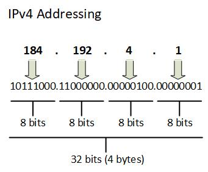
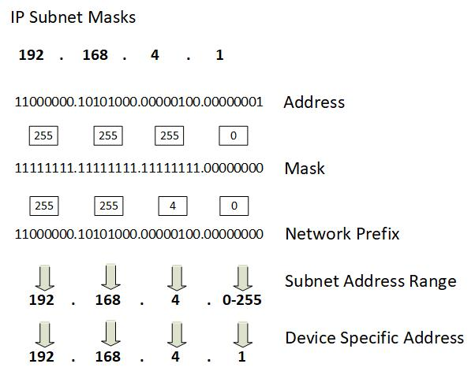
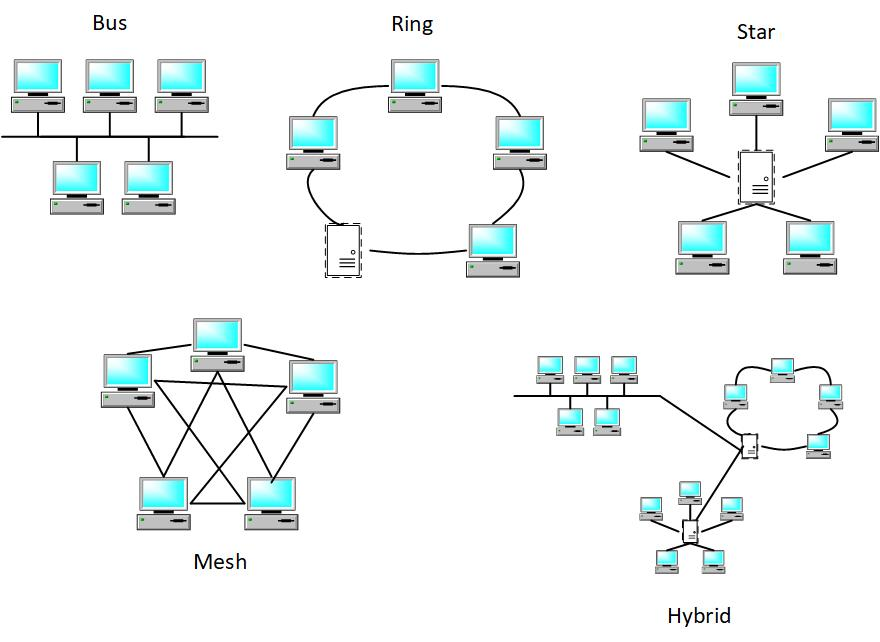
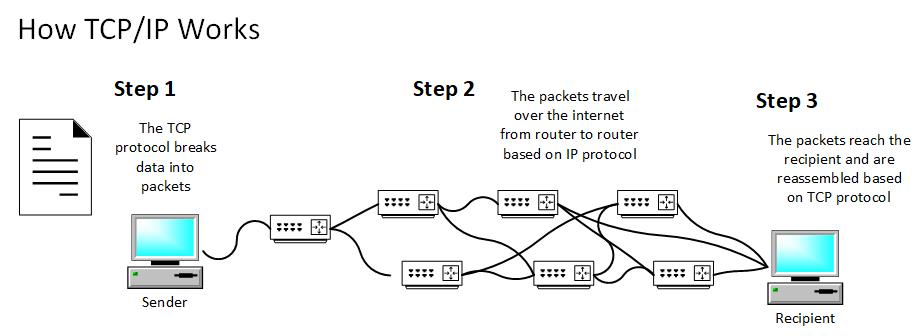

chapter02.md

---
label: Chapter 2
layout: page

order: 100

# 2

# Fundamentals of Networking Concepts

In the ever-connected digital world, where devices seamlessly communicate across distances and oceans, networking concepts reign supreme. They form the invisible threads that weave our global village together, enabling information flow, collaboration, and innovation. Welcome to the realm of networking, where understanding the core concepts is a gateway to harnessing the full potential of the digital age.

Imagine a world without networks—the internet as a mere fantasy, emails as unsent letters, and streaming as an unattainable dream. Networking concepts are the bedrock of this interconnected reality. They underpin every digital interaction, from when you send a text to when you access cloud services. Understanding networking concepts isn't just beneficial—it's essential. For aspiring developers, network engineers, or anyone intrigued by technology's inner workings, mastering these concepts is akin to wielding the tools of a digital architect. They are the foundation upon which reliable, efficient, and secure network applications are built.

At its core, networking is about connecting. It's about devices transcending physical boundaries to exchange information, transforming our world into a global village. Networks are the arteries through which data flows, enabling your device to share a cat video, retrieve crucial business data, or facilitate a virtual family reunion. Nodes, the entities connected within a network, could be anything from your smartphone to a data center housing powerful servers. And the data? It travels like invisible messengers, riding the currents of communication protocols, shaping our digital lives.

To journey through the world of networking, you need to speak its language. Terms like IP addresses, the digital identities of devices, guide data to its rightful destinations. Subnets, like neighborhoods within a city, ensure efficient data routing. Routers act as traffic controllers, directing data along the most efficient paths. Switches, on the other hand, ensure data reaches its intended recipient within a local network. And protocols? They're the rules of engagement, dictating how devices communicate and data travels. This vocabulary isn't just jargon—it's the essential networking lexicon.

As we dive deeper into this chapter, we aim to equip you with a fundamental understanding of networking concepts. By the end, you'll be able to decipher the mysteries of IP addressing, navigate the intricacies of subnets, and comprehend the roles of routers and switches. These insights give you the tools to conceptualize, design, and troubleshoot network applications confidently.

Our journey through networking concepts will follow a clear path. We'll start by dissecting the IP addressing and subnetting puzzle, understanding how devices find each other in the vast digital landscape. From there, we'll venture into the world of routing and network topologies, exploring how data navigates through the intricate web of networks. We'll then unravel the tapestry of network protocols and communication, discovering the protocols that enable seamless data exchange. By the chapter's end, you'll emerge with a solid grasp of the fundamentals, ready to build your connections in the digital realm.

In the following pages, we'll embark on a voyage through the essentials of networking concepts. Buckle up, for the digital highways are waiting to be explored, and the destinations are limited only by your imagination.

In this chapter, we are going to cover the following main topics:

- IP addressing and subnetting
- Routing and network topologies
- Network protocols and communication
- Network services and ports

# IP addressing and subnetting

At its core, IP addressing is the mechanism that grants distinct identities to each device within a network, much like street addresses for our physical locations. Here, we embark on an enlightening journey through the realms of IP addresses, unraveling the intricacies of this addressing system that enables seamless communication across diverse devices and networks.

As we delve deeper, we will unravel the two fundamental versions of IP addresses – **IPv4** and **IPv6**. We'll uncover the reasoning behind the transition from IPv4 to IPv6, exploring how these addressing schemes have evolved to meet the ever-growing demands of an interconnected world.

Subnetting, our next focal point, unveils a powerful concept that empowers network administrators with enhanced control over address allocation and efficient network management. We optimize address utilization, enhance security, and streamline network maintenance by dissecting the IP address space into smaller subnetworks, or subnets.

Our journey continues by demystifying subnet masks – the gatekeepers separating network and hosting portions of an IP address. These binary marvels serve as the linchpins that enable routing and data transmission within and across networks.

But that's not all. Subnetting techniques reveal themselves, equipping you with the knowledge to slice and allocate IP addresses with precision. From **Variable-Length Subnet Masks** ( **VLSM** ) to determining the optimal number of hosts per subnet, these techniques ensure that your network infrastructure is meticulously organized and capable of adapting to evolving requirements.

Lastly, introducing CIDR notation illuminates the path to a more concise and efficient representation of IP addresses and their corresponding subnet masks. By grasping the principles behind CIDR, you'll unlock a simplified yet powerful method of addressing that optimally matches the complex needs of contemporary networks.

As we journey through the nuances of IP addressing and subnetting, remember that these concepts form the bedrock of networking knowledge. Understanding these intricacies is akin to holding the key to crafting robust and scalable networks that enable the digital world to communicate, collaborate, and innovate seamlessly. So, let's begin this enlightening expedition into the heart of IP addressing and subnetting – the keystones of modern networking.

## Introduction to IP Addressing

At the heart of every digital conversation lies the IP address—an intricate string of numbers that grants devices their unique identity in the digital realm. These addresses serve as digital coordinates, guiding data packets to their intended destinations across vast networks. Our exploration begins with two distinct versions: IPv4 and IPv6. While IPv4 uses a 32-bit addressing scheme, presenting addresses like "192.168.1.1," IPv6's 128-bit format offers room for unimaginable growth. The shift from IPv4 to IPv6 stems from the latter's potential to accommodate the expanding universe of interconnected devices.

The structure of IPv4 addresses lies at the core of the internet's architecture, serving as the linchpin that allows devices to communicate across global networks. Within the expansive landscape of networking, IPv4 addresses are akin to the postal codes of the digital world, uniquely identifying every device connected to the network.

**\*\*\*\*\*\* DiagramFigure 2.1 -– IPv4 Addressing**

An IPv4 address is a 32-bit numerical label that is divided into four octets, each containing 8 bits. These octets are separated by periods, giving rise to the familiar decimal-dot notation, such as 192.168.0.1. This arrangement is crucial for both human comprehension and the computational efficiency of network routers and devices.

However, the significance of IPv4 addresses goes beyond their mere presentation. The 32 bits are grouped into two distinct portions: the network portion and the host portion. The division between these portions is defined by a subnet mask, which acts as a virtual boundary.

In essence, the subnet mask designates which bits of the 32-bit address represent the network and which correspond to the host within that network. This concept is central to routing and data transmission: routers use the subnet mask to determine whether a packet should be forwarded within the local network or to an external network.

IPv4 addresses further subdivide into classes, each with distinct ranges reserved for the network and host portions. There are five classes in total: A, B, C, D, and E. The first three classes (A, B, and C) are primarily used for unicast addresses, allowing devices to send data to a specific recipient. Class D is reserved for multicast, enabling data to be sent to multiple recipients, while Class E is reserved for experimental purposes.

The very structure of IPv4 addresses presents an interesting duality: they serve as both identifiers and locators. An IPv4 address uniquely identifies a device within a network while also providing information about its location within the broader framework of the internet. This dual role exemplifies the elegance and intricacy of networking design.

As you explore the IPv4 address structure, remember that this foundational understanding is essential for delving deeper into networking concepts. Whether you're configuring network devices, designing efficient subnetworks, or troubleshooting connectivity issues, a firm grasp of the IPv4 address structure is paramount. It's a cornerstone in the architecture that underpins our digital interconnectedness, guiding the flow of data across the intricate web of networks that shape our modern world.

## Subnetting basics

IPv4 subnetting is a pivotal technique in networking that empowers efficient address allocation, effective network management, and optimized data transmission. At its core, subnetting involves dividing a large IP address space into smaller, more manageable segments, known as subnets. These subnets offer a host of benefits, from conserving IP addresses to enhancing security and performance.

The primary motivation behind subnetting is the judicious utilization of available IP addresses. With the proliferation of devices connecting to networks, the exhaustion of IPv4 addresses became a pressing concern. Subnetting addresses this challenge by enabling organizations to create smaller, self-contained networks within a larger network, each with its own range of addresses. This not only conserves addresses but also streamlines network administration.

Subnetting offers the flexibility to design networks that align with specific requirements. By allocating IP addresses based on the actual number of devices within a subnet, you can avoid the wastage of valuable addresses. This approach is known as **Variable-Length Subnet Masking** ( **VLSM** ), and it allows organizations to maximize their address pool while minimizing address conflicts.

Moreover, subnetting enhances network security by segregating devices into distinct segments. This isolation limits the scope of potential security breaches, containing them within individual subnets. For instance, sensitive servers can be placed in a separate subnet, fortified with additional security measures. Similarly, subnetting can help contain the propagation of malware or unauthorized access attempts.

In terms of performance, subnetting optimizes data transmission within a network. Smaller subnets mean less broadcast traffic, reducing network congestion. Broadcasts, which are messages sent to all devices within a network, can become unwieldy in larger networks. By segmenting the network into subnets, broadcast traffic is confined to a specific subnet, preventing it from inundating the entire network.

The mechanics of subnetting involve manipulating the subnet mask. The subnet mask contains a sequence of binary ones (1s) followed by binary zeros (0s), with the boundary between them indicating the division between the network and host portions of an IP address. By modifying the subnet mask, you can create subnets of varying sizes and capacities.

For example, a Class C address, like 192.168.1.0, can be subnetted into smaller blocks, such as 192.168.1.0/24 and 192.168.1.0/26. The /24 and /26 notations signify the number of bits used for the network portion of the address. Subnetting in this manner yields multiple subnets, each with its own range of IP addresses, and enables more precise allocation.

In essence, IPv4 subnetting is a dynamic tool that addresses the challenges posed by the limited availability of IP addresses. By subdividing IP address space into smaller, more manageable units, subnetting conserves addresses, enhances security, reduces network congestion, and optimizes data transmission. This foundational technique serves as a cornerstone for effective network architecture, empowering network administrators to construct networks that are both efficient and adaptable.

## Subnet masks

IP subnet masks play a critical role in determining the network and host portions of an IP address within a subnetted network. They are essential components in the process of subnetting, as they define the boundary between these two segments of the address.

Subnet masks are expressed in the same format as IP addresses, comprising four octets separated by dots. However, unlike IP addresses that indicate specific devices, subnet masks consist of a sequence of binary ones (1s) followed by binary zeros (0s). The arrangement of these 1s and 0s delineates the division between the network and host portions of the IP address.

**\*\*\*\*\*\* DiagramFigure 2.2 – IP Subnet Masking**

To grasp the concept of subnet masks, consider a simple analogy: an IP address and its subnet mask are like a street address and a zip code. Just as a street address indicates a specific location, an IP address designates a particular device on a network. The subnet mask, analogous to the zip code, guides data packets to their intended destination. For example, let's take the IP address 192.168.1.25 and a subnet mask of 255.255.255.0 (/24). In binary representation, the subnet mask appears as 11111111.11111111.11111111.00000000. This signifies that the first 24 bits of the IP address pertain to the network portion, while the remaining 8 bits are allocated for host identification.

When a device sends data to another device on the same network, it checks whether the destination IP address falls within the same subnet. It does this by applying the subnet mask to the destination IP address. This process involves performing a bitwise AND operation between the subnet mask and the IP address. The result helps identify the network to which the destination belongs.

In the context of our example, when the device wants to communicate with IP address 192.168.1.30, it applies the subnet mask 255.255.255.0 to both addresses. The AND operation reveals that the network portions match (192.168.1), signifying that the devices are on the same subnet. Consequently, the device can send data directly without involving a router.

Subnet masks also assist in identifying the number of available hosts within a subnet. By counting the number of zeros in the subnet mask, you can deduce the number of available host addresses. In our previous example, the subnet mask 255.255.255.0 (/24) leaves 8 bits for hosts, allowing for 2^8 - 2 (minus 2 for the network and broadcast addresses) hosts, which equals 254 hosts.

Subnet masks serve as the guiding principles that determine how IP addresses are divided into network and host portions in a subnetted network. They enable efficient data routing and help devices identify whether they are on the same network, contributing to optimized data transmission. Understanding subnet masks is essential for effective subnetting, network management, and designing efficient network architectures.

## Subnetting techniques

IP subnetting techniques are fundamental to efficiently managing IP address space within a network. Subnetting allows network administrators to divide a larger IP address range into smaller, manageable subnetworks. This process provides several advantages, including improved IP address utilization, enhanced network security, and simplified network management.

There are various subnetting techniques, each serving specific needs and requirements. Two prominent techniques are Fixed-Length Subnetting and **Variable-Length Subnetting** ( **VLSM** ).

Fixed-Length Subnetting is a straightforward technique that divides an IP address range into subnets of equal size. This is achieved by allocating a fixed number of bits from the host portion of the IP address for subnetting. The number of bits allocated determines the number of subnets and hosts per subnet.

For example, consider a network with IP address range 192.168.1.0/24. In a fixed-length subnetting approach, if you allocate 3 bits for subnetting, you have 2^3 (8) subnets, each with 2^5 (32) usable host addresses. This results in subnets like 192.168.1.0/27, 192.168.1.32/27, and so on.

Fixed-Length Subnetting is relatively simple and easy to implement. However, it may lead to inefficient utilization of IP addresses if some subnets require more hosts than others.

VLSM is a more flexible approach that allows subnets to have different sizes based on their specific needs. It's particularly useful when you have subnets with varying numbers of hosts. VLSM enables you to allocate different subnet mask lengths to different subnets, optimizing IP address allocation.

Continuing from the previous example, let's say you have a requirement for one subnet with 50 hosts and another with 10 hosts. Instead of using a uniform /27 subnet mask for all subnets, you can allocate a /26 subnet mask for the first subnet (allowing 64 hosts) and a /28 subnet mask for the second subnet (allowing 16 hosts). This ensures efficient use of IP addresses and meets the needs of each subnet.

VLSM requires careful planning and consideration of IP address requirements for each subnet. It's commonly used when network resources are limited, and efficient IP address utilization is crucial.

Both Fixed-Length Subnetting and VLSM techniques contribute to efficient IP address allocation and enable network administrators to tailor their subnets to specific requirements. When subnetting, it's important to consider factors like the number of hosts needed per subnet, future scalability, and network management convenience. These techniques are pivotal in designing robust and optimized IP addressing schemes for networks of all sizes.

## CIDR notation

**Classless Inter-Domain Routing** ( **CIDR** ) notation is a concise and flexible way to represent IP addresses and their associated subnet masks. It has become a standard method for expressing IP addressing schemes, providing a more efficient and scalable alternative to traditional IP address notation.

CIDR notation combines the IP address with the subnet mask using a slash (/) followed by the number of bits in the subnet mask. This numeric value indicates the number of bits that are set to '1' in the subnet mask. For instance, a subnet mask of 255.255.255.0 in CIDR notation becomes /24, as there are 24 bits set to '1' in the mask.

Several key advantages drive the adoption of CIDR notation:

- **Compact Representation** : CIDR notation condenses complex IP addressing information into a single value. This is particularly valuable when dealing with networks that have varying subnet mask lengths.
- **Efficient Address Allocation** : CIDR enables efficient allocation of IP addresses based on the actual requirements of subnets. It allows network administrators to allocate more addresses to larger subnets and fewer addresses to smaller ones, optimizing address space utilization.
- **Simplified Routing** : CIDR simplifies routing table entries, leading to a more manageable and scalable routing infrastructure. **Internet Service Providers** ( **ISPs** ) use CIDR notation to announce aggregated routes, reducing the size of global routing tables.
- **Aggregation** : CIDR facilitates route aggregation by allowing multiple smaller IP address ranges to be combined into a single route. This helps reduce the number of entries in routing tables, enhancing routing efficiency.
- **Subnet Summarization** : CIDR allows the summarization of subnets with the same prefix length. For example, multiple /24 subnets can be summarized as a single /22 subnet, reducing routing table complexity.
- **IPv6 Transition** : CIDR notation is equally applicable to IPv6 addressing, making it easier to manage the transition from IPv4 to IPv6. IPv6 addresses can be expressed in CIDR notation as well, aiding in address allocation planning.

To better understand CIDR notation, consider an example where a network has IP address 192.168.10.0 with a subnet mask of 255.255.255.128. In CIDR notation, this is represented as 192.168.10.0/25, signifying that the first 25 bits are the network portion of the address.

CIDR notation provides a unified way to express IP addressing details, whether dealing with large or small networks. Its flexibility, efficiency, and compatibility with both IPv4 and IPv6 make it an essential tool for network administrators, enabling them to design, allocate, and manage IP addresses more effectively while minimizing the complexity of routing and subnetting configurations.

# Routing and network topologies

Routing is the art of intelligent navigation across networks. Imagine data packets as travelers seeking the most efficient route from their source to their destination. Just as a GPS system optimizes routes based on real-time traffic conditions, routing protocols steer data packets across the network terrain to ensure timely and reliable delivery. Understanding routing is crucial not only for network engineers and administrators but for anyone intrigued by the inner workings of the digital highways that power our connected world.

Network topologies, on the other hand, provide the blueprint for how devices are interconnected within a network. Much like the layout of streets in a city, network topologies dictate how devices communicate with each other, influencing factors such as efficiency, scalability, and fault tolerance. From the simplicity of a star topology to the complexity of a mesh topology, the choice of topology shapes the behavior and performance of a network.

Throughout this section, we will embark on a journey through the intricacies of routing and network topologies. We will unravel the mysteries behind routing protocols, exploring how routers collaborate to make split-second decisions about data packet paths. We will venture into the realm of network topologies, dissecting the strengths and weaknesses of each arrangement and understanding how they impact data flow and network reliability.

Whether you are a networking novice seeking to grasp the essentials or an experienced professional aiming to refine your understanding, this section aims to equip you with the knowledge needed to navigate the dynamic world of routing strategies and network topologies. As we delve into these concepts, keep in mind their integral role in shaping the way data traverses networks, from the smallest local area networks to the sprawling global infrastructure of the internet.

## Introduction to routing

At its core, routing is the art of directing data packets from their origin to their destination across intricate networks akin to orchestrating a complex symphony of data flow. Routing's importance can hardly be overstated. Imagine the internet as a bustling metropolis, and data packets as couriered messages seeking the fastest, most reliable route through the city streets. Routing algorithms play the role of experienced navigators, evaluating various paths, considering traffic conditions, and making real-time decisions to ensure these data messengers reach their intended recipients without delay.

But what exactly is routing? In simple terms, it's the process of forwarding data packets between devices in a network. This process occurs on multiple levels, from the microcosm of a local area network to the vast expanse of the internet. Routers, the cornerstone of routing, are specialized devices that serve as traffic controllers. They examine the destination addresses of data packets and make decisions about the most efficient path to reach their destinations.

For instance, imagine sending an email to a friend in another country. The email doesn't travel directly from your computer to your friend's. Instead, it hops through multiple routers, each making calculated decisions on where to forward the email next. These routers collaborate, communicating information about their available routes to ensure that your email arrives swiftly and intact.

Routing involves a multitude of strategies, with various routing protocols governing how routers communicate and make decisions. These protocols determine whether a router should send data packets down a specific path, take an alternate route in case of congestion, or even redirect traffic in the event of a network failure. Popular routing protocols like **RIP (Routing Information Protocol** ( **RIP** ), **OSPF (Open Shortest Path First** ( **OSPF** ), and **BGP (Border Gateway Protocol** ( **BGP** ) are the invisible architects of our networked world.

Understanding routing goes beyond technical prowess; it's about comprehending the intricate dance of data that enables our interconnected lives. As we venture deeper into this topic, we'll explore the nuances of routing protocols, dynamic and static routing, and the routing tables that routers consult to make their decisions. We'll uncover the challenges that routing addresses, such as scalability, redundancy, and efficient resource usage.

In essence, routing is the conductor orchestrating the symphony of data across networks. Its mastery empowers us to build robust, efficient, and responsive communication systems that drive today's digital society. So, join us on this journey as we unravel the mysteries of routing, explore its mechanisms, and discover how it shapes the modern landscape of networking.

## Routing protocols

Routing protocols, the intricate algorithms that underpin the interconnectedness of our digital world, are the unsung heroes of networking. These protocols serve as the invisible hands guiding data packets on their journey across networks, ensuring they reach their destinations swiftly and securely.

Routing protocols come in two main flavors: **interior gateway protocols** ( **IGPs** ) and **exterior gateway protocols** ( **EGPs** ). IGPs, also known as interior routing protocols, are designed for use within a single **autonomous system** ( **AS** ) - a network managed by a single organization. These protocols enable routers within the same AS to share information and make intelligent decisions about data packet routes.

One of the most well-known IGPs is the Routing Information Protocol (RIP). Despite its age, RIP remains relevant due to its simplicity and ease of configuration. RIP routers exchange information about network distances, allowing them to make routing decisions based on the shortest path. However, RIP's limitations include its inability to scale effectively for large networks and its slow convergence time.

Another popular IGP is the Open Shortest Path First (OSPF) protocol. OSPF is more advanced and suited for larger networks. It operates by exchanging link-state advertisements (LSAs) to build a detailed map of network topology. This information enables routers to calculate the shortest paths to reach various destinations. OSPF's dynamic routing table updates and fast convergence make it a robust choice for enterprise networks.

On the flip side, we have EGPs, which are designed for communication between different autonomous systems. Exterior routing protocols, like the Border Gateway Protocol (BGP), tackle the complexities of inter-domain routing. BGP is the protocol responsible for maintaining the internet's global routing table. It helps routers determine the best path to route data between ASes, ensuring efficient data delivery on a global scale.

BGP's intricate policies allow network administrators to control how data flows between ASes. This level of control comes with its own challenges, such as avoiding routing loops and ensuring a stable internet infrastructure. Given the importance of BGP, it's crucial that its implementation is carefully managed to prevent misconfigurations or malicious attacks that could disrupt internet traffic.

The world of routing protocols is vast and dynamic, with ongoing research and development to address the evolving needs of modern networks. While RIP, OSPF, and BGP are just a few examples, numerous other routing protocols cater to specialized requirements, such as **EIGRP (Enhanced Interior Gateway Routing Protocol** ( **EIGRP** ) for Cisco environments or **IS-IS (Intermediate System to Intermediate System** ( **IS-IS** ) for large networks.

In essence, routing protocols form the backbone of our digital infrastructure. They enable the seamless flow of data across networks, allowing us to harness the power of the internet and interconnected systems. As we journey through this chapter, we'll delve deeper into the intricacies of routing protocols, unveiling the mechanisms that make our digital world function seamlessly.

## Network topologies

Network topologies, like the diverse landscapes of a digital realm, define how devices are interconnected within a network. These topologies dictate how data flows, how redundancy is managed, and how fault tolerance is achieved. From the bus topology's simplicity to the mesh topology's intricacies, each design serves a specific purpose in shaping the network's efficiency and resilience:.

- **Bus Topology** : In a bus topology, devices are connected linearly along a central cable. This simple layout is cost-effective and easy to install, making it suitable for small networks. However, a single cable failure can disrupt the entire network, and as the number of devices increases, the performance may degrade due to collisions.
- **Star Topology** : The star topology revolves around a central hub or switch to which all devices are connected individually. This centralization simplifies network management and isolates failures to individual devices, enhancing fault tolerance. However, the reliance on the central hub means its failure can bring down the entire network.
- **Ring Topology** : In a ring topology, devices form a closed loop, where each device is connected to exactly two others. Data travels in a single direction, simplifying data transmission. Yet, a single device or connection failure can disrupt the entire loop, necessitating careful redundancy planning.
- **Mesh Topology** : The mesh topology exemplifies redundancy and fault tolerance. Each device is connected to every other device, creating multiple paths for data to travel. This layout minimizes single points of failure, ensuring data can still flow even if some connections or devices fail. However, the complexity and cost increase with the number of devices.
- **Hybrid Topology** : Often, networks combine multiple topologies to achieve the desired balance between redundancy, efficiency, and cost. This results in hybrid topologies like the star-bus or star-ring. These designs provide flexibility to adapt to various network requirements.

**\*\*\*\*\*\* DiagramFigure 2.3 – Common Network Topologies**

Choosing the right topology depends on factors such as network size, communication patterns, fault tolerance needs, and budget constraints. A small office might benefit from a star topology, while a data center might prefer a mesh topology for maximum redundancy.

It's important to note that the physical layout doesn't necessarily mirror the logical data flow. Modern networks often use logical topologies, like Ethernet's logical bus or star topology, irrespective of the physical layout.

## Static routing versus dynamic routing

In the realm of network routing, the decision of how data travels from source to destination is a critical one. This decision-making process can be broadly categorized into two main strategies: static routing and dynamic routing. Each strategy has its strengths and weaknesses, shaping the efficiency, adaptability, and management of a network.

Static routing is akin to using a predefined map to navigate. Network administrators manually configure the routing table on each router. These routes are fixed and don't change unless explicitly modified. This method offers simplicity and predictability; since routes are predefined, data follows a predetermined path. This can be advantageous for small networks with stable topologies, where changes in network layout are infrequent.

However, static routing has limitations. The need for manual configuration becomes cumbersome and error-prone as networks grow larger and more complex. Scaling can be problematic, as any changes necessitate updates on each router. Moreover, static routes might not be the most efficient in terms of data transmission, especially when alternative routes are available. Additionally, static routing struggles to adapt to network failures or congestions, potentially leading to suboptimal performance.

Dynamic routing takes a more adaptive approach. Routers communicate with each other, sharing information about network status and topology. Dynamic routing protocols, such as OSPF (Open Shortest Path First) or RIP (Routing Information Protocol), calculate the best paths for data based on real-time conditions. This approach introduces flexibility and resilience, allowing networks to automatically adjust to changes like link failures, traffic load, or new network additions.

The benefits of dynamic routing are numerous. Networks can be more efficient as data takes optimal paths, and administrators are relieved of manual configuration burdens. Scalability is better managed as new routers can be integrated seamlessly. Moreover, in case of network failures or changes, dynamic routing protocols can quickly adapt to reroute data, ensuring data continuity and efficient usage of available resources.

Yet, dynamic routing isn't without its drawbacks. The complexity of configuration and management increases, requiring administrators to understand the intricacies of routing protocols. There's also the risk of instability; if routing protocols aren't configured properly, they might cause route oscillations or even network outages.

Choosing between static and dynamic routing depends on network requirements. Static routing suits small networks with predictable traffic patterns, whereas dynamic routing shines in larger, dynamic environments. Often, a hybrid approach is taken, combining both strategies to balance efficiency and adaptability.

Ultimately, static and dynamic routing represent two sides of the same coin – predictability and control versus adaptability and resilience. In the ever-evolving world of networking, understanding the nuances of these approaches equips administrators with the knowledge to design networks that match their organization's needs.

## Routing tables and metrics

In the intricate web of network communication, routing tables, and metrics play a pivotal role in guiding data packets to their destinations efficiently and reliably. Routing tables are like roadmaps for routers, outlining the paths that data should take. Metrics, on the other hand, are the yardsticks routers use to assess the quality of potential routes.

Think of a routing table as a router's internal guidebook. It's a dynamic database containing information about the network's topology, available routes, and next-hop destinations. Each entry in the routing table consists of a destination network, a subnet mask, the next-hop router's IP address, and the exit interface through which data should be forwarded.

When a router receives a data packet, it consults its routing table to determine the most suitable path for the packet to reach its destination. The router compares the destination IP address with the entries in the routing table and selects the entry that most closely matches the destination. This entry provides the necessary information for the router to decide where to send the packet next.

Routing decisions are not arbitrary; they are grounded in metrics that quantify the attributes of routes. These metrics help routers select the optimal path based on factors such as speed, reliability, and traffic congestion.

Different routing protocols use distinct metrics. For instance, the number of hops (routers) a packet must traverse might be a metric. Shorter paths are often preferred as they imply less delay and fewer chances for packet loss. In contrast, other metrics could consider bandwidth availability, preferring routes with wider pipes for faster data transmission.

Routers receive data packets from multiple sources, and each packet must take the most suitable path to its destination. When faced with multiple entries in the routing table that match the packet's destination, the router uses metrics to determine which path to select.

It's important to note that routing tables are not fixed; they dynamically adapt to network changes. When a router learns about a new network or changes in network conditions, it updates its routing table accordingly. This adaptability is crucial for maintaining optimal routing paths and reacting to network modifications.

# Network protocols and communication

In the sprawling realm of modern connectivity, network protocols serve as the language that devices use to communicate, collaborate, and exchange information. The section on "Network Protocols and Communication" delves into the intricate world of these protocols and their fundamental role in enabling seamless data exchange within networks.

Imagine a bustling city with various transportation routes, each with its own rules and regulations. Similarly, computer networks rely on well-defined protocols to ensure that data packets travel smoothly across interconnected devices. These protocols dictate the format, sequence, and behavior of data during transmission, providing a standardized framework that devices can understand and adhere to.

At the heart of this section is the concept of layered architecture, akin to building a complex structure from modular components. This concept is embodied in models like the OSI (Open Systems Interconnection) model or the TCP/IP (Transmission Control Protocol/Internet Protocol) suite. These models break down the communication process into distinct layers, each responsible for specific functions such as data packaging, addressing, routing, and error correction.

The section explores a panorama of network protocols, each tailored for different purposes. From the reliability of **TCP (Transmission Control Protocol** ( **TCP** ) to the speed of **UDP (User Datagram Protocol** ( **UDP** ), these protocols serve as tools that developers leverage to meet specific communication needs. Protocols like HTTP (Hypertext Transfer Protocol) power web browsing, while **FTP (File Transfer Protocol** ( **FTP** ) facilitates seamless file sharing.

Delving deeper, we unravel the communication process itself—how devices establish connections, exchange data, and gracefully terminate interactions. We touch upon encapsulation and decapsulation, where data is carefully packaged with headers at each layer of the protocol stack, akin to nesting dolls, and then unwrapped upon receipt.

As we venture further, we introduce you to network protocol analysis tools that offer a window into the bustling traffic of data packets. These tools, like **Wireshark** or **tcpdump** , enable network administrators to monitor, troubleshoot, and optimize network performance and security.

In a world where data is the currency of communication, understanding network protocols becomes paramount. With this understanding, we embark on a journey to unravel the intricacies of these protocols, equipping ourselves with the knowledge to orchestrate seamless and efficient data flows within the complex web of modern networks.

## Introduction to network protocols

Network protocols are the lifeblood of modern communication systems, orchestrating the exchange of information between devices in a structured and standardized manner. They serve as a common language that devices use to understand each other's requests, responses, and messages.

In essence, network protocols are akin to a set of rules and conventions that govern interactions between devices on a network. Just as people from different cultures use a common language to communicate, devices from various manufacturers and platforms rely on these protocols to ensure seamless data exchange.

Think of network protocols as a recipe for successful communication. They specify how data should be packaged, labeled, and delivered. They define the format of data packets, the order in which they are sent, and the actions to be taken in case of errors. This meticulous structure ensures that data arrives intact and in the correct order, even when traversing complex networks.

These protocols are organized into layered architectures, where each layer handles specific aspects of communication. Models like the **OSI (Open Systems Interconnection** ( **OSI** ) model or the **TCP/IP (Transmission Control Protocol/Internet Protocol** ( **TCP/IP** ) suite provide a blueprint for constructing these layers. From the physical transmission of signals to high-level application services, each layer contributes to the seamless flow of data.

Network protocols span various functionalities. Some ensure reliable transmission, ensuring that data is accurately delivered and received. Others focus on speed and efficiency, prioritizing real-time communication. Specific protocols, like TCP and UDP, embody these characteristics and are chosen based on the requirements of the communication.

The advent of the internet brought about a proliferation of protocols, each tailored to specific use cases. **HTTP (Hypertext Transfer Protocol** ( **HTTP** ) facilitates web browsing, **SMTP (Simple Mail Transfer Protocol** ( **SMTP** ) manages emails, and **DNS (Domain Name System** ( **DNS** ) translates human-readable addresses into IP addresses.

In a world where global communication is the norm, network protocols are the silent conductors that orchestrate the symphony of data exchange. They enable devices to collaborate, share information, and provide services in ways that have transformed industries and societies. As we delve deeper into this section, we uncover the nuances of various protocols and their crucial roles in modern network communication.

## Common network protocols

Common network protocols are the building blocks of modern digital communication. These standardized sets of rules and conventions define how data is exchanged, processed, and understood between devices connected to a network. Each protocol serves a specific purpose, catering to different aspects of network communication.

One of the most fundamental network protocols is the **Internet Protocol** ( **IP** ), which forms the foundation of the internetInternet. IP provides addressing and routing functions, allowing data packets to navigate across networks and reach their intended destinations. Transmission Control Protocol (TCP) and User Datagram Protocol (UDP) are transport layer protocols that operate on top of IP, facilitating reliable and connectionless communication, respectively.

For web browsing, the **Hypertext Transfer Protocol** ( **HTTP** ) is essential. It enables the retrieval and display of web pages, images, and other resources from remote servers. Secure communication over the internet is made possible by the HTTPS (Hypertext Transfer Protocol Secure) protocol, which employs encryption to protect sensitive data.

When it comes to transferring files, the **File Transfer Protocol** ( **FTP** ) is commonly used. It enables the seamless uploading and downloading of files between computers, aiding in data distribution and storage.

Email communication relies on the **Simple Mail Transfer Protocol** ( **SMTP** ), which governs the sending and receiving of emails across different mail servers. Conversely, the **Post Office Protocol version 3** ( **POP3** ) and **Internet Message Access Protocol** ( **IMAP** ) are used by email clients to retrieve messages from mail servers.

For real-time communication, the **Real-time Transport Protocol** ( **RTP** ) is employed to transmit audio and video streams over networks. This protocol is often used in voice and video conferencing applications.

**Domain Name System** ( **DNS** ) protocol plays a critical role in converting human-readable domain names (for examplee.g., _www.example.com_) into IP addresses that computers can understand. This enables users to access websites without needing to remember numerical IP addresses.

Additionally, protocols like **Simple Network Management Protocol** ( **SNMP** ) facilitate the monitoring and management of network devices, ensuring their proper functioning and performance.

Each of these common network protocols addresses specific communication needs, facilitating seamless interactions and powering the functionalities that we often take for granted in our digital lives. Understanding these protocols is essential for anyone venturing into the world of networking, as they lay the groundwork for effective and efficient data exchange across global networks.

**\*\*\*\*\*\* DiagramFigure 2.4**

## Communication process

The communication process is the backbone of data exchange in a networked environment, enabling devices to share information, messages, and resources seamlessly. This process encompasses several key steps that ensure effective and reliable communication between sender and receiver. //

- **Establishing a Connection** : Communication begins with establishing a connection between the sender and receiver. This involves initiating a logical or physical link between the two devices, allowing them to exchange data. In a network context, this connection can be wired or wireless, and it can involve multiple intermediary devices such as routers and switches.
- **Data Transmission** : Once a connection is established, the sender can start transmitting data. The data can include text, images, files, or any information that needs to be communicated. Depending on the nature of the communication, different protocols may be used to ensure data integrity, such as TCP for reliable transmission or UDP for faster, connectionless communication.
- **Packetization and Addressing** : Data is broken down into smaller units called packets. Each packet contains both the actual data and addressing information, including source and destination addresses. This addressing is crucial for ensuring that packets are correctly routed through the network to reach the intended recipient.
- **Routing and Forwarding** : In larger networks, packets may traverse multiple intermediary devices to reach their destination. Routers play a key role in this process, examining the packet's destination address and forwarding it along the optimal path. This involves making decisions based on routing tables and algorithms to ensure efficient delivery.
- **Reassembly at Destination** : Upon reaching the destination, the received packets are reassembled in the correct order to reconstruct the original data. The addressing information within each packet guides this reassembly process.
- **Processing and Response** : Once the data is reassembled, the receiving device processes the information. This can involve tasks such as rendering a web page, playing a video, or storing a file. Depending on the content, the receiving device may generate a response that needs to be sent back to the sender.
- **Response Transmission** : If a response is generated, it undergoes a similar process of addressing, packetization, and routing as the initial data. It is then transmitted back to the sender through the established connection.
- **Data Verification and Acknowledgment** : Throughout the communication process, mechanisms are in place to verify data integrity. For instance, TCP ensures that all packets are received in the correct order and without errors. Acknowledgment signals are sent back to the sender to confirm the successful receipt of data.
- **Connection Termination** : Once the communication is complete, the connection is terminated. In TCP, a proper connection termination process (TCP handshake) ensures that both parties agree to close the connection gracefully.

**\*\*\*\*\*\* DiagramFigure 2.5 -– How TCP/IP Works**

Understanding the communication process is crucial for network engineers, software developers, and anyone working with networked systems. It enables the design of efficient and reliable communication systems, the troubleshooting of issues, and the optimization of network performance.

## Protocol stack and layered architecture

The protocol stack, also known as the layered architecture, is a fundamental concept in network communication. It represents a structured arrangement of protocols, each responsible for specific functions and tasks in the process of transmitting data between networked devices. This architectural approach ensures efficient and modular communication by breaking down complex tasks into manageable layers.

- **Layered Structure** : The protocol stack is organized into distinct layers, each addressing a particular aspect of communication. Each layer builds upon the services provided by the layer below it. This modular structure enables easy development, maintenance, and updates of protocols without affecting other layers.
- **OSI Model and TCP/IP Suite** : Two well-known protocol stack models are the OSI (Open Systems Interconnection) model and the TCP/IP (Transmission Control Protocol/Internet Protocol) suite. The OSI model defines seven layers, while the TCP/IP suite comprises four layers. These layers collectively handle tasks ranging from physical transmission to application-level data exchange.
- **Layer Responsibilities** : Each layer has specific responsibilities that contribute to the overall communication process. Lower layers focus on physical transmission and data encoding, while upper layers handle tasks like data formatting, error detection, and application-specific functions.
- **Encapsulation** : Data is encapsulated as it moves through the layers. At the sender's side, data is encapsulated with headers and possibly trailers specific to each layer. As data descends through the layers, additional headers and trailers are added to create a layered "wrapper."
- **Decapsulation** : At the receiver's end, the layered encapsulation is reversed. Each layer strips off its respective header and trailer, revealing the original data. This process continues until the application layer data is exposed and can be processed by the receiving application.
- **Interoperability** : The layered architecture enables interoperability between devices and networks using different technologies. As long as each device supports the same protocol stack and can interpret the standardized headers and trailers, communication can occur seamlessly.
- **Modularity and Flexibility** : The protocol stack's modular structure allows for flexibility and scalability. Changes or updates to a particular layer can be made without affecting other layers, fostering innovation and improvements in specific areas of communication.
- **Layer Dependencies** : Lower layers tend to be more dependent on hardware-specific factors, such as physical transmission mediums, while upper layers are more focused on application-level interactions.

Understanding the protocol stack and its layered architecture is crucial for designing, implementing, and troubleshooting network communication systems. It provides a standardized framework for developing network protocols and ensures that devices from different manufacturers and platforms can communicate effectively and efficiently.

## Encapsulation and decapsulation

Encapsulation and decapsulation are essential processes within the protocol stack's layered architecture, facilitating the organized transmission and reception of data across networks. These processes ensure that data is properly formatted, protected, and directed as it moves from the source to the destination.

Encapsulation involves the following for efficient communications:

- **Preparation for Transmission** : When data is to be transmitted from a source to a destination, it undergoes a process known as encapsulation. The data is prepared for transmission by adding headers and, in some cases, trailers at each layer of the protocol stack.
- **Layered Packaging** : Each layer adds its own header to the data, forming a layered "package" around the original data. These headers contain essential information for the network communication process, such as addressing, error detection, and data sequence management.
- **Header Information** : The headers attached at each layer include relevant information specific to that layer's function. For example, the physical layer might include information about electrical voltages and signaling, while the transport layer includes port numbers and error-checking codes.

Decapsulation of the network communication involves the following:

- **Arrival at Destination** : Upon reaching the destination device, the encapsulated data needs to be extracted layer by layer. This process is called decapsulation. It occurs in reverse order, starting from the topmost layer that was added during encapsulation.
- **Header Removal** : As the data moves through each layer, the corresponding header is removed. This "unwrapping" reveals the underlying data that was originally encapsulated.
- **Layer Processing** : At each layer, the extracted data is processed according to the responsibilities of that layer. For instance, the transport layer might reorder data packets to ensure correct sequence delivery, while the application layer might format data for presentation to the user.
- **Final Data** : After passing through all layers and undergoing necessary processing, the original data is obtained at the destination in its intended form. It is now ready for consumption by the receiving application or service.

Encapsulation and decapsulation ensure that data remains intact, properly formatted, and secure during transmission across networks. The headers and trailers added at each layer carry crucial information that enables routing, error detection, data integrity checks, and other essential functions. This approach of encapsulating data within layers fosters modularity, allowing different layers to operate independently while contributing to the overall communication process.

## Protocol analysis tools

In the realm of network communication, transparency is key. Protocol analysis tools like **Wireshark** and **tcpdump** act as Xx-ray vision, peering into the depths of data packets. These tools capture and dissect network traffic, shedding light on performance bottlenecks, security breaches, and anomalies. By wielding these tools, network architects gain insights into the intricate dance of protocols, ensuring the fluidity of communication.

Network protocols and communication are the architects of the digital dialogue that powers the modern world. Through layers, codes, and intricate steps, devices converse, share, and collaborate. By unveiling the inner workings of these protocols, you step into the realm of network choreography, understanding how data pirouettes through the virtual stage, uniting devices in a symphony of connectivity.

# Network services and ports

In the intricate web of modern networking, the role of network services and ports is nothing short of pivotal. As we navigate the digital landscape, we encounter a myriad of tasks and functionalities – from exchanging emails to browsing web pages to transferring files to remote access. These actions are made possible by a diverse array of software applications and processes known as network services. They are the engines that drive our digital interactions, seamlessly connecting devices and enabling data exchange.

This section delves into the realm of network services and ports, illuminating their significance in the broader context of networking concepts. We embark on a journey to understand how specific software components fulfill distinct purposes, all while unveiling the mechanism that underpins their operation.

At the heart of this exploration lies the concept of ports – those virtual portals that allow different services to coexist on a single device, ensuring the harmonious flow of data. From web servers to email clients, each service claims its designated entrance, known as a port, through which it communicates with the outside world.

As we traverse the intricate threads of network services and ports, we will decode their role in the communication matrix, understand how they enable diverse functionalities, and appreciate the robustness of the system. The journey is illuminating, offering insight into the subtle yet powerful components that sustain our modern digital interactions.

## Introduction to network services

In the intricate web of modern networking, the role of network services and ports is nothing short of pivotal. As we navigate the digital landscape, we encounter a myriad of tasks and functionalities – from exchanging emails to browsing web pages and transferring files to remote access. These actions are made possible by a diverse array of software applications and processes known as network services. They are the engines that drive our digital interactions, seamlessly connecting devices and enabling data exchange.

This section delves into the realm of network services and ports, illuminating their significance in the broader context of networking concepts. We embark on a journey to understand how specific software components fulfill distinct purposes, all while unveiling the mechanism that underpins their operation.

At the heart of this exploration lies the concept of ports – those virtual portals that allow different services to coexist on a single device, ensuring the harmonious flow of data. From web servers to email clients, each service claims its designated entrance, known as a port, through which it communicates with the outside world.

As we traverse the intricate threads of network services and ports, we will decode their role in the communication matrix, understand how they enable diverse functionalities, and appreciate the robustness of the system. The journey is illuminating, offering insight into the subtle yet powerful components that sustain our modern digital interactions.

## Common network services

In the vast expanse of networked systems, a tapestry of indispensable services weaves together the very fabric of modern communication. These services are the tools, the conduits, and the engines that propel our digital interactions forward. Let's embark on a journey to explore some of the most common network services, each a cornerstone in its own right, contributing to the seamless exchange of data and enabling our interconnected world.

- **File Transfer Protocol (FTP)**: At the core of FTP lies the ability to move files between systems, transcending geographical boundaries. Whether it's uploading a website's content, sharing software updates, or transferring large datasets, FTP remains a steadfast companion for data exchange.
- **Domain Name System (DNS)**: Beneath the names we type into our browsers resides a sophisticated system that converts human-readable domain names into machine-friendly IP addresses. DNS not only simplifies our online experience but also ensures that requests are routed accurately, leading us to the intended digital destination.
- **Hypertext Transfer Protocol (HTTP)**: Powering the World Wide Web, HTTP orchestrates the exchange of web content. When we click a link or enter a URL, HTTP's orchestration kicks in, fetching web pages and delivering them to our browsers, enabling the browsing experience we take for granted.
- **Simple Mail Transfer Protocol (SMTP)**: In the realm of electronic communication, SMTP is the emissary that ensures our emails find their recipients. It guides emails through intricate networks, bridging the gap between senders and recipients across the digital expanse.
- **Post Office Protocol (POP) and Internet Message Access Protocol (IMAP)**: These protocols offer pathways to our email inboxes. POP retrieves emails, while IMAP synchronizes them across devices, keeping our correspondence accessible regardless of where we log in.
- **Secure Shell (SSH)**: In the world of remote access, SSH emerges as the guardian of secure connections. It allows users to remotely access systems, execute commands, and even transfer files, all within the protective cloak of encryption.
- **Telnet** : While its security is often questioned in the age of encryption, Telnet's historical significance is undeniable. It paved the way for remote access to systems, making it possible to log in and operate a remote computer as if you were physically present.

**\*\*\*\*\*\* DiagramFigure 2.6 – Common Protocols and Ports**

These are but a few threads in the intricate tapestry of network services that enable our digital lives. Each service weaves its unique functionality into the collective experience, fostering connectivity, collaboration, and communication across the networked landscape.

## Ports and port numbers

Imagine the digital realm as a bustling harbor, with data sailing in and out like ships carrying valuable cargo. Ports serve as docking stations for these data vessels, each assigned a unique number that guides incoming data to the right destination. Port numbers act as virtual addresses, enabling devices to know which application or service should handle the data they receive.

There are three ranges of port numbers:

- **Well-Known Ports (0-1023)**: These ports are reserved for essential and commonly used services. For instance, port 80 is often associated with web browsing, port 25 with email communication, and port 443 with secure HTTPS connections.
- **Registered Ports (1024-49151)**: These ports are designated for applications that are not as universal as well-known services but still play significant roles. They include various services like database management systems and network applications.
- **Dynamic/Private Ports (49152-65535)**: These ports are used for temporary purposes, like dynamically assigned ports for client-server communication.

Port numbers are crucial in routing incoming data to the right destination application on a device, ensuring that messages and data reach the intended recipients seamlessly.

## Port numbers for common services

In the digital landscape, port numbers function like gateways, ensuring that data arriving at a device's doorstep reaches the appropriate application. These port numbers are standardized and universally recognized, much like specific addresses for different services. Here are eight common port numbers:

- **Port 80 (HTTP)**: Port 80 is synonymous with web browsing. When you access a website, your browser communicates with the web server over this port to fetch the requested web pages.
- **Port 443 (HTTPS)**: Secure communication over the internet takes place via HTTPS, and port 443 is its designated route. It's used for encrypted data transmission, ensuring privacy and security during activities like online shopping and banking.
- **Port 22 (SSH)**: Secure Shell (SSH) provides secure remote access to devices and servers. Port 22 facilitates encrypted communication for tasks like remote administration and file transfers.
- **Port 53 (DNS)**: The Domain Name System (DNS) translates human-readable domain names into IP addresses. Port 53 is the pathway for DNS queries and responses, making web browsing much smoother.
- **Port 21 (FTP)**: File Transfer Protocol (FTP) relies on port 21 for transferring files between a client and a server. It's a common method for uploading and downloading files to and from websites.

**\*\*\*\*\*\* DiagramFigure 2.7 -**

These common port numbers serve as essential signposts in the vast network landscape, ensuring that data finds its way to the right services efficiently and securely.

## Port scanning and service discovery

Port scanning and service discovery are essential techniques in network management and security. Port scanning involves systematically probing a target network or host to identify open ports and services available for communication. It's like checking the doors and windows of a building to see which ones are accessible.

Port scanning is valuable for several reasons:

- **Network Inventory** : By scanning ports on devices, network administrators can create an inventory of active services. This is crucial for maintaining and managing network resources.
- **Security Assessment** : Identifying open ports helps in assessing potential vulnerabilities. Unintentionally open ports can be gateways for unauthorized access, so finding and securing them is vital for network security.
- **Service Identification** : Port scanning reveals the services running on a device. This information aids in understanding the device's role and its potential impact on the network.
- **Troubleshooting** : When applications fail to communicate, port scanning can help identify whether the problem lies with network connectivity or application availability.
- **Penetration Testing** : Ethical hackers use port scanning to mimic potential cyberattacks and assess an organization's security posture.

Port scanning can take different forms, such as full connect scans (attempting to establish a full connection), SYN scans (sending SYN packets and analyzing responses), and stealthy scans that attempt to avoid detection. While port scanning is crucial for network management, it's important to note that improper or unauthorized scanning can be seen as a security breach.

Service discovery, closely related to port scanning, is the process of identifying specific services running on open ports. It involves analyzing the responses received from the target system during scanning to determine the type of service and its version. This information is valuable for understanding the network's configuration and potential security risks.

## Port Forwarding and Network Address Translation (NAT)

Imagine a bustling railway station where passengers embark on journeys. Port forwarding, like rerouting trains, redirects network traffic from one port to another within a network. Here, NAT, the master of disguise, steps in. NAT translates private IP addresses to public ones, maintaining order in the digital crowd and skillfully managing port assignments.

Port scanning and service discovery are fundamental techniques in the realm of networking and cybersecurity. They play a pivotal role in understanding the structure, accessibility, and security of computer networks.

### Port scanning

Port scanning involves systematically probing a target network or host to identify which ports are open, closed, or filtered. Ports are like designated entry points on a computer where specific services or applications listen for incoming data. Think of it as checking each door of a building to see which ones are accessible. Port scanning is a critical tool for several reasons:

- **Network Inventory** : By scanning ports on devices, network administrators can create an inventory of active services. This is crucial for managing and optimizing network resources.
- **Security Assessment** : Identifying open ports helps assess potential vulnerabilities. Unintentionally open ports can serve as gateways for unauthorized access, making it crucial to discover and secure them.
- **Service Identification** : Port scanning reveals the services running on a device. This insight aids in understanding the device's role and potential impact on the network.
- **Troubleshooting** : When applications fail to communicate, port scanning can help determine whether the problem lies with network connectivity or application availability.
- **Penetration Testing** : Ethical hackers use port scanning to simulate potential cyberattacks and evaluate an organization's security readiness.

### Service discovery

Service discovery goes hand in hand with port scanning. It involves identifying the specific services running on those open ports. During port scanning, the scanner sends requests to various ports, and the responses received provide valuable clues about the services. This information can include the type of service, its version, and sometimes even the underlying operating system.

Service discovery is instrumental in:

- **Network Mapping** : Identifying services paints a clearer picture of the network's architecture and functionality.
- **Security Analysis** : Understanding the services helps pinpoint potential security vulnerabilities or outdated software versions that could be exploited.
- **Application Profiling** : Developers use service discovery to understand the software stack, aiding in troubleshooting and optimization.

Port scanning and service discovery can be conducted using various tools and techniques. While they're invaluable for network management and security, it's important to exercise caution and adhere to ethical guidelines, as improper scanning can inadvertently lead to disruptions or be considered intrusive.

# Summary

This chapter has laid a solid foundation for comprehending the intricate world of network programming. We've explored the importance of networking concepts, gained insights into network structures, terminology, and protocols, and dived deep into critical aspects such as IP addressing, subnetting, routing, and network topologies. These skills and knowledge are indispensable for anyone venturing into the realm of network programming, as they enable the design, management, and optimization of efficient and reliable networked systems.

Now, as we transition to the next chapter, "Introduction to Socket Programming," we will bridge theory and practice by learning how to implement these networking concepts in real-world applications. Socket programming is the gateway to creating networked software, and it builds directly upon the foundational knowledge we've acquired. In the chapter, we'll explore the practical aspects of network communication and interaction in C#, empowering us to turn network concepts into functional, responsive, and dynamic applications.

