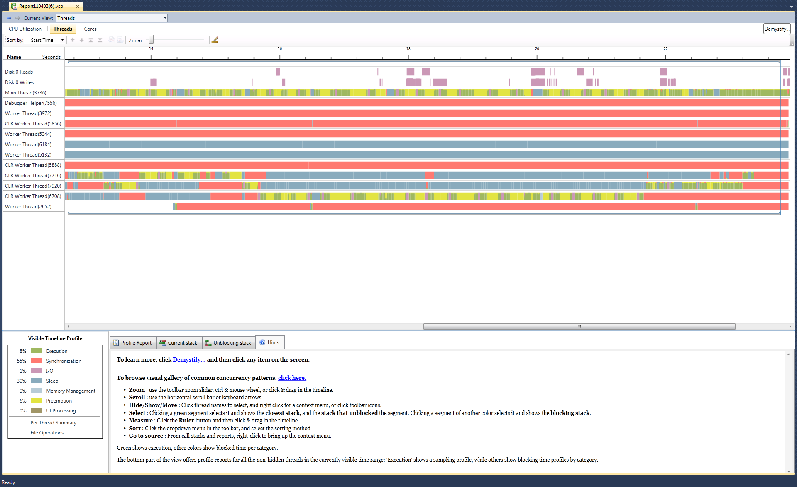
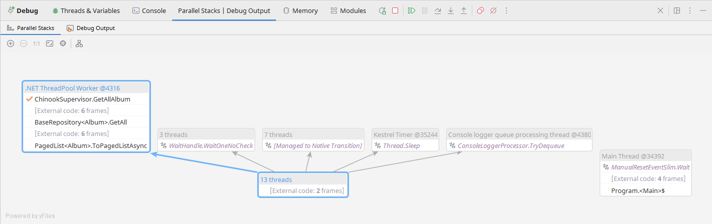
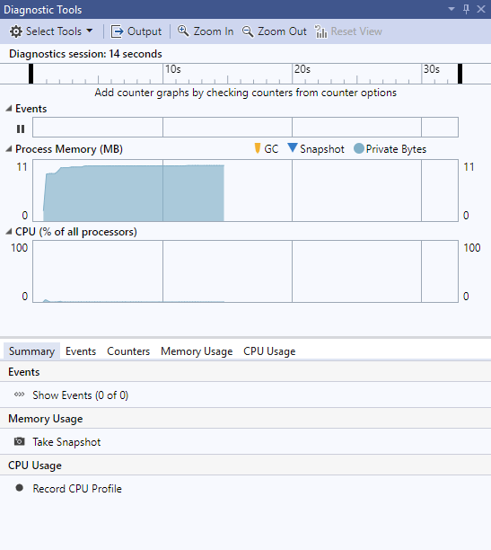
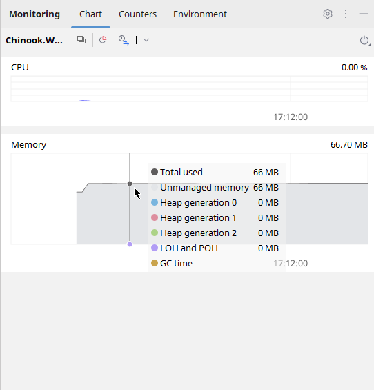

# 5


# Multithreading in Network Applications

C# 12. This chapter will explore how multithreading allows your application to perform multiple tasks in parallel, enhancing performance and efficiency.

Multithreading can be visualized as multiple workers (threads) in an operational environment (your program) executing various tasks simultaneously. This approach improves throughput. I will guide you through effective strategies for managing these threads to ensure they operate smoothly without resource conflicts or performance bottlenecks.

Parallelization, or parallel computing, refers to the technique of dividing a problem into tasks that can be solved concurrently and then combining the results of the tasks to get the final result. It mainly focuses on performance optimization by dividing a task into parts that can be executed simultaneously and utilizing multiple processors or cores to perform computations faster. We can look at parallelization as one strategy that implements multithreading.

The chapter will cover four main areas:

- Introducing Multithreading in Network Applications
- How to Handle Concurrent Network Connections with Multithreading
- Learning Parallel Processing and Performance Optimization in Network Applications
- Case Study: Building a Multithreaded Server

Each section is designed to build your understanding and skills in creating robust multithreaded applications. We will conclude with a practical case study on building a multithreaded server, providing a real-world application of the concepts discussed. Here, you will learn to construct a resilient architecture capable of handling multiple network requests efficiently, transforming theoretical knowledge into practical expertise that you can immediately apply in your projects.

## Introduction to Multithreading in Network Applications

Let's begin by exploring the fundamental role of multithreading in network applications using C#. As modern software demands increase, the ability to handle multiple operations concurrently is crucial for building efficient and scalable network applications. Multithreading allows a network program to manage multiple user requests simultaneously, improving throughput and responsiveness.

We begin by defining multithreading within the context of network programming, distinguishing between concepts such as concurrency and parallelism. You'll learn how these techniques can be applied to handle network operations' inherent complexities and performance bottlenecks. This introduction sets the groundwork for understanding how threads work in a multi-user environment, where managing multiple simultaneous network connections effectively becomes essential.

Throughout the chapter, we will delve into the architecture of multithreaded network applications, illustrating how C# facilitates the creation and management of threads with its rich library support. Practical examples will demonstrate how to implement these concepts to improve the performance of network services. By the end of this chapter, you should have a solid foundation in leveraging multithreading in your network applications, preparing you for more advanced topics and applications in network programming with C#.

### Defining Multithreading in Network Context

Multithreading, in the context of network programming, refers to an application's ability to execute multiple threads concurrently within a single process. This is particularly crucial in network applications where the need to handle multiple simultaneous client requests efficiently can significantly impact performance and responsiveness. Each thread operates as a separate execution path, allowing the application to perform numerous tasks simultaneously, such as listening for incoming connections, processing client data, and maintaining active connections.

In network programming, multithreading optimizes the utilization of CPU resources, ensuring the server can handle multiple operations at once without waiting for one task to complete before starting another. For example, a web server uses multithreading to handle requests from multiple web browsers simultaneously. Without multithreading, each client request would need to be processed sequentially, leading to delays and a suboptimal user experience.

C# provides robust support for multithreading through its .NET framework, offering various synchronization primitives such as locks, mutexes, and semaphores to help manage access to shared resources across threads. This ensures that while multiple threads may access the same data, they do so without causing data corruption or other concurrency issues. Moreover, C#'s Task Parallel Library (TPL) and language features such as async and await further simplify the development of asynchronous and multithreaded applications, making it easier to write clear and maintainable code.

Understanding how to implement and manage multithreading in network applications effectively allows developers to build scalable, high-performance network services. This section sets the foundation for further exploration into specific multithreading techniques and their practical applications in network programming, ensuring developers can meet the demands of complex, data-intensive network operations.

### The Need for Multithreading in Modern Network Applications

The necessity for multithreading in modern network applications stems from the demands for greater efficiency and responsiveness in handling multiple client requests. As network applications have become more data-intensive and connected, the ability to process several tasks simultaneously has become crucial. Multithreading allows a server to manage various operations in parallel, from processing client data to managing database connections, optimizing resource use and reducing response times.

For example, consider a high-traffic web server that must handle thousands of simultaneous connections. Without multithreading, each request would be processed sequentially, which could lead to significant delays and a poor user experience. With multithreading, the server can allocate separate threads for handling individual client requests, effectively distributing the workload across multiple CPU cores. This speeds up processing time and ensures the application remains responsive, even under heavy load.

Furthermore, multithreading facilitates a more scalable architecture in network applications. As the number of users and the volume of data increase, applications can scale to meet these demands by dynamically creating and managing threads as needed. This scalability is crucial for applications that anticipate varying levels of user engagement and require the flexibility to adjust to these changes efficiently.

### Basic Concepts of Multithreading

Understanding the basic concepts of multithreading is essential for any developer working with network applications in C#. At its core, multithreading involves the creation, execution, and management of multiple threads within a single application process. Each thread can perform tasks independently while sharing the application's memory and resources, leading to efficient CPU utilization and faster response times in network applications.

C# provides a straightforward way to create threads using the `System.Threading.Thread` class. Here's a simple example of how to create and start a thread that executes a method named `DoWork`:

```C#
using System;
using System.Threading;

public class Example
{
    public static void Main()
    {
        Thread newThread = new Thread(DoWork);
        newThread.Start();
    }

    static void DoWork()
    {
        Console.WriteLine("Work starting.");
        // Simulate work with Thread.Sleep
        Thread.Sleep(5000);
        Console.WriteLine("Work finished.");
    }
}
```

In this example, the `DoWork` method simulates a task. The `Main` method creates a thread that runs `DoWork`. When `newThread.Start()` is called, the thread begins its execution separately from the main program flow, allowing the main thread to continue its tasks or manage other threads.

Parallelization is another critical concept that uses multithreading in its implementation. It allows multiple threads to run in parallel, optimizing the use of CPU resources, especially on multi-core processors. However, it can introduce challenges such as race conditions and deadlocks, which occur when multiple threads attempt to access shared resources without proper synchronization.

Chapter 4 discussed concurrency with the async and await C# keywords. In one of the code examples, we examined how a kitchen functions. In that demo regarding concurrency, you can push the button to make a cup of coffee, and while the machine runs, handle payment with the customer. You can't, however, grind beans yourself simultaneously while handling payment; you'd need parallelization for that - another employee who can do manual bean grinding while you take care of payment. This is an example of how synchronization and parallelization in network development must be carefully thought out. We will discuss this in detail later in the chapter.


To manage access to shared resources, C# provides synchronization primitives such as `lock`. Here is an example that uses a lock to prevent concurrent access to a shared resource by multiple threads:

```C#
public class Account
{
    private readonly object balanceLock = new object();
    private decimal balance;

    public void Deposit(decimal amount)
    {
        lock (balanceLock)
        {
            balance += amount;
            Console.WriteLine($"Balance updated: {balance}");
        }
    }
}

public class Example
{
    public static void Main()
    {
        Account account = new Account();
        Thread thread1 = new Thread(() => account.Deposit(100));
        Thread thread2 = new Thread(() => account.Deposit(200));
        thread1.Start();
        thread2.Start();
    }
}
```

In the `Deposit` method, the `lock` statement ensures that one thread at a time can enter the code block that modifies the `balance` property, thus preventing data corruption. This method is crucial in network applications where threads may attempt to modify shared resources concurrently.

By understanding and correctly implementing these basic multithreading concepts, developers can significantly enhance the performance and reliability of network applications.

### Advantages and Challenges of Multithreading

By allowing multiple threads to execute concurrently, applications can handle more tasks simultaneously, such as processing multiple user requests or performing background tasks without blocking user interaction. This concurrent execution is particularly beneficial when tasks involve waiting for external resources like network responses or database transactions, as it prevents a single slow operation from halting the entire application.

For instance, consider a network service that needs to handle multiple client requests. Each request could potentially involve time-consuming operations such as database access or file I/O. By handling each request in a separate thread, the server can continue to accept and process new requests without waiting for the current ones to complete. Here’s a simple example illustrating this concept:

```C#
public class NetworkService
{
    public void HandleRequest(int requestID)
    {
        Console.WriteLine($"Starting request {requestID}");
        // Simulating a long-running operation
        Thread.Sleep(1000); 
        Console.WriteLine($"Request {requestID} completed.");
    }
}

public class Example
{
    public static void Main()
    {
        NetworkService service = new NetworkService();
        for (int i = 0; i < 5; i++)
        {
            int requestId = i;
            Thread thread = new Thread(() => service.HandleRequest(requestId));
            thread.Start();
        }
    }
}
```

However, the benefits of multithreading come with challenges. The primary issues include managing the complexity of concurrent execution and ensuring data consistency. Concurrency can lead to race conditions, where multiple threads modify shared data in a way that leads to unpredictable or erroneous behavior. Additionally, tasks such as debugging and testing become more complex due to the non-deterministic nature of thread execution.

To overcome these challenges, synchronization techniques play a pivotal role. They control the execution order of threads, providing a sense of control and ensuring data integrity. Using the `lock` statement ensures that only one thread can enter the critical section at a time, thereby maintaining the integrity of the `count` property.

Another significant challenge in multithreading is dealing with deadlocks, which occur when two or more threads are each waiting for the other to release the resources they need to continue execution. This results in a situation where neither thread can proceed, effectively freezing the application. Deadlocks are a classic problem in concurrent programming and can occur without necessarily involving the explicit use of locks (like lock keyword) for synchronization.

A typical scenario for deadlocks in C# involves using multiple mutexes (or similar synchronization primitives). Here's an illustrative example of how a deadlock can occur without directly using the `lock` keyword but using `Mutex`, which serves a similar purpose but with more control and across application domains:

```C#
public class Example
{
    static Mutex mutex1 = new Mutex();
    static Mutex mutex2 = new Mutex();

    static void Thread1()
    {
        mutex1.WaitOne();   // Requesting the first mutex
        Console.WriteLine("Thread 1 has acquired Mutex 1");
        Thread.Sleep(100); // Simulate some work (to ensure Thread 2 can lock mutex2)

        Console.WriteLine("Thread 1 attempting to acquire Mutex 2");
        mutex2.WaitOne();   // Requesting the second mutex
        Console.WriteLine("Thread 1 has acquired Mutex 2");

        mutex2.ReleaseMutex(); // Release mutex2
        mutex1.ReleaseMutex(); // Release mutex1
        Console.WriteLine("Thread 1 released both Mutexes");
    }

    static void Thread2()
    {
        mutex2.WaitOne();   // Requesting the second mutex
        Console.WriteLine("Thread 2 has acquired Mutex 2");
        Thread.Sleep(100); // Simulate some work (to ensure Thread 1 can lock mutex1)

        Console.WriteLine("Thread 2 attempting to acquire Mutex 1");
        mutex1.WaitOne();   // Requesting the first mutex
        Console.WriteLine("Thread 2 has acquired Mutex 1");

        mutex1.ReleaseMutex(); // Release mutex1
        mutex2.ReleaseMutex(); // Release mutex2
        Console.WriteLine("Thread 2 released both Mutexes");
    }

    public static void Main()
    {
        Thread t1 = new Thread(new ThreadStart(Thread1));
        Thread t2 = new Thread(new ThreadStart(Thread2));
        t1.Start();
        t2.Start();
        t1.Join(); // Wait for thread 1 to finish
        t2.Join(); // Wait for thread 2 to finish
        Console.WriteLine("Both threads completed execution");
    }
}
```

In this example, each thread tries to lock two mutexes. Thread 1 locks `mutex1` and then tries to lock `mutex2`, while Thread 2 locks `mutex2` and then tries to lock `mutex1`. If both threads lock their first mutex before attempting to acquire the other, neither can proceed, resulting in a deadlock.

To avoid deadlocks, ensure that all threads acquire locks consistently. Use timeout options like `WaitOne(timeout)`, where threads can back off and retry if they can't acquire all required resources within a specific timeframe. Managing thread execution order, carefully designing the locking strategy, or using higher-level concurrency mechanisms like the **Task Parallel Library (TPL)** that abstract away direct mutex management can help mitigate such risks.

Understanding these advantages and challenges is essential for developers implementing robust and efficient multithreaded applications in C#. Proper thread management and careful handling of synchronization can help harness multithreading's full potential, turning the inherent complexities into manageable parts of the application design.

## Handling Concurrent Network Connections with Multithreading

Efficiently managing concurrent network connections is a crucial aspect of modern network application development, especially in server environments where multiple clients interact with the server simultaneously. The use of multithreading is instrumental in this process, enabling servers to maintain responsiveness and handle each client request promptly.

In C#, multithreading for handling network connections typically involves creating a separate thread for each incoming client request. This approach ensures the server can continue listening for new requests while processing ongoing ones. For instance, a typical network server might continuously use a main thread to listen on a socket. When a client connection is detected, the server spawns a new thread to handle the communication, freeing the main thread to accept additional incoming connections.

However, while effective for low volumes of simultaneous connections, the thread-per-connection model can prove inefficient when dealing with a high volume. This is because each thread consumes system resources. A more efficient alternative is to use a thread pool. The .NET Framework offers a managed thread pool through the `System.Threading.ThreadPool` class, which effectively manages a pool of worker threads. By limiting the number of active threads at any given time, a thread pool reduces overhead and enhances scalability.

Here's a simple example of using a thread pool to handle network requests in C#:

```C#
using System.Net;
using System.Net.Sockets;

public class Server
{
    private TcpListener listener;

    public Server(string ipAddress, int port)
    {
        IPAddress localAddr = IPAddress.Parse(ipAddress);
        listener = new TcpListener(localAddr, port);
    }

    public void StartServer()
    {
        listener.Start();
        Console.WriteLine("Server started. Listening to TCP clients.");

        while (true)
        {
            TcpClient client = listener.AcceptTcpClient();
            ThreadPool.QueueUserWorkItem(ProcessClient, client);
        }
    }

    private void ProcessClient(object obj)
    {
        TcpClient client = (TcpClient)obj;
        // Handle client in separate thread
        Console.WriteLine("Connected to client.");
        // Client handling code here

        client.Close();
    }
}

public class Example
{
    public static void Main()
    {
        Server server = new Server("127.0.0.1", 13000);
        server.StartServer();
    }
}
```

In this example, the server listens for TCP connections and uses the thread pool to manage incoming client connections, delegating each client's processing to a separate thread managed by the thread pool. This method enhances the server's ability to scale and handle numerous connections simultaneously without bogging down under the overhead of excessive thread creation.

By understanding and implementing these strategies for managing concurrent network connections with multithreading, developers can build robust, high-performance network applications capable of efficiently serving high volumes of client requests.

### Understanding Concurrent Connections

Understanding concurrent connections is pivotal for developers building network applications that must efficiently handle multiple client requests simultaneously. In network programming, concurrency refers to an application's ability to manage multiple network connections simultaneously, ensuring that each connection is processed without causing delays or performance bottlenecks for others.

In C#, concurrent connections are typically handled through asynchronous programming models or multithreading techniques. Asynchronous programming allows a network server to initiate a potentially time-consuming operation, such as waiting for data from a client, and immediately return to listening for other requests. This model is facilitated by the `async` and `await` keywords in C#, which enable writing clear and performant asynchronous code.

Here is an example of handling concurrent network connections using asynchronous methods in C#:

```C#
using System.Net;
using System.Net.Sockets;

public class AsyncServer
{
    public async Task StartListening(IPAddress ipAddress, int port)
    {
        TcpListener listener = new TcpListener(ipAddress, port);
        listener.Start();
        Console.WriteLine("Server started. Listening to TCP clients.");

        while (true)
        {
            TcpClient client = await listener.AcceptTcpClientAsync();
            Console.WriteLine("Client connected.");
            await HandleClientAsync(client);
        }
    }

    private async Task HandleClientAsync(TcpClient client)
    {
        try
        {
            await using NetworkStream stream = client.GetStream();
            using (StreamReader reader = new StreamReader(stream))
            {
                string? request = await reader.ReadLineAsync();
                Console.WriteLine($"Received: {request}");
                // Respond to the client here
            }
        }
        finally
        {
            client.Close();
        }
    }
}

public static class Program
{
    public static void Main()
    {
        IPAddress localAddr = IPAddress.Parse("127.0.0.1");
        AsyncServer server = new AsyncServer();
        Task serverTask = server.StartListening(localAddr, 8888);
        serverTask.Wait();
    }
}
```

In this example, `AcceptTcpClientAsync` is used to wait for client connections asynchronously. `HandleClientAsync` is called to process the client request in a separate asynchronous task when a client connects. This allows the main listening loop to immediately return to waiting for additional client connections, effectively handling multiple concurrent connections without blocking.

Efficiently handling concurrent connections is a complex task that requires a solid understanding of asynchronous operations and multithreading. However, by leveraging the robust support for asynchronous programming built into C #, developers can create network servers that are not only capable of managing high volumes of traffic but also maintain optimal performance, a crucial advantage in today's demanding network environments.

### Multithreading to Manage Concurrent Connections

Managing concurrent network connections effectively is crucial in developing scalable and responsive network applications. In C#, multithreading is a common strategy to achieve this, where a separate thread handles each incoming connection. This approach allows the server to process multiple connections simultaneously, improving throughput and response times.

One practical way to implement multithreading in network applications is using the `System.Threading.Thread` class will spawn a new thread for each connection. This ensures the server can continue to accept new connections while existing connections are being processed independently. Here is a straightforward example demonstrating this approach:

```C#
using System.Net;
using System.Net.Sockets;

public class Server(IPAddress ip, int port)
{
    private readonly TcpListener listener = new(ip, port);

    public void Start()
    {
        listener.Start();
        Console.WriteLine("Server started. Waiting for connections...");

        while (true)
        {
            TcpClient client = listener.AcceptTcpClient();
            Thread clientThread = new Thread(new ParameterizedThreadStart(HandleClient));
            clientThread.Start(client);
        }
    }

    private void HandleClient(object clientObj)
    {
        TcpClient client = (TcpClient)clientObj;
        NetworkStream stream = client.GetStream();
        // Process the client request here
        Console.WriteLine("Handling client in thread " + Thread.CurrentThread.ManagedThreadId);
        
        // Simulate some work
        byte[] buffer = new byte[1024];
        int bytesRead = stream.Read(buffer, 0, buffer.Length);
        Console.WriteLine("Received data from client");

        // Always ensure you close the stream and client connection
        stream.Close();
        client.Close();
    }
}

public class Program
{
    static void Main(string[] args)
    {
        IPAddress localAddr = IPAddress.Parse("127.0.0.1");
        Server server = new Server(localAddr, 13000);
        server.Start();
    }
}
```

In this example, each time a client connects to the server, the AcceptTcpClient method blocks until a connection is made. Once a connection is established, a new thread is spawned to handle the client, allowing the main thread to return immediately to listening for other connections. This pattern keeps the server responsive to new clients while the individual threads handle the processing of each client.

However, while the thread-per-connection model can be effective for applications with moderate load, it may not scale well under high load due to the overhead associated with creating and managing a large number of threads. In such cases, alternative strategies like using a thread pool or asynchronous I/O operations (async/await) might be more efficient. These approaches reduce the overhead by reusing a limited number of threads and handling I/O operations more efficiently.

By carefully selecting and implementing multithreading techniques, developers can significantly enhance the performance and scalability of network applications, ensuring that each client receives prompt and efficient service.

### Synchronization and Safety

In multithreaded network applications, ensuring that data is accessed thread-safe is crucial to prevent data corruption and maintain application stability. Synchronization and safety are fundamental in managing the shared state between threads, particularly when multiple threads modify the same data. C# and the .NET framework provide various mechanisms to help developers synchronize access to shared resources and ensure thread safety.

One of the most straightforward synchronization techniques in C# is the `lock` keyword, which ensures that a block of code is not executed by more than one thread at a time. The `lock` keyword encloses a statement block in a synchronization lock, thus preventing other threads from entering the block until the current thread releases the lock. Here is an example of using the `lock` mechanism to synchronize access to a shared resource:

```C#
public class ThreadSafeLogger
{
    private readonly object lockObject = new object();
    private readonly string logFilePath;

    public ThreadSafeLogger(string filePath)
    {
        logFilePath = filePath;
        // Ensure the log file exists
        File.WriteAllText(logFilePath, $"Log started at {DateTime.UtcNow}\n");
    }

    public void Log(string message)
    {
        lock (lockObject)
        {
            // Append text to the log file in a thread-safe manner
            File.AppendAllText(logFilePath, $"{DateTime.UtcNow}: {message}\n");
        }
    }
}

public class Program
{
    public static void Main()
    {
        ThreadSafeLogger logger = new ThreadSafeLogger("log.txt");

        // Simulate multiple threads logging simultaneously
        Thread[] threads = new Thread[5];
        for (int i = 0; i < threads.Length; i++)
        {
            threads[i] = new Thread(() =>
            {
                for (int j = 0; j < 10; j++)
                {
                    logger.Log($"Thread {Thread.CurrentThread.ManagedThreadId} logging message {j}");
                    Thread.Sleep(100);  // Simulate work
                }
            });
            threads[i].Start();
        }

        // Wait for all threads to complete logging
        foreach (Thread thread in threads)
        {
            thread.Join();
        }

        Console.WriteLine("All threads have completed logging.");
    }
}
```

This example shows a practical application of the `lock` keyword: ensuring data consistency when multiple threads write to a shared file resource. This makes it a useful pattern for tasks like logging in multithreaded applications.

For more complex scenarios, other synchronization constructs such as `Mutex`, `Semaphore`, and `ReaderWriterLockSlim` might be more appropriate. `ReaderWriterLockSlim` is particularly useful when you have a resource that is read frequently but updated less often. It allows multiple threads to read the data in parallel but ensures exclusive access for writing. Here's how you can use `ReaderWriterLockSlim`:

```C#
public class DataCache
{
    private readonly ReaderWriterLockSlim cacheLock = new ReaderWriterLockSlim();
    private readonly Dictionary<int, string?> innerCache = new Dictionary<int, string?>();

    public string? Read(int key)
    {
        cacheLock.EnterReadLock();
        try
        {
            return innerCache.GetValueOrDefault(key);
        }
        finally
        {
            cacheLock.ExitReadLock();
        }
    }

    public void AddOrUpdate(int key, string? value)
    {
        cacheLock.EnterWriteLock();
        try
        {
            innerCache[key] = value;
        }
        finally
        {
            cacheLock.ExitWriteLock();
        }
    }
}
```

Using `ReaderWriterLockSlim`, the `AddOrUpdate` method acquires a write lock to ensure that no other writes or reads can occur simultaneously. In contrast, the `Read` method acquires a read lock, allowing concurrent reads unless a write takes place.

Understanding and implementing appropriate synchronization techniques is essential for building reliable and robust multithreaded applications, especially in network environments where data integrity and performance are paramount.

### Testing and Debugging Techniques

Testing and debugging multithreaded network applications in C# present unique challenges due to the inherent complexity of concurrent execution. Issues such as race conditions, deadlocks, and non-deterministic behavior can make bugs elusive and intermittent, often dependent on timing and the system's state. Practical strategies and tools are essential for identifying and resolving these issues to ensure the reliability and robustness of network applications.

One critical technique in debugging multithreaded applications is to use logging. Logging can provide insights into the application's behavior by recording the sequence of events, which is invaluable when you need to understand the interaction between threads. Here's a simple example of how to implement logging in a multithreaded environment using C#:

```C#
public class ThreadSafeLogger
{
    private static readonly object _lock = new object();

    public static void Log(string message)
    {
        lock (_lock)
        {
            Console.WriteLine($"{DateTime.Now:HH:mm:ss.fff}: {message}");
        }
    }
}

public class Worker
{
    public void Process(int id)
    {
        ThreadSafeLogger.Log($"Thread {id} started processing.");
        Thread.Sleep(new Random().Next(500, 1000)); // Simulate work
        ThreadSafeLogger.Log($"Thread {id} finished processing.");
    }
}

public class Program
{
    public static void Main()
    {
        Thread[] threads = new Thread[5];
        Worker worker = new Worker();
        for (int i = 0; i < threads.Length; i++)
        {
            int threadId = i;
            threads[i] = new Thread(() => worker.Process(threadId));
            threads[i].Start();
        }
        foreach (var thread in threads)
        {
            thread.Join();
        }
    }
}
```

In this example, `ThreadSafeLogger` ensures that log entries are written without interference from multiple threads, keeping the log output readable and consistent.

For more in-depth testing, tools like **Visual Studio’s Concurrency Visualizer** or **Parallel Stack in JetBrains Rider** can help identify performance bottlenecks and threading issues such as lock contention and deadlocks. Unit testing frameworks like NUnit or xUnit, combined with `Task` and async/await patterns, allow for the simulation and testing of asynchronous and parallel operations in a controlled environment.





Unit testing frameworks like NUnit or xUnit can be used to test multithreaded code, but they require careful planning to cover concurrency issues. One approach is to simulate multithreading scenarios where shared resources are accessed concurrently to ensure the code behaves as expected. Here’s a simple example using xUnit and the Task class to test a thread-safe counter class:

```C#
public class ThreadSafeCounter
{
    private int count = 0;
    private readonly object lockObject = new object();

    public int Increment()
    {
        lock (lockObject)
        {
            return ++count;
        }
    }
}

public class CounterTests
{
    [Fact]
    public void TestIncrement()
    {
        var counter = new ThreadSafeCounter();
        var tasks = new List<Task>();
        for (int i = 0; i < 100; i++)
        {
            tasks.Add(Task.Run(() => counter.Increment()));
        }

        Task.WaitAll(tasks.ToArray());
        Assert.Equal(100, counter.Increment() - 1);  // -1 because Increment is called one more time in Assert
    }
}
```

In this test, multiple tasks are created to increment the counter concurrently, and `Task.WaitAll` is used to ensure all increments are completed before the assertion checks the final count.

Effective debugging and testing are pivotal for the development cycle of multithreaded applications. By combining strategic logging, robust tools, and systematic testing approaches, developers can significantly mitigate the risks associated with concurrency and ensure that their applications perform reliably in production environments.

## Parallel Processing and Performance Optimization in Network Applications

Parallel processing and performance optimization are critical components in developing efficient network applications. With the increasing complexity of modern software systems and the high demand for responsive services, leveraging parallel processing techniques allows developers to enhance application throughput and reduce latency significantly. C# and the .NET framework provide a robust set of tools and libraries designed to facilitate the efficient execution of multiple operations simultaneously, thus maximizing hardware utilization and improving overall application performance.

In network applications, parallel processing involves the execution of multiple computational tasks concurrently over the network, such as handling multiple user requests or processing large volumes of data in real time. This is particularly important in scenarios where the network I/O might not be the bottleneck, but the processing of data is, making it essential to distribute the workload effectively across multiple cores of the server’s CPU.

This chapter section will delve into various strategies and best practices for implementing parallel processing in C# network applications. We will explore the use of concurrent collections, task parallelism with the Task Parallel Library (TPL), and asynchronous programming patterns that avoid blocking threads. Importantly, we will examine each of these techniques in the context of real-world network application scenarios. This approach will provide you with a clear understanding of how to apply them effectively to achieve optimal performance in your own projects.

Furthermore, we will explore performance optimization tips and tools that can help identify bottlenecks and inefficiencies in network applications. These include profiling tools, performance counters, and logging mechanisms that offer insights into the application’s behavior under different load conditions. By the end of this section, you will not only have a comprehensive understanding of parallel processing in C # network applications, but also be equipped with the knowledge to design and implement high-performance network applications. This knowledge will undoubtedly enhance your development skills and contribute to the success of your projects.

### Introduction to Parallel Processing in Network Applications

Parallel processing is a powerful technique that divides a problem into multiple tasks that can be processed simultaneously, unleashing the full potential of your computing resources, especially in systems with multi-core processors. In the context of network applications, parallel processing opens up exciting possibilities, enabling more effective handling of multiple simultaneous network requests or operations. This can lead to significant improvements in application throughput and responsiveness, sparking a new level of excitement in your development journey.

The Task Parallel Library (TPL) in .NET is a set of public types and APIs housed in the `System.Threading.Tasks` namespace. TPL simplifies adding parallelism and concurrency to applications, making it easier to write robust, scalable, and parallel code. It is designed to scale dynamically to use all available processors, and it also integrates well with existing asynchronous programming patterns in .NET.

One of the fundamental concepts introduced by TPL is the Task class, which represents an asynchronous operation. Tasks can be used for compute-bound operations and I/O-bound operations without blocking threads. Here is an example of how to use TPL to execute multiple tasks in parallel, which is particularly useful in scenarios like processing multiple incoming network data streams simultaneously:

```C#
class Program
{
    static void Main(string[] args)
    {
        Parallel.For(0, 10, i =>
        {
            // Simulate a task such as processing a network request
            Console.WriteLine($"Processing request {i} on thread {Task.CurrentId}");
            Task.Delay(1000).Wait(); // Simulate work with a synchronous delay
        });

        Console.WriteLine("All requests processed.");
    }
}
```

In this example, Parallel.For is used to launch multiple tasks that simulate handling ten different network requests. Each iteration of the loop represents a separate task that could handle a different part of a network operation, and these tasks are run concurrently across multiple threads provided by the .NET thread pool.

For more complex scenarios where tasks need to run asynchronously without blocking, you can use the asynchronous capabilities of the Task class with the async and await keywords:

```C#
class Program
{
    static async Task Main(string[] args)
    {
        HttpClient client = new HttpClient();
        string[] urls = { "http://example.com", "http://example.org", "http://example.net" };

        var downloadTasks = new Task<string>[urls.Length];
        for (int i = 0; i < urls.Length; i++)
        {
            downloadTasks[i] = ProcessUrlAsync(urls[i], client);
        }

        string[] results = await Task.WhenAll(downloadTasks);
        foreach (string result in results)
        {
            Console.WriteLine(result);
        }
    }

    static async Task<string> ProcessUrlAsync(string url, HttpClient client)
    {
        Console.WriteLine($"Starting processing of {url}");
        var response = await client.GetAsync(url);
        string result = await response.Content.ReadAsStringAsync();
        Console.WriteLine($"Completed processing of {url}");
        return result;
    }
}
```

`ProcessUrlAsync` is an asynchronous method in this code that fetches data from a URL and returns the content as a string. `Task.WhenAll` is used to await all the given tasks, the application can perform other work while waiting for network responses, thereby not wasting valuable thread resources.

By leveraging the TPL, developers can greatly enhance the performance and responsiveness of network applications, efficiently utilizing system resources and improving user experience. The examples demonstrate basic and advanced patterns for implementing parallel processing in network-related tasks using C#.

### Identifying Opportunities for Parallelism

Identifying opportunities for parallelism in network applications is crucial for optimizing performance and resource utilization. Network applications often handle multiple independent tasks such as processing incoming data, executing background computations, and responding to user requests, which are ideal candidates for parallel execution. By leveraging parallelism, these tasks can be distributed across multiple processor cores, significantly reducing response times and increasing throughput.

The Task Parallel Library (TPL) in .NET simplifies the implementation of parallelism in C#. TPL abstracts the complexities of thread management and provides a high-level approach to task-based parallelism. It is particularly well-suited for network applications where tasks are typically asynchronous and involve I/O operations that do not continuously consume CPU cycles.

One common scenario in network applications where parallelism can be beneficial in processing multiple incoming network requests. Each request can be processed independently of others, making this a perfect use case for parallel processing. Here's an example of using TPL to handle multiple web requests simultaneously:

```C#
public class NetworkService
{
    private static async Task ProcessRequestsAsync(string[] urls)
    {
        using HttpClient client = new HttpClient();
        Task[] tasks = new Task[urls.Length];

        for (var i = 0; i < urls.Length; i++)
        {
            string url = urls[i];
            tasks[i] = Task.Run(function: async () =>
            {
                Console.WriteLine($"Starting request to {url}");
                HttpResponseMessage response = await client.GetAsync(url);
                string content = await response.Content.ReadAsStringAsync();
                Console.WriteLine($"Received response from {url}: {content.Length} characters");
            });
        }

        await Task.WhenAll(tasks);
        Console.WriteLine("All requests processed.");
    }

    public static void Main(string[] args)
    {
        string[] urls = ["http://example.com", "http://example.net", "http://example.org"];
        ProcessRequestsAsync(urls).Wait();
    }
}
```

In this example, `Task.Run` is used to initiate separate tasks for each HTTP request. This approach ensures that each network call is handled concurrently, rather than sequentially, leveraging the asynchronous capabilities of `HttpClient`. The use of `Task.WhenAll` waits for all tasks to complete, the method can handle other tasks or idle until all network responses are received.

Another opportunity for parallelism in network applications is during data processing. If a server receives large datasets that need to be processed, this can be efficiently handled in parallel, especially when the processing of one data set is independent of others:

```C#
public class DataProcessor
{
    private static void ProcessDataParallel(int[] data)
    {
        Parallel.For(0, data.Length, (i) =>
        {
            // Simulate intensive data processing
            Console.WriteLine($"Processing data at index {i}");
            Task.Delay(100).Wait();
        });
    }

    public static void Main()
    {
        int[] data = new int[10]; // Example data array
        ProcessDataParallel(data);
    }
}
```

The `Parallel.For` method in TPL is utilized here to process each element in the data array concurrently. Each iteration of the loop runs as a separate task, which can be executed on different threads managed by the .NET thread pool.

These examples illustrate how TPL can be effectively used to implement parallelism in network applications, enhancing their scalability and responsiveness. Identifying tasks that can be executed in parallel is the first step towards harnessing modern multi-core systems' full potential, significantly improving network application performance.

### Implementing Parallelism in C#

Implementing parallelism in network applications using C# can dramatically improve performance by allowing multiple operations to run concurrently rather than sequentially. This is particularly beneficial in network applications where handling multiple user requests, processing data, and performing I/O operations are expected. C#'s Task Parallel Library (TPL) provides a robust set of tools that simplify creating and managing concurrent tasks.

TPL introduces several key concepts, such as tasks (`Task` and `Task<TResult>`), which are units of work that run asynchronously. Tasks are more lightweight than threads and are managed by the .NET thread pool, which optimizes available system resources. This makes TPL an ideal choice for network applications that need to scale to handle high loads.

One everyday use case for parallelism in network applications is the simultaneous processing of independent client requests. Here is an example of using TPL to handle multiple web requests asynchronously:

```C#
public class WebRequestHandler
{
    private static async Task FetchDataFromUrlsAsync(string[] urls)
    {
        using HttpClient client = new HttpClient();
        Task<string>[] tasks = new Task<string>[urls.Length];

        for (int i = 0; i < urls.Length; i++)
        {
            string url = urls[i];
            tasks[i] = client.GetStringAsync(url);
        }

        string[] results = await Task.WhenAll(tasks);
        foreach (string result in results)
        {
            Console.WriteLine($"Data fetched: {result.Length} characters long.");
        }
    }

    public static void Main(string[] args)
    {
        string[] urls = ["http://example.com", "http://example.org", "http://example.net"];
        FetchDataFromUrlsAsync(urls).Wait();
    }
}
```

In this example, `GetStringAsync` fetches data from multiple URLs asynchronously. `Task.WhenAll` is used to await all these tasks to complete, effectively running them in parallel and ensuring that the main thread is not blocked while the operations are ongoing.

Another scenario where TPL can be particularly useful is when processing large amounts of data received from network operations in parallel. Below is an example demonstrating how to use `Parallel.ForEach` to process a collection of data items concurrently:

```C#
using System.Collections.Concurrent;

public class DataProcessor
{
    private static void ProcessDataConcurrently(ConcurrentBag<string> dataItems)
    {
        Parallel.ForEach(dataItems, dataItem =>
        {
            // Process each data item
            Console.WriteLine($"Processing data: {dataItem}");
            // Simulate some processing work
            Task.Delay(100).Wait();
        });
    }

    public static void Main()
    {
        var dataItems = new ConcurrentBag<string> { "data1", "data2", "data3" };
        ProcessDataConcurrently(dataItems);
    }
}
```

`Parallel.ForEach` efficiently distributes the data processing tasks across multiple threads. This is ideal for operations that can be partitioned into independent sub-tasks, allowing them to be executed simultaneously, thus reducing overall processing time.

These examples demonstrate how to implement parallelism in network applications using TPL, making developing efficient, scalable, and responsive applications easier. By leveraging TPL, developers can focus more on the application logic rather than thread management, synchronization, and concurrency control complexities.

### Performance Optimization Techniques

Performance optimization in network applications is crucial for ensuring your applications can handle high loads efficiently and maintain responsiveness under stress. In C#, several strategies can be used to enhance the performance of network-driven applications, from optimizing data handling and processing to improving the underlying network communication itself.

One effective technique is asynchronous programming to prevent blocking I/O operations, which can significantly slow down network applications. Asynchronous methods in C# allow the program to continue executing other tasks while waiting for network responses or other I/O operations to complete. Here's an example using `HttpClient` to asynchronously fetch data from a URL, which is more efficient than synchronous calls that block the execution thread:

```C#
public class AsyncDataFetcher
{
    private static async Task<string> FetchDataAsync(string url)
    {
        using HttpClient client = new HttpClient();
        Console.WriteLine("Starting to fetch data...");
        string result = await client.GetStringAsync(url);
        Console.WriteLine("Data fetched successfully.");
        return result;
    }

    public static async Task Main(string[] args)
    {
        string url = $"http://example.com";
        string data = await FetchDataAsync(url);
        Console.WriteLine($"Fetched data: {data.Length} characters long.");
    }
}
```

In the above code, `GetStringAsync` makes a non-blocking call to retrieve data from a web server. This approach allows the CPU to perform other tasks while waiting for the network response, optimizing resource use and application performance.

Another critical optimization technique is the use of data structures and collections that are designed for concurrent access. The .NET Framework offers several thread-safe collections, such as `ConcurrentBag`, `ConcurrentDictionary`, and `BlockingCollection`, that can be used effectively in multithreaded environments. These collections manage synchronization internally, reducing the overhead and complexity of manual synchronization. Here's an example using `ConcurrentDictionary`:

```C#
using System.Collections.Concurrent;

public class ConcurrentAccess
{
    public static void Main()
    {
        ConcurrentDictionary<int, string> dictionary = new ConcurrentDictionary<int, string>();

        Parallel.For(0, 1000, (i) =>
        {
            dictionary.TryAdd(i, $"Value {i}");
        });

        Console.WriteLine($"Dictionary size: {dictionary.Count}");
    }
}
```

In this example, `Parallel.For` is used to perform many operations concurrently, each adding an entry to the ConcurrentDictionary. This collection ensures all additions are thread-safe and efficient without requiring explicit locks.

Optimizing network communication itself is also vital. Techniques such as reducing the frequency of network calls, compressing data for transmission, and using efficient serialization methods can significantly enhance network performance. For instance, choosing a faster serialization framework like Protocol Buffers over JSON or XML in high throughput scenarios can decrease latency and bandwidth usage.

Finally, profiling and monitoring tools such as **Visual Studio Diagnostic Tools** or **JetBrains' Monitor Tool Window** can be instrumental in identifying bottlenecks and performance issues. Regularly profiling your network applications can help you understand where delays or excessive resource usage occur, allowing for targeted optimizations that can substantially improve overall performance.

\

\

By implementing these performance optimization techniques, developers can ensure that their network applications are not only functional but also robust and efficient, capable of efficiently handling real-world loads.

### Monitoring and Tuning Parallel Applications

Monitoring and tuning parallel applications in C# is essential to ensure
they run efficiently and effectively. This involves not only tracking the performance of the applications under various conditions but also making adjustments based on the insights gained. The .NET framework and several developer tools provide robust support for these tasks, helping developers optimize parallel applications for better performance.

The first step in monitoring parallel applications is to understand the behavior under load. Performance counters in .NET can be handy for this. They provide detailed information about various aspects of application performance, such as CPU usage, thread counts, and lock contention. Here’s how you can programmatically access performance counters in C#:

```C#
using System.Diagnostics;

public class PerformanceMonitoring
{
    public static void Main()
    {
        var cpuCounter = new PerformanceCounter("Processor", "% Processor Time", "_Total");
        var ramCounter = new PerformanceCounter("Memory", "Available MBytes");

        Console.WriteLine("CPU Usage: " + cpuCounter.NextValue() + "%");
        Console.WriteLine("Available RAM: " + ramCounter.NextValue() + " MB");

        // It may take a few seconds for accurate values to show
        System.Threading.Thread.Sleep(1000);

        Console.WriteLine("Updated CPU Usage: " + cpuCounter.NextValue() + "%");
        Console.WriteLine("Updated Available RAM: " + ramCounter.NextValue() + " MB");
    }
}
```

This code creates performance counters for CPU usage and available memory and retrieves their values. These metrics are crucial for tuning applications, especially to diagnose performance bottlenecks that can impact parallel processing.

For more detailed analysis, tools like **Visual Studio's Diagnostic Tools** and the **Monitor Tool Window in JetBrains Rider** can be used. These tools offer features such as CPU Usage, Memory Usage, and Threads and Tasks windows that allow developers to see in real-time how well the application is performing and how resources are being used. This is particularly valuable for tuning parallel applications where threads and tasks are extensively used.

Another powerful tool for tuning .NET applications is the .NET Profiler API. It allows developers to track their applications' performance at a granular level, identify slow methods, and understand the call tree, which can help pinpoint inefficient code paths.

Beyond internal tools, third-party solutions like **JetBrains dotTrace, dotMemory** and **Redgate ANTS Performance Profiler** provide advanced profiling capabilities. These tools offer intuitive interfaces and detailed reports that help identify performance hotspots and optimize them. They can trace execution time across threads and manage profiling sessions to compare before and after performance metrics, which is invaluable for effective tuning.

Monitoring and tuning parallel applications require a systematic approach. Developers gather data, analyze it to identify issues, and then iteratively make changes and measure improvements. By leveraging the built-in capabilities of C# and .NET, along with sophisticated external tools, developers can ensure their parallel applications are optimized for maximum performance.

## Case Study: Building a Multithreaded Server

In network programming, building a multithreaded server is a critical skill for developers aiming to maximize the efficiency and scalability of their applications. Multithreading enables a server to handle multiple client requests simultaneously, ensuring optimal system resource use and responsiveness across a broad spectrum of user interactions. As networked applications grow in complexity and user base, effectively managing concurrent connections becomes indispensable.

This section will guide you through constructing a multithreaded server in C#. We will explore the foundational concepts of threading in the context of network applications, illustrating how to spawn, manage, and synchronize threads to handle multiple client connections efficiently. Using C#'s robust threading capabilities, including the `Thread` class and `ThreadPool`, you will learn to design a server that can manage its workload dynamically, adapting to varying demand levels.

Throughout this exploration, we will also address common challenges such as thread safety, synchronization issues, and the potential for resource contention, providing you with strategies to overcome these hurdles. Practical examples will demonstrate the application of these concepts in real-world scenarios, culminating in creating a fully functional multithreaded server. This hands-on approach will enhance your understanding of multithreading and equip you with the skills necessary to implement these techniques in your projects, ensuring your network applications are both powerful and resilient.

```C#
using System.Collections.Concurrent;
using System.Net;
using System.Net.Sockets;
using System.Text;

namespace Server;

public class SecureMultithreadedServer(string ipAddress, int port)
{
    private TcpListener listener;
    private volatile bool isRunning;
    private readonly IPAddress ipAddress = IPAddress.Parse(ipAddress);
    private readonly ConcurrentDictionary<int, TcpClient> clients = new ConcurrentDictionary<int, TcpClient>();
    private static readonly object _lock = new object();

    private void Start()
    {
        listener = new TcpListener(ipAddress, port);
        listener.Start();
        isRunning = true;
        Console.WriteLine("Server started...");

        while (isRunning)
        {
            Console.WriteLine("Waiting for connections...");
            var client = listener.AcceptTcpClient();
            var clientId = client.GetHashCode();
            clients.TryAdd(clientId, client);

            Thread clientThread = new Thread(() => HandleClient(client, clientId));
            clientThread.Start();
        }
    }

    private void HandleClient(TcpClient client, int clientId)
    {
        try
        {
            using var networkStream = client.GetStream();
            using var reader = new StreamReader(networkStream, Encoding.UTF8);
            using var writer = new StreamWriter(networkStream, Encoding.UTF8);
            string? message = null;
            while (!string.IsNullOrEmpty(message = reader.ReadLine()))
            {
                Console.WriteLine($"Received from {clientId}: {message}");
                writer.WriteLine($"Echo {clientId}: {message}");
                writer.Flush();
            }
        }
        catch (Exception ex)
        {
            Console.WriteLine($"Error with client {clientId}: {ex.Message}");
        }
        finally
        {
            client.Close();
            clients.TryRemove(clientId, out _);
            Console.WriteLine($"Client {clientId} disconnected.");
        }
    }

    public void Stop()
    {
        isRunning = false;
        listener.Stop();
        foreach (var client in clients.Values)
        {
            client.Close();
        }
        Console.WriteLine("Server stopped.");
    }

    public static void Main(string[] args)
    {
        var server = new SecureMultithreadedServer("127.0.0.1", 13000);
        server.Start();
    }
}
```

Several key features ensure the robustness and efficiency of a multithreaded server. Each client connection is managed by a dedicated thread, allowing the server to handle multiple connections concurrently. This is achieved by spawning a new thread for each client connection, which manages the communication with that client independently. Clients are managed using a ConcurrentDictionary, which allows for thread-safe addition and removal of client records, ensuring that operations on the client list do not lead to race conditions or other synchronization issues.

The ConcurrentDictionary supports concurrent operations and simplifies synchronization across threads, particularly when accessing shared data. While the dictionary handles most of the thread safety, additional locks can be used for critical sections to ensure data integrity further. However, this is not depicted in the basic example for simplicity.

Error handling is another crucial aspect, managed through try-catch blocks that capture and log exceptions to the console. This strategy helps maintain server stability by preventing crashes arising from individual client errors and allowing the server to continue operating despite issues with specific connections.

Opting to use SslStream rather than regular streams addresses performance optimization and scaling. This choice, coupled with manual thread management instead of relying on the ThreadPool or Task library, allows for greater control over thread behavior and security, which is essential for securely scaling the application. Moreover, security is reinforced through SSL/TLS encryption using SslStream, with the server authenticated using a certificate to ensure that all data transmitted between the server and clients is encrypted, protecting sensitive information and communications from potential interception.

This use case illustrates a server incorporating advanced features necessary for robust, secure, and scalable network applications. These features can be further optimized and tailored based on specific application needs and performance requirements.

## Summary

This chapter on multithreading and parallelism in C# has delved into the critical aspects and best practices necessary for building robust, efficient, and scalable network applications. Starting with the fundamentals, we explored the core concepts of multithreading, distinguishing between parallelism and concurrency, and their relevance in today's multi-core processor environments. These concepts, while complex, are practical and set the foundation for understanding how to enhance application performance through effective thread management and task distribution.

We discussed various methods for implementing multithreading in network applications, focusing on the System.Threading namespace and the powerful tools provided by the Task Parallel Library (TPL). These tools, proven to be effective in numerous applications, are crucial for writing non-blocking network operations, thus improving the responsiveness of applications handling intensive I/O operations.

The chapter also addressed the challenges associated with multithreading, such as synchronization issues, deadlocks, and race conditions. We covered synchronization techniques and thread safety measures to ensure data integrity when multiple threads access shared resources. Examples highlighted the use of locks, mutexes, and concurrent collections, which help prevent common pitfalls in multithreaded applications.

Error handling and performance optimization were also key topics. We examined strategies to robustly handle errors and exceptions in multithreaded environments to maintain application stability and reliability. Furthermore, the chapter provided insights into performance tuning, demonstrating how to profile and optimize multithreaded applications to maximize resource utilization and throughput, particularly in network-heavy scenarios.

Finally, we wrapped up with a comprehensive case study on building a multithreaded server, integrating all the discussed concepts into a single practical application. This server not only responded to multiple client requests concurrently but also implemented security measures, error handling, and performance optimizations. This chapter equipped you with the knowledge to build and scale practical multithreaded applications crucial for modern software development in C#.