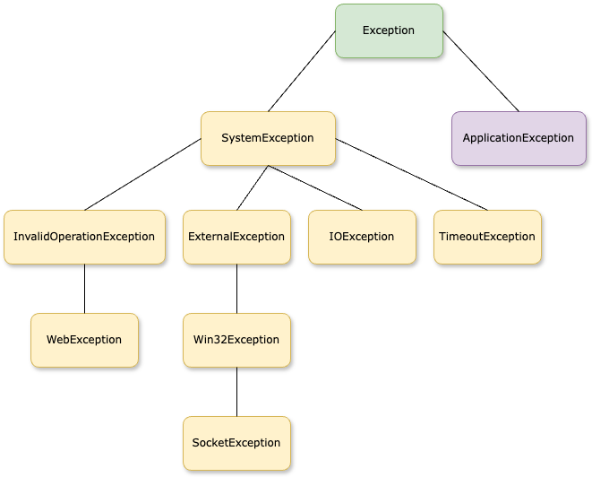

# 6


# Error Handling and Fault Tolerance Strategies

In the world of network programming, ensuring your applications are functional, adaptable, and reliable is non-negotiable. That's where robust error handling and fault tolerance strategies come into play, especially with the powerful features offered by .NET 8 and C# 12. This chapter dives deep into the sophisticated techniques that keep your network services running smoothly, even when faced with the unexpected. We'll build on the foundations laid in previous chapters, enhancing your toolkit with advanced practices that guarantee recovery and graceful degradation in the face of failures.

Understanding and implementing effective error handling in C# and .NET is crucial. We're not just catching exceptions anymore; we're strategizing around them. From leveraging the nuanced improvements in exception filtering to designing custom exception classes that carry meaningful error information, this chapter will refine how you perceive and manipulate errors. Moreover, with the introduction of asynchronous programming models and more complex threading scenarios, handling errors in multi-threaded environments has never been more critical.

As we design our network applications, fault tolerance becomes not just a feature, but a guiding principle. This chapter will walk you through the implementation of resilient patterns such as retries, circuit breakers, and fallback mechanisms. We'll demonstrate how to leverage **Polly**, a .NET resilience framework, to elegantly apply these patterns. Additionally, we'll delve into practical strategies for timeout management and load balancing that ensure your applications are not just enduring, but also sturdy under diverse and high-load conditions. Get ready to equip yourself with the knowledge to craft network applications that stand strong, delivering uninterrupted service even in the face of challenging digital conditions.

## Introduction to Error Handling in .NET

Error handling in .NET is fundamentally centered around exceptions, which are conditions that change a program's normal flow. In C# and .NET, exceptions provide a powerful mechanism for signaling and responding to unexpected situations, such as network timeouts or data format errors. For example, an exception might be thrown when a networking API fails to connect to a server or when an unexpected response is received.

The cornerstone of exception handling in C# is the try-catch-finally statement. A try block encapsulates code that might throw an exception, while catch blocks handle exceptions if one or more are thrown. The finally block, which is optional, executes code after the try and catch blocks, regardless of whether an exception was thrown or not, making it ideal for cleaning up resources, such as closing network streams or database connections.

Here is a simple example of using try-catch-finally in a network operation:

```C#
// Attempt to connect to a server
var client = new System.Net.Sockets.TcpClient("servername", 80);
try
{
    // Send some data
    var data = System.Text.Encoding.ASCII.GetBytes("Hello server!");
    client.GetStream().Write(data, 0, data.Length);
}
catch (System.Net.Sockets.SocketException e)
{
    Console.WriteLine($"SocketException: {e.Message}");
}
finally
{
    // Always close the client connection
    client?.Close();
}
```

In this example, a `TcpClient` attempts to connect to a server on port 80 and send a message. If a `SocketException` occurs—common in network operations—the error is caught, and an error message is displayed. Regardless of the outcome, the finally block ensures that the client connection is closed correctly, preventing resource leaks.

For more granular control, C# allows you to catch multiple types of exceptions and handle them differently, even filtering exceptions based on certain conditions using a when keyword. This capability enables developers to write more maintainable network code tailored to the specific risks and behaviors of network interactions. By embracing these practices, developers can significantly enhance their networked applications' reliability and user experience.

## Implementing Try, Catch, Finally, and Using Blocks

In the landscape of network programming in C# and .NET, knowing how to manage potential errors effectively through exception handling is crucial for building reliable applications. This section delves into the core constructs of C#'s error handling: the try, catch, finally, and using blocks. These tools are fundamental in gracefully managing runtime exceptions, ensuring that your network operations are resilient against the myriad of issues that can occur during execution.

We start by demystifying the try-catch-finally syntax, a practical and powerful tool that forms the backbone of exception handling in C#. This structure not only aids in capturing exceptions but also in executing necessary cleanup code, thereby preventing resource leaks and maintaining system stability. Mastering this syntax is a key step for any developer, empowering you to implement error handling in your applications.

Next, we delve into the application of try-catch blocks in the realm of network operations, where exceptions are not just possibilities but inevitabilities. From handling timeouts to managing network failures, effective use of these blocks can mean the difference between a failing application and a healthy one. We also shed light on the importance of effective exception filtering, a crucial aspect that allows your application to respond to different error conditions in a more targeted way, enhancing your error-handling strategy.

Moreover, we'll cover the critical roles of the finally block and using statements. The finally block ensures that specific code runs regardless of whether an exception occurred, which is crucial for releasing resources properly. Meanwhile, using statements provide a simplified syntax to handle disposable resources, such as network streams, ensuring they are correctly disposed of without cluttering your code with cleanup logic. We will also touch upon nested try-catch blocks, which can further refine how exceptions are handled in more complex scenarios involving multiple operations that could each throw different exceptions. This section aims to equip you with the knowledge and tools to implement sophisticated and effective error handling in your network applications.

### Overview of Try-Catch-Finally Syntax

In C# programming, robust error handling is achieved using the try-catch-finally syntax. This syntax is essential for managing exceptions—unforeseen errors that arise during a program's execution. This construct allows developers to write cleaner, more reliable code by effectively separating normal code from error-handling code.

The `try` block is where you place code that might cause an exception. If an exception occurs within this block, the flow of execution immediately transfers to a `catch` block that can handle the exception. Each `try` block can be followed by one or more `catch` blocks designed to catch and handle different types of exceptions in different ways. This is crucial in network programming, where various network errors, such as connection or timeout errors, can be anticipated and handled specifically.

```C#
try
{
    // Code that might throw an exception
    Console.WriteLine("Connecting to server...");
    using var client = new HttpClient();
    // Asynchronously read the response
    var response = await client.GetAsync("http://example.com");
    response.EnsureSuccessStatusCode(); // Throws an exception if the HTTP response status is an error code.
    Console.WriteLine("Connected and response received successfully.");
}
catch (HttpRequestException ex)
{
    // Handle HttpRequestException, which handles most HTTP related errors
    Console.WriteLine($"HTTP error: {ex.Message}");
}
catch (Exception ex)
{
    // Handle any other unexpected errors
    Console.WriteLine($"An unexpected error occurred: {ex.Message}");
}
```

Eventually, the `finally` block executes after the `try` and `catch` blocks complete but before control passes back to the main program. It is the ideal location to place cleanup code, such as freeing resources, closing network streams, or resetting variables, which must execute regardless of whether an exception was thrown or caught. Importantly, even if no exception occurs, the `finally` block ensures that the necessary cleanup operations are performed, avoiding resource leaks.

```C#
finally
{
    // Cleanup code, executed after try/catch blocks
    Console.WriteLine("Cleanup operations...");
    client?.Dispose();
}
```

Understanding and implementing this syntax is vital for writing network applications in C#. By carefully planning which exceptions to catch and ensuring all resources are properly cleaned up, developers can maintain system stability and prevent many common errors associated with network operations.

### Using Try-Catch Blocks in Network Operations

When dealing with network operations in C#, the `try-catch` block becomes indispensable for managing the uncertainties associated with network connectivity and data transmission. Network operations are prone to numerous issues, such as network failures, server downtime, or unexpected response formats, all of which can throw exceptions. Using `try-catch` blocks allows developers to gracefully handle these exceptions, ensuring the application remains user-friendly, even when facing unexpected network conditions.

In network programming, it's typical to wrap network requests in `try` blocks. The corresponding `catch` blocks can then be tailored with precision to handle specific network-related exceptions, allowing the program to respond appropriately depending on the nature of the error encountered. For instance, you might want to retry a request if a timeout occurs, or provide a user-friendly error message if the server cannot be reached.

Here's an example of using `try-catch` blocks effectively in a network operation:

```C#
try
{
    using var client = new HttpClient();
    Console.WriteLine("Sending request...");
    var response = await client.GetAsync("http://example.com/api/data");
    response.EnsureSuccessStatusCode(); // Throws an exception if the HTTP status code is not a success code
    string responseBody = await response.Content.ReadAsStringAsync();
    Console.WriteLine("Response received successfully.");
}
catch (HttpRequestException e)
{
    Console.WriteLine($"Request failed: {e.Message}");
}
catch (TaskCanceledException e)
{
    Console.WriteLine("Request timed out.");
}
catch (Exception e)
{
    Console.WriteLine($"An unexpected error occurred: {e.Message}");
}
```

In this code snippet, the `HttpRequestException` is specifically caught to handle errors related to the HTTP request, such as connection failures or non-success HTTP status codes. A `TaskCanceledException` is used to catch common timeout scenarios in network communications. Finally, a general `Exception` catch block is included to handle any other unforeseen errors that might occur.

By judiciously using `try-catch` blocks, developers can ensure that their network operations are error-resistant and optimized for performance and reliability. This enhances the user experience by reducing crashes and hangs and facilitates easier debugging and maintenance by clearly delineating the handling of different types of network errors.

### Utilizing the Finally Block

The `finally` block is a powerful feature in .NET for exception handling. It guarantees that a specific segment of code will be executed, regardless of any exceptions thrown and whether or not they are caught. This feature is particularly important in network programming where managing resources such as network connections and streams is critical for avoiding resource leaks and maintaining a stable and efficient application.

Typically, a `finally` block is used to release or clean up resources that were allocated in the `try` block. Since this block runs under all circumstances, it is an ideal place to include cleanup code. The `finally` block executes after the `try` block exits normally, after a `catch` block handles an exception, and even if an exception is thrown within a catch block and not subsequently handled.

Here’s an example demonstrating the use of a `finally` block in a network operation:

```C#
TcpClient? client = null;
try
{
    client = new TcpClient("example.com", 80);
    // Perform data transmission
    Console.WriteLine("Connection established.");
}
catch (SocketException ex)
{
    Console.WriteLine("Socket error: " + ex.Message);
}
finally
{
    // Ensure the client is properly closed
    client?.Close();
    Console.WriteLine("Connection closed.");
}
```

This example demonstrates the importance of utilizing the `finally` block in network applications. The `finally` block ensures that the network connection is always terminated correctly, regardless of successful establishment and usage or the occurrence of a socket exception. By doing so, potential issues such as hanging connections or memory leaks are avoided, resulting in significantly improved reliability. Utilizing the `finally` block effectively guarantees that resources are always released correctly, even in the presence of errors. Therefore, it is crucial to implement the `finally` block to enhance the overall performance of network applications. In this example, the `finally` block ensures that the network connection is properly terminated, whether or not the connection is established and used successfully or if a socket exception occurs. This helps to avoid potential issues such as hanging connections or memory leaks. By using the `finally` block effectively, network applications' dependability can be significantly improved. It guarantees that resources are always released correctly, even in the presence of errors.

### Handling Multiple Exceptions at Once and Filtering on Exceptions ###

Mastering the art of handling multiple exceptions is not just a skill, but a necessity in the world of network programming. The ability to efficiently manage various types of errors that can occur simultaneously is a hallmark of strong application development. In the realm of .NET, C# equips developers with structured exception handling capabilities, empowering them to catch and manage different exceptions separately or in a unified manner, depending on the scenario.

#### Catching Multiple Exceptions

When dealing with multiple types of exceptions, you can use multiple catch blocks to specify handlers for different exceptions. This approach is beneficial when the handling logic for each exception type is distinct. For example, you should handle a SocketException differently from an IOException, as each implies different underlying issues and recovery strategies.

Here's an example of how you might structure your code to catch and handle these exceptions differently:

```C#
using System.Net.Sockets;

try
{
    // Code that might throw multiple types of exceptions
    PerformNetworkOperation();
}
catch (SocketException ex)
{
    Console.WriteLine($"Socket error: {ex.Message}");
}
catch (IOException ex)
{
    Console.WriteLine($"I/O error: {ex.Message}");
}
catch (Exception ex)
{
    Console.WriteLine($"Unexpected error: {ex.Message}");
}
```

#### Exception Filters

C# also supports exception filtering using the when keyword, which allows more granular control over which exceptions to catch based on specific conditions. This feature is handy when you must catch an exception only under certain circumstances, such as logging detailed debug information only in debug builds or handling an exception only if it satisfies a particular condition.

Here is how you can use exception filters to handle exceptions selectively:

```C#
try
{
    // Code that might throw an exception
    PerformNetworkOperation();
}
catch (Exception ex) when (ex.Message.Contains("timeout"))
{
    Console.WriteLine("Operation timed out.");
}
catch (Exception ex) when (ex.Message.Contains("refused"))
{
    Console.WriteLine("Connection refused.");
}
catch (Exception ex)
{
    // This will catch all other Exceptions not previously filtered.
    Console.WriteLine($"An error occurred: {ex.Message}");
}
```

In this example, the when clauses filter exceptions based on the content of the exception message. This allows the code to respond differently depending on the specifics of the exception, making the error handling more targeted and effective.

By using multiple catch blocks and exception filters, developers can write more precise and maintainable error-handling code in their network applications. These techniques ensure that each exception type is addressed appropriately, contributing to the application's overall reliability and user experience.

### Exception Hierarchy in .NET

In .NET, exceptions are primarily categorized into two main types: `System.Exception` and `System.ApplicationException`. Understanding this hierarchy is crucial for implementing effective error handling in any C# application, particularly in network programming, where the distinction helps organize error-handling strategies more effectively.



<figcaption align = "center"><b>Heirarchy of Network Exceptions</b></figcaption>

#### System Exceptions

`System.Exception` is the base class for all exceptions in .NET. This category includes exceptions generally thrown by the CLR (Common Language Runtime) and typically associated with errors in the program's operation, such as `NullReferenceException`, `IndexOutOfRangeException`, and `InvalidOperationException`. These are considered "system exceptions" because the system usually triggers them when something goes wrong internally.

#### Application Exceptions

`System.ApplicationException` is designed for exceptions defined by applications. This distinction is meant to help differentiate between exceptions raised due to application logic and those due to system issues. However, in practice, deriving custom exceptions from `System.ApplicationException` is no longer recommended; Microsoft advises deriving custom exceptions directly from `System.Exception`.

#### Network-Specific Exceptions

For network programming, handling exceptions specific to network operations is vital. .NET provides several built-in exceptions to manage errors that occur during network communications. These include:
* `System.Net.WebException`: Occurs when an error is encountered while accessing the Internet using pluggable protocols. It provides status codes (`WebExceptionStatus`) that can tell you exactly what type of error occurred, such as Timeout, ConnectFailure, or ProtocolError.
* `System.Net.Sockets.SocketException`: Thrown by the `Socket` classes when an error occurs with the network socket, including detailed error codes (`SocketError`) like `SocketError.AccessDenied` or `SocketError.ConnectionReset`.
* `System.IO.IOException`: A broader exception that might be thrown for any input/output error, but it's also applicable to network streams when there's an issue with reading or writing to a network stream.

Here's an example of handling these network-specific exceptions in a network client application:

```C#
public class Program
{
    public static async Task Main(string[] args)
    {
        try
        {
            using var client = new HttpClient();
            string response = await client.GetStringAsync("http://example.com/data");
            Console.WriteLine(response);
        }
        catch (HttpRequestException ex) // Catches exceptions related to HTTP requests
        {
            Console.WriteLine(ex.InnerException is System.Net.Sockets.SocketException
                ? "Connection failed. Check your network connection."
                : $"Web error occurred: {ex.Message}");
        }
        catch (IOException ex)
        {
            Console.WriteLine($"An I/O error occurred: {ex.Message}");
        }
        catch (Exception ex)
        {
            Console.WriteLine($"An unexpected error occurred: {ex.Message}");
        }
    }
}
```

In this example, different types of exceptions are caught and explicitly handled according to their nature. This approach provides more accurate error messages and potentially different recovery actions based on the type of error encountered during the network operation.

Understanding and handling these exceptions correctly is vital to developing network applications in C#. By leveraging the exception hierarchy and handling specific network-related exceptions, developers can ensure that their applications behave predictably in the face of errors and maintain communication with other network resources.

### Resource Management with Using Statements

Resource management is a critical aspect of any software development project, especially when dealing with network resources that need to be released properly after use. In .NET, the `using` statement is a crucial feature in C# that simplifies resource management by automatically disposing of objects once they are no longer needed. This statement is particularly useful for objects that implement the `IDisposable` interface, such as streams, clients, and response objects used in network operations. It ensures that the `Dispose` method is called on an object when the code block within the `using` statement is exited, whether normally or due to an exception.

Here's a practical example of how to use the `using` statement in a network operation involving downloading data using `WebClient`, which is a typical class used in network programming.

```C#
using var client = new System.Net.WebClient();
try
{
    string data = client.DownloadString("http://example.com");
    Console.WriteLine("Data received: " + data);
}
catch (WebException ex)
{
    Console.WriteLine($"An error occurred: {ex.Message}");
}
// The WebClient is automatically disposed here, even if an exception occurs
```

In this example, the `WebClient` instance is created within the `using` block, ensuring it is disposed of immediately after the block is exited, after the operation completes successfully or if an exception interrupts it. This use of the `using` statement prevents resource leaks by automatically handling resource cleanup, making your code cleaner, safer, and more efficient. Such practices are essential for building reliable network applications in C#.

### Nested Try-Catch Blocks

Nested `try-catch` blocks in C# allow developers to handle layered exceptions, making it possible to manage errors at different levels of an application's logic. This approach is instrumental in network programming, where operations often involve multiple steps, each of which may fail due to different issues. Using nested `try-catch` blocks, developers can provide fine-grained error handling for complex operations involving multiple potentially fault-prone interactions, such as connecting to a server, sending data, and receiving responses.

In a nested `try-catch` structure, an outer `try-catch` block can encapsulate a broader operation. In contrast, inner `try-catch` blocks handle more specific exceptions that might occur within that broader context. This allows for more specific error messages and recovery actions at each level of the operation, improving the application's resilience and debugging clarity.

Consider the following example, where a network operation involves connecting to a server and then sending data:

```C#
try
{
    // Outer try block for connecting to the server
    using var client = new TcpClient("example.com", 80);
    Console.WriteLine("Connected to server.");
    try
    {
        // Inner try block for sending data
        NetworkStream stream = client.GetStream();
        byte[] data = Encoding.ASCII.GetBytes("Hello, server!");
        stream.Write(data, 0, data.Length);
        Console.WriteLine("Data sent.");
    }
    catch (IOException ex)
    {
        Console.WriteLine($"An I/O error occurred while sending data: {ex.Message}");
    }
}
catch (SocketException ex)
{
    Console.WriteLine($"Could not connect to server: {ex.Message}");
}
```

In this code example, the outer `try-catch` block handles exceptions related to establishing a connection with the server (e.g., `SocketException`). The inner `try-catch` block addresses errors that might occur while sending data (e.g., `IOException`). This structure helps isolate issues between connecting and sending and provides precise, context-specific handling for different errors that might occur during each phase.

Using nested `try-catch` blocks can significantly enhance error management in network applications, allowing developers to handle issues more precisely at the point of failure. This method provides clearer maintenance and operational reliability, especially in complex network operations requiring multiple steps.

## Advanced Exception Handling Techniques

Building on the advanced exception handling techniques you've mastered, you are now equipped to significantly enhance the maintainability of your network applications. The precise control you have gained over error detection, handling, and reporting is invaluable in network programming, where challenges like connectivity disruptions, protocol errors, and data transmission failures are commonplace. By effectively applying these sophisticated strategies, you can elevate the resilience of your applications and improve the overall user experience.

One advanced technique is the use of custom exception classes. Custom exceptions can be designed to convey more specific information about errors within a particular domain, such as network operations. By creating exceptions that carry additional data (like error codes, fault details, or troubleshooting steps), developers can provide more context to the error handlers and make debugging easier.

Here is an example of defining and using a custom exception in a network-related context:

```C#
public class NetworkTimeoutException(string message, Exception inner) : Exception(message, inner);

try
{
    // Simulate network operation that can timeout
    throw new NetworkTimeoutException("The operation timed out.", new TimeoutException());
}
catch (NetworkTimeoutException ex)
{
    Console.WriteLine($"Custom Exception Caught: {ex.Message}");
}
```

It's also important to note the distinction between using `throw` and `throw ex` within your exception handling blocks. Opting for `throw` preserves the original stack trace of the exception, providing a complete context of the error, which is crucial for debugging. In contrast, using `throw ex` resets the stack trace, which can obscure the origin of the error and complicate troubleshooting efforts. Preserving the integrity of the stack trace by using `throw` enhances your ability to diagnose and resolve issues more effectively.

Another advanced technique involves the use of the `ExceptionDispatchInfo` class to capture an exception and then rethrow it while preserving the original stack trace. This can be particularly useful in scenarios where an exception needs to be captured in one part of the application and rethrown in another without losing the original exception details.

```C#
ExceptionDispatchInfo? capturedException = null;

try
{
    // Some network operation that fails
    throw new InvalidOperationException("Invalid operation on the network stream.");
}
catch (Exception ex)
{
    capturedException = ExceptionDispatchInfo.Capture(ex);
}

// Later in the application, you might decide to rethrow
if (capturedException != null)
{
    capturedException.Throw();
}
```

The `AggregateException` class is particularly useful in tasks and parallel operations, where multiple exceptions may be thrown simultaneously. `AggregateException` can hold a collection of exceptions that are handled together at a later point. This is especially relevant in network programming when running multiple asynchronous operations concurrently.

```C#
try
{
    Task.WaitAll(
        Task.Run(() => throw new InvalidOperationException("Failed operation.")),
        Task.Run(() => throw new AccessViolationException("Memory error."))
    );
}
catch (AggregateException agEx)
{
    foreach (var ex in agEx.InnerExceptions)
    {
        Console.WriteLine($"Caught exception of type {ex.GetType()} with message: {ex.Message}");
    }
}
```

Using these advanced techniques, developers can handle exceptions more structured and informatively, enhancing network application fault tolerance. This not only leads to better error management but also improves the overall reliability and maintainability of the code.

### Handling Exceptions in Multithreaded Environments

Handling exceptions in multithreaded environments in .NET is critical to writing durable network applications. In these environments, exceptions can occur in multiple threads, and without proper handling, they can lead to application instability or crashes. Exception handling in such scenarios requires careful planning and implementation to ensure that errors do not undermine the integrity of the application.

One common approach in .NET for handling exceptions in multithreaded scenarios is to use the **Task Parallel Library** (**TPL**). The TPL provides a task-based programming model that makes exception handling more straightforward than dealing with raw threads. When a task encounters an exception, it is wrapped into an AggregateException object. This exception can contain one or more inner exceptions representing all the errors within the task.

Here’s an example of how to handle exceptions in tasks using TPL:

```C#
try
{
    Task task1 = Task.Run(() => throw new InvalidOperationException("Invalid operation!"));
    Task task2 = Task.Run(() => throw new NullReferenceException("Object reference not set!"));
    Task.WaitAll(task1, task2);
}
catch (AggregateException ae)
{
    foreach (var e in ae.InnerExceptions)
    {
        Console.WriteLine($"Caught exception: {e.GetType()}, Message: {e.Message}");
    }
}
```

In this code, `Task.WaitAll` is used to wait for all tasks to complete. If any tasks throw exceptions, `WaitAll` will throw an `AggregateException` containing all the exceptions from the tasks. The `catch` block handles the `AggregateException` and iterates through the `InnerExceptions` collection to process each exception individually.

Another critical aspect is ensuring that any exceptions not directly related to a task (such as those thrown in asynchronous callbacks or event handlers) are also captured and handled appropriately. In such cases, you should implement additional exception-handling logic to catch and log errors in those contexts or use try-catch blocks within each asynchronous method.

```C#
async Task PerformNetworkOperationAsync()
{
    using var client = new HttpClient();
    try
    {
        // Asynchronously get the response as a string
        string result = await client.GetStringAsync("http://example.com");
        Console.WriteLine("Download completed: " + result);
    }
    catch (Exception ex)
    {
        Console.WriteLine("Exception caught during network operation: " + ex.Message);
    }
}
```

In this example, exceptions that occur during an asynchronous network operation are handled within the event handler. This is essential because the `PerformNetworkOperationAsync` event executes on a different thread from the UI and main program execution threads.

Handling exceptions in multithreaded environments requires attention to detail and a thorough understanding of the threading model used in your application. By implementing error handling, you can build more reliable network applications in .NET, capable of handling the complexities and challenges of modern software environments.

### Using Custom Exception Classes

In .NET, custom exception classes can significantly enhance error handling by providing a transparent, more specific context for errors occurring within an application. Custom exceptions are particularly useful in network programming, where distinguishing between different types of network failures or specific conditions can improve debugging, error reporting, and user experience. By defining your own exception classes, you can include additional information and functionality beyond what is available in standard .NET exceptions.

#### Benefits of Custom Exception Classes

Custom exception classes allow you to express specific error scenarios clearly and explicitly in your code. For example, you might create a custom exception to represent timeouts in a specific network protocol or to indicate data corruption. These custom exceptions can carry additional data pertinent to the error, such as an error code, the name of the affected network operation, or diagnostic details.

#### Defining a Custom Exception

A custom exception should be derived from the `System.Exception` class. Providing constructors that mirror those found in the base `Exception` class is good practice. This includes constructors that accept a message string and an inner exception, which can be used to chain exceptions together, preserving the original exception data.

Here’s an example of how to define a custom exception for a network operation:

```C#
public class NetworkTimeoutException : Exception
{
    public int TimeoutDuration { get; }

    public NetworkTimeoutException() { }

    public NetworkTimeoutException(string message)
        : base(message) { }

    public NetworkTimeoutException(string message, Exception inner)
        : base(message, inner) { }

    public NetworkTimeoutException(string message, int timeoutDuration)
        : base(message)
    {
        TimeoutDuration = timeoutDuration;
    }
}
```

In this example, the `NetworkTimeoutException` includes an additional property, `TimeoutDuration`. This property can be used to provide more detailed information about the context in which the timeout occurred.

#### Using Custom Exception Classes

Once you have defined a custom exception `NetworkTimeoutException`, you can throw it in your code where appropriate. For example, you might throw a `NetworkTimeoutException` when a network request exceeds a defined time limit.

```C#
try
{
    if (isNetworkTimeout)
    {
        throw new NetworkTimeoutException("The network request timed out.", timeoutSeconds);
    }
}
catch (NetworkTimeoutException ex)
{
    Console.WriteLine($"Timeout after {ex.TimeoutDuration} seconds: {ex.Message}");
}
```

#### Best Practices for Custom Exceptions

When using custom exceptions, follow these best practices:
1. Inherit from the appropriate base exception class. While it's common to inherit directly from `System.Exception`, if your exception is more specific (like an invalid operation or an argument exception), inherit from another more specific exception type.
2. Use `[Serializable]` attribute if exceptions need to be serialized. This is particularly important for applications that distribute objects across different processes or network locations.
3. Provide additional context with custom properties. These properties can offer significant insights during debugging or error handling.

Developers can create a more manageable and readable error-handling architecture by employing custom exceptions in network programming. This approach helps quickly identify and handle problems effectively, thus improving the reliability of network applications.

### Logging and Diagnosing Exceptions

Logging and diagnosing exceptions are crucial aspects of developing network applications in .NET. Effective logging helps to understand the causes of exceptions after they occur and plays a vital role in monitoring application health and debugging during the development and maintenance phases. By implementing comprehensive logging strategies, developers can greatly enhance the ability to diagnose and resolve issues that may affect application stability and performance.

#### Importance of Logging

Exception logging is particularly crucial in network programming. In this context, exceptions can arise from transient network conditions or remote server errors, making logging an essential tool. It provides a historical record of anomalies, which is invaluable for troubleshooting and enhancing future versions of the application. It also helps to determine whether exceptions are isolated incidents or part of a broader issue with the network infrastructure or application logic.

#### Implementing Logging

In C#, logging can be implemented using various logging frameworks that integrate easily with the .NET environment, such as **NLog**, **Serilog**, or **log4net**. These libraries offer advanced features like configurable logging levels, multiple output targets (file, database, console), and structured logging. Here’s an example using Serilog to log exceptions:

```C#
using Serilog;

Log.Logger = new LoggerConfiguration()
    .MinimumLevel.Debug()
    .WriteTo.File("logs/myapp.txt", rollingInterval: RollingInterval.Day)
    .CreateLogger();

try
{
    // Simulate network operation
    throw new InvalidOperationException("Failed to process the network request");
}
catch (Exception ex)
{
    Log.Error(ex, "Exception caught during network operation");
}
```

In this example, **Serilog** is configured to log debug and higher severity messages to both the console and a text file. When an exception is caught, it logs an error with a message and the exception details, which helps in diagnosing the issue.

#### Best Practices in Exception Logging

When logging exceptions, it’s important to:
1. Include as much context as possible: Information such as the time of the exception, the operation being performed, and any relevant data values can be crucial for diagnosing problems.
2. Use appropriate log levels: Not every exception needs to be logged with high severity. Use warning levels for recoverable faults and error levels for more severe issues.
3. Avoid sensitive data in logs: Ensure that logs do not contain sensitive information such as passwords or personal user data.

#### Using Diagnostics Tools

.NET also provides built-in tools and libraries to help diagnose issues, such as the System.Diagnostics namespace, which includes classes for event logging, performance counters, and tracing. Tracing can be incredibly useful for following the flow of execution and understanding the state of an application when an exception occurs.

```C#
using System.Diagnostics;

TraceSource trace = new TraceSource("MyTraceSource");

try
{
    // Network operation that might fail
    trace.TraceEvent(TraceEventType.Start, 0, "Starting network operation.");
    throw new NullReferenceException();
}
catch (Exception ex)
{
    trace.TraceEvent(TraceEventType.Error, 1, $"Exception: {ex.Message}");
}
finally
{
    trace.TraceEvent(TraceEventType.Stop, 2, "Stopping network operation.");
    trace.Flush();
}
```

In this code, `TraceSource` is used to log different stages of a network operation, providing clear start and stop markers around an exception-throwing operation. This can help developers follow the application’s behavior up to and following an exception.

By effectively using logging and diagnostics tools, developers can significantly improve the reliability of network applications by quickly identifying and addressing the underlying causes of exceptions.

## Designing for Fault Tolerance

Designing for fault tolerance is an essential aspect of building network applications in .NET. Fault tolerance is about ensuring that your application remains operational despite failures, whether they are due to software bugs, hardware malfunctions, or network issues. This section will explore how to design and implement fault-tolerant systems using [the Polly project](https://www.thepollyproject.org/), a popular resilience and transient fault-handling library specifically designed for .NET applications.

Polly introduces patterns such as retries, circuit breakers, fallbacks, and more, allowing developers to handle exceptions and transient faults in their code elegantly. By leveraging these patterns, developers can ensure their applications can gracefully handle and recover from unexpected disruptions. This is particularly important in network programming, where unreliable network conditions and external system failures can significantly impact application performance and user experience.

We will embark on a comprehensive journey, starting with an introduction to the concepts of fault tolerance and how Polly fits into this landscape. This includes a deep dive into the retry mechanism offered by Polly, which enables applications to automatically attempt failed operations again until they succeed or a certain condition is met. We will then explore the circuit breaker pattern, which prevents an application from performing an operation that's likely to fail, based on recent failures.

Additionally, we will explore fallback methods that provide alternative solutions when primary methods fail, effective timeout management to avoid long waits, and strategies for load balancing and failover that distribute workload and ensure continuity in case of a system failure.
Lastly, we will underscore the practicality of monitoring and health checks, demonstrating how these can provide real-time insights into application health and help preempt potential issues. Through practical examples and in-depth discussion, this section will equip you with the practical tools needed to design and implement flexible network applications using Polly in a .NET environment.

### Introduction to Fault Tolerance

In the .NET environment, designing applications to be fault-tolerant involves structuring them to handle and recover from partial failures without service interruption. The goal is to ensure continuous service availability and reliability, even under adverse conditions.

In .NET, fault tolerance can be achieved through various strategies and patterns that anticipate, detect, and respond to failures. These strategies include implementing retry mechanisms, applying circuit breaker patterns, and employing fallback methods. Each approach aims to handle different types of failures that a network application may encounter, thereby minimizing downtime and maintaining a seamless user experience.

A retry mechanism is a simple yet effective way to handle transient failures—temporary issues that may resolve themselves quickly, such as a brief network outage or a temporarily overloaded server. The system can often overcome the failure without user intervention or escalation by automatically retrying a failed operation after a short delay.

On the other hand, the circuit breaker pattern handles more sustained problems by monitoring for a certain threshold of failures. Once this threshold is reached, the circuit breaker "trips" to prevent further operations, thus avoiding continuous failure and allowing dependent systems or components to recover. This resembles an electrical circuit breaker that cuts off electricity to prevent overload and potential hazards.

Lastly, fallback methods provide alternative solutions or responses when a primary method fails. For example, a network application might return cached data or a default response if it cannot retrieve fresh data due to a failure. This ensures that the application can still function, albeit in a degraded mode, rather than failing outright.

Understanding these concepts is crucial for developers working in .NET, as it sets the foundation for implementing network applications. In subsequent sections, we'll explore how to apply these fault tolerance strategies using specific tools and libraries available in .NET, enhancing the stability and reliability of your applications.

### A Look at the Polly Project

Polly is a resilience and transient fault-handling library designed for .NET applications that helps developers add fault tolerance to their systems by providing a variety of resilience pipelines to handle exceptions and transient errors. It is especially powerful in network programming, where issues like temporary network failures, timeouts, and response delays are common. Polly allows applications to react to these problems by retrying operations, breaking the circuit, or falling back to a predefined alternative method, thus maintaining stability and service availability.

At its core, Polly provides several types of resilience strategies, each designed to handle failures in a different way. The most commonly used resilience strategy include Retry, Circuit Breaker, Timeout, Bulkhead Isolation, and Fallback. Each resilience pipeline can be configured with custom settings to tailor the error handling to the specific needs of your application.

#### Installing Polly

Installing the Polly library in your .NET projects enhances your application's resilience by incorporating advanced fault-handling patterns such as retries, circuit breakers, etc. Version 8 of Polly can be installed in various development environments, including Visual Studio, via the command-line interface (CLI) and JetBrains Rider. Here's how you can install Polly in each of these environments:

##### Installing Polly in Visual Studio

1. **Open Your Project in Visual Studio**: Start by opening your solution or project in Visual Studio.
2. **Manage NuGet Packages**: Right-click on the project in the Solution Explorer and select "Manage NuGet Packages."
3. **Search for Polly**: Go to the "Browse" tab in the NuGet Package Manager and type "Polly.Core" into the search box.
4. **Install the Package**: Find the Polly package in the list (ensure it's the official package by checking the author or company is "App vNext"), select it, and press "Install." Visual Studio will handle the rest, including adding the necessary references to your project.

##### Installing Polly using the .NET CLI

If you prefer using a command-line interface, or if you are working in an environment where Visual Studio is not available, you can use the .NET CLI to install Polly:

```Bash
dotnet add package Polly.Core --version 8.3.1
```

Note: The version of Polly.Core will likely have increased from the writing of this chapter.

This command adds the Polly package directly to your project. Before running the command, navigate to your project directory in the command line.

##### Installing Polly in JetBrains Rider

JetBrains Rider also supports NuGet package management within its IDE, which makes installing libraries like Polly straightforward:
1. **Open Your Project**: Start Rider and open the project where you want to add Polly.
2. **Access NuGet Window**: Go to the "Tools" menu and select "NuGet" and then "Manage NuGet Packages for Solution."
3. **Search for Polly**: In the NuGet window, click the "Browse" tab and enter "Polly.Core" into the search field.
4. **Install Polly**: Select the Polly package from the search results, ensure it's the correct package by verifying the publisher, and click "Install." Rider will download and add the references automatically to your project.

Polly integrates seamlessly with .NET applications and supports asynchronous programming patterns, making it an ideal choice for modern network-based or cloud-first applications. By using Polly, developers can enhance the resilience of their applications, ensuring that they handle failures gracefully and maintain a high level of service availability even under adverse conditions.

### Retry Resilience Strategies in Polly

Retry resilience strategies are a cornerstone of robustness in modern applications, particularly in network programming, where transient failures such as temporary network outages or server overloads are common. The Polly library for .NET provides a sophisticated yet user-friendly framework for implementing retry resilience strategies that help applications recover from such transient failures gracefully. By automatically retrying failed operations, these resilience strategies can significantly improve the reliability and user-friendliness of your applications.

One of the key strengths of Polly is its flexibility in configuring retry resilience pipelines. For instance, a basic retry resilience pipeline can be set to attempt an operation several times before the `finally` handles the failing if the issues persist. This is particularly beneficial for scenarios where the failure is expected to be temporary and resolve quickly. With Polly, you can specify the number of retries and the delay between them, offering both fixed delay retries and more sophisticated exponential backoff strategies.

Here’s an example of how to implement a simple retry resilience pipeline with a fixed delay using Polly:

```C#
var strategy = new ResiliencePipelineBuilder().AddRetry(new()
{
    ShouldHandle = new PredicateBuilder().Handle<Exception>(),
    MaxRetryAttempts = 3,
    Delay = TimeSpan.FromMilliseconds(200), // Wait between each try
    OnRetry = args =>
    {
        var exception = args.Outcome.Exception!;
        progress.Report(ProgressWithMessage($"Strategy logging: {exception.Message}", Color.Yellow));
        Retries++;
        return default;
    }
}).Build();
```

This code configures the retry resilience pipeline to handle any exception by retrying three times with a two-second pause between each attempt. The onRetry delegate is an optional parameter that executes custom logic with each retry, such as logging the retry attempt, which is helpful for debugging and monitoring.

You should implement an exponential backoff strategy for more sophisticated scenarios, where the delay between retries increases exponentially. This approach is helpful to avoid overloading the server or network when it is already under strain. Here's how you can set up exponential backoff with Polly:

```C#
var strategy = new ResiliencePipelineBuilder().AddRetry(new()
{
    ShouldHandle = new PredicateBuilder().Handle<Exception>(),
    MaxRetryAttempts = 5,
    Delay = TimeSpan.FromSeconds(Math.Pow(2, Retries)), // Wait between each try
    OnRetry = args =>
    {
        var exception = args.Outcome.Exception!;
        progress.Report(ProgressWithMessage($"Strategy logging: {exception.Message}", Color.Yellow));
        Retries++;
        return default;
    }
}).Build();
```

This resilience pipeline retries up to five times, with the delay between retries growing exponentially. Thus, the network or the server has more time to recover as the number of attempts increases.

Moreover, Polly's resilience pipelines are more comprehensive than simple exception handling. They can also be configured to handle specific exceptions or even based on the operation's result. For example, you should retry a network call only if it returns a specific HTTP status code indicating a temporary issue, such as a 504 Gateway Timeout.

```C#
using System.Net;
using Polly.Retry;

var statusCodes = new List<HttpStatusCode>
{
    HttpStatusCode.GatewayTimeout
};

PredicateBuilder<HttpResponseMessage> predicateBuilder = new PredicateBuilder<HttpResponseMessage>()
    .HandleResult(response => statusCodes.Contains(response.StatusCode));

var strategy =  new ResiliencePipelineBuilder<HttpResponseMessage>()
    .AddRetry(new RetryStrategyOptions<HttpResponseMessage>()
    {
        ShouldHandle = predicateBuilder,
        
        // additional options
    });
```

This resilience pipeline specifically retries HTTP calls that result in a `504 Gateway Timeout` status, making it a highly targeted approach to handling specific network-related issues.

These examples show how Polly provides a flexible and powerful way to implement retry strategies in .NET applications. By understanding and leveraging these patterns, developers can build more adaptable systems that can better withstand the complexities and challenges of network communication.

### Circuit Breaker Resilience Strategies in Polly

The circuit breaker pattern is a resilience strategy that prevents an application from repeatedly trying to execute an operation that is likely to fail. Adopted from electrical engineering, where a circuit breaker prevents overloads by breaking the circuit, in software, a circuit breaker prevents further strain on an already failing system by temporarily halting potentially harmful operations. This pattern is instrumental in network programming, where continuous failures can exacerbate the problem, such as overwhelming a struggling remote service with repeated requests.

Polly empowers developers to define conditions under which the circuit should 'break,' and the duration for which it should stay 'open' before attempts to close it resume. When the circuit is open, attempts to execute the operation will automatically fail without actually executing, thereby giving the system time to recover. This straightforward implementation makes it a confident choice for developers.

Here's how to configure a basic circuit breaker using Polly:

```C#
var circuitBreakerStrategy = new ResiliencePipelineBuilder().AddCircuitBreaker(new()
{
    ShouldHandle = new PredicateBuilder().Handle<Exception>(),
    MinimumThroughput = 4,
    BreakDuration = TimeSpan.FromSeconds(30),
    OnOpened = args =>
    {
        progress.Report(ProgressWithMessage(
                $".Breaker logging: Breaking the circuit for {args.BreakDuration.TotalMilliseconds}ms!",
                Color.Magenta));

        var exception = args.Outcome.Exception!;
        progress.Report(ProgressWithMessage($"..due to: {exception.Message}", Color.Magenta));
        return default;
    },
    OnClosed = args =>
    {
        progress.Report(ProgressWithMessage(".Breaker logging: Call OK! Closed the circuit again!", Color.Magenta));
        return default;
    },
    OnHalfOpened = args =>
    {
        progress.Report(ProgressWithMessage(".Breaker logging: Half-open: Next call is a trial!", Color.Magenta));
        return default;
    }
}).Build();
```

In this example, the circuit breaker resilience pipeline is set to open after four exceptions and will remain open for 30 seconds. During this time, all attempts to execute the protected operation will fail immediately without invoking the operation. After 30 seconds, the circuit transitions to a "half-open" state, where a subsequent trial call is allowed to test if the underlying problem has been resolved. If this trial call succeeds, the circuit resets to the closed state; if it fails, the circuit opens again for the specified duration.

The circuit breaker pattern is essential in systems where continuous failures can cause more harm than stopping the operation altogether. For example, continuously retrying a failed network operation can lead to performance degradation, more errors, or even complete service unavailability. Implementing a circuit breaker can help ensure that the system maintains functionality during faults and can recover more gracefully.

Advanced configurations of Polly's circuit breaker can include tracking successes and failures over a rolling interval rather than counting consecutive failures, which provides a more nuanced approach to determining the circuit's state. Additionally, integrating circuit breakers with other Polly resilience pipelines, such as retries or fallbacks, can effectively create a potent fault-handling strategy that addresses multiple failure scenarios.

By leveraging the circuit breaker pattern through Polly, developers can enhance the stability and resilience of their network applications in .NET. This pattern not only helps manage unresponsive external services but also contributes significantly to the overall quality of the application, preventing cascading failures and promoting system recovery and stability.

### Fallback Resilience Strategies in Polly

Fallback strategies are essential to resilience and fault tolerance in software development. They not only allow applications to operate smoothly by providing an alternative course of action when a primary method fails but also play a crucial role in enhancing user experience. This is especially critical in network programming, where dependencies on remote services or data can lead to vulnerabilities if those external systems become unreliable or unresponsive. Using fallback strategies, applications can degrade gracefully, maintaining functionality and ensuring a seamless user experience even under partial system failures.

Here’s a simple example of how to implement a fallback strategy with Polly:

```C#
using Polly.Fallback;

new ResiliencePipelineBuilder<User>().AddFallback<User>(new FallbackStrategyOptions<User>
{
    ShouldHandle = new PredicateBuilder<User>()
        .Handle<HttpRequestException>()
        .HandleResult(user => user is null),
    FallbackAction = static args =>
    {
        var user = User.GetRandomUser();
        return Outcome.FromResultAsValueTask(User.Empty);
    },
    OnFallback = static args => default
});
```

In this example, the fallback resilience pipeline is configured to handle `HttpRequestException`, which is common in network requests. The fallback action is to send back to the caller a dynamically generated user. This ensures that the application can still provide data to the client, albeit potentially less valuable if the network request fails.

Fallbacks are particularly useful in scenarios where maintaining a non-disruptive user experience is critical, even when some functionalities are impaired. For instance, an e-commerce application might display products from a local cache or a generic product list if the inventory service is down, thus allowing users to browse products and make purchases based on the cached data.

Furthermore, fallback strategies can be combined with other Polly resilience pipelines for a better resilience strategy. For example, a fallback could be used with a retry resilience pipeline. This layered approach ensures that the application attempts to handle failures progressively, starting from retries, possibly escalating to a circuit breaker, and finally, if all else fails, executing a fallback.

```C#
var predicateBuilder = new PredicateBuilder<HttpResponseMessage>()
    .Handle<HttpRequestException>()
    .HandleResult(r => r.StatusCode == HttpStatusCode.InternalServerError);

var pipeline = new ResiliencePipelineBuilder<HttpResponseMessage>()
    .AddFallback(new()
    {
        ShouldHandle = predicateBuilder,
        FallbackAction = args =>
        {
            // Try to resolve the fallback response
            HttpResponseMessage fallbackResponse = ResolveFallbackResponse(args.Outcome);

            return Outcome.FromResultAsValueTask(fallbackResponse);
        }
    })
    .AddCircuitBreaker(new ()
    {
        ShouldHandle = predicateBuilder,
        MinimumThroughput = 4,
        BreakDuration = TimeSpan.FromSeconds(30),
        OnOpened = args =>
        {
            var exception = args.Outcome.Exception!;
            return default;
        },
        OnClosed = args => default,
        OnHalfOpened = args => default
    })
    .AddRetry(new()
    {
        ShouldHandle = predicateBuilder,
        MaxRetryAttempts = 3,
    })
    .Build();
```

The application will first retry the operation three times using this combined strategy. If the failures continue, the circuit breaker trips to prevent further immediate attempts, and after all these measures, if the operation still fails, the fallback logic is executed. This comprehensive use of Polly's resilience pipelines ensures that applications remain responsive and operational despite adverse conditions, effectively managing failures and providing alternatives seamlessly.

### Timeout Resilience Strategies in Polly

Timeouts are a critical component of resilience strategies in network programming. They ensure that an application does not hang indefinitely while waiting for a response from an external service or operation. Implementing effective timeout strategies can prevent resources from being tied up and maintain an application's responsiveness.

In Polly, the timeout resilience pipeline can be configured to abort an operation if it exceeds a specified duration. This is particularly useful for network calls where long waits could degrade user experience or lead to resource exhaustion. The timeout resilience pipeline in Polly throws an exception when the timeout period is exceeded, allowing the application to catch this exception and handle it appropriately, whether that means retrying the operation, logging the timeout, or providing feedback to the user.

Now, let's dive into a practical example of how to implement a timeout strategy with Polly.

```C#
var pipeline = new ResiliencePipelineBuilder()
    .AddTimeout(new TimeoutStrategyOptions
    {
        Timeout = TimeSpan.FromSeconds(10),
        OnTimeout = args =>
        {
            Console.WriteLine("Timeout limit has been exceeded");
            return default;
        }
    }).Build();
```

In this example the timeout resilience pipeline is set to give up after 10 seconds if the operation has not been completed. This strategy is used when you have operations that may hang or do not handle cancellation tokens internally. The onTimeout delegate is used to log the timeout event.

Using Polly’s timeout resilience pipelines, you can define clear boundaries for how long your application should attempt to perform operations, protecting it against failures in external dependencies and maintaining a smooth and responsive user experience. Moreover, the flexibility to choose between pessimistic and optimistic strategies allows developers to tailor the timeout handling to the nature of the operations they are dealing with, whether entirely under their control or dependent on third-party APIs that support cancellation.

### Load Balancing and Failover Techniques

Load balancing and failover, two crucial techniques in network programming, play a pivotal role in enhancing application scalability and reliability. These strategies, by distributing the workload across multiple computing resources, such as servers or network paths, ensure no single point of failure and improve response times during high-traffic periods. For developers working in environments where application uptime and performance are key, understanding how to implement these techniques effectively is not just important, but vital.

In .NET, load balancing can typically be managed at several layers, including DNS, hardware, and application logic. Software-level load balancing can be done by distributing requests across a pool of servers or services based on various algorithms like round-robin, least connections, or even more complex, adaptive schemes that consider server load or response times. .NET applications can implement this using various techniques, such as load balancers that support sticky sessions or programmatically routing requests to the least busy servers.

Here is a fundamental conceptual example of implementing a simple load balancing mechanism in C#:

```C#
void Main(string[] args)
{
    var serverPool = new ServerPool();
    serverPool.AddServer(new Server("Server1", 1)); // Lower weight, less traffic
    serverPool.AddServer(new Server("Server2", 3)); // Higher weight, more traffic
    serverPool.AddServer(new Server("Server3", 2)); // Medium weight, medium traffic

    for (int i = 0; i < 10; i++)
    {
        Server? selectedServer = serverPool.GetServer();
        Console.WriteLine($"Redirecting request to {selectedServer?.Name}");
    }
}

public class Server(string name, int weight)
{
    public string Name { get; } = name;
    public int Weight { get; } = weight;
}

public class ServerPool
{
    private readonly List<Server?> _servers = new();
    private readonly Random _random = new Random();
    private int _totalWeight;

    public void AddServer(Server? server)
    {
        _servers.Add(server);
        _totalWeight += server.Weight;
    }

    public Server? GetServer()
    {
        int randomNumber = _random.Next(_totalWeight);
        int cumulativeWeight = 0;

        foreach (var server in _servers)
        {
            cumulativeWeight += server.Weight;
            if (randomNumber < cumulativeWeight)
            {
                return server;
            }
        }

        return null; // This should never happen if servers are correctly weighted
    }
}
```

This load balancer uses a simple weighted random algorithm to distribute requests proportionally based on server weights. This approach can be expanded with more sophisticated load monitoring and dynamic weight adjustments based on ongoing performance metrics, making the load balancer adaptive to changing conditions in server performance or network load.

Failover techniques involve switching over to a redundant or standby system, server, network, or component when the currently active system fails. This is crucial for maintaining service availability and continuity. In .NET, one common approach to achieve failover is through the use of clustering. Clustering allows multiple application instances to run in parallel, and if one fails, others can seamlessly take over, ensuring uninterrupted service. Another approach is to use secondary databases or data stores. These secondary databases are kept in sync with the primary, and in case the primary fails, the application can quickly switch to the secondary, minimizing downtime and ensuring data integrity.

Effective load balancing and failover strategies require technical implementation and thorough planning and testing to ensure they handle expected and unexpected loads and transition smoothly in the event of a component failure. Developers must also consider the trade-offs between complexity and benefits when implementing these strategies to ensure that the solution matches the actual needs of the application in terms of scalability, reliability, and maintainability.

### Monitoring and Health Checks

In modern network applications, especially those deployed at scale, monitoring and implementing health checks are critical to ensure reliability and availability. These practices provide insight into an application's operational status and can help detect issues before they affect users. In .NET, various tools and techniques are available to monitor application health and implement health checks effectively.

**Monitoring** in .NET can be broadly categorized into logging, performance metrics, and event tracing. Logging involves recording information about application processes and errors, which can be crucial for diagnosing issues after they occur. Tools like NLog, Serilog, or log4net can be configured to log detailed information about network requests, responses, and unexpected failures. **Performance metrics** gather data on various aspects of application performance, such as response times, throughput, and resource utilization. .NET provides performance counters and Application Insights for tracking these metrics in real time, which helps in identifying performance bottlenecks and trends.

**Event tracing** is another vital monitoring part of network programming. It involves recording significant events in the application's lifecycle. This is particularly useful in a distributed environment where understanding the sequence of operations can be challenging. NET's EventSource and TraceSource classes offer support for adding custom tracing to your applications.

**Health checks** are proactive measures to assess the health of an application and its dependencies. In .NET, health checks can be implemented using the `Microsoft.Extensions.Diagnostics.HealthChecks` namespace, which is part of the ASP.NET Core. This package allows developers to define health check services that can test various parts of the application and its external dependencies, such as databases, file systems, and external services.

Here is an example of how you can set up a basic health check in an ASP.NET Core application:

```C#
using Microsoft.Extensions.Diagnostics.HealthChecks;

var builder = WebApplication.CreateBuilder(args);

// Other configurations

builder.Services.AddHealthChecks()
    .AddCheck("example_health_check", () => HealthCheckResult.Healthy("The check indicates a healthy state."));
    
var app = builder.Build();

// Other app setups

app.MapHealthChecks("/health");
```

This code snippet adds a health check service that always returns a healthy state. The health check endpoint is exposed at `/health`, where it can be queried to get the application's health status. Tools like Kubernetes can use this endpoint to manage service availability and perform actions like restarting unhealthy service instances.

By integrating monitoring and health checks into your .NET applications, you ensure that potential problems can be identified and addressed quickly, minimizing downtime and maintaining a high level of service reliability. These practices are essential for any network application and are strongly recommended as part of a comprehensive operational strategy.

## Summary

This chapter on Error Handling and Fault Tolerance Strategies in C# and .NET has not only equipped you with the essential knowledge and tools, but also empowered you to enhance the reliability and resilience of your network applications. By understanding and implementing strong error-handling techniques, you can confidently ensure that your applications manage unexpected failures gracefully and maintain optimal functionality under diverse conditions. We covered a broad range of topics, from the basics of error handling using try, catch, and finally blocks to the intricacies of advanced techniques such as exception filtering and the creation of custom exception classes.

The discussion began with a detailed examination of the .NET exception hierarchy, emphasizing the differentiation between system and application exceptions and introducing network-specific exceptions that are particularly relevant to network programming. We explored how leveraging these can aid in more targeted and effective error management. The chapter also detailed practical implementations of nested try-catch blocks and the strategic use of the finally block for resource cleanup, which is critical in preventing resource leaks and ensuring application stability. These practical implementations are immediately applicable and valuable in your day-to-day work.

Moving into the realm of fault tolerance, we introduced the Polly library, a powerful tool for implementing advanced fault-handling patterns like retries, circuit breakers, and fallback methods. Each pattern was discussed in detail, providing scenarios where they would be most effective and C# code examples to demonstrate their implementation. The critical discussion points were the importance of retries in handling transient faults, circuit breakers to prevent repeated failures, and fallback methods to provide alternative solutions when operations fail.

Additionally, the chapter covered the necessity of incorporating monitoring and health checks into your network applications. This ensures the continuous assessment of an application's health and enhances its reliability and availability through proactive maintenance. Tools and techniques for logging, tracing, and defining health checks in .NET were examined, showing how they can provide critical insights into application performance and operational status.

In conclusion, this chapter has laid a solid foundation for writing more resilient network-driven applications in C#. With the strategies, patterns, and practices discussed, you are now better prepared to design applications that can withstand and recover from the myriad of issues in dynamic network environments. This knowledge will undoubtedly aid in building services that offer enhanced user experiences by being robust, reliable, and responsive.