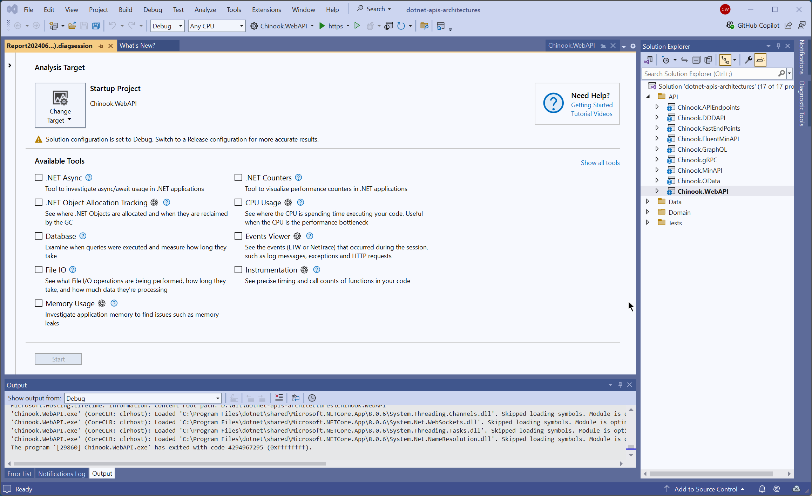
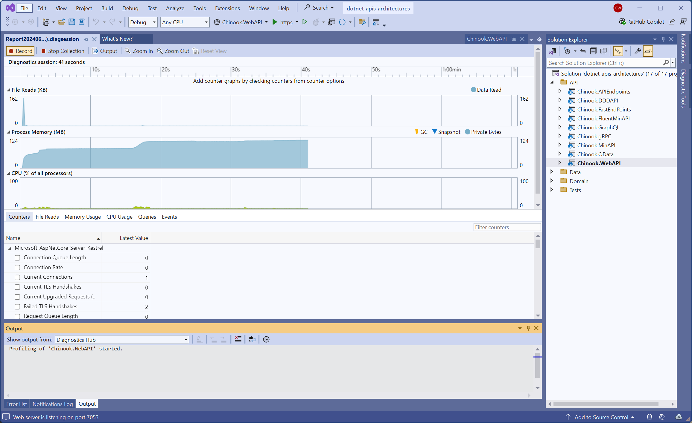
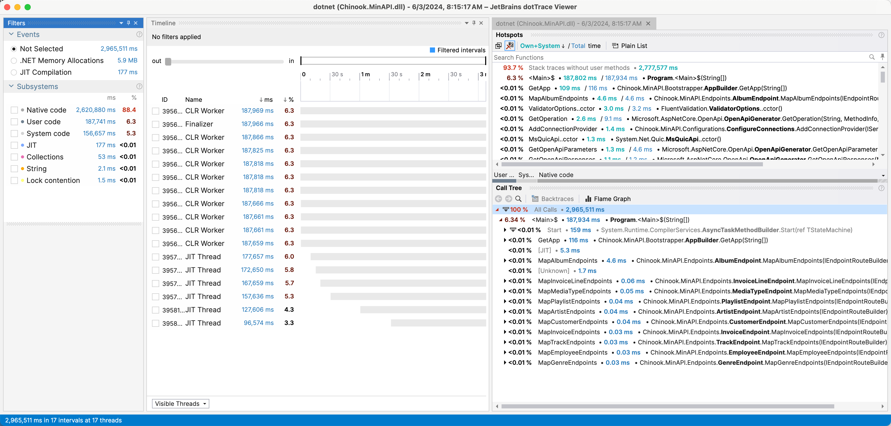
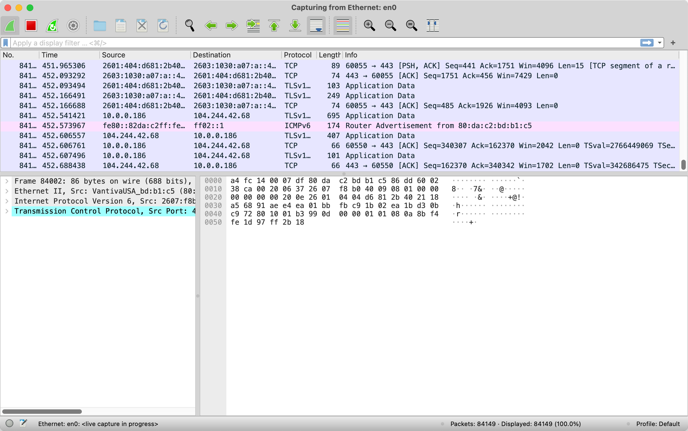
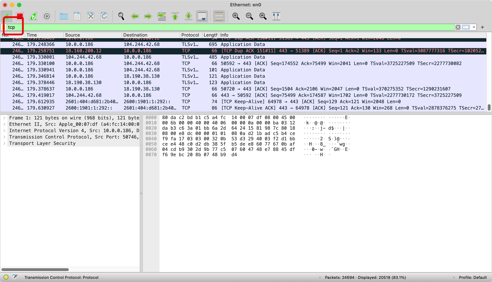

# 8


# Network Performance Optimization

Optimizing network performance is pivotal for developing robust and efficient applications in network programming using .NET 8 and C #12. In previous chapters, we have explored various facets of network communication, emphasizing the importance of effective data management and serialization techniques. As we transition into a focused discussion on network performance optimization, this chapter aims to synthesize these elements and introduce advanced strategies to enhance network operations' efficiency and responsiveness.

Optimizing network performance in .NET applications is a complex task that involves a variety of approaches. It's about making the most of the features in C#, like the improved asynchronous programming models and span-based memory access, to reduce the time and resources needed for network communications. .NET 8 provides powerful tools for network analysis and diagnostics, which can help you identify and fix performance issues.

This chapter will delve into practical optimization techniques, including the judicious use of threading and task parallelism, optimization of network protocols, and strategic data compression. We will examine case studies and performance metrics to demonstrate the impact of these optimizations in real-world scenarios. By the end of this chapter, readers should have a comprehensive toolkit of strategies and best practices for enhancing the performance of their networked applications, explicitly tailored to the capabilities and features of .NET and C#.

## Understanding and Analyzing Network Performance in .NET

As we embark on the journey of understanding and analyzing network performance within .NET, it is crucial to establish a solid foundation of the key concepts and metrics that govern the efficiency of network interactions. This section aims to equip developers with the necessary tools and knowledge to assess their network applications' performance accurately. By understanding the underlying metrics, such as latency, throughput, and packet loss, developers can gain insights into the operational aspects of their applications and identify areas that may require optimization.

Network performance analysis begins with the effective use of diagnostic tools and performance monitoring techniques. In the .NET ecosystem, developers have access to a range of tools, such as network profilers, performance counters, and tracing utilities, that provide detailed insights into application network activity. Learning to leverage these tools not only helps pinpoint performance bottlenecks but also helps understand how data flows through network channels and how it is affected by various network conditions.

Furthermore, this section will guide developers through interpreting the data gathered from these tools, turning raw metrics into actionable insights. We will discuss methods to systematically approach performance issues, from identifying the root cause to evaluating the impact of potential solutions. By the end of this section, developers should be well-prepared to conduct thorough performance analyses and implement effective optimizations in their .NET network applications, ensuring that they meet the high standards of responsiveness and reliability required in today's networked environments.

### Tools and Techniques for Performance Analysis

Applicable performance analysis is critical for optimizing network applications and systems in C# and .NET. Developers can identify and resolve performance bottlenecks by employing suitable techniques, ensuring their applications run smoothly and efficiently. This section covers critical techniques that provide deep insights into network performance and guide the optimization process.

One essential technique is the use of asynchronous programming models. Asynchronous programming (see Chapter 4), facilitated by the async and await keywords in C#, helps prevent blocking network calls and allows applications to handle multiple network operations concurrently. This approach reduces latency and improves the overall responsiveness of network applications. Additionally, analyzing the execution of asynchronous methods using tools like JetBrains dotTrace can reveal performance bottlenecks and help optimize asynchronous code paths.


Another technique that can greatly enhance your network applications involves leveraging performance profiling and diagnostic tools. Tools such as Visual Studio Performance Profiler and Event Tracing for Windows (ETW) provide detailed metrics on network activity, CPU usage, and memory allocation. Profiling is a powerful tool that helps identify inefficient code, excessive network calls, and other performance issues. By systematically analyzing these metrics, developers can optimize data transmission, reduce network overhead, and enhance application performance. Combining these techniques with thorough monitoring and continuous performance testing ensures that network applications remain efficient and scalable.

#### Visual Studio Performance Profiler

Optimizing network performance is critical for ensuring responsive and efficient applications. One of the most powerful tools available to .NET developers is the Visual Studio Performance Profiler. This section provides a step-by-step guide on using the Visual Studio Performance Profiler to identify and address performance bottlenecks in your network applications.

**Step 1: Setting Up the Profiler**

To start profiling your application, open your project in Visual Studio. Navigate to Debug > Performance Profiler. You will see a list of available tools. Select the CPU Usage tool to monitor how much CPU time is being spent on various parts of your application. You can also choose tools like Memory Usage or I/O Operations based on your profiling needs.


<figcaption align = "center"><b>Setting up Performance Profiler</b></figcaption>

**Step 2: Running the Profiler**

With a single click on Start, you initiate the profiling of your application. Visual Studio will build and run your application with the profiler attached. As your application runs, the profiler collects real-time data on CPU usage, memory allocation, and other metrics. This allows you to perform the network operations you want to analyze while the profiler is running, giving you full control over the process.


<figcaption align = "center"><b>Running Performance Profiler</b></figcaption>

**Step 3: Analyzing the Results**

Once you have completed your profiling session, click Stop collection to end the session. Visual Studio will process the collected data and display a detailed report. The CPU Usage report, for instance, will show you which methods are consuming the most CPU time, allowing you to identify potential bottlenecks in your network code.


<figcaption align = "center"><b>Results from Performance Profiler</b></figcaption>

**Step 4: Identifying Bottlenecks**

Examine the report to identify methods that take up a significant amount of CPU time during network operations. Look for any unexpected spikes or areas where the CPU usage is disproportionately high. Optimizations will have the most impact in these hotspots. For example, if you see that a particular method related to data processing takes up a lot of time, you may want to optimize or refactor that method.

**Step 5: Optimizing the Code**

Once you've identified the bottlenecks, it's time to make the necessary code changes to optimize performance. This is where your expertise and understanding of the code come into play. You might consider optimizing data serialization, reducing the number of network calls, or implementing more efficient algorithms. For instance, you could switch from synchronous to asynchronous calls to improve performance. Your role in this process is crucial and valued.

```C#
// Before optimization: Synchronous call
public void FetchData()
{
    var client = new HttpClient();
    var response = client.GetStringAsync("https://example.com").Result;
    ProcessData(response);
}

// After optimization: Asynchronous call
public async Task FetchDataAsync()
{
    var client = new HttpClient();
    var response = await client.GetStringAsync("https://example.com");
    ProcessData(response);
}
```

**Step 6: Re-Profiling**

After making your optimizations, re-run the profiler to see the impact of your changes. Compare the new profiling results with the previous ones to ensure that the optimizations have effectively reduced the CPU usage and improved the network performance. Continuous profiling and optimization are crucial to maintaining high-performance applications.

By following these steps and leveraging the Visual Studio Performance Profiler, you can systematically identify and address performance issues in your network applications, ensuring they run efficiently and responsively.

#### JetBrains dotTrace

JetBrains dotTrace is a powerful profiling tool that provides in-depth performance analysis for .NET applications. This section demonstrates how to use dotTrace to identify and resolve performance bottlenecks in network applications, enabling you to optimize your code effectively.

**Step 1: Setting Up dotTrace**

First, ensure you have JetBrains dotTrace installed. Open your project in Visual Studio and launch dotTrace from the JetBrains Rider toolbar or standalone application. To start profiling, click on Run | Profile Startup Project if you are using Rider, or select Run | Attach to Process to profile a running application.


<figcaption align = "center"><b>Setting up dotTrace</b></figcaption>

**Step 2: Running the Profiler**

Once the profiler is attached, it's time to select the type of profiling that best suits your needs. For network performance optimization, I recommend using Sampling or Tracing modes. These modes offer a wealth of detailed information about method execution times and call stacks, which are crucial for identifying performance issues. Start the profiling session, and observe your application as it goes through its regular operations, with a focus on the network interactions you intend to analyze.

**Step 3: Analyzing the Results**

After you have completed the profiling session, stop the profiler to view the collected data. dotTrace will present a snapshot of the application's performance, highlighting the most time-consuming methods. The call tree view is particularly useful for understanding how method calls propagate through your application and where time is being spent.


<figcaption align = "center"><b>Results from dotTrace</b></figcaption>

**Step 4: Identifying Bottlenecks**

In the call tree, look for methods that have high execution times or frequent calls. These are potential bottlenecks. For instance, if you notice that a method responsible for parsing JSON data from network responses takes significant time, it indicates a need for optimization. Here's a code example where inefficient JSON parsing could be optimized:

```C#
// Before optimization: Inefficient JSON parsing
public void ParseJsonData(string jsonData)
{
    var jsonObject = JsonConvert.DeserializeObject<Dictionary<string, object>>(jsonData);
    ProcessData(jsonObject);
}

// After optimization: Using optimized JSON parsing
public void ParseJsonDataOptimized(string jsonData)
{
    var jsonObject = JsonSerializer.Deserialize<Dictionary<string, object>>(jsonData);
    ProcessData(jsonObject);
}
```

**Step 5: Optimizing the Code**

Make the necessary code changes to optimize the identified bottlenecks. In the example above, switching from JsonConvert to JsonSerializer can improve parsing performance due to better efficiency and lower overhead. After making changes, re-run the profiling session to verify the improvements.

**Step 6: Re-Profiling**

Profile your application again using dotTrace to compare the performance metrics before and after optimization. Ensure that the changes have effectively reduced the execution time and improved overall performance. Continuous profiling is crucial to maintaining optimal performance as your application evolves.

Emphasize the benefits of using JetBrains dotTrace. It provides valuable insights into your application's performance, identifies critical bottlenecks, and enables targeted optimizations. This systematic approach ensures that your network applications in C# and .NET are both efficient and responsive, thereby enhancing the user experience.

#### .NET Trace

The .NET Trace tool is a powerful command-line utility that helps developers capture and analyze performance data for .NET applications. This section demonstrates how to use the .NET Trace tool to identify performance bottlenecks in network applications, offering a practical approach to optimizing your code.

**Step 1: Setting Up .NET Trace**

First, ensure you have the .NET SDK installed on your system. The .NET Trace tool is included in the SDK. To verify the installation, open a command prompt and run the following command:

```Bash
dotnet --version
```

**Step 2: Collecting a Trace**

To start tracing your application, use the dotnet trace command. This example demonstrates how to trace a network operation where an application retrieves data from an API and processes it. Here’s the sample code:

```C#
using System;
using System.Net.Http;
using System.Threading.Tasks;

public class NetworkOperation
{
    public async Task FetchAndProcessDataAsync()
    {
        var httpClient = new HttpClient();
        var response = await httpClient.GetStringAsync("https://api.example.com/data");
        ProcessData(response);
    }

    private void ProcessData(string data)
    {
        // Simulate data processing
        System.Threading.Thread.Sleep(200);
        Console.WriteLine("Data processed.");
    }

    public static async Task Main(string[] args)
    {
        var networkOperation = new NetworkOperation();
        await networkOperation.FetchAndProcessDataAsync();
    }
}
```

To start collecting trace data, run the following command in the directory where your project is located:

```Bash
dotnet trace collect --process-id <process-id>
```

Replace `<process-id>` with the ID of the running process of your application. You can find the process ID using tools like Task Manager on Windows or `ps` on Unix-based systems.

**Step 3: Stopping and Saving the Trace**

After collecting sufficient data, stop the trace by pressing Ctrl+C in the command prompt. The tool will save the trace file (e.g., trace.nettrace) in the current directory. This file contains detailed performance data that you can analyze.

**Step 4: Analyzing the Trace**

To analyze the trace, use the dotnet trace tool to convert the collected data into a format that is easier to read, such as speedscope format:

```Bash
dotnet trace convert --format speedscope trace.nettrace
```

Open the converted trace file using a tool like Speedscope (https://www.speedscope.app/), which provides a visual representation of the performance data, making it easier to identify bottlenecks.


<figcaption align = "center"><b>.NET Trace results visualized with Speedscope</b></figcaption>

**Step 5: Identifying Bottlenecks**

Examine the visual representation in Speedscope to identify methods with high execution times. In our example, if you see that the ProcessData method takes a significant amount of time, it indicates a bottleneck in data processing.

**Step 6: Optimizing the Code**

After identifying the bottleneck, optimize the code to improve performance. For example, you could replace the synchronous Thread.Sleep with an asynchronous delay to avoid blocking the main thread:

```C#
private async Task ProcessDataAsync(string data)
{
    // Simulate data processing
    await Task.Delay(200);
    Console.WriteLine("Data processed.");
}

public async Task FetchAndProcessDataAsync()
{
    var httpClient = new HttpClient();
    var response = await httpClient.GetStringAsync("https://api.example.com/data");
    await ProcessDataAsync(response);
}
```

By using the .NET Trace tool and analyzing the trace data, developers can gain valuable insights into their application's performance, identify bottlenecks, and apply targeted optimizations. This process ensures that network applications in C# and .NET remain efficient, responsive, and capable of handling varying workloads effectively.

#### WireShark

WireShark is a widely used network protocol analyzer that provides detailed insights into network traffic. It is an invaluable tool for diagnosing network issues and optimizing network application performance. This section demonstrates how to use WireShark to identify and resolve performance bottlenecks in your network applications.

**Step 1: Setting Up WireShark**

First, download and install WireShark from the official website (https://www.wireshark.org/). Once installed, launch WireShark, and you will be presented with a list of available network interfaces. Select your application's interface for network communication (e.g., Ethernet or Wi-Fi).

**Step 2: Capturing Network Traffic**

Click the start button next to the selected interface to capture network traffic. WireShark will start capturing all network packets transmitted and received through that interface. Run your network application and perform the operations you wish to analyze. For example, if your application fetches data from an API, initiate that process while WireShark is capturing the traffic.


<figcaption align = "center"><b>WireShark running</b></figcaption>

**Step 3: Filtering the Captured Data**

WireShark captures a large amount of data, so filters are essential to narrow down the relevant packets. For example, if your application communicates with a specific server, you can filter packets by the server's IP address:

```Plain Text
ip.addr == 192.168.1.1
```

Or, if you want to filter TCP traffic, you can use:

```Plain Text
tcp
```


<figcaption align = "center"><b>Filtered TCP traffic in WireShark</b></figcaption>

**Step 4: Analyzing the Traffic**

Examine the filtered packets to identify performance issues. Look for high latency in request-response pairs, packet loss, or retransmissions. For instance, high response times for HTTP requests can indicate a performance bottleneck in the server or network path. You can also analyze the TCP stream to see the sequence of packets and pinpoint delays.

**Step 5: Identifying and Resolving Bottlenecks**

Based on the analysis, identify the root causes of performance issues. For example, if you notice delays in server response times, consider optimizing the server-side code. Investigate network stability or bandwidth issues if there is significant packet loss or retransmission. Optimizing data payload sizes, improving server processing times, or switching to a more efficient protocol can mitigate these issues.

**Step 6: Verifying Improvements**

After implementing optimizations, Wireshark will capture and analyze the network traffic again. Compare the new capture with the previous one to verify that the changes have effectively reduced latency, packet loss, or other performance bottlenecks. Continuous monitoring and analysis ensure that your network application remains optimized and efficient.

By leveraging WireShark for detailed network analysis, developers can gain deep insights into their application's network performance, identify critical issues, and apply targeted optimizations. This comprehensive approach ensures that network applications in C# and .NET are robust, efficient, and capable of delivering a high-quality user experience.

### Network Performance Metrics

Creating effective network performance metrics is essential for monitoring and optimizing C# and .NET network applications. These metrics provide valuable insights into the behavior and efficiency of network operations, enabling developers to identify and address performance bottlenecks. This section outlines the key metrics to track and how to implement them in .NET applications.

#### Implementing Network Performance Metrics

Monitoring key network performance metrics is crucial for ensuring the efficiency and reliability of network applications in C# and .NET. This section outlines three essential metrics: latency, throughput, and packet loss. We'll provide a description and a C# code example for each metric to track it using custom performance counters.

##### Latency

Latency measures the time it takes for data to travel from the source to the destination. It is a critical indicator of the responsiveness of network applications. High latency can negatively impact user experience, especially in real-time applications.

```C#
using System.Diagnostics;

public class LatencyTracker
{
    private PerformanceCounter latencyCounter;

    public LatencyTracker()
    {
        if (!PerformanceCounterCategory.Exists("NetworkCategory"))
        {
            CounterCreationDataCollection counters = new CounterCreationDataCollection();

            CounterCreationData latencyData = new CounterCreationData();
            latencyData.CounterName = "Latency";
            latencyData.CounterHelp = "Network latency in milliseconds";
            latencyData.CounterType = PerformanceCounterType.NumberOfItems32;
            counters.Add(latencyData);

            PerformanceCounterCategory.Create("NetworkCategory", "Network performance metrics", counters);
        }

        latencyCounter = new PerformanceCounter("NetworkCategory", "Latency", false);
        latencyCounter.ReadOnly = false;
    }

    public void RecordLatency(long milliseconds)
    {
        latencyCounter.RawValue = milliseconds;
    }
}
```

##### Throughput

Throughput represents the data transmitted over the network in a given period. It indicates the network's capacity to handle data traffic efficiently. Monitoring throughput helps identify bottlenecks and optimize data transfer.

```C#
using System.Diagnostics;

public class ThroughputTracker
{
    private PerformanceCounter throughputCounter;

    public ThroughputTracker()
    {
        if (!PerformanceCounterCategory.Exists("NetworkCategory"))
        {
            CounterCreationDataCollection counters = new CounterCreationDataCollection();

            CounterCreationData throughputData = new CounterCreationData();
            throughputData.CounterName = "Throughput";
            throughputData.CounterHelp = "Data throughput in bytes per second";
            throughputData.CounterType = PerformanceCounterType.RateOfCountsPerSecond32;
            counters.Add(throughputData);

            PerformanceCounterCategory.Create("NetworkCategory", "Network performance metrics", counters);
        }

        throughputCounter = new PerformanceCounter("NetworkCategory", "Throughput", false);
        throughputCounter.ReadOnly = false;
    }

    public void RecordThroughput(long bytes)
    {
        throughputCounter.IncrementBy(bytes);
    }
}
```

##### Packet Loss

Packet loss occurs when data packets fail to reach their destination. It can severely impact the reliability and quality of network communications. Tracking packet loss helps diagnose network stability issues and ensure data integrity.

```C#
using System.Diagnostics;

public class PacketLossTracker
{
    private PerformanceCounter packetLossCounter;

    public PacketLossTracker()
    {
        if (!PerformanceCounterCategory.Exists("NetworkCategory"))
        {
            CounterCreationDataCollection counters = new CounterCreationDataCollection();

            CounterCreationData packetLossData = new CounterCreationData();
            packetLossData.CounterName = "PacketLoss";
            packetLossData.CounterHelp = "Number of lost packets";
            packetLossData.CounterType = PerformanceCounterType.NumberOfItems32;
            counters.Add(packetLossData);

            PerformanceCounterCategory.Create("NetworkCategory", "Network performance metrics", counters);
        }

        packetLossCounter = new PerformanceCounter("NetworkCategory", "PacketLoss", false);
        packetLossCounter.ReadOnly = false;
    }

    public void RecordPacketLoss(int packets)
    {
        packetLossCounter.IncrementBy(packets);
    }
}
```

By creating and monitoring these performance metrics, developers can gain valuable insights into the efficiency and reliability of their network applications. This proactive approach allows for timely identification and resolution of performance issues, ensuring that applications remain responsive and robust under varying network conditions.

### Identifying Bottlenecks

Identifying bottlenecks in network applications is crucial for optimizing performance and ensuring efficient operation. Bottlenecks can occur at various points in the network stack, from inefficient code and resource contention to external factors such as network congestion. This section explores methods to identify and address these bottlenecks in C# and .NET applications.

The first step in identifying bottlenecks is thorough performance profiling. As we have demostrated, tools like Visual Studio Performance Profiler, JetBrains dotTrace, and Event Tracing for Windows (ETW) can provide detailed insights into your application's performance under different conditions. Analyzing CPU usage, memory allocation, and I/O operations, these tools help pinpoint areas where the application is spending excessive time or resources. For instance, high CPU usage during network operations may indicate inefficient network data processing.

Another effective approach is to use logging and tracing to monitor network activity. By implementing detailed logging in your network code, you can reveal patterns and anomalies in network traffic. For example, you can log the time taken for each network request and response and then analyze the logs to identify unusually long delays. Similarly, tracing tools like .NET Trace and ETW can capture low-level network events, providing a granular view of network interactions and helping to uncover hidden bottlenecks. These practical methods can be easily integrated into your development process, enhancing your ability to optimize network operations.

Finally, it is essential to conduct stress testing and load testing to observe how the application behaves under various network conditions. Tools such as Apache JMeter and Microsoft Visual Studio Load Test can simulate high-traffic scenarios and measure the application's performance. Observing how the application handles increased load allows you to identify bottlenecks that may not be apparent under normal usage conditions. For example, a sudden spike in response times during peak traffic can indicate that the application struggles to handle concurrent network requests efficiently.

By combining these methods—profiling, logging, tracing, and testing—developers can systematically identify and address bottlenecks in their network applications. This comprehensive approach not only ensures that network operations are optimized but also leads to improved performance, scalability, and user satisfaction. The value of this approach is evident in its ability to provide a holistic view of the application's performance, enabling developers to make targeted improvements and deliver a better user experience.

## Strategies for Network Performance Optimization

In the ever-evolving landscape of network application development, optimizing performance is a critical task that directly impacts user experience and operational efficiency. This section, "Strategies for Network Performance Optimization," aims to provide developers with practical techniques and best practices to enhance the performance of their networked applications in C# and .NET. By leveraging these strategies, developers can ensure that their applications are not only fast and responsive but also scalable and reliable under varying network conditions.

Optimizing network performance involves a multifaceted approach combining code-level optimizations and architectural enhancements. At the code level, techniques such as asynchronous programming, efficient data serialization, and judicious use of threading can significantly reduce latency and improve throughput. At a broader level, employing caching mechanisms, connection pooling, and load balancing can help manage network resources more effectively and ensure consistent performance.

This section will detail these strategies, providing clear explanations and code examples to illustrate their implementation. We will explore how to apply asynchronous programming models using the async and await keywords, optimize data transmission with efficient serialization formats, and utilize performance-enhancing patterns such as caching and pooling. By the end of this section, readers will be equipped with a comprehensive toolkit for optimizing network performance in their C# and .NET applications, enabling them to build robust, high-performing network solutions.

### Optimizing Data Transmission

Optimizing data transmission is crucial for enhancing the performance and efficiency of network applications in C# and .NET. Efficient data transmission reduces latency, minimizes bandwidth usage, and improves application responsiveness. This section explores critical techniques for optimizing data transmission, including compression, efficient serialization formats, and batching requests.

One effective method for optimizing data transmission is to use data compression. Compression reduces the size of data being transmitted, which can significantly decrease the time required for data transfer and reduce bandwidth consumption. .NET provides built-in support for compression through classes such as GZipStream and BrotliStream.

The following example is compressing and decompressing using the GZip.

```C#
using System.IO;
using System.IO.Compression;

public class GZipDataCompressor
{
    public byte[] CompressData(byte[] data)
    {
        using (var outputStream = new MemoryStream())
        {
            using (var gzipStream = new GZipStream(outputStream, CompressionMode.Compress))
            {
                gzipStream.Write(data, 0, data.Length);
            }
            return outputStream.ToArray();
        }
    }

    public byte[] DecompressData(byte[] compressedData)
    {
        using (var inputStream = new MemoryStream(compressedData))
        {
            using (var gzipStream = new GZipStream(inputStream, CompressionMode.Decompress))
            {
                using (var outputStream = new MemoryStream())
                {
                    gzipStream.CopyTo(outputStream);
                    return outputStream.ToArray();
                }
            }
        }
    }
}
```

Brotli compression is an efficient algorithm that reduces the size of data, which can significantly enhance network performance by minimizing the amount of data transmitted over the network. Below is an example of how to use Brotli compression for network development in C#.

First, ensure you have the necessary package installed. You can install the Brotli compression package via NuGet:

```Console
Install-Package System.IO.Compression.Brotli
```

Here's a simple example demonstrating how to compress and decompress data using Brotli in a C# network application.

```C#
using System.IO;
using System.IO.Compression;

public class BrotliDataCompressor
{
    public static byte[] CompressData(byte[] data)
    {
        using (var outputStream = new MemoryStream())
        {
            using (var brotliStream = new BrotliStream(outputStream, CompressionMode.Compress))
            {
                brotliStream.Write(data, 0, data.Length);
            }
            return outputStream.ToArray();
        }
    }

    public static byte[] DecompressData(byte[] compressedData)
    {
        using (var inputStream = new MemoryStream(compressedData))
        {
            using (var brotliStream = new BrotliStream(inputStream, CompressionMode.Decompress))
            {
                using (var outputStream = new MemoryStream())
                {
                    brotliStream.CopyTo(outputStream);
                    return outputStream.ToArray();
                }
            }
        }
    }
}
```

Another essential technique is to use efficient serialization formats. JSON and XML are commonly used formats, but they can be verbose and inefficient for large data sets. Binary serialization formats, such as Protocol Buffers or MessagePack, offer more compact and faster serialization, making them ideal for performance-critical applications.

```C#
using MessagePack;

public class DataSerializer
{
    public byte[] SerializeData<T>(T data)
    {
        return MessagePackSerializer.Serialize(data);
    }

    public T DeserializeData<T>(byte[] serializedData)
    {
        return MessagePackSerializer.Deserialize<T>(serializedData);
    }
}
```

Batching requests is another strategy to optimize data transmission. Instead of sending individual requests for each small piece of data, batching combines multiple data items into a single request. This reduces the overhead associated with each network call and can significantly improve throughput.

```C#
using System.Collections.Generic;
using System.Net.Http;
using System.Text;
using System.Threading.Tasks;

public class DataBatcher
{
    private readonly HttpClient httpClient;

    public DataBatcher()
    {
        httpClient = new HttpClient();
    }

    public async Task SendBatchedRequestsAsync(List<string> dataItems)
    {
        var batchedData = string.Join(",", dataItems);
        var content = new StringContent(batchedData, Encoding.UTF8, "application/json");
        await httpClient.PostAsync("https://example.com/api/data", content);
    }
}
```

Developers can optimize data transmission in their network applications by implementing these techniques—data compression, efficient serialization, and request batching. These optimizations lead to reduced latency, lower bandwidth usage, and improved overall performance, ensuring that applications are responsive and efficient even under heavy network loads.

## Summary

In the "Network Performance Optimization" chapter of the C# book, we delved into practical strategies and techniques that can be readily applied to enhance the efficiency and responsiveness of networked applications in .NET. This chapter, building upon the foundational concepts discussed in previous chapters, provides developers with the tools they need to identify, analyze, and optimize network performance, empowering them to make a significant impact on their applications.

Our journey began with understanding and analyzing network performance metrics, which are crucial for diagnosing and addressing performance issues. We introduced key metrics such as latency, throughput, and packet loss, and emphasized the role of tools like Visual Studio Performance Profiler, JetBrains dotTrace, and Event Tracing for Windows (ETW) as invaluable resources for capturing and analyzing these metrics, helping developers pinpoint performance bottlenecks.

The chapter then delved into practical techniques for optimizing data transmission. We discussed the importance of data compression, efficient serialization formats, and batching requests to minimize latency and reduce bandwidth usage. Simple code examples illustrated how to implement these techniques, clearly demonstrating their significant impact on improving network performance.

This chapter equipped developers with a comprehensive toolkit for optimizing network performance in C# and .NET applications. By combining thorough performance analysis with targeted optimization techniques and best practices, developers can ensure their applications are efficient, scalable, and responsive. These strategies are vital for delivering high-quality networked applications that meet the demands of today's users and environments.