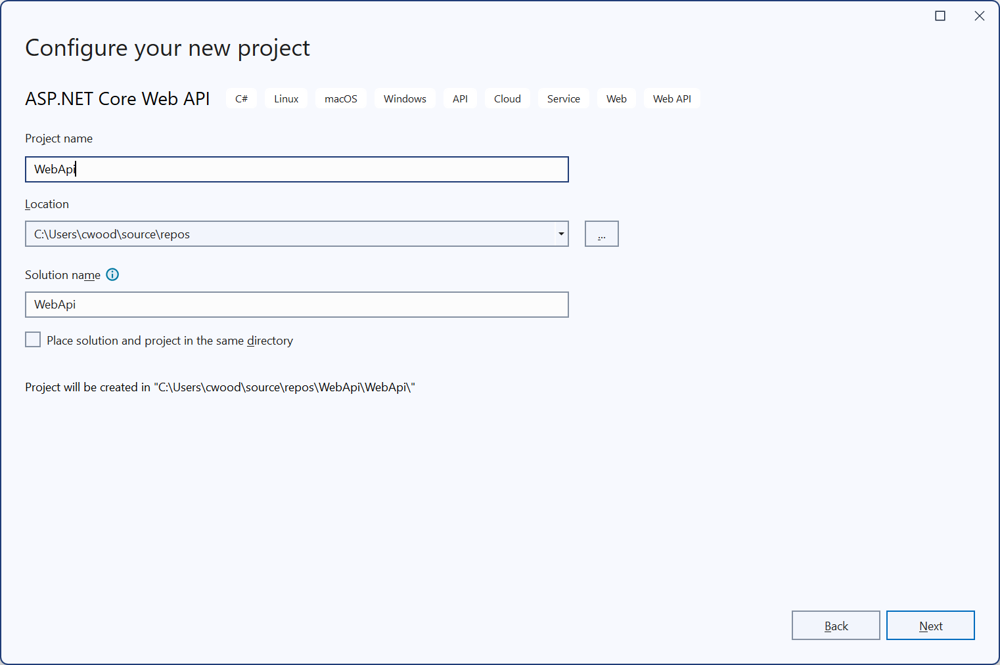
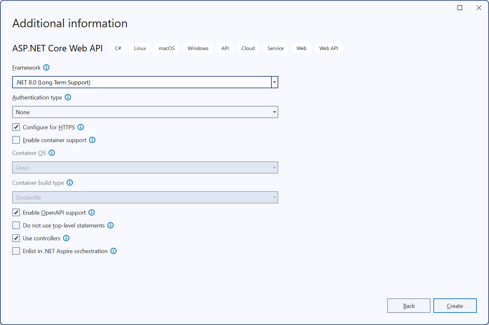
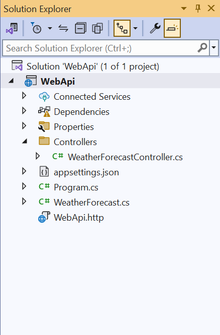
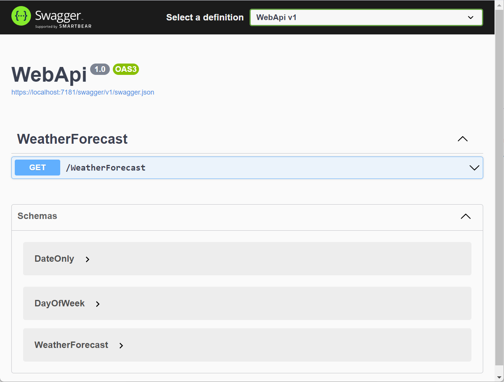

# 9

# Working with REST APIs

Working with REST APIs is not just a trend, but a fundamental aspect of modern network programming in .NET 8 and C# 12. It enables the development of scalable, maintainable, and interoperable web services. **REST**, or **Representational State Transfer**, is an architectural style that leverages the HTTP protocol to facilitate communication between client and server. RESTful APIs define a set of constraints that guide the design of web services, ensuring that they are stateless, cacheable, and capable of supporting a uniform interface. By adhering to these principles, RESTful APIs enable developers to create services that are both easy to consume and simple to extend, making them ideal for a wide range of applications, from web and mobile apps to microservices and distributed systems.

When it comes to RESTful API development in .NET and C#, ASP.NET Core is the star of the show. This powerful and flexible framework provides all the necessary tools to build robust web services. Its seamless integration with modern C# features, such as records, pattern matching, and minimal APIs, allows developers to write concise and readable code without compromising on performance and scalability. The framework's built-in support for HTTP methods, routing, and model binding simplifies the process of defining and exposing RESTful endpoints, freeing developers to focus on implementing business logic rather than dealing with low-level network details.

As .NET and C# continue to evolve, they bring about enhancements that further optimize the development of RESTful APIs. Features like HTTP/3 support, improved serialization options, and enhanced security mechanisms ensure that applications built on .NET 8 are not just fast and efficient, but also secure and future-proof. With REST maintaining its dominance in API design, mastering its implementation in .NET and C# is not just beneficial, but essential for developers aiming to build cutting-edge networked applications.

## Introduction to HTTP and REST

> Note: We have previously touched on HTTP in the first several chapters of this book, and you can read more details about the subject there.

Understanding the foundational elements of web communication is not just important, it's crucial for building modern networked applications. At the heart of this communication is the **Hypertext Transfer Protocol** (**HTTP**), a protocol that governs how data is exchanged across the web. HTTP's rules for structuring requests and responses between clients and servers are the backbone of the Internet, enabling the retrieval of resources and the interaction with services. Mastering the mechanics of HTTP is a pivotal step for any developer working with network programming, as it forms the basis for more complex interactions in web applications.

REST, building on the principles of HTTP, introduces an architectural style that not only harnesses the simplicity and ubiquity of HTTP but also ensures scalability and maintainability. This approach creates web services that can grow with your application, as RESTful services use HTTP methods in a standardized way to perform operations on resources identified by URIs (Uniform Resource Identifiers).

As we delve deeper into HTTP and REST, we must understand how these technologies work together to enable efficient communication between distributed systems. This section, through a combination of theoretical insights and practical examples, will equip you with the knowledge needed to design and implement RESTful APIs using the tools and frameworks provided by .NET and C#. These examples are not just theoretical exercises, but practical tools that will prepare you for real-world network programming challenges.

### Overview of the HTTP Protocol

The foundation of web communication relies on a protocol that dictates how information is transmitted across the Internet: HTTP or Hypertext Transfer Protocol. Since its inception, HTTP has become the backbone of the web, enabling clients and servers to exchange data seamlessly. Whether you're loading a webpage, submitting a form, or accessing an API, HTTP is the underlying mechanism that makes these interactions possible. Its simplicity and flexibility have allowed it to evolve alongside the web, adapting to new demands while maintaining its fundamental principles.

At its core, HTTP operates as a request-response protocol, where a client sends a request to a server, and the server responds with the requested resource or an appropriate status code. This straightforward model has been vital to HTTP's widespread adoption, allowing developers to build a wide array of applications that can communicate over the Internet. Understanding how these requests and responses are structured is crucial for anyone working in network programming, as it forms the basis for designing and interacting with web services.

Over the years, HTTP has undergone significant enhancements to improve performance, security, and scalability. From HTTP/1.1, which introduced persistent connections and chunked transfers, to the more recent HTTP/2 and HTTP/3, which brought features like multiplexing and improved header compression, each iteration of HTTP has addressed the growing needs of modern web applications. These advancements ensure that HTTP remains relevant in an era where fast, secure, and reliable communication is paramount.

As we explore the specifics of HTTP, we will examine the structure of HTTP messages, the roles of various HTTP methods, and the importance of headers and status codes. This exploration will provide the foundational knowledge needed to effectively work with HTTP in your applications, setting the stage for more advanced topics such as RESTful API development and secure communication in subsequent sections. Understanding HTTP is not just about learning how data moves across the web; it's about mastering the language that enables global connectivity in today's digital world.

### HTTP Verbs

Mastering HTTP methods, the actions that can be performed on resources in a web application, is a crucial step in building effective networked applications and RESTful APIs. These methods, also known as HTTP verbs, specify the intent of a request and guide how the server should handle it. While the most commonly used methods include GET, POST, PUT, and DELETE, additional methods such as HEAD, PATCH, and OPTIONS exist, each serving distinct purposes. This mastery empowers you to create applications that are efficient, scalable, and easy to maintain, giving you full control over your web development journey.

The GET method, the most widely used HTTP verb, is designed to retrieve data from the server without modifying it. When a client makes a GET request, the server responds with the requested resource, whether it's an HTML page, JSON data, or another format. GET requests are considered safe and idempotent, ensuring that your data retrieval processes are secure and reliable. This safety and idempotence make GET ideal for data retrieval scenarios, such as fetching records from a database or loading static resources, giving you confidence in your data retrieval processes.

POST, in contrast, is used to send data to the server, typically to create a new resource. This method is not idempotent; each request can result in different outcomes, such as creating multiple entries in a database. POST requests often include a message body that contains the data to be processed, such as form inputs or JSON objects. It is essential to use POST when performing operations that modify server state, such as submitting user data or making changes that will persist.

PUT and PATCH both serve to update existing resources, but they differ in their scope. PUT replaces an entire resource with new data, making it idempotent since repeated requests will produce the same result. Conversely, PATCH is used for partial updates, where only a subset of the resource is modified. PATCH is particularly useful when working with large datasets, as it allows updates without sending the entire resource back to the server.

DELETE is a straightforward method for removing resources from the server. Like PUT, DELETE is idempotent, meaning multiple requests will have the same effect as a single one—removing the resource in question. DELETE requests typically do not contain a message body. Still, the server will respond with a confirmation or appropriate status code and an empty response body indicating whether the operation was successful or the resource was already gone.

The HEAD method is similar to GET but with a key difference: it only retrieves the headers of a resource, not the body. This makes HEAD useful for checking metadata, such as a resource's size or last modification date, without downloading the entire content. It is often used for lightweight checks before making full GET requests, helping to optimize performance by reducing unnecessary data transfer.

Each of these methods plays a vital role in building web services that are efficient, scalable, and easy to maintain. When designing APIs, your choice of the appropriate HTTP method is crucial. It ensures clarity in communication between client and server, adheres to REST principles, and improves the overall structure and reliability of your application. This responsibility in choosing the right method gives you full control over your API design, ensuring that your application is efficient and reliable.


*HTTP Verbs*

### HTTP Headers

HTTP headers are critical components of communication between clients and servers. They provide metadata that helps manage the request and response process. Without headers, the communication process would be significantly limited, as they contain key-value pairs that convey additional information about the request or response, such as content type, encoding, authentication tokens, caching rules, etc. By including headers in HTTP messages, clients and servers can exchange important contextual data without modifying the core body of the message.

Request headers allow the client to specify preferences and send additional data to the server. For example, the `Accept` header indicates the type of content the client expects in the response, such as `application/json` or `text/html`. The `Authorization` header sends credentials, such as a bearer token for authentication, ensuring the request is handled securely. Another commonly used header is `User-Agent`, which identifies the client application or browser making the request. This allows the server to tailor its response based on the client’s capabilities, for instance, by serving a mobile-friendly version of a website to a mobile browser.

On the server side, response headers provide critical details about the returned content and how the client should handle it. The `Content-Type` header, for instance, indicates the MIME type of the returned content, such as `application/json` or `image/png`, allowing the client to interpret the response correctly. Additionally, headers like `Cache-Control` dictate how the client should cache the response, either encouraging the reuse of data to reduce load on the server or ensuring that the content is always fresh by setting expiration times.

Security-related headers are also essential in protecting the client and server during HTTP communication. The `Set-Cookie` header, for example, stores session information on the client, allowing the server to maintain user state across multiple requests. Headers such as `Strict-Transport-Security` enforce the use of HTTPS to ensure secure connections. At the same time, `Content-Security-Policy` helps prevent cross-site scripting (XSS) attacks by restricting the sources from which content can be loaded.

Effective use of HTTP headers is not just about technical implementation, it's about enhancing the robustness and security of web applications. Understanding how to configure and manage headers enables developers to build more efficient and secure systems, ensuring smooth communication between clients and servers. This reassures developers of the reliability of their systems. As we move deeper into RESTful API development, headers will play an increasingly important role in defining how data is transmitted and how APIs respond to client requests.

### HTTP Status Codes

Status codes are a crucial part of HTTP communication, providing feedback to the client about the result of a request. These numeric codes, grouped into five categories, indicate whether the request was successful, encountered errors, or requires additional action from the client. As a developer, your understanding and correct usage of these status codes are key. They ensure that web applications and APIs communicate effectively, providing meaningful responses to clients. Incorrect usage of these codes can lead to confusion and inefficiency in your web services. Being familiar with the common codes and their appropriate usage empowers you to maintain clarity and consistency in your web services.

The first category, 1xx status codes, represents informational responses. These codes, while rarely encountered directly by developers, play a role in HTTP/2 and HTTP/3 for cases where the server needs to inform the client that the request is being processed. A common example is `100 Continue`, which indicates that the initial part of a request has been received and that the client should continue sending the rest of the request body. Rest assured, while these codes are rarely used in most applications, understanding them can help with more advanced HTTP scenarios.

Successful responses fall under the 2xx category, with `200 OK` being the most commonly encountered status code. This code signifies that the request was successfully processed, and the server returned the requested resource. Other common codes in this category include `201 Create` is used when a new resource has been successfully created, often in response to a POST request. Additionally, `204 No Content` is used when the request is successful, but there is no content to return, often following an update or delete operation.

Redirection codes, represented by the 3xx range, instruct the client to perform further actions, usually to complete the request. The most common code here is `301 Moved` Permanently, which tells the client that the requested resource has been permanently relocated to a new URI. This is often used in URL restructuring or domain changes. Another important code is `302 Found`, indicating that the resource is temporarily available at a different URI. Understanding these codes is not just important, it's essential for maintaining URL consistency and redirecting traffic appropriately.

Client error responses are captured by 4xx status codes, which indicate that the request contains bad syntax or cannot be fulfilled. A common example is `400 Bad Request`, used when the server cannot understand the request due to invalid syntax. Another frequently seen code is `401 Unauthorized`, which informs the client that authentication is required. Similarly, `403 Forbidden` is returned when the server understands the request but refuses to authorize it. `404 Not Found` is one of the most well-known codes, indicating that the requested resource could not be found on the server. Using these codes appropriately helps clarify errors to the client and guides them toward correcting their request.

Finally, the 5xx series represents server-side errors, which occur when the server fails to fulfill an otherwise valid request. `500 Internal Server` error is the catch-all for unexpected conditions, often due to server misconfiguration or unhandled exceptions. Other relevant codes include `502 Bad Gateway`, indicating that the server, acting as a gateway or proxy, received an invalid response from the upstream server, and `503 Service Unavailable`, which is used when the server is temporarily unable to handle the request, often due to maintenance or overload.

Using the correct HTTP status codes is not just a best practice, it's a responsibility. It helps establish clear communication between clients and servers. Clients rely on these codes to interpret the result of their requests and take the necessary actions. As we delve deeper into RESTful API design, proper use of status codes will play a critical role in defining the behavior and reliability of the APIs we build. It ensures both developers and consumers of the API can interact with the system smoothly and effectively, reinforcing your commitment to your work.


*HTTP Status Codes*

### HTTP Messages and Data Exchange

In HTTP communication, messages are the foundation for exchanging data between clients and servers. Every HTTP interaction consists of a request sent by the client and a response returned by the server. These message types are structured in a specific way, consisting of a start line, headers, and a body. Understanding this structure and how data is exchanged between the two is not just critical, but it also empowers you as a developer, giving you the confidence and capability to build efficient networked applications and APIs.

An HTTP request message begins with a request line containing the HTTP method (such as GET or POST), the target URI, and the protocol version (e.g., HTTP/1.1). This line specifies the action that the client wishes to perform on the server, such as retrieving data or submitting a form. Following the request line are headers providing additional context about the request. These headers can specify the type of content the client expects, the format of the data being sent, and other metadata relevant to the request. The optional body of the request contains the actual data being transmitted, such as form fields or JSON payloads, particularly in methods like POST or PUT.

Similarly, an HTTP response message starts with a status line, which includes the protocol version, a status code, and a status message. The status code informs the client of the outcome of the request, such as `200 OK` for a successful request or `404 Not Found` if the requested resource cannot be located. Following the status line, response headers provide additional information about the response, including details like the content type, cache control settings, and the size of the data being returned. The response body contains the actual data, such as HTML, JSON, or image files, depending on the nature of the request.

Data exchange in HTTP is typically done through the message body, where the payload of the request or response is placed. HTTP's flexibility in supporting various data formats, such as web pages, images, or structured data like JSON, inspires creativity in building a wide range of applications. For example, when submitting data to an API using a POST request, the client sends a payload in the request body that the server processes and stores. Likewise, when the server responds to a client's request for data, the response body contains the resource in the appropriate format.

JSON (JavaScript Object Notation) is one of the most commonly used formats in modern web applications for structured data exchange. JSON is lightweight, easy to parse and widely supported across different programming languages, including C#. XML (eXtensible Markup Language) is another format, although less common in new APIs today. When working with HTTP in C#, JSON or XML data is handled simply through libraries like `System.Text.Json` or `Newtonsoft.Json` for serialization and deserialization. These libraries allow you to easily convert between C# objects and JSON, enabling smooth data exchange in APIs.

Headers play a significant role in data exchange by specifying how the data should be handled. They give you, as a developer, a sense of control and responsibility to ensure that the data is exchanged in a format that both sides can interpret correctly. For instance, the `Content-Type` header indicates the format of the data being transmitted, such as `application/json` or `text/html`. Meanwhile, the `Accept` header in a request specifies what formats the client can handle in the response.

Efficient data exchange in HTTP is about more than just sending and receiving messages. It also involves smartly using headers, understanding message structure, and choosing the appropriate data formats. As we explore more advanced topics in HTTP, a solid grasp of message construction and data exchange will allow developers to design better, more efficient networked applications and RESTful services in .NET and C#.

## Understanding REST: Principles and Concepts

REST is an architectural style designed for distributed systems, particularly web services. It defines a set of constraints and principles guiding how these systems should interact. REST leverages the foundational components of HTTP, such as methods, status codes, and headers, to facilitate communication between clients and servers in a stateless and scalable manner. By adhering to these constraints, RESTful systems enable efficient data exchange while remaining flexible, adaptable, and easy to integrate across various platforms and technologies. This adaptability ensures that RESTful systems can handle diverse requirements and evolve with changing needs, providing a sense of reassurance to developers and architects.

At the heart of REST is the resource concept, which represents any data or service accessible on a network. Resources can be anything from a user profile to a product catalog or even a blog post. Each resource is uniquely identified by a Uniform Resource Identifier (URI), which serves as its address on the web. For example, a resource representing a user might be accessible at `/api/users/{id}`, where `{id}` represents the user's unique identifier. This uniformity in addressing resources is one of the core strengths of REST, providing a consistent and predictable structure for accessing and manipulating data.

A key characteristic of RESTful systems is the stateless communication between clients and servers. Each HTTP request from a client to a server must contain all the necessary information for the server to process it. This means that the server does not retain any session-specific state between requests. While this may seem like a limitation, statelessness is a key feature that enhances scalability and reliability. It allows servers to handle each request independently, without the overhead of managing client-specific data between interactions. This also allows for greater flexibility in load balancing and distributing requests across multiple servers, ensuring that the system can handle high demand and changing conditions effectively.

Another fundamental principle of REST is the separation of concerns between the client and server. In a RESTful architecture, the client manages the user interface and user experience, while the server manages the resources and data. This clear division allows clients and servers to evolve independently as long as they continue communicating through the standardized HTTP interface. For example, a mobile app and a web application can interact with the same RESTful API, even if their user interfaces differ vastly.

RESTful APIs extensively use HTTP methods to perform operations on resources. The four primary methods—GET, POST, PUT, and DELETE—are mapped to the standard CRUD (Create, Read, Update, Delete) operations. For instance, a GET request retrieves data from the server without modifying it, while a POST request creates a new resource. This alignment with HTTP methods ensures that RESTful APIs are simple to understand and use, leveraging the existing capabilities of the web to perform actions on resources.

Another important aspect of REST is its emphasis on a uniform interface. This uniformity simplifies the design of the API by providing consistent patterns for interacting with resources. The use of standard methods, well-defined URIs, and predictable behavior allows clients to interact with the API without needing detailed knowledge of its inner workings. This simplicity and predictability ensure that developers can confidently understand and use RESTful APIs, creating systems that are easier to maintain and extend over time, instilling a sense of confidence in their abilities.

One optional but valuable constraint in RESTful design is using hypermedia as the engine of application state, often abbreviated as HATEOAS. In this model, responses from the server not only contain the requested data but also links to other related resources or actions. These links guide the client in how to proceed, effectively serving as a 'hypermedia control' that drives the application's state transitions. For example, a response to a request for a user's profile might include links to update the profile, view the user's posts, or navigate to other relevant resources. This approach simplifies client logic and decouples the client from hard-coded knowledge of the API's structure, making it easier to evolve the system without breaking existing clients.

Caching is another principle that REST leverages to improve performance and scalability. By indicating whether a response is cacheable, servers can reduce the need for repeated requests for the same resource. HTTP headers like `Cache-Control` and `ETag` control caching behavior, allowing clients to store and reuse responses until they expire or are invalidated. Proper use of caching can significantly reduce the load on servers and improve the responsiveness of applications, especially when dealing with frequently accessed data.

Security is a critical consideration in any RESTful API design. While REST does not mandate specific security practices, it works seamlessly with established HTTP security mechanisms. Transport Layer Security (TLS) ensures that communications between clients and servers are encrypted, preventing eavesdropping or tampering. Additionally, RESTful APIs typically use token-based authentication mechanisms such as OAuth2 or JSON Web Tokens (JWT) to authenticate and authorize clients, ensuring that only authorized users can access specific resources.

By adhering to these principles and constraints, REST enables the development of scalable, reliable, and flexible systems. Its emphasis on statelessness, resource-based design, and uniform interfaces ensures that RESTful services can grow and adapt to changing requirements without becoming overly complex. This scalability and reliability provide a secure foundation for RESTful systems to perform under high demand and changing conditions, instilling a sense of security in the audience.

### RESTful Resources and URIs

In RESTful systems, the concept of resources is central to how clients and servers interact. A resource represents any entity or data that can be accessed and manipulated via the web. This could range from a single user or a collection of products to an individual document or even a server-side process. In REST, resources are not tied to a specific file or database record but are rather abstract representations that the client interacts with through standard HTTP methods. By organizing data into distinct resources, RESTful APIs create a clear and predictable structure for external systems to navigate.

A Uniform Resource Identifier (URI) uniquely identifies each resource in a RESTful system. URIs provide a standard, human-readable way to address resources, making it straightforward for clients to interact with the API. A well-designed URI follows predictable patterns, offering clear insight into the structure and hierarchy of the API. For example, the URI `/api/products` might refer to the collection of all products, while `/api/products/123` would point to a specific product with the ID 123. This uniformity is essential for designing scalable and maintainable APIs.

The structure of URIs should be designed with clarity and simplicity in mind, avoiding unnecessary complexity. RESTful URIs are often hierarchical, reflecting the relationship between resources. For example, a user’s collection of orders might be represented as `/api/users/1/orders`, where `1` is the user ID, and `orders` are the collection of that user’s orders. This structure mirrors the logical relationship between the resources, allowing clients to understand the context and navigate between related resources easily.

While designing URIs, it is important to follow best practices that improve both usability and consistency. Using nouns rather than verbs in URIs is a fundamental practice in RESTful design. The HTTP methods (GET, POST, PUT, DELETE) should indicate the action performed, while the URI should represent the resource. For instance, instead of `/api/getProduct` or `/api/createProduct`, use `/api/products`, with the HTTP method determining whether the request is retrieving or creating a product. This approach aligns with the REST principle of a uniform interface.

Another important consideration when designing URIs is maintaining consistency across the entire API. Resources that follow a consistent structure and naming convention are easier to understand and navigate. Using plural nouns, such as `/api/products` for collections and `/api/products/{id}` for individual resources, helps maintain uniformity. Additionally, versioning the API within the URI (e.g., `/api/v1/products`) can help manage changes to the API over time without breaking existing clients that rely on older versions.

Query parameters can also be used to refine how a client interacts with a resource without altering the fundamental structure of the URI. For example, `/api/products?category=electronics&sort=price` retrieves a subset of products filtered by category and sorted by price. Query parameters should be used for optional criteria such as filtering, searching, or pagination, while the central resource should always be represented in the URI path itself. This keeps the URI clean and focused on identifying the resource.

Although URIs should be easy for clients to interpret, they are not meant to expose the internal structure or workings of the server. URIs should represent logical resources rather than database tables or file paths. By abstracting the resource representation, the API becomes more flexible and capable of evolving without breaking clients. For instance, the API might store products in a relational database today and switch to a NoSQL database tomorrow without changing the `/api/products` URI. Decoupling resource representation from the underlying implementation is vital to building resilient APIs.

Effective URI design forms the backbone of any RESTful API, enabling clients to locate and interact with resources in a predictable, standardized way. As we continue to explore how to build RESTful systems, understanding the role of URIs will help ensure that your APIs are intuitive, scalable, and adaptable, providing a strong foundation for the applications that rely on them.

### REST and HTTP Methods

In RESTful APIs, the interaction between clients and servers is primarily facilitated through standard HTTP methods. Each method is designed to perform specific actions on resources, following the CRUD (Create, Read, Update, Delete) operations. By mapping HTTP methods to these actions, RESTful systems offer a simple and consistent way to interact with resources. Understanding the role of each method and how it is used within the context of REST is essential for designing intuitive and efficient APIs.

The GET method retrieves information from the server. It is considered a "safe" method because it does not modify the resource and is idempotent, meaning multiple identical requests will return the same result without side effects. GET requests are commonly used to fetch data, such as a list of products or a specific user profile. Using GET to access resources in a RESTful API ensures clarity and consistency, allowing clients to understand that they are simply retrieving data, not altering it.

POST, in contrast, is used to create a new resource on the server. When a client sends a POST request, it typically includes data in the request's body, which the server processes to create the new resource. POST is not idempotent, as repeated requests can result in multiple resource creations. For example, posting to ```/api/orders``` might create a new order in the system, with each subsequent POST resulting in a new, unique order being added to the database. POST is crucial when data is being introduced to the system, and each submission represents a distinct transaction.

PUT and PATCH are used to update existing resources but differ in scope. PUT is generally used to completely replace a resource with a new one, making it idempotent—submitting the same PUT request multiple times will produce the same result. On the other hand, PATCH is designed for partial updates, where only certain fields of the resource are modified. For instance, a PUT request to ```/api/products/123``` might replace the entire product with new details, while a PATCH request could update only the product's price. Choosing between PUT and PATCH depends on whether a complete replacement or a targeted update is needed.

DELETE is used to remove resources from the server. Like PUT, DELETE is idempotent, meaning multiple DELETE requests for the same resource will have the same effect: removing the resource. For example, deleting a user with the URI ```/api/users/123``` will remove that specific user from the system. If the resource has already been deleted, subsequent DELETE requests will have no further impact. DELETE is essential for maintaining resource lifecycle management in a RESTful API, allowing clients to remove resources when they are no longer needed.

Using these HTTP methods appropriately ensures that a RESTful API remains predictable and easy to use, instilling confidence in the development process. Each method has a well-defined role, and by adhering to these roles, developers can create intuitive APIs for clients to interact with and efficiently process data. As we explore more advanced topics in RESTful API design, the correct use of HTTP methods will continue to serve as a foundation for building robust, scalable systems.

### RESTful API Design Best Practices

Adhering to best practices when designing RESTful APIs ensures that they are intuitive, scalable, and maintainable. A well-designed API enhances the developer experience and ensures that the system can evolve over time without breaking existing integrations. Following these principles helps create APIs that are predictable, consistent, and easy to use, all while leveraging HTTP's full capabilities.

One of the most essential principles in designing a RESTful API is keeping it **resource-oriented**. Resources, such as users, products, or orders, should be the focal point of the API, each identified by a unique Uniform Resource Identifier (URI). For instance, an endpoint like ```/api/products/123``` represents a product with the ID ```123```. The API's actions on this resource—whether retrieving, updating, or deleting—should be driven by the HTTP methods, rather than embedding actions directly in the URI (e.g., avoiding /api/products/delete/123).

**Consistency in naming** conventions is equally critical. Using plural nouns for collections, such as ```/api/users```, and singular nouns when referring to individual resources, such as ```/api/users/123```, enhances the clarity of the API. Similarly, avoiding verbs in URIs helps keep the focus on resources, as HTTP methods like GET, POST, PUT, and DELETE already indicate the action being performed. This approach creates a more intuitive API, reducing the learning curve for developers using the service.

**Versioning** is another best practice to ensure the API remains flexible over time. Changes to an API are inevitable as business needs evolve, but these changes should maintain clients' reliance on previous versions. By including the API version in the URI (e.g., ```/api/v1/products```), clients can continue interacting with the current version, even as new features or breaking changes are introduced in future versions. This approach enables smoother transitions and prevents breaking changes from affecting existing clients.

**Error handling** is a crucial aspect of RESTful API design. When something goes wrong, the API should provide clear, informative error messages that help clients understand what happened and how to fix it. Utilizing standard HTTP status codes, such as ```400 Bad Request``` for malformed requests or ```404 Not Found``` when a resource cannot be located, ensures that clients can easily interpret the API's response. In addition to status codes, including a descriptive message in the response body, such as an explanation of the error or validation details, enhances the API's usability.

**Pagination and filtering** are essential when dealing with large collections of resources. To improve performance and prevent clients from being overwhelmed with data, APIs should implement pagination for endpoints that return lists of resources. For example, a response to ```/api/products?page=2&size=10``` might return the second page of products, with 10 items per page. Additionally, providing filtering options via query parameters allows clients to request specific subsets of data, such as ```/api/products?category=electronics&sort=price```. This keeps the API flexible and responsive, allowing clients to retrieve the needed data.

**Caching** is another technique that significantly improves API performance. By enabling HTTP caching mechanisms, such as setting appropriate ```Cache-Control``` headers, the API can reduce the need for repeated requests, especially for static or rarely changing resources. Caching can also reduce server load, improve response times, and provide a better overall experience for clients. Using techniques like ETags and ```Last-Modified``` headers allows clients to cache resources while ensuring they receive updates when the data changes.

**Security** is a non-negotiable aspect of API design. APIs should always be served over HTTPS to ensure data encryption during transmission, protecting sensitive information from being intercepted. Additionally, authentication and authorization mechanisms, such as OAuth2 or JSON Web Tokens (JWT), should be implemented to restrict access to sensitive resources. Proper use of security headers, including ```Content-Security-Policy``` and ```Strict-Transport-Security```, can further enhance the security posture of the API. We will look at this subject later in this chapter.

**Documentation** is pivotal in making an API easy to use and integrate with. Providing comprehensive, up-to-date documentation, ideally through tools like Swagger or OpenAPI, helps developers understand the API's capabilities, endpoints, request formats, and responses. Including examples of typical requests and responses further aids developers in quickly getting started. A well-documented API reduces friction for users and increases its adoption.

**Rate limiting** is another essential consideration, especially for public-facing APIs. Implementing rate limits helps protect the server from being overwhelmed by too many requests in a short period, ensuring the system remains responsive for all users. For instance, an API might allow up to 100 requests per minute per user, after which it returns a ```429 Too Many Requests``` status code. Including rate limit information in the response headers allows clients to adjust their behavior accordingly.

A RESTful API should also be designed with **scalability** in mind. As the user base grows, the API must be able to handle increased traffic and data loads without degrading performance. Techniques like horizontal scaling, where additional servers are added to distribute the load, and implementing microservices to separate different parts of the system are common strategies for achieving scalability. Additionally, using cloud services, such as load balancers, auto-scaling and **content delivery networks** (**CDNs**), can help optimize performance and availability.

The principle of **HATEOAS** (**Hypermedia as the Engine of Application State**) is another valuable best practice. With HATEOAS, each API response includes links to related resources or possible actions the client can take next. For example, when retrieving a user's profile, the response might include links to view the user's orders or update their details. This approach simplifies client logic and makes the API more discoverable, allowing clients to navigate through the available actions without needing hard-code knowledge of the API's structure.

Adhering to these best practices allows RESTful APIs to be designed to provide a clear, consistent, and secure interface for clients. These principles help ensure that the API is flexible, easy to maintain, and capable of evolving with the system's needs over time. As we continue to build RESTful APIs using .NET and C#, these guidelines will be essential for creating robust, scalable, and user-friendly systems.

## Setting Up ASP.NET Core 8 Web API

To begin building a RESTful API with ASP.NET Core 8, the first step is setting up a new Web API project using **Visual Studio 2022 Community edition**. ASP.NET Core provides a powerful framework for creating modern, scalable web APIs that leverage the latest .NET features, including minimal APIs and improved dependency injection. This section will walk through creating a new project, setting up the basic API structure, and preparing it for further development.

Open Visual Studio 2022 and create a new project by selecting **Create a new project** from the start window. From the project template list, choose **ASP.NET Core Web API** and click **Next**. Provide a name for your project, choose a location to save it, and click **Create**. In the following dialog, ensure that **.NET 8** is selected as the target framework, and check the option to enable **OpenAPI support** for automatic API documentation generation. Click **Create** to initialize the project. 


*Visual Studio 2022 Project Creation*


*Visual Studio 2022 Web API Project Additional*

Once the project is generated, Visual Studio creates a default folder structure that includes several key components. The **Controllers** folder contains the default WeatherForecastController file, demonstrating how a basic API controller works. In a RESTful API, controllers handle incoming requests and map them to appropriate actions, such as retrieving, creating, or updating resources. You can expand this folder as needed to include additional controllers for various resources in your API.


*Visual Studio 2022 Web API Project Structure*

ASP.NET Core uses dependency injection by default, and services are registered in the **Program.cs** file. This file is crucial in configuring middleware, routing, and services like database connections or authentication. By default, the Program.cs file already contains the basic configuration for handling API requests and serving JSON responses. To add more functionality, you will modify this file to include additional services, such as support for Entity Framework Core or third-party libraries for logging or security.

At this point, your API project is ready to run. Press **F5** or click **Start** to launch the API in the browser. Visual Studio will open the Swagger UI by default, allowing you to interact with the available API endpoints. The Swagger UI is a convenient way to explore and test your API without needing a separate tool like Postman. It automatically generates API documentation based on the OpenAPI specification and allows you to test requests against the available endpoints.


*Web API Project Swagger*

To add your first custom API controller:
1. Right-click on the **Controllers** folder and select **Add > Controller**.
2. Choose **API Controller - Empty** and name the new controller ProductController.
3. Inside the ProductController, create basic endpoints for retrieving and managing product data, such as a GET method to fetch a list of products and a POST method to add a new product.
For now, you can return mock data or simple status codes as placeholders for actual database logic, which we will cover later in this chapter.

With the basic API structure in place, you can now add features to make it more functional and robust. ASP.NET Core 8 allows you to easily integrate middleware for logging, security, and error handling, which can be configured in the Program.cs file. Additionally, routing can be customized to ensure clean and intuitive URIs for your resources, critical for maintaining a RESTful design. We will explore these topics in greater depth as we expand the API’s capabilities throughout this chapter.

By setting up the initial project structure and familiarizing yourself with the controller-based architecture, you have created a scalable and maintainable web API with ASP.NET Core 8. As we move forward, you will learn how to integrate databases, add security layers, and fine-tune your API to meet the demands of modern web applications. The combination of ASP.NET Core 8 and Visual Studio 2022 provides a powerful environment for building high-performance APIs that can scale with your application needs.

## Designing RESTful Resources

Determining resources is a critical step when designing RESTful APIs. Resources represent the key entities the API exposes and operates on, such as users, products, or orders. In a well-structured API, each resource is modeled with clarity and consistency, ensuring developers and clients can easily interact. To begin designing resources, we create corresponding C# classes to represent the underlying data structure, ensuring that these classes align with the API's needs while following best practices for RESTful design.

In ASP.NET Core 8, a resource is typically represented by a model class. For example, consider a simple Product class, which represents a product in an e-commerce system. The class might contain ```Id```, ```Name```, ```Description```, and ```Price``` properties. These properties map directly to the data fields that the client interacts with. Creating such model classes allows the API to serve, manipulate, and return structured data in response to client requests. Below is an example of a Product class in C#.

```C#
public class Product
{
    public int Id { get; set; }
    public string Name { get; set; }
    public string Description { get; set; }
    public decimal Price { get; set; }
}
```

This simple class, designed with the purpose of defining the structure of the Product resource, is straightforward and comfortable to work with. Each property corresponds to a piece of data that the client will expect to retrieve or update. In a RESTful API, resources should be treated as nouns, with the HTTP methods (GET, POST, PUT, DELETE) performing actions on these resources. The URI for interacting with a collection of products might be ```/api/products```, while an individual product would be accessible via ```/api/products/{id}```.

Once the resource class is defined, the next step is to create a controller to empower you in handling the API endpoints for managing this resource. For example, a ```ProductController``` will provide endpoints to retrieve a list of products, fetch a single product by ID, create new products, and update or delete existing ones. Each action corresponds to an HTTP method that interacts with the resource. Below is a sample of the ```ProductController``` class that defines these actions.

```C#
[ApiController]
[Route("api/[controller]")]
public class ProductController : ControllerBase
{
    [HttpGet]
    public IEnumerable<Product> GetAllProducts()
    {
        // Returns a list of mock products
        return new List<Product>
        {
            new Product { Id = 1, Name = "Laptop", Description = "A high-performance laptop", Price = 999.99m },
            new Product { Id = 2, Name = "Headphones", Description = "Noise-cancelling headphones", Price = 199.99m }
        };
    }

    [HttpGet("{id}")]
    public ActionResult<Product> GetProductById(int id)
    {
        var product = new Product { Id = id, Name = "Sample Product", Description = "Sample Description", Price = 9.99m };
        return Ok(product);
    }
}
```

In this controller, we define two endpoints: one for retrieving all products (```GET /api/products```) and one for fetching a specific product by its ID (```GET /api/products/{id}```). The methods are mapped to these URIs using the ```HttpGet``` attributes, making the interaction between the client and the API precise and predictable. As we build out the API further, we will add POST, PUT, and DELETE methods for managing the lifecycle of these resources.

Designing resources also involves defining relationships between them. For instance, if products belong to categories, you might have a ```Category``` resource related to the ```Product``` resource. In this case, a product might include a reference to its category, as shown below.

```C#
public class Product
{
    public int Id { get; set; }
    public string Name { get; set; }
    public string Description { get; set; }
    public decimal Price { get; set; }
    public Category Category { get; set; }
}

public class Category
{
    public int Id { get; set; }
    public string Name { get; set; }
}
```

With these relationships defined in the model, the API can expose endpoints that allow clients to filter products by category or retrieve categories along with their associated products. For example, you could implement an endpoint such as ```/api/products?categoryId=3``` to fetch all products in a particular category.

By designing resources with clear structure and relationships, we ensure that the API is both logical and scalable. This structured approach to resource modeling simplifies client interaction and supports the creation of clean, maintainable code as the API grows in complexity. As we build out the API, maintaining this resource-driven approach will ensure we adhere to RESTful principles, delivering a reliable and predictably consistent service to clients.

## Implementing CRUD Operations

Creating a robust API involves implementing the full range of CRUD (Create, Read, Update, Delete) operations to allow clients to manage resources effectively. These operations correspond to HTTP methods: POST for creating new resources, GET for reading existing ones, PUT or PATCH for updating them, and DELETE for removal. ASP.NET Core 8, with its efficient tools, simplifies this process by providing the means to easily map these operations to API endpoints with the help of controllers and routing, empowering developers and boosting their confidence in the development process.

Let’s start by implementing the POST operation, a method of utmost importance as it creates a new resource in our API. This will allow clients to add new products, making the POST method a significant part of our API. The POST method is typically mapped to the `/api/products` endpoint and expects a product object in the request body. In the controller, the method receives the product data, processes it, and returns a success status with details about the newly created resource. Below is the POST implementation in the ```ProductController```.

```C#
[HttpPost]
public ActionResult<Product> CreateProduct(Product newProduct)
{
    // Add logic to save the product (e.g., database call)
    newProduct.Id = new Random().Next(1, 1000); // Simulating ID assignment for the new product
    return CreatedAtAction(nameof(GetProductById), new { id = newProduct.Id }, newProduct);
}
```

In this example, the `CreateProduct` method accepts a `Product` object from the request body and assigns it an ID, simulating a database insert. The `CreatedAtAction` method returns an HTTP 201 response along with the URI of the newly created resource, providing a link to the `GetProductById` method that retrieves the specific product.

Next, we implement the GET operation, which allows clients to retrieve both individual resources and collections of resources. For retrieving all products, we map the GET method to `/api/products`, while for retrieving a specific product by ID, we use `/api/products/{id}`. This operation is idempotent, meaning it can be called repeatedly without altering the resource's state. Below are the GET methods for retrieving both all products and a specific product.

```C#
[HttpGet]
public IEnumerable<Product> GetAllProducts()
{
    // Logic to retrieve all products (e.g., from a database)
    return new List<Product>
    {
        new Product { Id = 1, Name = "Laptop", Description = "A high-performance laptop", Price = 999.99m },
        new Product { Id = 2, Name = "Headphones", Description = "Noise-cancelling headphones", Price = 199.99m }
    };
}

[HttpGet("{id}")]
public ActionResult<Product> GetProductById(int id)
{
    var product = new Product { Id = id, Name = "Sample Product", Description = "Sample Description", Price = 9.99m };
    if (product == null)
    {
        return NotFound();
    }
    return Ok(product);
}
```

The first method, `GetAllProducts`, returns a list of products, while `GetProductById` retrieves a single product based on its ID. If the requested product cannot be found, the method ensures proper error handling by returning an HTTP 404 status code using the `NotFound` method. This process is designed to keep you secure and confident in your work.

Feel at ease with the PUT and PATCH methods for updating existing resources. The PUT method is straightforward for full updates, while the PATCH method is simple for partial updates. When the client sends the complete updated resource, PUT is the way to go. If you're only modifying specific fields, PATCH is your friend. Here's how to update a product using the PUT method, which maps to `/api/products/{id}`.

```C#
[HttpPut("{id}")]
public IActionResult UpdateProduct(int id, Product updatedProduct)
{
    if (id != updatedProduct.Id)
    {
        return BadRequest("Product ID mismatch.");
    }

    // Logic to update the product (e.g., database call)
    return NoContent(); // Indicates the update was successful but no content is returned
}
```

In this method, we check if the product ID in the URL matches the ID in the product data. If not, a `BadRequest` response is returned. Upon a successful update, the method returns HTTP 204 (`No Content`), indicating the operation succeeded without returning any resource data. This reassures the user of a successful operation, a common pattern in RESTful APIs for successful updates.

Finally, the DELETE operation is implemented to allow clients to remove resources. This is mapped to `/api/products/{id}` and ensures that once a product is deleted, it cannot be retrieved again, emphasizing the finality of this action. Below is the DELETE method in the `ProductController`.

```C#
[HttpDelete("{id}")]
public IActionResult DeleteProduct(int id)
{
    // Logic to delete the product (e.g., database call)
    return NoContent(); // Indicates the resource was successfully deleted
}
```

The `DeleteProduct` method accepts the product ID as a parameter, performs the deletion (in this case, simulated), and returns an HTTP 204 response, indicating that the resource has been successfully removed. If the product was not found or couldn’t be deleted, appropriate error handling would return an HTTP 404 or another relevant status code.

Implementing these CRUD operations enables full lifecycle management for resources in our API. This ensures clients can create, read, update, and delete products as needed, using standard HTTP methods that align with REST principles. Moving forward, we will focus on integrating more advanced features such as authentication, validation, and database persistence to build a robust and secure API.

## Working with Data and Entity Framework Core

Integrating a database is critical to building RESTful APIs, and **Entity Framework Core** (**EF Core**) is the leading data access technology in .NET. It offers an object-relational mapper (**ORM**) that allows developers to interact with databases using C# objects, eliminating the need for raw SQL queries. One of EF Core's key strengths is its support for multiple database systems, including SQL Server, SQLite, PostgreSQL, and others, making it a flexible choice for various application needs.

The first step to working with data in an ASP.NET Core 8 Web API is to set up EF Core in the project. This involves installing the necessary NuGet packages and configuring the database connection. In Visual Studio 2022, right-click on the project and select **Manage NuGet Packages**. Search for and install `Microsoft.EntityFrameworkCore` and `Microsoft.EntityFrameworkCore.SqlServer`. Once installed, these packages provide the tools to interact with an SQL Server database through EF Core.

Next, configure the database connection in the `Program.cs` file. EF Core uses the `DbContext` class to represent a session with the database, and the connection string must be specified to connect to the actual database server. Below is the configuration in the `Program.cs` file.

```C#
var builder = WebApplication.CreateBuilder(args);

// Add services to the container.
builder.Services.AddControllers();
builder.Services.AddDbContext<AppDbContext>(options =>
    options.UseSqlServer(builder.Configuration.GetConnectionString("DefaultConnection")));

var app = builder.Build();
```

In this example, AddDbContext registers the database context (AppDbContext) with the dependency injection container, enabling EF Core to work throughout the application. The connection string is stored in the appsettings.json file, which points to the SQL Server instance. Below is an example connection string in appsettings.json.

```C#
{
  "ConnectionStrings": {
    "DefaultConnection": "Server=localhost;Database=ProductDB;Trusted_Connection=True;"
  }
}
```

Once the database connection is set up, the next step is to define the `DbContext` class. This class manages the entity objects during runtime, which involves tracking changes, maintaining relationships, and performing database operations. The `DbContext` class is responsible for querying and saving data to the database. The `DbContext` class contains DbSet properties for each resource (table) in the database. Below is an example of the `AppDbContext` class for managing products.

```C#
public class AppDbContext : DbContext
{
    public AppDbContext(DbContextOptions<AppDbContext> options) : base(options)
    {
    }

    public DbSet<Product> Products { get; set; }
}
```

In this example, the `Products` property represents a table in the database, where each `Product` object corresponds to a row. EF Core will automatically map the `Product` class to the database schema, creating tables and columns that match the class properties.

EF Core uses migrations to apply changes to the database, such as creating tables or altering columns. Migrations allow the schema to evolve without manually writing SQL. To add an initial migration, open the **Package Manager Console** in Visual Studio and run the following commands:

```Bash
Add-Migration InitialCreate
Update-Database
```

The `Add-Migration` command plays a crucial role in the database setup process, as it generates a migration file containing schema changes (e.g., creating the `Products` table). Similarly, the `Update-Database` command is equally important, as it applies the migration to the database.

Once the database is set up and the migrations are applied, the next step is implementing data operations in the API controller using EF Core. Instead of working with in-memory data, as shown earlier, we will now perform actual CRUD operations on the database. To illustrate this, below is a practical example of implementing the GET method using EF Core to retrieve products from the database.

```C#
[HttpGet]
public async Task<IEnumerable<Product>> GetAllProducts()
{
    return await _context.Products.ToListAsync();
}
```

This method uses the EF Core DbSet to query the Products table and retrieve all product records. The ToListAsync method asynchronously retrieves the data, making the API more efficient by preventing blocking operations. Equally important, the POST method for creating a new product plays a key role in saving the data to the database, as shown below.

```C#
[HttpPost]
public async Task<ActionResult<Product>> CreateProduct(Product newProduct)
{
    _context.Products.Add(newProduct);
    await _context.SaveChangesAsync();

    return CreatedAtAction(nameof(GetProductById), new { id = newProduct.Id }, newProduct);
}
```

In this example, the `CreateProduct` method adds the new product to the `Products` table and then saves the changes using `SaveChangesAsync`. Once the product is saved, it returns its details along with its location in the API.

To update an existing product, we use the PUT method, as demonstrated below. This method updates the product record in the database and ensures that changes are saved.

```C#
[HttpPut("{id}")]
public async Task<IActionResult> UpdateProduct(int id, Product updatedProduct)
{
    if (id != updatedProduct.Id)
    {
        return BadRequest("Product ID mismatch.");
    }

    _context.Entry(updatedProduct).State = EntityState.Modified;
    await _context.SaveChangesAsync();

    return NoContent();
}
```

The `UpdateProduct` method uses EF Core's Entry method to mark the product as modified and saves the changes to the database.

Finally, the DELETE method removes a product from the database using the product ID, as shown below.

```C#
[HttpDelete("{id}")]
public async Task<IActionResult> DeleteProduct(int id)
{
    var product = await _context.Products.FindAsync(id);
    if (product == null)
    {
        return NotFound();
    }

    _context.Products.Remove(product);
    await _context.SaveChangesAsync();

    return NoContent();
}
```

Utilizing EF Core, this method efficiently retrieves the product by its ID using FindAsync and promptly removes it from the database. Following the deletion, the changes are swiftly saved with SaveChangesAsync, and the method promptly returns a NoContent response, showcasing the efficiency of EF Core.

By integrating EF Core into the API, we have enabled persistent storage for products, allowing the API to handle real-world data scenarios. This approach not only simplifies data management, making it a breeze, but also leverages the power of EF Core’s ORM to abstract the complexities of database access. As we move forward, the potential for enhancing this foundation with additional features like relationships, validation, and security is vast, promising to further enrich the API’s functionality and open up exciting new possibilities.

## Testing and Debugging REST APIs

Testing and debugging are not just steps, but a responsibility in building a reliable REST API. They ensure that your endpoints work as expected, handle edge cases gracefully, and perform efficiently. In ASP.NET Core 8, you can use various tools to test and debug your API. This section will focus on automated testing using xUnit and debugging techniques to help identify and resolve issues quickly during development, showing your commitment to delivering a robust API.

xUnit is a popular testing framework in .NET that offers a simple and flexible way to write unit and integration tests for your API. Unit tests verify the functionality of individual components, while integration tests, with xUnit's robust capabilities, thoroughly test the API's interaction with external systems like databases. To begin, install the `xUnit` and `Microsoft.AspNetCore.Mvc.Testing` NuGet packages in your test project. These packages provide the tools to test your API and simulate HTTP requests, giving you the confidence that your API is secure and reliable.

Once the testing environment is set up, we can write unit tests for the API's controllers. For example, testing the `ProductController`'s GET method ensures that it returns the expected list of products. Below is a simple unit test using xUnit that mocks the necessary dependencies and tests the `GetAllProducts` method.

```C#
public class ProductControllerTests
{
    private readonly ProductController _controller;
    private readonly Mock<AppDbContext> _contextMock;

    public ProductControllerTests()
    {
        _contextMock = new Mock<AppDbContext>();
        _controller = new ProductController(_contextMock.Object);
    }

    [Fact]
    public void GetAllProducts_ReturnsProducts()
    {
        // Arrange
        var products = new List<Product>
        {
            new Product { Id = 1, Name = "Laptop", Description = "A laptop", Price = 1000m },
            new Product { Id = 2, Name = "Phone", Description = "A smartphone", Price = 500m }
        };
        _contextMock.Setup(c => c.Products.ToList()).Returns(products);

        // Act
        var result = _controller.GetAllProducts();

        // Assert
        Assert.Equal(2, result.Count());
        Assert.Equal("Laptop", result.First().Name);
    }
}
```

In this test, we use the `Mock` class from `Moq` to simulate the behavior of the `AppDbContext`. The test verifies that the `GetAllProducts` method returns a list of products and checks that the data matches what is expected. Unit tests like this help ensure that the logic inside the controller works correctly under various conditions.

Integration tests are often more appropriate for more complex scenarios, such as testing the creation of products (POST). Integration tests allow you to test how the API interacts with external systems, like databases, in a real-world scenario. Below is an example of an integration test using the WebApplicationFactory class to simulate an HTTP request and ensure a product is created successfully.

```C#
public class ProductApiIntegrationTests : IClassFixture<WebApplicationFactory<Program>>
{
    private readonly HttpClient _client;

    public ProductApiIntegrationTests(WebApplicationFactory<Program> factory)
    {
        _client = factory.CreateClient();
    }

    [Fact]
    public async Task CreateProduct_ReturnsCreatedProduct()
    {
        // Arrange
        var newProduct = new Product { Name = "Tablet", Description = "A tablet device", Price = 300m };
        var content = new StringContent(JsonConvert.SerializeObject(newProduct), Encoding.UTF8, "application/json");

        // Act
        var response = await _client.PostAsync("/api/products", content);

        // Assert
        response.EnsureSuccessStatusCode();
        var responseBody = await response.Content.ReadAsStringAsync();
        var createdProduct = JsonConvert.DeserializeObject<Product>(responseBody);
        Assert.Equal("Tablet", createdProduct.Name);
    }
}
```

Integration tests, such as this one that simulates a complete HTTP POST request to the `/api/products` endpoint and verifies the successful creation of a product, are not just a part of the process-they are essential. They validate that the API behaves correctly when interacting with external systems, such as the database, under real-world conditions, underscoring the importance of your work.

In addition to writing tests, debugging your API is another critical part of ensuring its reliability. Visual Studio 2022 provides powerful debugging tools that allow you to set breakpoints, inspect variables, and step through code execution line by line. During development, it's helpful to run the API locally and use breakpoints to examine the behavior of specific endpoints. For example, you can set breakpoints in the `CreateProduct` method to inspect the incoming request, view the state of the product being created, and verify the database interaction.

This chapter explored the fundamental aspects of building and managing a REST API using ASP.NET Core 8. From understanding the HTTP protocol to designing RESTful resources and implementing CRUD operations, these principles lay the groundwork for creating scalable, maintainable, and secure APIs. Each section is built on crucial REST principles, demonstrating how to design intuitive endpoints, manage data, and secure resources with modern authentication methods like JWT.

The integration of Entity Framework Core is a powerful tool that empowers developers by simplifying the process of connecting to databases and persisting data. This allows you to focus on business logic without the burden of manual data handling. By leveraging EF Core, you can build APIs that interact seamlessly with databases, ensuring that your data operations follow best practices for scalability and reliability.

Testing and debugging are not just steps in the development lifecycle of any API, they are your safety net. Writing both unit and integration tests with xUnit ensures that your API behaves as expected and can handle real-world scenarios. Debugging tools in Visual Studio and strategic logging make it easier to identify and resolve issues during development and deployment, giving you the reassurance that your API is robust and reliable.

As we move forward, you’ll apply these concepts to more advanced scenarios, such as handling complex relationships, optimizing performance, and ensuring API security at scale. These are not just advanced scenarios, they are the exciting next steps in your learning journey. These core principles provide the foundation for building robust RESTful services ready for production, offering flexibility and reliability to meet the demands of modern applications.
