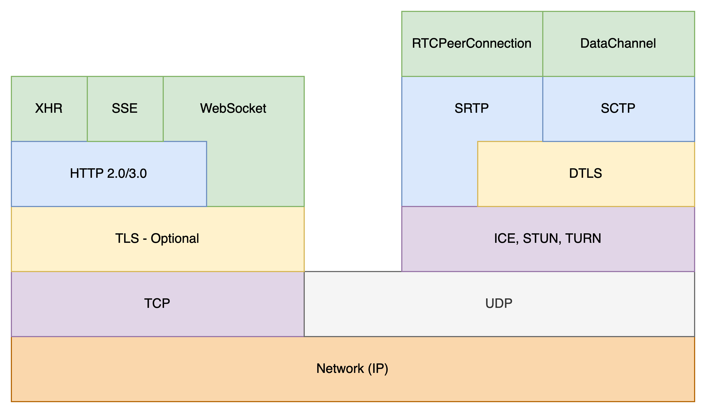

# 11


# Working with WebRTC

WebRTC (**Web Real-Time Communication**) revolutionizes network programming by enabling real-time peer-to-peer communication directly from browsers or native applications. It is ideal for video conferencing, voice calls, and instant data sharing without plugins or complex setups. Its low latency and high-quality media transmission capabilities make it a natural fit for creating highly interactive applications in the .NET 8 and C# ecosystem. By integrating WebRTC with .NET, developers can combine the reliability of .NET's server-side efficiency with WebRTC's real-time features, such as `RTCPeerConnection`, signaling management, and media stream handling, to deliver rich, interactive user experiences. This integration empowers developers to unlock new possibilities for modern, scalable applications.

This chapter explores the essential aspects of WebRTC in .NET, including its architecture, signaling, and media handling. By the end, you'll have the tools and knowledge to create real-time communication applications that support video conferencing, live streaming, collaborative tools, or other innovative use cases.

## Introduction to WebRTC

WebRTC transforms real-time communication by enabling direct peer-to-peer connections for audio, video, and data exchange, eliminating the need for complex media servers. Its low-latency, high-bandwidth interactions make it ideal for video chats, collaborative tools, and multiplayer games. By leveraging technologies like **STUN** (**Session Traversal Utilities for NAT**), **TURN** (**Traversal Using Relays around NAT**), and **ICE** (**Interactive Connectivity Establishment**) for **NAT**, WebRTC ensures reliable connections across different networks or firewalls, reducing cost and complexity compared to traditional infrastructure-dependent approaches.

WebRTC's flexibility allows it to support both media streams and arbitrary data transfer via `RTCPeerConnection` and `RTCDataChannel`. While signaling orchestrates metadata and connection candidates, tools like WebSockets simplify this process in a .NET context. Understanding these components equips developers to create robust, interactive, real-time applications.



<figcaption align = "center"><b>WebRTC Architecture Overview</b></figcaption>

## Key Features of WebRTC

WebRTC stands out as a transformative technology for real-time communication, offering a suite of features that make it ideal for modern, interactive applications. Its ability to establish direct peer-to-peer connections, support versatile media and data transfer, ensure robust security, and adapt to varying network conditions is a cornerstone for applications requiring low latency and high reliability. Understanding these features provides the foundation for unlocking WebRTC's potential in your .NET applications.

### Peer-to-Peer Communication

One of WebRTC's most compelling features is its ability to establish direct peer-to-peer connections, eliminating the need for centralized servers to route data. By creating a direct communication path between devices, WebRTC minimizes latency, which is critical for real-time applications such as video conferencing and multiplayer gaming. This reduction in latency not only enhances user experience but also reduces server costs, as data doesn't have to flow through intermediary infrastructure.

In a peer-to-peer setup, once signaling establishes a connection, WebRTC's `RTCPeerConnection` transmits media and data directly between devices. This approach ensures that interactions like video calls or live collaborative sessions feel immediate and natural. By bypassing server bottlenecks, developers can deliver fast, responsive applications that meet modern demands for immediacy and efficiency.

### Versatile Media and Data Support

WebRTC's flexibility in handling both media streams and arbitrary data transfer makes it a versatile solution for various use cases. Media streams, comprising audio and video tracks, are central to applications like video conferencing, telehealth, and live streaming. WebRTC's efficient handling of these streams ensures high-quality transmission, even under fluctuating network conditions.

Beyond media streams, WebRTC's `RTCDataChannel` enables low-latency, bi-directional data transfer between peers. This feature is invaluable for in-game state synchronization in multiplayer games, collaborative document editing, or real-time chat. The ability to handle custom data alongside media streams opens up endless possibilities for creating hybrid, interactive experiences. For example, a telehealth application could combine secure video consultations with real-time medical data sharing, enhancing both functionality and user experience.

### Built-in Security

Security is a core tenet of WebRTC, with encryption seamlessly integrated into its architecture. All media and data transmissions are protected using **DTLS** (Datagram Transport Layer Security) for signaling and **SRTP** (Secure Real-Time Transport Protocol) for media streams. This ensures that communication remains private and tamper-proof, even over unsecured networks.

In addition to end-to-end encryption, WebRTC requires user permission to access sensitive resources like cameras and microphones, further enhancing its security posture. Developers can rely on these built-in mechanisms to safeguard user data while focusing on building application features. For instance, in a financial application with video support, WebRTC's encryption ensures that sensitive conversations remain confidential, bolstering user trust and regulatory compliance.

### Adaptability to Network Conditions

WebRTC's ability to adapt to diverse and unpredictable network conditions makes it a reliable choice for real-time communication. Its dynamic use of **ICE**, **STUN**, and **TURN** ensures that connections remain stable, even in challenging scenarios such as users switching between Wi-Fi and mobile networks.

ICE orchestrates the connection process by testing multiple paths between peers to find the most efficient route. STUN helps discover public IP addresses for direct peer-to-peer communication, while TURN acts as a fallback, relaying data when direct connections aren't possible. This adaptability is especially valuable for applications with global user bases, where network reliability varies widely. For example, a live streaming platform can maintain uninterrupted service by dynamically switching to TURN servers when direct paths fail, ensuring a seamless experience for its users.

By leveraging these mechanisms, WebRTC minimizes connection drops and interruptions, delivering a consistent and reliable user experience. This resilience, combined with its other features, makes WebRTC a powerful tool for developers building real-time applications that must perform under various conditions.

## WebRTC Architecture Overview

WebRTC's architecture is built on three primary components that work together to facilitate real-time peer-to-peer communication: `RTCPeerConnection`, `MediaStream`, and `RTCDataChannel`. These components are supported by a signaling process that exchanges necessary metadata, such as Session Description Protocol (SDP) messages and Interactive Connectivity Establishment (ICE) candidates, to establish connections. Each element plays a distinct role in creating a seamless and secure communication experience.

At the heart of WebRTC is `RTCPeerConnection`, a robust API that manages the logistics of peer-to-peer connections. Once signaling establishes the initial handshake, `RTCPeerConnection` takes over to handle media and data exchange between peers. It ensures a secure connection using encryption protocols like Datagram Transport Layer Security (DTLS) for signaling and Secure Real-Time Transport Protocol (SRTP) for media transmission. This secure foundation allows developers to focus on building features without worrying about the intricacies of securing the communication channel. `RTCPeerConnection` also dynamically adjusts to network conditions, maintaining connection quality even in variable environments.

The `MediaStream` component is integral to handling audio and video streams, which are the backbone of many WebRTC applications, such as video conferencing and live streaming. By encapsulating media tracks, `MediaStream` abstracts the complexity of capturing, encoding, and transmitting multimedia content. This abstraction ensures developers can manage streams efficiently, whether transmitting a single video track or multiple synchronized audio and video streams. Furthermore, `MediaStream` integrates seamlessly with the `RTCPeerConnection` API, enabling a smooth flow of media between peers.

In addition to media, WebRTC supports arbitrary data transfer through `RTCDataChannel`. This component allows for low-latency, bi-directional communication, making it an essential tool for applications that require real-time data sharing. Whether used for transmitting game state information, enabling collaborative text editing, or sharing files during a call, `RTCDataChannel` provides a flexible mechanism for exchanging custom data. Its seamless integration with the peer-to-peer connection managed by `RTCPeerConnection` ensures that data transfer remains efficient and synchronized with other communication elements.


<figcaption align = "center"><b>WebRTC Signaling Flow Diagram</b></figcaption>

The signaling process acts as the bridge that connects these components by facilitating the exchange of metadata required to establish a connection. SDP messages provide details about media capabilities, codecs, and encryption requirements, ensuring both peers agree on the terms of the communication. ICE candidates enable the discovery of optimal network routes, overcoming challenges posed by firewalls and NATs. Once the signaling phase is complete, the direct peer-to-peer connection managed by `RTCPeerConnection` comes into play, enabling real-time communication.

WebRTC's architecture exemplifies a careful balance between simplicity and power. Abstracting complex processes like encryption, media handling, and network traversal empowers developers to focus on building innovative, real-time applications. This chapter will explore how these components are implemented in .NET to create scalable and efficient solutions. All information presented builds on prior chapters, so concepts previously covered are distinct here.

## Setting Up a WebRTC Peer-to-Peer Connection

Establishing a peer-to-peer connection in WebRTC involves a series of coordinated steps, bringing together signaling, network traversal, and connection management. While WebRTC simplifies many of the complexities of real-time communication, the initial setup requires careful orchestration to ensure seamless connectivity between peers. This section focuses on two critical aspects: the signaling process, which facilitates the exchange of connection details, and network traversal, which addresses the challenges posed by firewalls and NATs. These steps provide the foundation for creating robust and efficient real-time applications using WebRTC in a .NET environment.

### Signaling and Session Establishment

The signaling process acts as the entry point for establishing a WebRTC connection. It facilitates the exchange of critical metadata, such as Session Description Protocol (SDP) messages and Interactive Connectivity Establishment (ICE) candidates, which are necessary for peers to negotiate their communication parameters. Signaling does not occur directly within the WebRTC APIs; developers must implement a signaling mechanism, often using tools like WebSockets or HTTP-based APIs to transmit this information between peers.

In a typical WebRTC workflow, signaling begins when one peer generates an SDP offer containing details about its media capabilities, supported codecs, and desired communication parameters. This offer is sent to the other peer through the signaling channel, which responds with an SDP answer containing its corresponding parameters. During this exchange, ICE candidates are also shared, allowing peers to identify potential network routes for communication. Once signaling concludes, the peers have all the information needed to establish a direct connection, and the `RTCPeerConnection` API takes over to manage the actual media and data exchange. In a .NET application, this process is streamlined using ASP.NET Core for signaling, leveraging the framework's scalability and flexibility.

### Network Traversal with ICE, STUN, and TURN

Even with signaling successfully completed, establishing a direct connection between peers can be challenging due to network obstacles like firewalls and NATs. This is where the network traversal mechanisms of WebRTC—ICE, STUN , and TURN—come into play. These technologies work together to ensure that peers can discover and establish the most efficient communication path, regardless of their network configurations.

ICE orchestrates the traversal process by gathering potential connection candidates from each peer. These candidates include public and private IP addresses and ports discovered using STUN servers. STUN enables peers to determine their public-facing IP addresses, which is essential for direct communication when one or both peers are behind a NAT. However, direct connections are only possible in restrictive network environments. TURN servers act as intermediaries in such cases, relaying data between peers to ensure the connection is established and maintained. Although TURN adds some latency due to its relaying nature, it is a critical fallback for ensuring reliable communication.

The dynamic interplay between ICE, STUN, and TURN allows WebRTC to adapt to various network scenarios, from simple home networks to complex enterprise environments. By integrating these mechanisms into your .NET applications, you can ensure that users experience seamless and consistent connectivity, even in challenging network conditions. The following sections will explore implementing these technologies in a .NET environment, ensuring your application is equipped for reliable real-time communication.

## Use Cases and Challenges

WebRTC has emerged as a versatile technology that transforms real-time communication across diverse industries. Its low-latency and high-bandwidth capabilities, combined with its ability to handle both media streams and arbitrary data, make it suitable for various applications. However, while its flexibility and performance are compelling, implementing WebRTC comes with challenges, such as ensuring robust security and overcoming network traversal hurdles. This section explores key use cases highlighting WebRTC's strengths and addresses the primary challenges developers must navigate when integrating it into their applications.

### Use Cases

WebRTC has become a cornerstone for modern video conferencing solutions, where its peer-to-peer architecture ensures smooth and high-quality interactions. Enabling direct communication between devices minimizes latency and reduces the need for costly media servers, making it an excellent choice for one-on-one calls and large-scale virtual meetings alike. Organizations leverage this technology to create seamless remote collaboration experiences, allowing participants to share screens, exchange files, and interact in real-time without perceptible delays. These features make it invaluable in business, education, and telehealth, where real-time engagement is critical.

Beyond video conferencing, WebRTC plays a pivotal role in online gaming. Its low-latency data channels allow game developers to synchronize game states between players in real-time, creating immersive, fast-paced multiplayer experiences. This technology supports not only voice chat but also the instantaneous exchange of game-related data, such as player positions or game events. By ensuring minimal delays, WebRTC enhances gameplay, keeping players engaged and connected in competitive or cooperative scenarios.

WebRTC is also transforming live streaming and broadcasting applications, particularly those requiring instant updates. Platforms hosting auctions, sports commentaries, or live events use WebRTC to provide real-time streams, ensuring audiences remain engaged without frustrating lags. Additionally, the Internet of Things (IoT) ecosystem benefits significantly from WebRTC's efficient peer-to-peer communication. Smart devices can relay data directly to each other or to central systems in real-time, enabling responsive home automation, efficient monitoring systems, and more integrated IoT networks.

### Challenges

While WebRTC's capabilities are impressive, implementing it is challenging, particularly in the realm of network traversal. Establishing a peer-to-peer connection between devices often requires navigating obstacles such as NATs (Network Address Translators) and firewalls. WebRTC relies on mechanisms like ICE, STUN, and TURN to overcome these barriers. Although these tools enable connectivity in most scenarios, they introduce complexity during setup and increase the need for careful configuration. Developers must balance the reliance on STUN for discovering public IPs and TURN for relaying data in restrictive environments, ensuring the connection remains efficient and reliable.

Another significant challenge is ensuring security, especially during the signaling phase. While WebRTC provides built-in encryption for media and data streams, it leaves the implementation of secure signaling to developers. Without proper safeguards, such as HTTPS and robust authentication mechanisms, signaling channels can become vulnerable to attacks, including eavesdropping and spoofing. Managing permissions for accessing sensitive resources, like cameras and microphones, adds another layer of responsibility. Developers must integrate these security measures seamlessly into their applications, ensuring both user privacy and data protection.

Despite these challenges, the rewards of using WebRTC far outweigh the complexities. Its ability to deliver real-time, high-quality communication experiences is unparalleled, making it a valuable tool for developers willing to invest in mastering its nuances. By addressing network traversal and security concerns early in the development process, WebRTC applications can provide reliable and secure solutions across a range of use cases.

## Integrating WebRTC in a .NET Application

Integrating WebRTC into a .NET application brings the architecture, components, and peer-to-peer connection setup to life. This section focuses on practical implementation, exploring how to harmonize a .NET backend with WebRTC clients for real-time, low-latency communication. A key element of this integration is managing the signaling process, which involves the exchange of session descriptions and ICE candidates between peers. To facilitate this, a signaling server is set up in ASP.NET Core using WebSockets. This server ensures efficient communication and allows developers to maintain complete control over how peers connect and negotiate their interaction rules.

Beyond signaling, the integration must support smooth media and data exchange, where .NET facilitates media negotiation, session management, and connection quality maintenance. Leveraging JavaScript interop in Blazor applications seamlessly bridges the .NET backend with the WebRTC client-side API, creating a unified and harmonious development environment. This approach combines the strengths of C# for backend processes with WebRTC's real-time capabilities, delivering responsive, engaging user experiences and unlocking immense possibilities for real-time peer-to-peer communication in .NET applications.

### Implementing a Signaling Server in .NET

Setting up a signaling server is a critical part of making WebRTC work, and with .NET, you have all the tools you need to get it done effectively. The purpose of the signaling server is to facilitate the exchange of session descriptions and ICE candidates between peers. Essentially, the matchmaker gets two devices talking, and once they're connected, it steps back to let the magic happen peer-to-peer. Let's build this with ASP.NET Core and WebSockets, ensuring our setup is ready for real-time interactions.

First, we start by creating an ASP.NET Core project that will serve as our signaling server. Use the following command to create a Web API project:

```Bash
dotnet new webapi -n WebRTCSignalingServer
```

After creating the project, navigate to the Program.cs file and modify it to include WebSocket support. The goal is to enable incoming WebSocket requests, which will allow our server to receive and forward signaling messages from clients. Here’s how we add WebSocket support and set up a simple endpoint:

```C#
var builder = WebApplication.CreateBuilder(args);
var app = builder.Build();

app.UseWebSockets();
app.UseRouting();

app.UseEndpoints(endpoints =>
{
    endpoints.MapGet("/signal", async context =>
    {
        await HandleWebSocketRequest(context);
    });
});

app.Run();
```

In the code above, we’ve defined an endpoint /signal that serves as the entry point for WebSocket communication. This is where clients will connect to exchange their signaling messages. If a request isn’t a WebSocket request, we return a 400 status code to indicate an invalid request type.

Now, let’s implement HandleSignaling to deal with incoming WebSocket messages. The logic here will involve maintaining a list of connected clients, relaying messages between them, and processing different types of signaling messages like SDP offers and ICE candidates:

```C#
const int BufferSize = 1024 * 4;

List<WebSocket> connectedClients = new List<WebSocket>();

async Task HandleWebSocketRequest(HttpContext context)
{
    if (context.WebSockets.IsWebSocketRequest)
    {
        var webSocket = await context.WebSockets.AcceptWebSocketAsync();
        await HandleWebSocketSignaling(webSocket);
    }
    else
    {
        context.Response.StatusCode = 400;
    }
}

async Task HandleWebSocketSignaling(WebSocket webSocket)
{
    connectedClients.Add(webSocket);
    var buffer = new byte[BufferSize];

    try
    {
        while (webSocket.State == WebSocketState.Open)
        {
            var result = await webSocket.ReceiveAsync(new ArraySegment<byte>(buffer), CancellationToken.None);
            var message = Encoding.UTF8.GetString(buffer, 0, result.Count);

            Console.WriteLine($"Received: {message}");

            // Here you would parse the signaling message (e.g., SDP, ICE) and forward it to the appropriate peer
            foreach (var client in connectedClients)
            {
                if (client != webSocket && client.State == WebSocketState.Open)
                {
                    await client.SendAsync(new ArraySegment<byte>(Encoding.UTF8.GetBytes(message)),
                        result.MessageType,
                        result.EndOfMessage,
                        CancellationToken.None);
                }
            }
        }
    }
    catch (Exception ex)
    {
        Console.WriteLine($"Error: {ex.Message}");
    }
    finally
    {
        connectedClients.Remove(webSocket);
        await webSocket.CloseAsync(WebSocketCloseStatus.NormalClosure, "Closing", CancellationToken.None);
    }
}
```

In this implementation, we maintain a list of all connected clients, allowing the server to forward incoming messages to other peers. When a message is received, it’s sent to every other connected client except the sender. This is a basic but functional approach to signaling—enough to facilitate the initial exchange of SDP and ICE candidates.

In a real application, you’d want to improve this logic to support client identification and targeted message delivery. For instance, you could add logic to associate a unique ID with each client and include routing information in the signaling message so that messages only go to the intended recipient. This keeps communication efficient and avoids unnecessary traffic between clients.

This signaling server sets the stage for establishing peer-to-peer connections in your .NET application. With the signaling logic in place, clients can now exchange the crucial details needed to start their WebRTC sessions. In the next section, we’ll explore how to connect the front end to this signaling server, using JavaScript and WebRTC APIs to initiate and manage peer connections effectively.

### Using JavaScript Interop for WebRTC in Blazor

One of the most practical approaches to integrating this technology with Blazor is leveraging JavaScript interop. Blazor is a fantastic tool for creating modern web applications in C#, but WebRTC is primarily JavaScript territory. Thankfully, Blazor's interop capabilities allow us to seamlessly bridge the gap, letting you use C# to control JavaScript and ultimately bring WebRTC functionality into your Blazor applications without reinventing the wheel.

To start, let's create a Blazor application that will allow us to establish a WebRTC connection. Begin by creating a new Blazor Server or Blazor WebAssembly project in .NET:

```Bash
dotnet new blazorserver -n BlazorWebRTC
```

Once the Blazor project is set up, the next step is to add JavaScript functionality to handle WebRTC. We will write a JavaScript file to manage all WebRTC operations, including creating `RTCPeerConnection`, handling ICE candidates, and exchanging SDP. Add a new JavaScript file called `webrtc.js` in the `wwwroot` directory:

```Javascript
// wwwroot/webrtc.js

let localConnection = null;
let remoteConnection = null;

window.webRTCInterop = {
    initializeConnection: function () {
        localConnection = new RTCPeerConnection();
        remoteConnection = new RTCPeerConnection();

        // Handle ICE candidates
        localConnection.onicecandidate = (event) => {
            if (event.candidate) {
                remoteConnection.addIceCandidate(event.candidate);
            }
        };
        
        remoteConnection.onicecandidate = (event) => {
            if (event.candidate) {
                localConnection.addIceCandidate(event.candidate);
            }
        };

        // Handle remote stream
        remoteConnection.ontrack = (event) => {
            const remoteVideo = document.getElementById("remoteVideo");
            remoteVideo.srcObject = event.streams[0];
        };
    },

    startCall: async function () {
        const stream = await navigator.mediaDevices.getUserMedia({ video: true, audio: true });
        const localVideo = document.getElementById("localVideo");
        localVideo.srcObject = stream;

        stream.getTracks().forEach(track => localConnection.addTrack(track, stream));

        const offer = await localConnection.createOffer();
        await localConnection.setLocalDescription(offer);
        await remoteConnection.setRemoteDescription(offer);

        const answer = await remoteConnection.createAnswer();
        await remoteConnection.setLocalDescription(answer);
        await localConnection.setRemoteDescription(answer);
    }
};
```

In your _Host.cshtml file, add a reference to the JavaScript file within the <head> tag:

```ASP.NET (C#)
<script src="~/webrtc.js"></script>
```

In this JavaScript code, we set up two peer connections (`localConnection` and `remoteConnection`) for demonstration purposes, simulating two different users connecting. This will handle media streams, SDP offers, and ICE candidates. The goal is to initiate and manage the connection purely through JavaScript while invoking this behavior from C#.

Next, integrate this JavaScript into the Blazor application using JavaScript interop. Open a Blazor component, such as `Index.razor`, and set up the necessary user interface for video calls:

```ASP.NET (C#)
@page "/"

<h3>WebRTC Video Chat</h3>

<video id="localVideo" autoplay playsinline></video>
<video id="remoteVideo" autoplay playsinline></video>

<button @onclick="InitializeConnection">Initialize Connection</button>
<button @onclick="StartCall">Start Call</button>

@code {
    private async Task InitializeConnection()
    {
        await JS.InvokeVoidAsync("webRTCInterop.initializeConnection");
    }

    private async Task StartCall()
    {
        await JS.InvokeVoidAsync("webRTCInterop.startCall");
    }
}
```

In this Blazor component, we have two `<video>` elements to display the local and remote video streams and two buttons to initialize the connection and start the call. The C# code-behind uses JavaScript interop to call the functions defined in `webrtc.js`, which is necessary for integrating the Blazor component with JavaScript for video streaming.

To connect the Blazor component with the JavaScript file, inject the JavaScript runtime in the @code block:

```C#
@inject IJSRuntime JS
```

This allows us to use `JS.InvokeVoidAsync()` to call JavaScript functions from the C# side. When the user clicks "Initialize Connection," it will set up the peer connections and ICE candidate handling, and when "Start Call" is clicked, it will begin the media exchange process.

This JavaScript and C# integration approach gives you the best of both worlds—leveraging WebRTC's native support in browsers via JavaScript while managing the application's logic and UI using Blazor and C#. The key here is to offload the WebRTC operations to JavaScript, which already has well-supported APIs. Use Blazor for everything else, ensuring you maintain a structured and easy-to-manage codebase.

This combination makes building real-time web applications a breeze. If you prefer working in C #, you won't have to dive too deep into JavaScript. In the next sections, we'll explore how to manage media streams and data channels further, making this solution functional, polished, and ready for real-world scenarios.

### Handling Media Streams in .NET Applications

Handling media streams is one of the core capabilities that makes WebRTC so powerful, enabling real-time audio and video exchange between peers. In a .NET application, the challenge lies in effectively integrating the front end (where users interact with video and audio) with a backend capable of supporting signaling and handling real-time data exchange. This section will extend our Blazor-based WebRTC setup to capture, manage, and route media streams, highlighting the satisfaction of overcoming this integration challenge.

First, on the JavaScript side, we already have the logic to capture the user's media stream using `getUserMedia()` in our `webrtc.js` file. This function captures video and audio from the local device and adds it to the peer connection. The next task is to set up the backend signaling to ensure that media streams are correctly set up between peers. This includes communicating SDP offers, answers, and ICE candidates to the .NET backend, which then relays the messages between clients.

On the .NET server side, we must manage signaling messages to set up these media streams. Suppose you have the signaling server implemented as in our earlier example. Let's add a way to differentiate between signaling messages when setting up media. You might want to implement different types of messages like "offer," "answer," and "candidate" to handle the SDP and ICE candidate exchanges. Here's a simplified example:

```C#
async Task HandleWebSocketSignaling(WebSocket webSocket)
{
    connectedClients.Add(webSocket);
    var buffer = new byte[1024 * 4];

    try
    {
        while (webSocket.State == WebSocketState.Open)
        {
            var result = await webSocket.ReceiveAsync(new ArraySegment<byte>(buffer), CancellationToken.None);
            var message = Encoding.UTF8.GetString(buffer, 0, result.Count);
            
            // Parsing JSON message to differentiate message types
            var signalingMessage = JsonSerializer.Deserialize<SignalingMessage>(message);
            
            switch (signalingMessage.Type)
            {
                case "offer":
                case "answer":
                case "candidate":
                    await ForwardSignalingMessage(signalingMessage, webSocket);
                    break;
                default:
                    Console.WriteLine($"Unknown message type: {signalingMessage.Type}");
                    break;
            }
        }
    }
    catch (Exception ex)
    {
        Console.WriteLine($"Error: {ex.Message}");
    }
    finally
    {
        connectedClients.Remove(webSocket);
        await webSocket.CloseAsync(WebSocketCloseStatus.NormalClosure, "Closing", CancellationToken.None);
    }
}

async Task ForwardSignalingMessage(SignalingMessage signalingMessage, WebSocket sender)
{
    foreach (var client in connectedClients)
    {
        if (client != sender && client.State == WebSocketState.Open)
        {
            var messageJson = JsonSerializer.Serialize(signalingMessage);
            await client.SendAsync(new ArraySegment<byte>(Encoding.UTF8.GetBytes(messageJson)), WebSocketMessageType.Text, true, CancellationToken.None);
        }
    }
}

public class SignalingMessage
{
    public string Type { get; set; }
    public string Payload { get; set; }
}
```

In this example, we handle different signaling message types to manage SDP offers, answers, and ICE candidates, which are essential for setting up media streams. The `ForwardSignalingMessage` method ensures that each client receives the relevant signaling data to establish the peer-to-peer connection.

On the Blazor frontend, the captured media is displayed in the local video element, while the remote video is displayed once the other peer's stream has been received. The media streams can be manipulated through JavaScript, but it's also possible to control the flow from the .NET side by adjusting how and when media tracks are added. For example, if you wanted to add or remove tracks dynamically, you could extend your JavaScript interop to include functions like `addTrack` or `removeTrack` and then call those functions from C# based on the user's actions:

```C#
public async Task AddTrack()
{
    await JS.InvokeVoidAsync("webRTCInterop.addTrack");
}

public async Task RemoveTrack()
{
    string trackId = "your-track-id";
    await JS.InvokeVoidAsync("webRTCInterop.removeTrack", trackId);
}
```

Managing media streams in a WebRTC application isn't just about setting up the initial connection—it also means maintaining the connection, monitoring the quality, and potentially adjusting parameters like bitrate, resolution, or even turning specific tracks on/off. This is where combining the flexibility of JavaScript with the control of .NET truly shines, letting you tailor the experience based on the capabilities of the user's network or device. These capabilities can be determined through various methods such as network speed tests, device detection, or user input.

In the following sections, we'll explore optimizing these media streams for performance and reliability, ensuring that users have a smooth experience regardless of their network conditions. The idea is to keep things seamless for users, which should resonate with you, the developer, as it's all about enhancing the end-user experience.

## Data Channels and Custom Data Exchange

Data channels are a source of boundless inspiration in the WebRTC landscape. They transcend the conventional audio and video streaming, opening up a realm where real-time messages, file sharing, and application state synchronization can occur directly between users, with minimal latency. This potential unleashes a world of creativity for dynamic applications, from multiplayer games that demand instant action sharing to productivity tools that foster seamless user collaboration. Data channels are the key to this world, and in this section, we’ll explore how to infuse this potential into your .NET applications.

Working with data channels in .NET involves:
Setting up efficient signaling.
Using WebRTC’s powerful APIs for creating reliable and secure pathways for data exchange.
Managing the flow of information between peers.
It’s not just about establishing a connection; it’s about designing an experience that feels responsive and smooth—whether for chatting, sharing documents, or creating a shared virtual environment. Integrating WebRTC data channels into Blazor applications provides a perfect example of leveraging the best of both worlds—high-level C# capabilities such as asynchronous programming and LINQ combined with real-time data transmission.

Throughout this section, we’ll guide you through the process of setting up and managing data channels in Blazor, exploring how to handle the different states of the data channel and implement the logic for sending and receiving custom data. By the end, you’ll be equipped to create sophisticated .NET applications where data exchange is as seamless as a chat between friends—immediate, direct, and reliable. Your users can trust in the reliability of your application's data exchange, enhancing their overall experience.

### Managing WebRTC Data Channels

Data channels, a powerful feature of WebRTC, enable the direct transfer of arbitrary data between peers. Unlike media streams, which are used for audio and video, data channels allow you to send text, files, game states, or any custom data with low latency. Integrating data channels into a .NET application is a complex task that involves setting up signaling, but more importantly, it requires the effective management of data transfer. Your role in ensuring that both the backend and frontend are in sync to handle these messages effectively is crucial. Let’s explore this challenge of managing data channels using Blazor and .NET.

Our journey to include the data channel in our existing WebRTC setup begins with a crucial step on the JavaScript side. Here, your expertise comes into play as we modify `webrtc.js` to create a data channel within the existing peer connection setup. The following JavaScript code, which you will be instrumental in implementing, initializes a data channel and sets up event listeners to handle incoming messages:

```Javascript
// wwwroot/webrtc.js

let dataChannel = null;

window.webRTCInterop = {
    initializeConnection: function () {
        localConnection = new RTCPeerConnection();
        remoteConnection = new RTCPeerConnection();

        // Set up the data channel
        dataChannel = localConnection.createDataChannel("chat");
        dataChannel.onopen = () => console.log("Data channel is open");
        dataChannel.onmessage = (event) => {
            console.log("Received message: ", event.data);
            // Display received message in the UI
        };

        // Set up event listener for data channel in remote connection
        remoteConnection.ondatachannel = (event) => {
            const receiveChannel = event.channel;
            receiveChannel.onmessage = (e) => {
                console.log("Received message on remote: ", e.data);
                // Display received message in the UI
            };
        };

        // Handle ICE candidates as before
        localConnection.onicecandidate = (event) => {
            if (event.candidate) {
                remoteConnection.addIceCandidate(event.candidate);
            }
        };

        remoteConnection.onicecandidate = (event) => {
            if (event.candidate) {
                localConnection.addIceCandidate(event.candidate);
            }
        };
    },

    sendMessage: function (message) {
        if (dataChannel && dataChannel.readyState === "open") {
            dataChannel.send(message);
            console.log("Sent message: ", message);
        }
    }
};
```

In the JavaScript code above, `createDataChannel` creates a data channel named "chat." We also set up event handlers to listen for incoming messages and respond to the channel's state changes. Once the data channel is open, the `sendMessage` function can be called to send data through it.

Now, let's integrate this with Blazor so that users can send messages from the UI. In the `Index.razor` component, we can create a simple interface for sending text messages:

```ASP.NET (C#)
@page "/"

<h3>WebRTC Data Channel Demo</h3>

<input @bind="message" placeholder="Type a message" />
<button @onclick="SendMessage">Send</button>

@code {
    private string message = string.Empty;

    private async Task SendMessage()
    {
        await JS.InvokeVoidAsync("webRTCInterop.sendMessage", message);
        message = string.Empty;
    }
}
```

Here, we create an input box where users can type messages and a button that sends those messages via the data channel. Using JavaScript interop (`JS.InvokeVoidAsync`), we call the `sendMessage` function in our JavaScript code to send data from the local client to the remote client.

On the .NET backend, we don't need to directly handle the data channel itself, as it's managed between peers on the frontend. However, the backend signaling server plays a vital role in facilitating the setup of the peer connection. It ensures that both peers have successfully negotiated the data channel during signaling, acting as a mediator for the initial connection setup and subsequent communication. The existing signaling server from the previous sections can be used as-is, with SDP and ICE candidates exchanged to support both media and data channels.

A key aspect of managing data channels is monitoring the connection state. You want to ensure the data channel is open before sending messages, which we handle in JavaScript by checking `dataChannel.readyState`. Additionally, you may want to implement some form of error handling or reconnection logic, especially if the connection is interrupted. This can be done by listening for events like `onerror` and `onclose` on the data channel and responding accordingly. For instance, you can display an error message to the user when an error occurs, or automatically attempt to reconnect when the connection is closed.

Using data channels in .NET applications provides:
* A lot of flexibility.
* Allowing you to create features such as real-time chat.
* File sharing.
* Even collaborative tools like shared whiteboards.

Combining the power of Blazor and .NET with WebRTC's real-time capabilities is a game-changer. It enables you to develop interactive, dynamic web applications that feel responsive and connected. In the following sections, we'll continue building on this foundation, covering how to secure these connections and ensure a smooth user experience.

### Adjusting Bitrate and Resolution

One of the critical factors in maintaining a high-quality media experience in WebRTC is the ability to adjust the bitrate and resolution of the video streams dynamically. Network conditions can vary significantly between users, and without proper adjustments, you might end up with a connection that's either poor in quality or consuming too much bandwidth. In this section, we'll look into how you can use JavaScript interop in Blazor to tweak bitrate and resolution settings for video streams and, in turn, create an adaptive, high-quality experience for users regardless of their network environment.

Start by adding controls to the JavaScript file that adjust the video bitrate during a call. For this, we'll interact with the WebRTC `RTCRtpSender` API, which allows fine-tuning parameters such as max bitrate. Here's an extension of the `webrtc.js` file where we control the bitrate settings:

```Javascript
// wwwroot/webrtc.js

window.webRTCInterop = {
    adjustBitrate: function (bitrate) {
        const senders = localConnection.getSenders();
        senders.forEach(sender => {
            if (sender.track && sender.track.kind === 'video') {
                const parameters = sender.getParameters();
                if (!parameters.encodings) {
                    parameters.encodings = [{}];
                }
                parameters.encodings[0].maxBitrate = bitrate * 1000; // Convert kbps to bps
                sender.setParameters(parameters);
                console.log(`Adjusted video bitrate to ${bitrate} kbps`);
            }
        });
    },

    // Existing functions like initializeConnection and startCall...
};
```

The `adjustBitrate` function, a key element in managing bandwidth usage, utilizes the `RTCRtpSender` to access and modify encoding parameters, including the `maxBitrate`. This function is crucial as it allows you to cap the bandwidth usage, a practical solution to avoid overwhelming a user's connection, especially in environments with limited bandwidth.

Now, let's integrate this user-centric functionality with the Blazor UI. This will empower users or the application to adjust bitrate based on detected network conditions. We'll add an input and button to Index.razor to set the desired bitrate:

```ASP.NET (C#)
@page "/"

<h3>Adjust WebRTC Video Bitrate</h3>

<input type="number" @bind="bitrate" placeholder="Enter bitrate (kbps)" />
<button @onclick="SetBitrate">Set Bitrate</button>

@code {
    private int bitrate;

    private async Task SetBitrate()
    {
        if (bitrate > 0)
        {
            await JS.InvokeVoidAsync("webRTCInterop.adjustBitrate", bitrate);
        }
    }
}
```

Here, the user can specify a new bitrate, and upon clicking the button, the value is sent to JavaScript via interop. This allows the application to adapt video quality based on network analysis, such as bandwidth estimation algorithms you might implement on the server side.

Resolution adjustment ensures optimal media quality, especially when bandwidth limitations are present. To adjust video resolution dynamically, you would modify how the media is accessed and constrained. When initially capturing the video, you can set constraints based on the current network conditions. Here's an example that allows dynamic adjustment of video constraints:

```Javascript
window.webRTCInterop = {
    updateResolution: async function (width, height) {
        const stream = await navigator.mediaDevices.getUserMedia({
            video: {
                width: { ideal: width },
                height: { ideal: height }
            },
            audio: true
        });

        const videoTracks = localConnection.getSenders().filter(sender => sender.track.kind === 'video');
        videoTracks.forEach(track => {
            track.replaceTrack(stream.getVideoTracks()[0]);
            console.log(`Updated resolution to ${width}x${height}`);
        });

        const localVideo = document.getElementById("localVideo");
        localVideo.srcObject = stream;
    }
};
```

To integrate this in your Blazor application, you could add controls that allow a user to select a resolution, or automatically adjust it based on network analysis:

```ASP.NET (C#)
<h3>Adjust Video Resolution</h3>

<input type="number" @bind="resolutionWidth" placeholder="Width (px)" />
<input type="number" @bind="resolutionHeight" placeholder="Height (px)" />
<button @onclick="SetResolution">Set Resolution</button>

@code {
    private int resolutionWidth = 1280;
    private int resolutionHeight = 720;

    private async Task SetResolution()
    {
        if (resolutionWidth > 0 && resolutionHeight > 0)
        {
            await JS.InvokeVoidAsync("webRTCInterop.updateResolution", resolutionWidth, resolutionHeight);
        }
    }
}
```

By enabling users or the system to adjust the bitrate and resolution seamlessly, you’re empowering the WebRTC application to balance quality and performance. These adjustments can happen dynamically during a call, responding to network fluctuations or changes in available bandwidth. Integrating these options into your Blazor interface provides a user-friendly way to adapt media streams for the best possible experience.

In the next sections, we will explore how adaptive bitrate and resolution adjustments can be automated using network analysis techniques. This will make your application smarter and more responsive to real-world conditions without requiring manual user input.

### Using Adaptive Bitrate and Bandwidth Estimation

Implementing adaptive bitrate and bandwidth estimation is essential for maintaining high-quality, real-time media experiences in unpredictable network environments. Rather than sticking to a fixed bitrate or resolution that might degrade the experience if conditions change, adaptive bitrate enables your application to adjust the video quality based on current network conditions dynamically. This ensures that, even if bandwidth fluctuates, users experience minimal interruptions and enjoy the best possible media quality their connection can support.

In WebRTC, the browser often manages adaptive bitrate control automatically using mechanisms like congestion control and feedback from the network. However, you can enhance this capability in your .NET-based application by utilizing the RTCRtpSender.`getParameters()` and `setParameters()` methods for manual control, combined with information you gather about the network's state. We can start by using JavaScript to get statistics on the current network performance and pass this information back to the server or control logic in your Blazor app.

Here's a JavaScript function that makes use of `getStats()` to monitor bandwidth and estimate network conditions:

```Javascript
window.webRTCInterop = {
    monitorBandwidth: function () {
        localConnection.getStats(null).then(stats => {
            stats.forEach(report => {
                if (report.type === 'outbound-rtp' && report.mediaType === 'video') {
                    console.log(`Bitrate: ${report.bytesSent} bytes sent, Timestamp: ${report.timestamp}`);
                }
            });
        });
    }
};
```

The `monitorBandwidth` function accesses WebRTC statistics and logs relevant information about the video bitrate. This can be used to diagnose the current network conditions, and based on this information, you can adjust the bitrate in real time. Let’s integrate this monitoring functionality into a Blazor app, where it will play a crucial role in making informed decisions about video streaming.

In the `Index.razor` file, set up a button to initiate monitoring and adaptive bitrate control:

```ASP.NET (C#)
@page "/"

<h3>Monitor Bandwidth and Adjust Bitrate</h3>

<button @onclick="MonitorAndAdjustBitrate">Monitor and Adjust Bitrate</button>

@code {
    private async Task MonitorAndAdjustBitrate()
    {
        await JS.InvokeVoidAsync("webRTCInterop.monitorBandwidth");
        // Simulate adaptive logic, you could add a timer or a loop here
        await Task.Delay(5000); // Delay to simulate monitoring interval
        // Adjust bitrate based on monitored conditions, assuming you already retrieved a desired value
        int adjustedBitrate = 500; // Example: adjust bitrate to 500 kbps
        await JS.InvokeVoidAsync("webRTCInterop.adjustBitrate", adjustedBitrate);
    }
}
```

In this example, clicking "Monitor and Adjust Bitrate" will run the `monitorBandwidth` JavaScript function to collect network statistics. Based on these stats, you could adjust the bitrate dynamically by invoking `adjustBitrate` with a new value. This is where you add your adaptive logic, potentially by analyzing the output and responding to changes in available bandwidth.

To take things a step further, you might implement a continuous feedback loop that monitors network conditions and automatically adapts bitrate without user intervention. This can be done with a recurring timer that continuously monitors and adjusts the bitrate:

```ASP.NET (C#)
@code {
    private PeriodicTimer? timer;

    protected override async Task OnInitializedAsync()
    {
        timer = new PeriodicTimer(TimeSpan.FromSeconds(5));
        await MonitorAndAdjustLoop();
    }

    private async Task MonitorAndAdjustLoop()
    {
        while (await timer.WaitForNextTickAsync())
        {
            await JS.InvokeVoidAsync("webRTCInterop.monitorBandwidth");
            // Adjust the bitrate based on collected stats
            int adjustedBitrate = EstimateNewBitrate();
            await JS.InvokeVoidAsync("webRTCInterop.adjustBitrate", adjustedBitrate);
        }
    }

    private int EstimateNewBitrate()
    {
        // Replace this with logic based on actual bandwidth estimates.
        return 500; // Example: dynamic calculation can be added here.
    }
}
```

This implementation utilizes a PeriodicTimer that runs every five seconds to monitor the bandwidth and adjust the bitrate. The EstimateNewBitrate method is not just a placeholder, but a powerful tool that empowers you to customize the logic based on the network feedback gathered by monitorBandwidth. This setup provides an automated solution to adjust the media quality in response to changing network conditions, giving you full control over the adaptive bitrate control process.

With adaptive bitrate control, you're making your application much more resilient to the realities of users' network environments. It keeps the stream quality as high as possible while avoiding poor connectivity, leading to dropped frames or buffering. It's particularly beneficial for applications like video conferencing or live streaming, where consistent quality is key to the user experience.

In the next sections, we'll explore how to optimize these adaptive techniques, including managing packet loss and handling network congestion gracefully, ensuring that your application can offer reliable real-time communication, no matter what the network throws at it.

### Managing Network Conditions and Handling Packet Loss

In real-time communication, dealing with fluctuating network conditions and packet loss is an inevitable challenge. When network quality degrades, packets can get lost or arrive out of order, leading to degraded media quality—like choppy video or laggy audio. Understanding how to manage these conditions and handle packet loss is essential to delivering a smooth user experience. In this section, we’ll explore the proactive role of developers in implementing strategies in their.NET-based WebRTC solutions to maintain connection quality, even under less-than-ideal circumstances.

One of the ways WebRTC handles network fluctuations is through mechanisms like Forward Error Correction (FEC) and retransmissions. To support these strategies from the application side, we need to closely monitor network quality. JavaScript, with its ability to provide access to WebRTC statistics, plays a key role in this process. Here’s a JavaScript function that retrieves packet loss statistics using `getStats()`:

```Javascript
window.webRTCInterop = {
    monitorPacketLoss: function () {
        localConnection.getStats(null).then(stats => {
            stats.forEach(report => {
                if (report.type === 'inbound-rtp' && report.mediaType === 'video') {
                    console.log(`Packets Lost: ${report.packetsLost}`);
                }
            });
        });
    }
};
```

This function iterates over the statistics reports and logs the number of packets lost for video streams. It’s a good starting point for understanding the quality of the current connection and determining whether further action is needed to mitigate packet loss.

To integrate this with the .NET application, we can use Blazor to call this JavaScript function regularly and take action based on the results. For example, if we detect a high packet loss, we can adjust the bitrate or even change the codec to one that performs better under constrained conditions:

```ASP.NET (C#)
@page "/"

<h3>Monitor Packet Loss and Adjust Quality</h3>

<button @onclick="MonitorAndHandlePacketLoss">Monitor and Handle Packet Loss</button>

@code {
    private async Task MonitorAndHandlePacketLoss()
    {
        await JS.InvokeVoidAsync("webRTCInterop.monitorPacketLoss");
        // Simulate adaptive action, add actual handling logic here
        int adjustedBitrate = 300; // Lower bitrate if packet loss is detected
        await JS.InvokeVoidAsync("webRTCInterop.adjustBitrate", adjustedBitrate);
    }
}
```

In the above example, 'Monitor and Handle Packet Loss' triggers monitoring. Based on the collected data, you could lower the bitrate. This action helps alleviate network stress, thereby reducing the packet loss rate and significantly improving the overall experience.

A more sophisticated approach would involve implementing a dynamic feedback loop that continually monitors network conditions and actively responds to packet loss. This engaging process can be achieved by leveraging a periodic timer, as we did in the previous section:

```ASP.NET (C#)
@code {
    private PeriodicTimer? packetLossTimer;

    protected override async Task OnInitializedAsync()
    {
        packetLossTimer = new PeriodicTimer(TimeSpan.FromSeconds(5));
        await MonitorPacketLossLoop();
    }

    private async Task MonitorPacketLossLoop()
    {
        while (await packetLossTimer.WaitForNextTickAsync())
        {
            await JS.InvokeVoidAsync("webRTCInterop.monitorPacketLoss");
            // Logic to determine how to handle detected packet loss
            int adjustedBitrate = EstimateBitrateBasedOnPacketLoss();
            await JS.InvokeVoidAsync("webRTCInterop.adjustBitrate", adjustedBitrate);
        }
    }

    private int EstimateBitrateBasedOnPacketLoss()
    {
        // Add logic to determine new bitrate based on packet loss data
        return 300; // Example: dynamically adjust this value
    }
}
```

This loop ensures that packet loss is monitored regularly, allowing the application to make timely adjustments. By constantly adapting to changing conditions, you reduce the chance of severe quality degradation, making the experience more resilient.

In addition to adjusting bitrate, consider switching codecs during the session if packet loss becomes an ongoing issue. Particular codecs, such as VP9 and H.264, have different levels of resilience to packet loss. VP9, for example, has better error resilience, making it more suitable for challenging networks. By dynamizing the SDP (Session Description Protocol) and renegotiating the connection, you can choose a codec that best suits the current conditions.

While preventing packet loss entirely is impossible, especially on unreliable networks, proactive management is the key to a consistently good experience. By monitoring packet loss, adjusting bitrates, and choosing the appropriate codecs, you can ensure that your WebRTC solution delivers the best possible quality under varying conditions. In the next sections, we will further explore optimizing network performance by utilizing jitter buffers and strategies to maintain a smooth and responsive connection.

### Optimizing Encoding and Hardware Acceleration

Optimizing video encoding is one of the most impactful ways to ensure smooth, real-time communication. Efficient encoding helps balance quality, performance, and bandwidth usage, especially in unpredictable network conditions. One powerful way to boost performance and feel empowered is by leveraging hardware acceleration. This technology offloads complex encoding tasks to specialized hardware, thereby reducing the load on the CPU and significantly improving overall application efficiency. This section will explore how you can use encoding settings and hardware acceleration to provide the best user experience.

Let’s start by adjusting the encoder settings. WebRTC, with its flexible options, gives you the confidence to control encoding parameters, such as setting preferred codecs, adjusting resolution, and limiting frame rates. You can achieve this through JavaScript, using `RTCRtpSender.getParameters()` and `setParameters()`. For example, let’s modify our `webrtc.js` file to add a function that optimizes the encoder’s settings for improved performance:

```Javascript
window.webRTCInterop = {
    optimizeEncoding: function (bitrate, framerate) {
        const senders = localConnection.getSenders();
        senders.forEach(sender => {
            if (sender.track && sender.track.kind === 'video') {
                const parameters = sender.getParameters();
                if (!parameters.encodings) {
                    parameters.encodings = [{}];
                }
                parameters.encodings[0].maxBitrate = bitrate * 1000; // kbps to bps
                parameters.encodings[0].maxFramerate = framerate;
                sender.setParameters(parameters);
                console.log(`Optimized encoding: Bitrate set to ${bitrate} kbps, Frame rate set to ${framerate}`);
            }
        });
    }
};
```

This function sets the maximum bitrate and frame rate for the video stream, helping reduce the load on the network and optimize the quality based on current conditions. Lower frame rates or bitrates are especially helpful in maintaining a stable connection during periods of high packet loss or limited bandwidth.

To leverage hardware acceleration, it is crucial to configure video encoding so that it takes advantage of the user's GPU when available. Most modern browsers already support hardware acceleration by default, but you can ensure this is happening effectively by monitoring the system's performance. Your Blazor app plays a crucial role in this optimization process, allowing users to select encoding options or letting the application dynamically adjust based on system feedback.

In your .razor file, you could add an option for the user to select performance modes:

```ASP.NET (C#)
@page "/"

<h3>Optimize Encoding Settings</h3>

<button @onclick="() => OptimizeEncoding(1000, 30)">Low Quality (1000 kbps, 30 fps)</button>
<button @onclick="() => OptimizeEncoding(2000, 60)">High Quality (2000 kbps, 60 fps)</button>

@code {
    private async Task OptimizeEncoding(int bitrate, int framerate)
    {
        await JS.InvokeVoidAsync("webRTCInterop.optimizeEncoding", bitrate, framerate);
    }
}
```

Here, users can select between different quality options, allowing them to optimize their experience based on their current system performance or network capability. This is particularly useful if your application targets a broad audience with varying levels of hardware, from high-performance desktop machines to lower-powered laptops or tablets.

Another crucial aspect of optimizing encoding is choosing the accurate codec. Codecs like VP8, VP9, and H.264 have different strengths—VP9 generally provides better compression at similar quality levels than VP8, but it also requires more processing power. With hardware acceleration, H.264 can be highly efficient due to broad device support. During the initial connection setup, you can choose a particular codec by modifying the SDP, which can be obtained using the JavaScript getLocalDescription() function, and by modifying the content to select the codec you want to prioritize.

By optimizing the encoding settings and ensuring hardware acceleration is in play, you make your application more robust and responsive to different user scenarios. Whether users are on high-end devices or constrained environments, encoding optimization and offloading heavy tasks to the GPU help ensure a high-quality and seamless media experience. In the upcoming sections, we'll explore how to continue refining media handling by employing jitter buffers and ensuring smooth audio and video synchronization, even in fluctuating network conditions.

## Security Considerations in WebRTC

When it comes to real-time communication, security is not an afterthought, but a fundamental requirement. In WebRTC, security considerations are ingrained in the protocol from the ground up, ensuring private and secure exchange of audio, video, and data between peers. However, while WebRTC handles many aspects of encryption and data protection by default, there are crucial elements that developers must understand and manage to ensure a truly secure implementation. From securing signaling channels to managing permissions for media access, a comprehensive understanding of the full scope of security is vital when integrating WebRTC into your .NET applications.

WebRTC encrypts all media and data streams by design, using DTLS to secure data channels and SRTP to secure media. However, the security of your application is not solely dependent on encryption. The vulnerability of other aspects, such as the signaling server, can be exploited by attackers to hijack the session. Therefore, securing signaling channels, often through HTTPS and WebSockets with proper authentication, is a critical aspect of WebRTC security. This measure is essential to prevent attacks and ensure that only trusted peers can connect.

Another crucial consideration in WebRTC security is the control of access to communication resources such as cameras, microphones, and shared data channels. Users need to be confident that their devices are being accessed appropriately and that sensitive data is only shared with authorized peers. In this section, we will delve into how to leverage both built-in WebRTC security features and additional techniques in .NET to secure your application end-to-end. This approach ensures a safe and reliable experience for all users, enhancing their confidence in the security of your application.

### Securing the Signaling Process

The signaling process is the backbone of establishing a secure WebRTC connection, as it's responsible for exchanging the necessary details for the peer-to-peer setup—such as session descriptions (SDP) and ICE candidates. Because this phase happens before encryption takes over, securing the signaling channel itself is crucial to prevent attackers from hijacking the session or injecting malicious data. In practical terms, this means using HTTPS and secure WebSockets (WSS) for all signaling communications and implementing authentication to ensure that only trusted users can participate.

To secure your signaling server, start by ensuring all endpoints are accessed via HTTPS. This provides a secure channel for the signaling data and prevents common attacks like man-in-the-middle from intercepting sensitive information. You can use ASP.NET Core to enforce HTTPS redirection in your Program easily.cs file:

```C#
var builder = WebApplication.CreateBuilder(args);
builder.Services.AddHttpsRedirection(options =>
{
    options.HttpsPort = 5001; // Ensure you're redirecting all HTTP traffic to HTTPS
});

var app = builder.Build();
app.UseHttpsRedirection();
app.UseWebSockets();

app.UseRouting();

app.UseEndpoints(endpoints =>
{
    endpoints.MapGet("/signal", async context =>
    {
        if (context.WebSockets.IsWebSocketRequest)
        {
            var webSocket = await context.WebSockets.AcceptWebSocketAsync();
            await HandleSignaling(webSocket);
        }
        else
        {
            context.Response.StatusCode = 400;
        }
    });
});

app.Run();
```

The above code, when implemented, ensures that all communication with the signaling server happens over HTTPS, and WebSocket requests are upgraded to WSS, providing an encrypted channel for the signaling process. This robust encryption not only secures the communication but also reassures the users about the privacy of their data. Beyond encryption, adding authentication is vital to ensuring only authorized users can participate in signaling. For example, you can require clients to send a token or API key that gets validated before allowing them to connect to the signaling server. This can be done by adding middleware that checks for authentication before establishing the WebSocket connection.

```C#
app.Use(async (context, next) =>
{
    if (context.Request.Path == "/signal")
    {
        var apiKey = context.Request.Headers["ApiKey"];
        if (string.IsNullOrEmpty(apiKey) || !IsValidApiKey(apiKey))
        {
            context.Response.StatusCode = 401; // Unauthorized
            await context.Response.WriteAsync("Unauthorized");
            return;
        }
    }

    await next();
});
```

The middleware checks for an API key in the request header in this example. The server responds with a 401 Unauthorized status if the key is missing or invalid. This additional layer of security helps prevent unauthorized access to the signaling process, ensuring that only legitimate clients can participate in setting up a WebRTC session.

Securing the signaling process is an essential step toward ensuring the overall security of your WebRTC application. You create a robust first line of defense by using encrypted channels like HTTPS and WSS and adding proper authentication measures. As we move forward, we'll explore how to further control access, ensuring that only trusted users can share audio, video, and data, thus providing a fully secure real-time communication experience.

## Debugging and Testing WebRTC Applications

Debugging and testing WebRTC applications can be an adventure, especially considering all the moving parts involved—media streams, signaling, peer-to-peer connections, and network traversal. Unlike traditional web applications, WebRTC adds a layer of complexity with real-time components that can be affected by countless variables, from network conditions to device hardware. That's why having a structured approach to debugging and testing is crucial for ensuring your application performs reliably, even when faced with less-than-ideal circumstances.

From monitoring ICE candidate exchanges to verifying audio and video quality, effective debugging requires the right tools and a deep understanding of how WebRTC works under the hood. Tools like Chrome's WebRTC internals, browser console logs, and getStats() API are your best allies in understanding what's happening during a WebRTC session and diagnosing any issues that arise. Moreover, testing real-time interactions means thinking outside the box—simulating different network conditions, managing packet loss, and ensuring peer connections are stable even when users are on opposite sides of the globe.

In this section, we'll dive into the best practices and tools for debugging WebRTC applications, with specific guidance on using .NET and Blazor to build test scenarios that uncover potential issues before they affect your users. We'll cover strategies for simulating network problems, tools for real-time monitoring, and methods for logging and analyzing the intricate flow of media and signaling data. With these skills, you'll be better equipped to handle whatever challenges your WebRTC application might face, ensuring a seamless experience for everyone.

### Using Browser Developer Tools for WebRTC

Browser developer tools are not just for debugging WebRTC, they also play a key role in optimizing your application's performance. They provide deep insights into the inner workings of your WebRTC connections, from the moment signaling starts to the point where media is exchanged between peers. Modern browsers like Chrome, Firefox, and Edge come equipped with robust developer tools that help you track the flow of data, diagnose issues, and ensure your application is performing at its best.

One of the most valuable features in Chrome is the `chrome://webrtc-internals` page, which offers a detailed report on all active WebRTC sessions in the browser. Accessing this tool is as simple as typing `chrome://webrtc-internals` into the address bar. This tool allows you to monitor SDP exchanges, track ICE candidates, and observe real-time statistics like bitrate, packet loss, and jitter. For example, if your video stream suddenly drops in quality, WebRTC Internals will help you pinpoint if it's due to packet loss or an ICE candidate issue. Use this in conjunction with console logging in your JavaScript code to see how various stages of your signaling process interact with peer connections:

```Javascript
localConnection.onicecandidate = (event) => {
    if (event.candidate) {
        console.log("New ICE candidate:", event.candidate);
        // Send the candidate to the remote peer via your signaling server
    }
};
```

This kind of logging, combined with WebRTC Internals, will help you visualize the ICE negotiation process and ensure that candidates are generated and exchanged correctly.

Another powerful tool is the browser’s standard DevTools console. The Network tab can monitor WebSocket messages exchanged during the signaling process, making it easy to debug signaling issues. You can use the console to ensure that the SDP offers and answers are properly formatted and delivered to your .NET signaling server without errors. Here’s how you might log the signaling exchange in your .NET application to confirm that SDP messages are received correctly:

```C#
private static async Task HandleSignaling(WebSocket webSocket)
{
    var buffer = new byte[1024 * 4];
    WebSocketReceiveResult result;

    while (webSocket.State == WebSocketState.Open)
    {
        result = await webSocket.ReceiveAsync(new ArraySegment<byte>(buffer), CancellationToken.None);
        var message = Encoding.UTF8.GetString(buffer, 0, result.Count);
        Console.WriteLine($"Signaling message received: {message}");
        
        // Further processing...
    }
}
```

Logging the signaling messages in your .NET backend helps you correlate the information seen in the browser's DevTools with what's happening on the server side. This can be especially helpful for diagnosing mismatches between SDP offers (proposals for a session) and answers (responses to the proposals), which could result in failed connections.

Finally, consider the Console tab's utility for checking JavaScript errors or warnings. Simple things like incorrect SDP parameters or JavaScript exceptions during the signaling flow can break the connection setup. The Console tab, paired with breakpoints (points in your code where the execution will pause) set in the JavaScript code, lets you step through each connection stage to identify exactly where things go awry. This approach is beneficial for detecting situations where a specific browser setting or device capability is causing issues, allowing you to handle edge cases gracefully in your Blazor and .NET integration.

Combining `chrome://webrtc-internals`, the Network tab for monitoring signaling, and the Console for debugging JavaScript gives you a complete picture of your WebRTC application's behavior. The Network tab is particularly useful for monitoring signaling, which is crucial for understanding the flow of data in your application. These tools work together to uncover everything from minor glitches to significant errors in your real-time communications, empowering you to deliver a more reliable and optimized user experience. In the following sections, we'll cover how to simulate various network conditions and put your WebRTC setup through its paces, ensuring it holds up even when the going gets tough.

### Monitoring WebRTC Statistics with getStats()

Monitoring the performance of your WebRTC connections is crucial for understanding how well your application is holding up, especially under different network conditions. The `getStats()` API in WebRTC is a powerful tool that allows you to pull detailed metrics on almost every aspect of a peer connection—from bitrate and packet loss to jitter and codec information. This data helps you identify bottlenecks, diagnose quality issues, and make informed adjustments to improve your application’s performance.

You can call `getStats()` on an `RTCPeerConnection` object to get started. The returned statistics provide insights into what’s happening with both incoming and outgoing streams. Here’s an example of a JavaScript function that gathers some key stats and logs them for further analysis:

```Javascript
window.webRTCInterop = {
    logStats: async function () {
        const stats = await localConnection.getStats();
        stats.forEach(report => {
            if (report.type === 'inbound-rtp' && report.mediaType === 'video') {
                console.log(`Video Inbound: Bitrate - ${report.bytesReceived}, Packets Lost - ${report.packetsLost}`);
            }
            if (report.type === 'outbound-rtp' && report.mediaType === 'video') {
                console.log(`Video Outbound: Bitrate - ${report.bytesSent}, Frame Rate - ${report.framesPerSecond}`);
            }
        });
    }
};
```

This script pulls basic inbound and outbound statistics for a video connection, such as bytes received and packets lost. You can use these metrics to determine if there’s significant packet loss on the incoming stream or if the bitrate drops unexpectedly. The next step is to integrate this into your .NET application. This will allow you to initiate the logging process from the Blazor frontend, enabling you to make adjustments accordingly.

In your Blazor component, the creation of a button is pivotal. This button will serve as the trigger for the `logStats` JavaScript function. It's this function that allows you to check connection quality during a live session, providing the flexibility to monitor performance as conditions change:

```ASP.NET (C#)
@page "/"

<h3>Monitor WebRTC Statistics</h3>

<button @onclick="LogStats">Log Statistics</button>

@code {
    private async Task LogStats()
    {
        await JS.InvokeVoidAsync("webRTCInterop.logStats");
    }
}
```

When you click the "Log Statistics" button, it will call the JavaScript function, logging the current WebRTC statistics in the console. This is useful for understanding real-time changes and how network fluctuations affect the quality of your media streams. You can also set up a periodic timer in Blazor to continuously call `logStats` and automatically monitor stats at intervals, which can benefit long-running sessions.

Using `getStats()` to monitor WebRTC sessions gives you both a microscope and a dashboard. It shows you what's happening in the finer details of your connection, empowering you to make informed decisions. With this data, you can proactively manage network conditions, improve quality, and provide a reliable real-time communication experience. In the following sections, we'll explore how to simulate adverse network conditions, push your application to its limits, and ensure it remains robust.

### Debugging Signaling and Network Issues in C#

Debugging signaling and network issues in your WebRTC application can feel like finding a needle in a haystack—a lot happens behind the scenes and isn't always visible. However, with a systematic approach, you can focus and determine the root cause of the issue. Whether it's a dropped connection, an SDP mismatch, or a failure in ICE negotiation, this understanding can save you a lot of time and headaches. Fortunately, .NET provides a strong foundation for logging, diagnostics, and troubleshooting these complex scenarios.

A great place to start when debugging signaling issues is to ensure that you have thorough logging in your signaling server. You need to know when an SDP offer or answer is received, when ICE candidates are exchanged, and when something unexpected happens. The insights provided by a simple logging mechanism in your ASP.NET Core signaling server are invaluable:

```C#
private static async Task HandleSignaling(WebSocket webSocket)
{
    var buffer = new byte[1024 * 4];
    var clientId = Guid.NewGuid().ToString();
    Console.WriteLine($"New client connected: {clientId}");

    try
    {
        while (webSocket.State == WebSocketState.Open)
        {
            var result = await webSocket.ReceiveAsync(new ArraySegment<byte>(buffer), CancellationToken.None);
            var message = Encoding.UTF8.GetString(buffer, 0, result.Count);
            Console.WriteLine($"Client {clientId}: Received message: {message}");

            // Here you might parse and forward SDP/ICE messages
        }
    }
    catch (Exception ex)
    {
        Console.WriteLine($"Error handling signaling for client {clientId}: {ex.Message}");
    }
    finally
    {
        Console.WriteLine($"Client disconnected: {clientId}");
        await webSocket.CloseAsync(WebSocketCloseStatus.NormalClosure, "Closing", CancellationToken.None);
    }
}
```

Logging each significant step—such as receiving messages and errors—will help you trace the flow of signaling data and identify where something might have gone wrong. For instance, if you notice that an SDP answer is missing, it could indicate a problem with how the offer was relayed or processed.

Another common network issue in WebRTC involves ICE negotiation—specifically, failures in finding a suitable network path between peers. ICE issues are notoriously tricky because they depend on the network environment, which can vary widely. To debug these issues, you can log each ICE candidate as generated and received and ensure they are successfully relayed to the other peer. Here’s a simple way to do that:

```C#
public static void LogIceCandidate(string clientId, string candidate)
{
    Console.WriteLine($"Client {clientId}: ICE candidate: {candidate}");
}

// Call this function whenever a new candidate is received or sent
```

By maintaining a comprehensive log of all ICE candidates, you gain the power to pinpoint missing candidates or candidates not reaching their intended destination. This control over the network can often result from network restrictions or firewalls, which prevent candidates from being usable.

On the client side, you can implement additional JavaScript logging for ICE candidate states and use C# to analyze these logs in real time. This real-time analysis is crucial, as it allows you to respond immediately to any changes in the ICE connection state.

```Javascript
localConnection.oniceconnectionstatechange = () => {
    console.log("ICE Connection State Changed: ", localConnection.iceConnectionState);
};
```

Using this approach, you can get more context on what's happening during ICE negotiation, such as whether it gets stuck in "checking" or falls back to "failed." If you're seeing frequent failures, it may be a sign that a TURN server is needed to relay the media.

Debugging network-related problems often requires recreating the conditions that cause them. If you suspect the issue is related to specific network conditions (e.g., high latency or packet loss), tools like `Netem` on Linux or third-party network simulation tools can help you emulate those conditions. Once you can reproduce the problem consistently, you can use your logs and metrics from the server and client to narrow down the root cause.

Integrating structured logging with a solution like Serilog can be a game-changer for more complex debugging. Serilog allows you to output structured logs that can be queried and analyzed, making it easier to identify patterns or inconsistencies. You can add Serilog to your .NET project and enrich your logs with contextual information:

```C#
Log.Logger = new LoggerConfiguration()
    .WriteTo.Console()
    .WriteTo.File("logs/webrtc_log.txt")
    .CreateLogger();

Log.Information("Client {ClientId}: Received signaling message: {Message}", clientId, message);
```

With these structured logs, which organize information in a consistent and readable format, you can more easily track events across multiple sessions and identify issues that may only occur under specific conditions, making debugging far more efficient than with regular logs.

By combining comprehensive logging in both your signaling server and client-side JavaScript and using tools like Serilog for structured insights, you can effectively debug even the trickiest signaling and network issues. This not only saves time but also helps you understand where potential problems lie, giving you the power to improve the reliability and quality of your WebRTC application. The following section will discuss strategies to test your application under different conditions, ensuring robustness and quality across all possible user environments.

### Writing Unit and Integration Tests for WebRTC Logic

Testing WebRTC logic differs from writing unit tests for more traditional client-server applications simply because of the technology's real-time and peer-to-peer nature. However, a good strategy is to break down the testing into two parts: unit tests for isolated components like signaling logic and integration tests that verify the entire flow of signaling and media exchange. This section will explore how to write effective unit and integration tests for WebRTC-related logic using xUnit, with a specific focus on your .NET signaling server and its components.

Unit testing is a key part of the testing process, especially when it comes to the ProcessSignalingMessage method. This method, which handles incoming signaling messages and returns the response to be sent to the peer, is a crucial function in the signaling server. Using xUnit, you can set up a simple test to ensure this logic behaves as expected:

```C#
public class SignalingTests
{
    [Fact]
    public void ProcessSignalingMessage_ValidOffer_ReturnsExpectedAnswer()
    {
        // Arrange
        var signalingHandler = new SignalingHandler();
        var sdpOffer = "Valid SDP Offer"; // Simplified SDP for the purpose of testing

        // Act
        var result = signalingHandler.ProcessSignalingMessage(sdpOffer);

        // Assert
        Assert.NotNull(result);
        Assert.Contains("SDP Answer", result); // Simplified validation for expected SDP response
    }
}
```

In this test, you create an instance of the SignalingHandler and verify that when a valid SDP offer is processed, the response is a valid SDP answer. Testing like this ensures your signaling logic handles the messages correctly before sending them to other peers. Unit tests like this are great for checking edge cases, malformed inputs, and unexpected states that could cause signaling issues.

Moving on to integration tests, the goal is to validate the entire signaling flow between two or more components. This type of testing requires a bit more setup, but it's worth it because you can see how everything interacts in a more real-world scenario. In an integration test, you can simulate two peers connecting through the signaling server and verify that the correct messages are exchanged.

Here's an example of how you could use xUnit to set up a basic integration test that simulates two WebSocket clients connecting to your signaling server:

```C#
public class SignalingIntegrationTests
{
    [Fact]
    public async Task SignalServer_TwoClients_ExchangeMessagesSuccessfully()
    {
        // Arrange
        var webHost = new WebHostBuilder()
            .UseKestrel()
            .UseUrls("http://localhost:5000")
            .UseStartup<Startup>() // Your signaling server startup
            .Build();
        
        await webHost.StartAsync();

        using var client1 = new ClientWebSocket();
        using var client2 = new ClientWebSocket();

        await client1.ConnectAsync(new Uri("ws://localhost:5000/signal"), CancellationToken.None);
        await client2.ConnectAsync(new Uri("ws://localhost:5000/signal"), CancellationToken.None);

        var sdpOffer = Encoding.UTF8.GetBytes("SDP Offer from Client 1");
        await client1.SendAsync(new ArraySegment<byte>(sdpOffer), WebSocketMessageType.Text, true, CancellationToken.None);

        // Act
        var buffer = new byte[1024];
        var result = await client2.ReceiveAsync(new ArraySegment<byte>(buffer), CancellationToken.None);
        var message = Encoding.UTF8.GetString(buffer, 0, result.Count);

        // Assert
        Assert.Contains("SDP Offer from Client 1", message); // Simplified validation for message relay

        await webHost.StopAsync();
    }
}
```

Our integration test is a crucial step in the process. We initiate a local instance of our signaling server and set up two WebSocket clients. The test's primary objective is to confirm that the signaling server accurately relays an SDP offer from client1 to client2. This meticulous test is designed to instill confidence in the system's reliability, ensuring that the signaling server functions as expected in a natural multi-client environment, with no messages lost or mishandled.

As a developer, you have the power to anticipate and handle error conditions. You can write integration tests for scenarios like invalid messages or unexpected client disconnections. These tests are not just about identifying problems, but about empowering you to ensure that your signaling server gracefully handles unexpected scenarios, without crashing or leaving connections hanging.

It's important to understand that testing WebRTC, particularly media streams, is a complex task that demands specialized testing environments and tools. For instance, you might need to use automated browsers or headless WebRTC clients to run end-to-end tests that verify the actual audio/video quality or the correctness of the media paths. While these tests are more challenging to set up, they provide a comprehensive assessment of your application's stability and quality.

Writing unit and integration tests for WebRTC logic can be challenging, but it's a rewarding process that significantly enhances your application's reliability. By thoroughly testing signaling logic and simulating real-world scenarios, you ensure that your .NET-based WebRTC solutions are robust, secure, and ready for any situation. Next, we'll delve into testing the user experience itself under different conditions, pushing our WebRTC application to the limits and ensuring it remains stable.