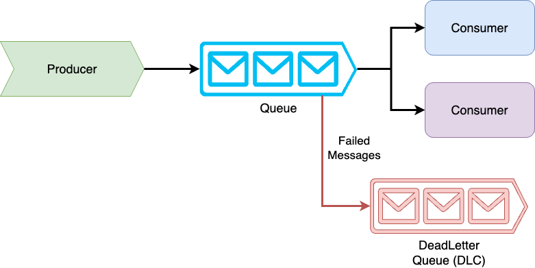

# 15


# Implementing Message Queuing

Message queuing, a pivotal tool in modern software systems, facilitates reliable, scalable, and resilient communication and coordination among applications. Whether you're managing a high-traffic e-commerce platform or orchestrating microservices in a complex distributed system, message queues are the backbone that ensures smooth operation, even when parts of the system are offline or under heavy load. In this chapter, we'll delve into the intriguing world of message queuing, exploring how .NET 8 and C# 12 empower you to leverage its power with elegance and efficiency.

We'll take a hands-on approach to implementing message queues, unraveling the technical magic that allows asynchronous communication between producers and consumers. From writing producers that generate messages to creating robust consumers who process them, you'll gain a deep understanding of the tools and techniques involved. Along the way, we'll also cover advanced topics such as error handling, acknowledgments, and performance optimization in detail, equipping you with the skills to build scalable, fault-tolerant systems. Let's queue up some knowledge and see how message queuing can transform your networked applications!

## Introduction to Message Queuing

Imagine a bustling city with delivery services crisscrossing the streets, each carefully routing packages to their destinations. In software systems, message queues play a similar role, acting as data couriers, ensuring messages are delivered reliably and efficiently between components. More than that, they are the guardians of a smooth flow of communication, even when the unexpected happens, like delays or system outages. This approach allows systems to function asynchronously, decoupling producers and consumers. In this section, we'll explore the foundational concepts of message queuing and why it has become a cornerstone of modern network programming.

By diving into the core principles of message queues, you'll learn how they facilitate scalable and resilient communication. We'll cover key concepts such as message producers and consumers and the different patterns they follow—whether it's a simple point-to-point model or a publish-subscribe architecture. Through practical examples that you can relate to in your everyday life, we'll set the stage for understanding how message queues empower you to build robust and responsive systems. Let's unpack the fundamentals of message queuing and prepare to take the next step into implementation.

### Core Concepts of Message Queuing

At the heart of message queuing lies a simple yet powerful concept: **producers** create messages, **queues** store them temporarily, and **consumers** retrieve and process them. This straightforward model allows systems to communicate asynchronously, ensuring that producers and consumers operate independently. Message queues decouple system components by separating the creation of messages from their consumption, reducing complexity and increasing reliability. This subsection will break down these fundamental concepts to understand how message queuing works behind the scenes.



<figcaption align = "center"><b>Message Queue Architecture Overview</b></figcaption>

A **message** is the fundamental unit of transmitted data, often formatted as JSON, XML, or binary. It can represent anything from a user's order in an e-commerce system to a notification about a completed task. Queues, on the other hand, serve as the holding area where messages wait to be processed. In many implementations, these queues operate on a first-in, first-out (FIFO) basis, ensuring messages are processed in the order they were sent. However, advanced patterns allow for flexibility, such as prioritizing or distributing specific messages across multiple consumers.

The interaction between producers and consumers defines the behavior of a message queue. A [**point-to-point**](https://go.particular.net/point-to-point) model pairs a single producer with a single consumer, ideal for tasks like job processing. In contrast, a [**publish-subscribe**](https://go.particular.net/publish-subscribe) model enables one producer to broadcast messages to multiple subscribers, perfect for scenarios like sending real-time notifications to users. These core patterns empower developers to design robust communication systems tailored to their application's needs. By mastering these foundational concepts, you'll be ready to tackle more advanced topics and see how message queues bring order to the chaos of modern distributed systems.

### The Role of Message Queues in Modern Applications

In the dynamic world of modern software, where systems span continents and services operate at massive scales, ensuring reliable and efficient communication is both an art and a science. This is where message queues step in, providing a structured mechanism to handle asynchronous communication between applications. Rather than forcing components to interact in real-time, which can create bottlenecks and fragile dependencies, message queues allow systems to exchange information seamlessly, even when parts of the system are unavailable or under heavy load.

At their core, message queues act as intermediaries, enabling producers to send messages without worrying about when or how consumers will process them. This decoupling is invaluable in scenarios like processing customer orders in an e-commerce platform, where a sudden spike in traffic could overwhelm synchronous systems. By queuing messages for later processing, systems gain resilience, maintain performance, and handle demand gracefully. Whether used for load balancing, task delegation, or system-to-system communication, message queues ensure that nothing falls through the cracks, even in high-stakes environments.

Beyond reliability, message queues unlock scalability. Need to handle more messages? Add more consumers. Want to implement a new feature? Introduce another producer or subscriber without disrupting the entire system. This flexibility makes message queues essential for microservices, serverless architectures, and other distributed systems. As we explore the role of message queues in modern applications, you’ll see how they act as the glue binding complex systems together—ensuring they perform smoothly, scale effectively, and stay resilient in the face of challenges.

### Exploring Use Cases for Message Queuing

Message queues shine brightest in real-world scenarios where asynchronous communication and system decoupling are crucial. Consider an **e-commerce platform** processing thousands of orders during a flash sale. Instead of making the checkout process wait for inventory checks, payment processing, and order fulfillment to complete, the system uses a message queue. Each step generates a message placed in a queue for later processing, ensuring that customers experience a fast and seamless checkout. At the same time, the backend works methodically in the background.

Another compelling use case is **event-driven systems** like real-time notification services. When a social media user posts a photo, the application generates multiple events: notifying followers, updating feeds, and logging analytics. A publish-subscribe message queue handles this elegantly, allowing one producer (the photo post-event) to notify multiple subscribers (e.g., the feed service, notification system, and analytics processor). This ensures all systems are updated efficiently without overloading the producer.

Message queues are indispensable in the realm of **IoT devices**. Devices like smart thermostats and sensors continuously generate data at unpredictable rates. A message queue buffers this incoming data, ensuring reliable delivery to analytics services, even during a temporary network outage. This emphasis on reliable delivery ensures smooth operation and allows systems to scale, adding more consumers to process data as demand grows. Message queues demonstrate their versatility and critical role in building robust, scalable, and future-proof systems by enabling such diverse applications.

## Exploring Message Queue Technologies

Message queues are not a one-size-fits-all solution—different applications require different tools, and the ecosystem of message queuing technologies offers a variety of options to meet diverse needs. Each technology brings unique strengths, from lightweight, open-source solutions to enterprise-grade, cloud-native services. Understanding the available technologies is crucial in designing the optimal solution, whether you're handling high-throughput data streams, building scalable microservices, or enabling asynchronous workflows in legacy systems.

In this section, we'll explore the leading message queuing platforms, including RabbitMQ, Apache Kafka, Azure Service Bus, and Amazon SQS. By examining their features, strengths, and trade-offs, you'll gain insight into which tool best suits specific scenarios. We'll also discuss how these technologies integrate with .NET and C#, ensuring you have the knowledge and tools to choose and implement the right message queue for your application's needs. Let's dive into the technology landscape and discover how these platforms can elevate your network programming projects.

### Overview of Message Queue Technologies

The world of message queues is remarkably diverse, offering a range of tools that can be tailored to different scales, architectures, and performance requirements. This adaptability is a key feature of every message queuing technology, enabling asynchronous communication at its core. The methods and features they provide may vary widely, but the assurance of adaptability remains constant. Some platforms excel at handling massive, real-time event streams, while others focus on simplicity and reliability for smaller, more predictable workloads. Choosing the right tool starts with understanding the broad categories of message queuing systems and what sets them apart.

Open-source solutions like **RabbitMQ** and **Apache Kafka** lead the pack for self-managed deployments. RabbitMQ is the Swiss Army knife of message queuing, offering flexibility with AMQP-based communication, support for various exchange types, and plugins for extending functionality. On the other hand, Kafka is a true powerhouse in the world of event streaming. It is designed for ultra-high throughput and durability, often favored in big data and analytics-driven applications. Both platforms integrate seamlessly with .NET, allowing developers to build robust messaging solutions with fine-grained control.

For those who prefer managed services, cloud-native message queues like **Azure Service Bus** and **Amazon SQS** offer powerful messaging capabilities without the operational overhead. Azure Service Bus, for instance, provides advanced features like dead-letter queues, message sessions, and hybrid cloud connectivity, making it an ideal choice for enterprise applications. Amazon SQS, known for its simplicity, handles large-scale, distributed messaging with minimal setup. Both services come with SDKs for .NET, enabling developers to quickly integrate these tools into their applications. As we delve deeper into these technologies, you’ll see how each can address specific use cases and seamlessly fit into your network programming projects.

### Popular Message Queue Platforms

The landscape of popular message queue platforms offers a range of solutions tailored to meet the diverse needs of modern applications. From open-source powerhouses to cloud-native managed services, these platforms provide developers with the tools to build scalable, reliable, and efficient messaging systems. Let’s dive into some of the most widely used options, highlighting their unique features and capabilities and exploring how they can enhance your .NET and C# network programming projects.

#### RabbitMQ: The Versatile Contender

RabbitMQ, a standard of flexibility, is one of the most widely adopted open-source message brokers. Its foundation on the AMQP protocol allows it to support a diverse array of messaging patterns, from point-to-point to publish-subscribe and routing-based exchanges. With plugins for monitoring, high availability, and federation, RabbitMQ is a versatile tool that can handle a wide range of workloads. Its seamless integration with .NET, providing a robust, developer-friendly library for producing and consuming messages, further enhances its appeal. The lightweight design of RabbitMQ makes it an ideal choice for applications spanning from microservices to IoT systems.

#### Apache Kafka: The Event Streaming Powerhouse

If you’re dealing with massive volumes of real-time data, Apache Kafka is the platform of choice. Designed for high throughput and low latency, Kafka shines in event streaming, log aggregation, and big data applications. Unlike traditional message brokers, Kafka treats messages as durable logs, allowing consumers to replay them as needed. Its distributed architecture ensures fault tolerance and scalability. The .NET Kafka client libraries make producing and consuming streams straightforward, giving developers an edge in building analytics-driven systems.

#### Azure Service Bus: The Enterprise Workhorse

For developers building enterprise-grade applications, Azure Service Bus offers a cloud-native messaging solution packed with features. It supports both queues and topics, making it versatile for different messaging patterns. Advanced capabilities like message sessions, dead-letter queues, and transaction support provide reliability and flexibility. With tight integration into the Azure ecosystem and a rich .NET SDK, Service Bus is a top choice for applications requiring high availability, security, and hybrid cloud connectivity.

#### Amazon SQS: Simplicity at Scale

Amazon SQS, with its minimalist approach, provides a fully managed, scalable queuing service that effortlessly handles millions of messages per second. This scalability, coupled with its seamless integration with AWS services, makes it an attractive option for large-scale distributed systems. While it may lack some advanced features compared to other platforms, its ease of use and the efficiency of incorporating it into your application with the AWS SDK for .NET make it a compelling choice.

Each platform offers distinct strengths, allowing you to choose the right tool for your specific requirements. Whether your focus is flexibility, event streaming, enterprise integration, or simplicity, the .NET ecosystem provides robust support and seamless integration for these popular message queue platforms, ensuring you have the tools you need to succeed.

### Comparison of Key Features

Empower yourself with a deep understanding of the key features and trade-offs when selecting the right message queue platform for your application. Each platform has its unique strengths and nuances, tailored to specific use cases. We’ll delve into popular message queue technologies like RabbitMQ, Apache Kafka, Azure Service Bus, and Amazon SQS, comparing them based on critical factors such as delivery guarantees, scalability, and integration. By the end, you’ll be equipped with the knowledge to align the right tool with your application’s needs, feeling informed and empowered.

#### Delivery Guarantees: Getting the Message Across

Message queues are the bedrock of reliable communication, and the delivery guarantees they offer— at-most-once, at-least-once, or exactly-once —can vary. RabbitMQ provides flexibility with acknowledgment modes, allowing you to balance reliability with performance. Apache Kafka offers at-least-once delivery by default but can achieve exactly once semantics for stream processing with careful configuration. Azure Service Bus takes it further with native support for exactly-once delivery in transactional messaging, a boon for enterprise applications. Meanwhile, Amazon SQS provides robust at-least-once guarantees with minimal complexity, making it a reliable choice for high-throughput systems. This reliability should instill a sense of security and confidence in your choice of message queue platform.

#### Scalability and Performance: Handling the Heat

Regarding scalability, Apache Kafka is the heavyweight champion, designed to handle massive data streams across distributed clusters. RabbitMQ, while not as distributed as Kafka, supports horizontal scaling through clustering and federation, making it effective for many workloads. Azure Service Bus simplifies scaling with auto-scaling capabilities in the cloud, while Amazon SQS boasts nearly limitless throughput by dynamically distributing messages across its infrastructure. Each platform handles performance differently, so your choice will depend on whether you prioritize sheer throughput, low latency, or ease of scaling.

#### Integration and Ecosystem: Plugging It All Together

Integration is a crucial aspect to consider when selecting a message queue, as it can significantly impact its suitability. RabbitMQ and Apache Kafka offer strong open-source ecosystems and seamless .NET libraries, making them flexible for diverse environments. Azure Service Bus integrates tightly with the Azure ecosystem, offering first-class support for hybrid cloud scenarios and enterprise solutions. Amazon SQS stands out for its effortless connection to AWS services, which is ideal for building cloud-native applications with minimal setup. For .NET developers, all platforms provide robust SDKs, enabling smooth integration into your applications. Understanding the importance of integration will ensure you make an informed decision when choosing a message queue platform.

Choosing a message queue is about finding the right balance of features for your specific needs. Whether you need Kafka’s raw power, RabbitMQ’s versatility, Azure Service Bus’s enterprise-grade reliability, or Amazon SQS’s simplicity at scale, the .NET ecosystem ensures you can implement your choice confidently and precisely.

## Implementing a Message Queue in C#

While WebHooks excel at delivering real-time notifications from one service to another, they rely on the availability of both sender and receiver at the exact moment the event occurs. But what happens when the receiver is temporarily offline or overwhelmed by a flood of incoming events? This is where message queues act as the unsung heroes of asynchronous communication, providing a buffer to ensure no event is lost and systems operate smoothly under pressure.

In this section, we’ll explore how to implement message queuing in .NET using C#, bridging the gap between transient WebHook notifications and durable, scalable processing pipelines. You can decouple these components by introducing a message queue between your WebHook sender and consumer, allowing them to work at their own pace. This ensures that notifications from your WebHooks are reliably captured and processed, even in high-load or failure scenarios.

From creating a producer to send WebHook data to a queue to building a consumer that processes these messages efficiently, we’ll guide you step-by-step through implementing a robust message queuing solution. Along the way, you’ll learn about handling message acknowledgments, retry mechanisms, and error handling to ensure that your system doesn’t just survive but thrives under real-world conditions. It’s time to level up your WebHook-driven applications by introducing the power and reliability of message queues.

### Setting Up the Environment

To begin working with message queues in .NET, you’ll need a properly configured environment to produce and consume messages seamlessly. Setting up your .NET solution is the first step, whether using RabbitMQ, Azure Service Bus, or another platform. In this example, we’ll focus on RabbitMQ as our queue provider, leveraging its popularity and extensive .NET support.

First, ensure RabbitMQ is running. You can use Docker to spin up an instance for local development quickly. Open your terminal and run the following command:

```Bash
docker run -d --hostname rabbitmq-host --name rabbitmq -p 5672:5672 -p 15672:15672 rabbitmq:3-management
```

This starts RabbitMQ with the management interface available at `http://localhost:15672`. Use the default credentials (`guest`/`guest`) to log in. Now, let’s set up the .NET solution.

Create a new .NET console application:

```Bash
dotnet new console -n MessageQueueDemo
cd MessageQueueDemo
dotnet add package RabbitMQ.Client
```

Next, initialize the message producer. In your `Program.cs` file, start by establishing a connection to RabbitMQ and sending a test message:

```C#
using RabbitMQ.Client;
using System.Text;

var factory = new ConnectionFactory() { HostName = "localhost" };
using var connection = factory.CreateConnection();
using var channel = connection.CreateModel();

channel.QueueDeclare(queue: "demo-queue", durable: false, exclusive: false, autoDelete: false, arguments: null);

string message = "Hello, RabbitMQ!";
var body = Encoding.UTF8.GetBytes(message);

channel.BasicPublish(exchange: "", routingKey: "demo-queue", basicProperties: null, body: body);

Console.WriteLine($"[x] Sent '{message}'");
```

Run the application to verify that the message is sent successfully. Now, let’s set up the consumer. Add another console application to your solution, or modify the existing one:

```C#
using RabbitMQ.Client;
using RabbitMQ.Client.Events;
using System.Text;

var factory = new ConnectionFactory() { HostName = "localhost" };
using var connection = factory.CreateConnection();
using var channel = connection.CreateModel();

channel.QueueDeclare(queue: "demo-queue", durable: false, exclusive: false, autoDelete: false, arguments: null);

var consumer = new EventingBasicConsumer(channel);
consumer.Received += (model, ea) =>
{
    var body = ea.Body.ToArray();
    var message = Encoding.UTF8.GetString(body);
    Console.WriteLine($"[x] Received '{message}'");
};

channel.BasicConsume(queue: "demo-queue", autoAck: true, consumer: consumer);

Console.WriteLine("Press [enter] to exit.");
Console.ReadLine();
```

This consumer listens for messages on the `demo-queue` and prints them to the console. Run both applications simultaneously: the producer will send messages, and the consumer will receive them.

This basic setup gives you a working message queue pipeline in .NET. You’re now ready to build on this foundation by implementing more advanced features such as error handling, acknowledgments, and scaling.

### Creating a Message Producer

With your environment set up, the next step is to design a component responsible for sending messages to the queue. This involves creating a producer that not only establishes a connection to the message queue and prepares the message payload, but also plays a crucial role in ensuring reliable communication within your distributed system. This foundational piece is key to the stability of your system.

Start by creating a new service class for the producer. This step is not just about encapsulating the logic, but also about making it highly reusable and easily testable. In your project, add a file named `MessageProducer.cs`:

```C#
using RabbitMQ.Client;
using System.Text;

public class MessageProducer
{
    private readonly string _queueName;
    private readonly IConnection _connection;
    private readonly IModel _channel;

    public MessageProducer(string queueName, string hostName = "localhost")
    {
        _queueName = queueName;
        var factory = new ConnectionFactory { HostName = hostName };
        _connection = factory.CreateConnection();
        _channel = _connection.CreateModel();

        _channel.QueueDeclare(
            queue: _queueName,
            durable: false,
            exclusive: false,
            autoDelete: false,
            arguments: null
        );
    }

    public void SendMessage(string message)
    {
        var body = Encoding.UTF8.GetBytes(message);
        _channel.BasicPublish(exchange: "", routingKey: _queueName, basicProperties: null, body: body);
        Console.WriteLine($"[x] Sent: {message}");
    }

    public void Dispose()
    {
        _channel.Close();
        _connection.Close();
    }
}
```

This class encapsulates the connection setup and provides a method for sending messages. The `SendMessage` method takes a string, converts it to bytes, and publishes it to the queue specified in the constructor.

Next, use this class in your application to produce messages. Update your `Program.cs` to include the following:

```C#
using System;

class Program
{
    static void Main()
    {
        const string queueName = "demo-queue";

        using var producer = new MessageProducer(queueName);
        while (true)
        {
            Console.Write("Enter a message to send (or type 'exit' to quit): ");
            var message = Console.ReadLine();

            if (string.IsNullOrEmpty(message) || message.ToLower() == "exit")
                break;

            producer.SendMessage(message);
        }

        Console.WriteLine("Producer terminated.");
    }
}
```

This implementation offers a flexible interactive message production system, empowering you to test different payloads dynamically. Run the program, type messages into the console, and observe them being sent to the queue.

Remember, resource management is key. The `Dispose` method in `MessageProducer` ensures that connections and channels are closed cleanly, preventing resource leaks. This responsibility is especially important in high-throughput applications where connections may be long-lived or reused.

This setup provides you with a robust producer, instilling confidence in its ability to handle message publishing in your queueing system. Next, you’ll learn how to design the corresponding component to consume these messages, bringing the entire pipeline to life.

### Building a Message Consumer

With a producer in place to send messages to the queue, the next step is building the counterpart that retrieves and processes those messages. This component is crucial for transforming queued data into actionable outcomes within your application. Designing a robust consumer ensures messages are handled efficiently and reliably, even in high-throughput or error-prone environments.

Begin by creating a service class to encapsulate the consumer logic. Add a file named `MessageConsumer.cs` to your project:

```C#
using RabbitMQ.Client;
using RabbitMQ.Client.Events;
using System.Text;

public class MessageConsumer
{
    private readonly string _queueName;
    private readonly IConnection _connection;
    private readonly IModel _channel;

    public MessageConsumer(string queueName, string hostName = "localhost")
    {
        _queueName = queueName;
        var factory = new ConnectionFactory { HostName = hostName };
        _connection = factory.CreateConnection();
        _channel = _connection.CreateModel();

        _channel.QueueDeclare(
            queue: _queueName,
            durable: false,
            exclusive: false,
            autoDelete: false,
            arguments: null
        );
    }

    public void StartListening()
    {
        var consumer = new EventingBasicConsumer(_channel);
        consumer.Received += (model, eventArgs) =>
        {
            var body = eventArgs.Body.ToArray();
            var message = Encoding.UTF8.GetString(body);
            Console.WriteLine($"[x] Received: {message}");

            // Simulate message processing
            ProcessMessage(message);
        };

        _channel.BasicConsume(
            queue: _queueName,
            autoAck: true,
            consumer: consumer
        );

        Console.WriteLine("Listening for messages. Press [Enter] to exit.");
        Console.ReadLine();
    }

    private void ProcessMessage(string message)
    {
        Console.WriteLine($"[✓] Processed: {message}");
    }

    public void Dispose()
    {
        _channel.Close();
        _connection.Close();
    }
}
```

This class creates a listener for the queue and processes each message as it arrives. The `StartListening` method, which is responsible for setting up a consumer, attaching an event handler for message reception, and beginning the consumption of messages, plays a crucial role in this process.

Next, easily integrate this consumer into your application by updating `Program.cs` or creating a dedicated console application for consuming messages:

```C#
using System;

class Program
{
    static void Main()
    {
        const string queueName = "demo-queue";

        using var consumer = new MessageConsumer(queueName);
        consumer.StartListening();

        Console.WriteLine("Consumer terminated.");
    }
}
```

Run this program, and the consumer will print each received message to the console. Pair it with your producer from the previous section to test the complete message pipeline.

This implementation includes a placeholder for processing logic inside the ProcessMessage method. It's a blank canvas waiting for your application-specific logic, whether it's saving data to a database or triggering workflows. The power is in your hands.

Handling message processing errors is not just important, it's a responsibility. If a message fails processing, it's crucial to consider logging the error and moving it to a dead-letter queue for later review. The next section will delve deeper into this proactive approach to error handling.

With your consumer in place, you now have a complete pipeline: a producer sends messages to the queue, and the consumer retrieves and processes them. From here, you can optimize performance by tuning the message processing logic, implementing error handling, and scaling both components by adding more instances or using more powerful hardware to meet your application's needs.

### Handling Acknowledgments and Errors

Processing messages reliably requires more than retrieving and acting on them; it also involves managing acknowledgments and handling errors effectively. Proper acknowledgment handling can prevent your system from losing critical messages or processing them multiple times. Likewise, a robust error-handling strategy, such as implementing retry mechanisms or dead-letter queues, ensures that failures don’t disrupt the entire pipeline.

By default, some message queues, like RabbitMQ, use an **auto-acknowledge** mode where messages are marked as processed as soon as they are delivered to the consumer. While simple, this mode is risky because a consumer crash before completing the processing could result in lost messages. To address this, consider the benefits of switching to manual acknowledgments. This approach ensures that messages are only marked as processed after successful handling, providing a higher level of control and reducing the risk of lost messages.

Your role in this process is crucial. Start by modifying the consumer to enable manual acknowledgments. Update the `BasicConsume` method in your `MessageConsumer` class:

```C#
_channel.BasicConsume(
    queue: _queueName,
    autoAck: false, // Disable automatic acknowledgment
    consumer: consumer
);
```

Next, modify the `Received` event handler to send an acknowledgment after processing a message:

```C#
consumer.Received += (model, eventArgs) =>
{
    var body = eventArgs.Body.ToArray();
    var message = Encoding.UTF8.GetString(body);
    Console.WriteLine($"[x] Received: {message}");

    try
    {
        ProcessMessage(message);

        // Send acknowledgment only after successful processing
        _channel.BasicAck(deliveryTag: eventArgs.DeliveryTag, multiple: false);
        Console.WriteLine($"[✓] Acknowledged: {message}");
    }
    catch (Exception ex)
    {
        Console.WriteLine($"[!] Error processing message: {ex.Message}");
        
        // Reject the message and requeue for another attempt
        _channel.BasicNack(deliveryTag: eventArgs.DeliveryTag, multiple: false, requeue: true);
    }
};
```

In this implementation, messages are acknowledged only after successful processing. If an error occurs, the **BasicNack** method, a crucial tool in our system, rejects the message and requests a retry. This approach ensures reliability but can lead to repeated failures if a message is inherently problematic.

To avoid endlessly reprocessing faulty messages, our system is equipped with a **dead-letter queue (DLQ)** to handle problematic messages. Dead-letter queues, a key feature of our system, capture messages that exceed a retry limit or encounter unrecoverable errors, allowing them to be analyzed separately. When declaring your queue, specify DLQ settings in the arguments:

```C#
_channel.QueueDeclare(
    queue: _queueName,
    durable: false,
    exclusive: false,
    autoDelete: false,
    arguments: new Dictionary<string, object>
    {
        { "x-dead-letter-exchange", "" },
        { "x-dead-letter-routing-key", "dead-letter-queue" }
    }
);

_channel.QueueDeclare(
    queue: "dead-letter-queue",
    durable: false,
    exclusive: false,
    autoDelete: false,
    arguments: null
);
```

Now, any message that fails multiple times will automatically be routed to the `dead-letter-queue`, a special queue where such messages are stored for further analysis, preventing further disruption to your main queue.

Finally, ensure that error handling includes appropriate logging and monitoring. For example, you can log errors to a file, database, or external service for tracking and analysis. This practice not only helps identify patterns in failures but also empowers you with knowledge to improve your system's resilience over time.

By implementing manual acknowledgments, dead-letter queues, and error logging, you ensure your message queue can handle failures gracefully while maintaining data integrity. These strategies are crucial in preparing your application for real-world scenarios, where reliability and resilience are non-negotiable. This preparation should make you feel more secure and confident in your system's capabilities.

### Testing and Deploying the Message Queue Solution

Ensuring your message queue solution is ready for production requires thorough testing and a carefully planned deployment process. Testing validates that producers and consumers function as intended, while deployment ensures the system is robust and scalable under real-world conditions. A well-tested and properly deployed message queue solution is crucial as it minimizes the risk of data loss, system crashes, or performance bottlenecks. Not doing so could lead to severe consequences, underlining the urgency and importance of your role.

#### Unit Testing the Producer and Consumer

Unit testing starts by isolating the producer and consumer logic. Mock the message queue connection to verify that your code behaves as expected without relying on an actual queue. For instance, testing the producer’s message-sending logic might look like this:

```C#
using Moq;
using Xunit;

public class MessageProducerTests
{
    [Fact]
    public void SendMessage_ShouldPublishMessageToQueue()
    {
        var mockChannel = new Mock<IModel>();
        var producer = new MessageProducer("test-queue", mockChannel.Object);

        producer.SendMessage("Test Message");

        mockChannel.Verify(
            c => c.BasicPublish(
                exchange: "",
                routingKey: "test-queue",
                basicProperties: null,
                body: It.IsAny<byte[]>()
            ),
            Times.Once
        );
    }
}
```

Similarly, for the consumer, mock the message receipt and validate that the message is processed as expected:

```C#
[Fact]
public void Consumer_ShouldProcessReceivedMessage()
{
    var mockChannel = new Mock<IModel>();
    var consumer = new MessageConsumer("test-queue", mockChannel.Object);

    var args = new BasicDeliverEventArgs
    {
        Body = Encoding.UTF8.GetBytes("Test Message")
    };

    consumer.OnMessageReceived(args);

    Assert.True(consumer.LastProcessedMessage == "Test Message");
}
```

#### Integration Testing with a Live Queue

Integration tests validate that your producer and consumer interact correctly with a real message queue. Use Docker to spin up a RabbitMQ instance for a controlled test environment:

```Bash
docker run -d --hostname test-rabbit --name test-rabbit -p 5672:5672 -p 15672:15672 rabbitmq:3-management
```

Create a test scenario where the producer sends messages, and the consumer processes them, ensuring end-to-end functionality:

```C#
[Fact]
public async Task EndToEndTest_ShouldProcessMessage()
{
    var producer = new MessageProducer("integration-queue");
    var consumer = new MessageConsumer("integration-queue");

    producer.SendMessage("Integration Test Message");

    await Task.Delay(1000); // Allow time for the consumer to process

    Assert.True(consumer.LastProcessedMessage == "Integration Test Message");
}
```

#### Performance and Load Testing

Before deploying, stress-test your solution to verify it can handle the expected message volume. Tools like Apache JMeter or custom scripts can simulate high loads. For example, modify the producer to send a batch of messages and measure throughput:

```C#
for (int i = 0; i < 1000; i++)
{
    producer.SendMessage($"Message {i}");
}
```

Monitor the queue's performance and observe metrics like message latency and processing rate to identify bottlenecks.

#### Deployment to Production

For production deployment, ensure that your message queue infrastructure is robust. Use managed services like Azure Service Bus or a container orchestration platform like Kubernetes for RabbitMQ. Configuration settings such as queue durability, prefetch limits, and retry policies should be tailored to your workload. Queue durability ensures that messages are not lost even in the event of a system failure, prefetch limits control the number of messages a consumer can fetch at a time, and retry policies determine how failed messages are handled.

#### Monitoring and Logging

Integrate monitoring tools to keep track of queue health. Tools like Prometheus and Grafana or built-in cloud service dashboards help detect anomalies early. Moreover, structured logging for message processing ensures transparency and confidence in the system's operations:

```C#
_logger.LogInformation("Message processed: {MessageId}", message.Id);
```

This makes debugging and system audits much more manageable.

#### Post-Deployment Validation

As a key player in the deployment process, your role is crucial. After deployment, it's essential to validate the system under real-world conditions. Ensure that messages flow correctly and no errors occur. Use canary deployments or phased rollouts to minimize risk.

With rigorous testing and a structured deployment process, your message queue solution will be ready to handle production traffic reliably. These practices ensure your system is scalable, maintainable, and resilient against unexpected failures, giving you the confidence in its performance.

## Advanced Topics in Message Queuing

As your applications become complex, your message queuing infrastructure demands will scale alongside them. While foundational concepts like producers, consumers, and simple queue configurations are vital, they’re only the beginning. Advanced techniques in message queuing—such as ensuring reliable delivery, optimizing performance, and managing message flow with dead-letter queues—are not just theoretical concepts. They are essential tools that allow you to easily handle real-world challenges like fault tolerance, message prioritization, and scalability, thereby building robust, high-performing systems.

In this section, we’ll go beyond the basics, diving into strategies that elevate your message queuing implementation to production-grade excellence. From mastering delivery guarantees and implementing advanced error-handling mechanisms to optimizing throughput and scaling consumers dynamically, you’ll gain the tools to tackle even the most demanding scenarios. Just as WebHooks offer real-time responsiveness, advanced message queuing ensures asynchronous operations remain resilient and efficient—no matter how complex the system becomes. Let’s unlock the full potential of message queues and discover how they cannot only support but transform the backbone of your distributed architecture.

### Message Delivery Guarantees

Ensuring reliable message delivery is one of the cornerstones of building robust messaging systems. A critical aspect of message queuing involves defining the delivery guarantee model: at-most-once, at-least-once, or exactly-once. Each has its trade-offs, and the right choice depends on the specific requirements of your application. Understanding these guarantees and how to implement them in .NET gives you precise control over the reliability and performance of your system, instilling a sense of security and empowerment.

An at-most-once model delivers a message to a consumer without retries, even if processing fails. While this approach minimizes resource usage and latency, it risks message loss. Configuring RabbitMQ for this behavior involves setting `autoAck` (automatic acknowledgment) to `true`:

```C#
_channel.BasicConsume(
    queue: _queueName,
    autoAck: true,
    consumer: consumer
);
```

This setup, which is suitable for scenarios where occasional message loss is acceptable, such as real-time telemetry that doesn’t require historical accuracy, is a confident choice.

The at-least-once model, a reliable method that ensures messages are delivered at least once, even if retries are necessary, is a dependable approach. However, this reliability may lead to duplicate messages, requiring consumers to handle idempotency. For RabbitMQ, disable automatic acknowledgments and manually acknowledge messages after successful processing:

```C#
consumer.Received += (model, eventArgs) =>
{
    var body = eventArgs.Body.ToArray();
    var message = Encoding.UTF8.GetString(body);

    try
    {
        ProcessMessage(message);
        _channel.BasicAck(deliveryTag: eventArgs.DeliveryTag, multiple: false);
    }
    catch
    {
        _channel.BasicNack(deliveryTag: eventArgs.DeliveryTag, multiple: false, requeue: true);
    }
};
```

This approach works well for critical tasks like order processing or payment handling, where message loss is unacceptable but managing duplicates is a necessity.

The ultimate goal in message delivery guarantees, achieving exactly-once processing, is a complex task. It ensures that each message is processed precisely once, a feat that often necessitates a combination of transaction support and idempotent operations. Azure Service Bus plays a pivotal role in simplifying this intricate process with its support for sessions and transactions. Here’s an example of how Azure Service Bus achieves exactly-once processing:

```C#
var client = new ServiceBusClient("<connection-string>");
var processor = client.CreateProcessor("queue-name", new ServiceBusProcessorOptions());

processor.ProcessMessageAsync += async args =>
{
    var message = args.Message.Body.ToString();
    Console.WriteLine($"Processing message: {message}");

    // Idempotent processing logic here

    await args.CompleteMessageAsync(args.Message);
};

processor.ProcessErrorAsync += async args =>
{
    Console.WriteLine($"Error occurred: {args.Exception.Message}");
};

await processor.StartProcessingAsync();
```

With this setup, Azure Service Bus ensures that messages are completed only after successful processing, a crucial step in avoiding duplicates and guaranteeing reliability.

Delivery guarantees play a pivotal role in meeting specific application needs. The choice often involves balancing performance, reliability, and complexity. While at-most-once works for low-criticality tasks, at-least-once is often the default for its simplicity and flexibility. However, exactly-once ensures every message is handled precisely for applications with strict reliability requirements. By implementing these guarantees effectively, you can build systems that are flexible and adaptable, meeting your application's specific needs without compromising performance or data integrity.

### Optimizing Performance and Scalability

Building a high-performance and scalable message queuing system is not just a technical task, but a crucial one. It's essential for handling large volumes of messages while maintaining reliability. This requires optimizing message throughput, reducing latency, and ensuring the system scales seamlessly as demands grow. You can create a system that balances efficiency and robustness by fine-tuning both the queue infrastructure and your .NET implementation.

One effective way to improve throughput is by batching messages. Group them into batches instead of sending or processing messages individually to reduce overhead. RabbitMQ supports publishing messages in bulk, which can be implemented in your producer:

```C#
public void SendMessages(IEnumerable<string> messages)
{
    var batch = _channel.CreateBasicPublishBatch();

    foreach (var message in messages)
    {
        var body = Encoding.UTF8.GetBytes(message);
        batch.Add(exchange: "", routingKey: _queueName, mandatory: false, properties: null, body: body);
    }

    batch.Publish();
    Console.WriteLine($"[✓] Sent {messages.Count()} messages in batch.");
}
```

This approach minimizes the number of network roundtrips, significantly boosting performance.

On the consumer side, it's essential to enable prefetching to control how many messages are sent to a consumer at a time. By default, RabbitMQ sends as many messages as possible, which can overwhelm the consumer. Adjusting the `prefetch` value is a key step to ensure the consumer only processes a manageable number of messages concurrently:

```C#
_channel.BasicQos(prefetchSize: 0, prefetchCount: 10, global: false);
```

This setup is designed to prevent overload and ensure the stability of your system. By allowing the consumer to fetch messages in small, optimized batches, we can improve processing efficiency without compromising on system stability.

For scalability, you can empower your system by implementing horizontal scaling. This can be achieved by running multiple consumers in parallel, a strategy that effectively distributes the processing load across multiple instances. With the right tools like Kubernetes or cloud-based orchestration platforms, you can manage these instances dynamically based on demand, ensuring your system is always ready to handle increasing message volumes.

When working with Azure Service Bus, session-based processing can optimize scalability. Session-based processing is a technique where related messages are grouped together and processed in a sequence, ensuring session consistency. Use session-enabled queues and partition consumers to process messages in parallel while maintaining session consistency:

```C#
var client = new ServiceBusClient("<connection-string>");
var processor = client.CreateSessionProcessor("queue-name");

processor.ProcessMessageAsync += async args =>
{
    var message = args.Message.Body.ToString();
    Console.WriteLine($"Processing session message: {message}");
    await args.CompleteMessageAsync(args.Message);
};

await processor.StartProcessingAsync();
```

Session-based processing ensures scalability without sacrificing order guarantees for session-aware messages, which are messages that are part of a specific session and require a certain order of processing.

Lastly, performance metrics should be monitored to identify bottlenecks. Tools like Prometheus or cloud-native monitoring solutions are invaluable in this regard, allowing you to track metrics such as message latency, queue depth, and processing rate. Alerts on critical thresholds help you address issues proactively, instilling confidence in your ability to manage the system effectively.

With these optimizations, your message queuing system will handle high loads efficiently while maintaining scalability and reliability. These techniques ensure your system is ready for production-grade demands and poised to adapt to future growth.

### Securing Message Queues

Security is a critical consideration when designing a message queuing system. Your expertise in implementing authentication, encryption, and access control mechanisms is crucial. Without these safeguards, sensitive messages could be intercepted, tampered with, or misused. Your role in securing your queues ensures that only authorized parties can interact with your messaging infrastructure and that messages remain confidential and intact.

Start by enabling authentication to ensure only verified clients can connect to the queue. For RabbitMQ, you can configure user accounts with specific permissions. To update your RabbitMQ connection factory in .NET, you need to include the credentials in the connection string or use the appropriate methods to set the credentials programmatically:

```C#
var factory = new ConnectionFactory
{
    HostName = "localhost",
    UserName = "secureUser",
    Password = "strongPassword"
};
```

Use Azure Active Directory (AAD) or connection strings with Shared Access Signature (SAS) tokens for cloud-based services like Azure Service Bus. AAD integration allows fine-grained access control tied to Azure roles, while SAS tokens provide scoped and time-limited access:

```C#
var client = new ServiceBusClient("<connection-string-or-aad-token>");
```

Ensure connection strings are securely stored using tools like Azure Key Vault or .NET's built-in user secrets management. These tools provide a centralized and secure way to manage application secrets, reducing the risk of accidental exposure and simplifying the process of updating or rotating secrets.

Encryption is another vital layer of security. Use TLS (Transport Layer Security) to encrypt messages during transit. Most queuing systems, including RabbitMQ, enable TLS by default when configured. For example, you can require TLS in your .NET connection setup:

```C#
var factory = new ConnectionFactory
{
    HostName = "localhost",
    Port = 5671, // TLS port
    Ssl = new SslOption
    {
        Enabled = true,
        ServerName = "your-server",
        AcceptablePolicyErrors = SslPolicyErrors.RemoteCertificateNameMismatch
    }
};
```

For message encryption at rest, cloud services like Azure Service Bus handle this automatically using managed keys. For self-hosted solutions, consider encrypting message payloads manually before sending them:

```C#
public string EncryptMessage(string plainText, string key)
{
    using var aes = Aes.Create();
    aes.Key = Encoding.UTF8.GetBytes(key);
    aes.GenerateIV();
    var encryptor = aes.CreateEncryptor(aes.Key, aes.IV);

    using var ms = new MemoryStream();
    using (var cs = new CryptoStream(ms, encryptor, CryptoStreamMode.Write))
    using (var writer = new StreamWriter(cs))
    {
        writer.Write(plainText);
    }

    return Convert.ToBase64String(ms.ToArray());
}
```

Emphasizing its crucial role, role-based access control (RBAC) should be implemented to restrict queue operations. For RabbitMQ, assign specific users permissions such as read, write, and configure. For Azure Service Bus, assign roles like Sender, Receiver, or Owner to user identities or service principals.

It's crucial to maintain a vigilant eye on your message queuing infrastructure for unauthorized access attempts and anomalies. Tools like RabbitMQ Management or Azure Monitor can provide insights into who accessed your queues and when. Enable logging for authentication failures or suspicious activities.

Securing your message queues requires a robust and comprehensive layered approach combining authentication, encryption, access control, and monitoring. Implementing these practices not only protects your system from threats but also ensures that legitimate communication remains uninterrupted and trustworthy.

## Performance Optimization and Best Practices

As message queues take center stage in your distributed architecture, efficiency becomes paramount. While a basic setup may suffice for small workloads, scaling to enterprise-level systems or handling high-throughput scenarios (such as real-time analytics or high-frequency trading) demands optimization. Fine-tuning your message queuing solution boosts performance and ensures the system remains reliable, responsive, and cost-effective under increasing loads. It’s the difference between a system that survives and one that thrives in the face of growing demands.

In this section, we’ll explore techniques to unlock the full potential of your message queuing solution. From optimizing throughput with batching and prefetching to scaling consumers dynamically and implementing robust monitoring, these best practices help you create a system that’s not just fast but also resilient and maintainable. By building on the foundational knowledge of message queuing, you’ll be equipped to design systems that meet today’s challenges and are ready to adapt to tomorrow’s opportunities. Let’s dive in and supercharge your messaging pipeline.

### Improving Throughput and Latency

Maximizing throughput and minimizing latency is not just important, it's critical for high-performance messaging systems, especially when handling large message volumes or time-sensitive data. The key lies in optimizing how messages are sent, processed, and acknowledged, ensuring the system operates efficiently without sacrificing reliability. You can significantly improve performance while maintaining responsiveness by leveraging batching, asynchronous processing, and connection pooling.

Batching messages, a powerful technique, is one of the most effective ways to boost throughput. Instead of processing messages individually, you can send or receive them in groups, reducing the overhead associated with network roundtrips. Here’s an example of batching messages in a producer:

```C#
public void SendMessagesBatch(IEnumerable<string> messages)
{
    var batch = _channel.CreateBasicPublishBatch();

    foreach (var message in messages)
    {
        var body = Encoding.UTF8.GetBytes(message);
        batch.Add(exchange: "", routingKey: "queue-name", mandatory: false, properties: null, body: body);
    }

    batch.Publish();
    Console.WriteLine($"[✓] Sent batch of {messages.Count()} messages.");
}
```

This approach reduces the number of operations per message, improving overall throughput.

Asynchronous processing is another essential optimization. By leveraging asynchronous consumers, your application can process multiple messages simultaneously, reducing latency. Here’s how to implement an asynchronous consumer in RabbitMQ:

```C#
consumer.Received += async (model, eventArgs) =>
{
    var body = eventArgs.Body.ToArray();
    var message = Encoding.UTF8.GetString(body);

    await Task.Run(() =>
    {
        ProcessMessage(message); // Simulate processing
        Console.WriteLine($"[✓] Processed: {message}");
    });

    _channel.BasicAck(deliveryTag: eventArgs.DeliveryTag, multiple: false);
};
```

This setup ensures the consumer doesn’t block while waiting for each message to complete processing. The result is a significant improvement in both throughput and responsiveness, enhancing the overall performance of the application.

Connection pooling is another best practice, particularly in high-throughput scenarios where the inefficiency of creating new connections for every operation is evident. In .NET, you can confidently use a shared connection and channel for multiple operations, ensuring efficiency and optimal performance:

```C#
private readonly IConnection _connection;
private readonly IModel _channel;

public MessagingService(string hostName)
{
    var factory = new ConnectionFactory { HostName = hostName };
    _connection = factory.CreateConnection();
    _channel = _connection.CreateModel();
}
```

Reusing connections and channels is a key strategy that minimizes the overhead of establishing new connections, making your cloud-based messaging system more efficient and resourceful.

Finally, monitor queue depth and message age to ensure your optimizations are effective. If latency remains high, consider adjusting consumer prefetch limits or adding more consumers to distribute the load. For example:

```C#
_channel.BasicQos(prefetchSize: 0, prefetchCount: 20, global: false);
```

This configuration allows the consumer to process messages in manageable batches, improving efficiency by preventing the system from being overwhelmed, which can lead to performance degradation or even system crashes.

By implementing these optimizations, you’ll create a message queuing system that handles large workloads efficiently and responds to real-time demands with minimal delay. These strategies provide the foundation for scaling and maintaining performance as your application grows, ensuring a reliable and responsive system.

### Scaling Message Queuing Systems

Scaling message queuing systems is essential for handling growing workloads and ensuring consistent performance under heavy demand. A scalable system adjusts seamlessly to increased message volumes by distributing the load across multiple consumers or even multiple queues. You can build a robust message queuing infrastructure capable of handling enterprise-level traffic by implementing horizontal scaling, partitioning, and load-balancing strategies.

Horizontal scaling is the simplest and most common approach to scaling message queues. By increasing the number of consumers, you distribute the processing load across multiple instances, ensuring no single consumer becomes a bottleneck. For example, in RabbitMQ, multiple consumers can listen to the same queue, each processing a subset of messages:

```C#
var consumer = new EventingBasicConsumer(_channel);
consumer.Received += (model, eventArgs) =>
{
    var body = eventArgs.Body.ToArray();
    var message = Encoding.UTF8.GetString(body);

    ProcessMessage(message);
    _channel.BasicAck(eventArgs.DeliveryTag, multiple: false);
};

_channel.BasicConsume(queue: "task-queue", autoAck: false, consumer: consumer);
Console.WriteLine("Consumer instance ready to process messages.");
```

Deploy multiple instances of this consumer application on separate machines or containers managed by Kubernetes or Docker Swarm. With this setup, RabbitMQ distributes messages across all active consumers.

Partitioning queues is another effective scaling strategy. Instead of using a single queue, divide the workload across multiple queues based on criteria like message type, priority, or geographic region. Dedicated consumers can then process each queue:

```C#
_channel.QueueDeclare(queue: "priority-queue", durable: true, exclusive: false, autoDelete: false);
_channel.QueueDeclare(queue: "standard-queue", durable: true, exclusive: false, autoDelete: false);
```

Assign consumers to each queue based on their processing requirements, such as handling critical tasks from the `priority-queue` (e.g., financial transactions) while standard messages (e.g., user notifications) are processed separately.

For cloud-based systems like Azure Service Bus, scaling is simplified through features like auto-scaling and partitioned queues. Partitioned queues automatically distribute messages across multiple brokers, enhancing scalability and fault tolerance. To use a partitioned queue, configure it during creation:

```C#
var client = new ServiceBusClient("<connection-string>");
await client.CreateQueueAsync(new CreateQueueOptions("partitioned-queue") { EnablePartitioning = true });
```

Dynamic scaling, a pivotal aspect, is crucial for managing growing workloads. Use monitoring tools to track metrics like queue depth and message latency and automatically scale consumers or adjust queue configurations as needed. For example, you can define Horizontal Pod Autoscaler (HPA) rules with Kubernetes to scale consumers based on CPU usage or queue length. This feature is not just beneficial, but urgent for your system's performance.

Load balancing, a key feature, ensures that messages are evenly distributed across consumers, thereby optimizing your system's performance. RabbitMQ handles this automatically for queues, but you’ll need to manage consumer groups in systems like Kafka. Each consumer in a group processes a distinct partition, ensuring parallelism without duplication.

Effectively scaling your message queuing system requires a combination of horizontal scaling, queue partitioning, and load balancing strategies tailored to your specific application needs. These needs could include high message throughput, low latency, or specific resource constraints. By implementing these techniques, your system will remain responsive, efficient, and ready to handle even the most demanding workloads.
