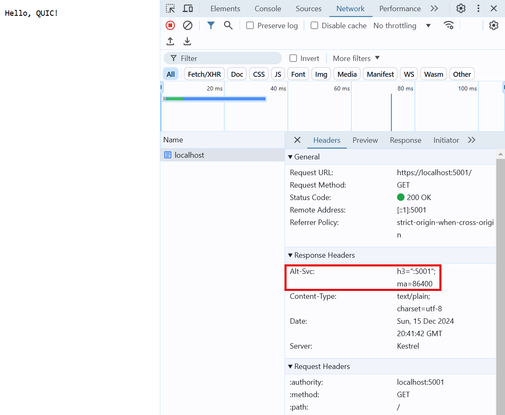
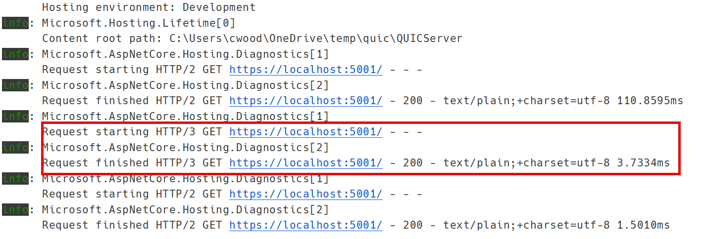
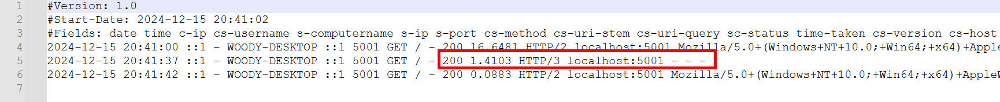

# 17


# Looking to the Future with QUIC

The evolution of network protocols has always been driven by the need to address new challenges and leverage emerging opportunities. As the internet has become more central to daily life, traditional protocols like TCP have shown their age, struggling to meet the demands of modern applications. Enter QUIC, a next-generation protocol designed to tackle these limitations head-on. By combining the best aspects of existing technologies with forward-looking innovations, QUIC is poised to redefine how data is transmitted across the web.

At its core, QUIC was created to address issues like latency, head-of-line blocking, and connection interruptions, which are common pain points in current networking architectures. By building on UDP and integrating features like encryption, multiplexing, and connection migration, QUIC offers a more robust and efficient alternative. These capabilities are not just theoretical improvements—they have been proven in real-world scenarios, with major platforms like Google and Cloudflare adopting QUIC to enhance performance and reliability.

As we delve deeper into the world of QUIC, this chapter will explore its foundational concepts, key features, and why it matters to developers. From understanding its technical innovations to appreciating its practical applications, you’ll gain insight into how QUIC is shaping the future of networking. Whether you are building real-time applications or architecting scalable systems, understanding QUIC is essential for staying ahead in a rapidly evolving technological landscape.

### What is QUIC? A Modern Protocol for Modern Needs

As the internet has evolved, so too have the demands placed on its underlying infrastructure. Traditional protocols like TCP, which were designed decades ago, struggle to keep pace with the requirements of today’s applications. Whether it’s delivering high-definition video streams, enabling seamless online gaming, or ensuring real-time responsiveness in collaboration tools, the limitations of older technologies are becoming increasingly apparent. QUIC (Quick UDP Internet Connections) was developed as a direct response to these challenges, offering a modern approach to network communication that prioritizes speed, reliability, and security.

Unlike TCP, which requires additional layers like TLS for security, QUIC integrates encryption and authentication directly into its design. This not only results in faster connection establishment but also provides enhanced protection against cyber threats, giving you a sense of security. Furthermore, QUIC eliminates head-of-line blocking by utilizing multiplexed streams, ensuring that delays in one stream don't stall others. The key difference from HTTP/2 is that QUIC overcomes the "head-of-line blocking" issue in TCP, meaning that if one data stream experiences packet loss in QUIC, it won't affect the other streams. In contrast, in HTTP/2 on TCP, a single packet loss can block all streams on that connection. These innovations have made QUIC the foundation of HTTP/3, the latest iteration of the HTTP protocol, enabling it to deliver superior performance and reliability for modern web applications.

QUIC also addresses the mobility of modern internet users. As devices move between networks—such as switching from home Wi-Fi to cellular data—traditional connections are often disrupted, requiring a complete re-establishment of the session. QUIC’s use of connection IDs instead of fixed IP and port pairs allows for seamless connection migration, maintaining continuity without additional overhead. In the sections ahead, we will explore these features in greater detail, uncovering how QUIC redefines the way data flows across the web.

### Key Features of QUIC: A Technical Overview

QUIC introduces several groundbreaking features that set it apart from traditional protocols. One of its most notable capabilities is its use of multiplexing, which allows multiple data streams to coexist within a single connection. This eliminates head-of-line blocking, a common issue in TCP where the delay of one packet can hold up an entire stream. By handling data streams independently, QUIC ensures smoother and faster transmission.

Another critical feature is connection migration. QUIC connections are identified by unique connection IDs rather than the traditional IP address and port pairing. This enables seamless transitions between networks, such as moving from Wi-Fi to cellular data, without disrupting the connection. Additionally, QUIC natively integrates encryption at the transport layer using TLS 1.3, providing high security by default.

However, not all environments or networks fully support HTTP/3 and QUIC yet. In such cases, applications using HTTP/3 can gracefully fall back to HTTP/2, which relies on TCP as its underlying protocol. This fallback mechanism ensures compatibility and continuity for users on networks or devices that do not yet support QUIC. While HTTP/2 lacks some of QUIC’s advanced features, such as seamless connection migration and independent streams, it remains a robust alternative for maintaining reliable communication in less modernized environments. This adaptability highlights QUIC’s role as a standalone protocol and part of an evolving ecosystem of transport technologies.

| Feature                  | QUIC                              | TCP/IP                            |
|--------------------------|------------------------------------|------------------------------------|
| **Protocol Base**        | Built on UDP                      | Built on IP with TCP layer         |
| **Connection Setup**     | Single handshake with TLS 1.3     | Multi-step handshake (TCP + TLS)  |
| **Multiplexing**         | Supports multiple streams in one connection, avoiding head-of-line blocking | Single stream per connection; prone to head-of-line blocking |
| **Connection Migration** | Uses connection IDs, allowing seamless migration between networks | Tied to IP address and port; migration disrupts connection    |
| **Encryption**           | Enforced end-to-end encryption with TLS 1.3 | Encryption optional and separate (requires TLS)              |
| **Performance**          | Low latency, optimized for real-time applications | Higher latency due to connection setup and retransmissions   |
| **Packet Loss Handling** | Retransmissions occur at the stream level, maintaining other streams | Retransmissions block all streams due to single-stream design |
| **Resource Usage**       | Lightweight due to UDP base and multiplexing | Higher resource usage due to connection overhead             |
| **Use Cases**            | Ideal for real-time apps, gaming, video streaming, and mobile use cases | Best for applications prioritizing reliability over speed    |
| **Adoption**             | Emerging, with growing adoption via HTTP/3 | Mature, widely implemented and supported                    |

<figcaption align = "center"><b>Comparing QUIC vs TCP/IP</b></figcaption>

### Why QUIC Matters for Developers

For developers, QUIC represents a significant step forward in building responsive, secure, and reliable applications. Its low-latency design is particularly beneficial for applications that require real-time communication, such as VoIP services, multiplayer games, and live video streaming. The protocol’s ability to reduce connection setup time and mitigate packet loss ensures a smoother user experience, even under less-than-ideal network conditions.

Furthermore, QUIC’s built-in security features simplify the development process by eliminating the need to implement additional encryption layers. Developers can focus on application logic while relying on QUIC to handle transport-level concerns. As the adoption of QUIC grows, developers who understand its capabilities will be well-positioned to build future-proof applications that meet the demands of modern users.

## Core Concepts and Features of QUIC

The core innovations of QUIC lie in its ability to address fundamental shortcomings of traditional protocols while introducing new capabilities that align with modern networking demands. At a time when applications require low latency, high reliability, and robust security, QUIC delivers by blending proven ideas with cutting-edge advancements. Its foundation on UDP provides the flexibility and speed needed for today’s fast-paced internet, while its enhancements make it a formidable transport layer protocol.

What sets QUIC apart is its holistic approach to tackling network inefficiencies. From eliminating head-of-line blocking through multiplexed streams to ensuring uninterrupted connections with its migration capabilities, every aspect of QUIC is designed to optimize performance and user experience. Security is baked in at the protocol level, leveraging the latest encryption standards to safeguard data without compromising speed. In the following sections, we’ll examine these key concepts and features, diving into how they redefine networking and why they matter to developers and users alike.

### The Foundation of QUIC: UDP with Modern Enhancements

QUIC is fundamentally built on UDP, a lightweight and connectionless protocol that provides a solid foundation for fast data transmission. While UDP itself is minimalistic, QUIC enhances it with features traditionally associated with TCP, such as reliable data delivery and flow control. By having these features at a higher level on the stack than TCP and UDP, QUIC will have more flexibility in the future to adapt to changes. These enhancements transform UDP into a robust transport mechanism capable of supporting the complex requirements of modern applications.

By using UDP as its base, QUIC can circumvent many of the challenges associated with TCP, such as slow connection setups and dependency on specific network paths. This flexibility allows QUIC to provide faster connections and more efficient use of network resources. Its design also makes it more adaptable to evolving networking needs, ensuring it remains relevant as technologies and user expectations continue to advance.

### Multiplexing, Connection Migration, and Resilience

QUIC’s multiplexing capability is a game-changer for network performance. Traditional TCP connections suffer from head-of-line blocking, where a single delayed packet can stall the entire stream. QUIC addresses this by allowing independent streams of data within the same connection, ensuring that issues with one stream do not affect others. This leads to more consistent performance and a better user experience.

Another standout feature is connection migration. In a world where users frequently switch between networks, such as from home Wi-Fi to mobile data, QUIC’s use of connection IDs ensures that these transitions occur without disrupting ongoing communication. This resilience is crucial for maintaining connectivity in dynamic network environments, making it particularly valuable for mobile applications and IoT devices.

In addition to improving performance and connectivity, QUIC’s approach to multiplexing and connection migration significantly enhances resource utilization. By enabling multiple streams to operate simultaneously within a single connection, QUIC reduces the need for redundant connections, thereby decreasing overhead and optimizing bandwidth. For developers, this means being able to design more efficient applications capable of handling large amounts of concurrent data without compromising on speed or reliability.

Connection migration also addresses a critical pain point in user experience: maintaining uninterrupted service during network changes. For example, during a video call or a live-streaming session, a switch from one network to another would traditionally result in dropped connections or delays while re-establishing a session. With QUIC, these transitions happen seamlessly, maintaining the session without interruptions. This is particularly advantageous for mobile users who frequently move between Wi-Fi and cellular networks.

These capabilities not only enhance the technical performance of network applications but also contribute to a more resilient and user-friendly internet experience. By solving long-standing issues with legacy protocols, QUIC sets a new standard for how data is transmitted and connections are maintained. The next sections will explore the underlying mechanisms that enable these innovations, providing deeper insights into how QUIC achieves such impressive results.

### Integrated Security and Performance Optimization

Security is at the heart of QUIC’s design. Unlike TCP, which requires additional layers such as TLS for encryption, QUIC integrates security directly into the protocol. By using TLS 1.3 as its cryptographic backbone, QUIC ensures that all connections are encrypted and secure from the outset. This not only enhances security but also reduces the overhead associated with establishing secure connections.

Performance optimization is another key advantage of QUIC. Its reduced handshake latency, thanks to a combined transport and cryptographic handshake, allows for faster connection setups. This is particularly beneficial for applications that require frequent or short-lived connections, such as web browsing and API calls. Together, QUIC’s security and performance enhancements make it a powerful tool for modern networking challenges.

One of the significant benefits of QUIC’s integrated security model is the reduction in attack surfaces. By eliminating the need for separate security layers, such as the TCP handshake followed by a TLS handshake, QUIC simplifies the connection process and reduces the risk of vulnerabilities being exploited during setup. Additionally, QUIC's encryption applies to both headers and payloads, protecting against common attacks such as eavesdropping and tampering. This makes QUIC especially suitable for applications handling sensitive data or operating in potentially insecure environments.

From a performance perspective, QUIC’s ability to establish secure connections in a single round trip dramatically improves user experience. Traditional protocols often require multiple round trips to establish a connection, causing noticeable delays, particularly on high-latency networks. QUIC’s streamlined handshake process enables applications to respond more quickly, making it an ideal choice for latency-sensitive scenarios such as financial transactions or real-time communication. The protocol's efficient resource utilization ensures that it can deliver these benefits without compromising scalability, further reinforcing its suitability for the demands of modern internet traffic.

## Implementing QUIC in .NET Applications

Imagine a bustling online multiplayer game where players navigate vast virtual worlds while battling foes, chatting with teammates, and trading rare items—all in real-time. Traditionally, achieving this level of responsiveness meant contending with the quirks of TCP, juggling latency issues, and patching up security vulnerabilities. With QUIC, the game changes entirely—literally. Its streamlined connection setup, multiplexing, and built-in encryption redefine how such applications perform under pressure, ensuring players stay immersed, no matter the network hiccups. For .NET developers, QUIC isn’t just a protocol; it’s a versatile toolkit for building modern, high-performance applications that thrive in dynamic environments, from multiplayer games to lightning-fast APIs.

This section bridges the conceptual understanding of QUIC from the previous chapter to practical implementation in .NET 8. You’ll learn to leverage QUIC’s capabilities in C#, exploring real-world use cases and design patterns that maximize its potential. From setting up a QUIC-enabled server to managing connections in a scalable architecture, we’ll walk through examples that showcase the protocol’s power and reveal how it integrates seamlessly into the .NET ecosystem. Whether you’re building the next big multiplayer game or optimizing APIs for lightning-fast response times, this section reassures you of QUIC's adaptability, equipping you with the tools and insights to make it happen.

### Getting Started with QUIC in .NET

To unlock the power of QUIC in your .NET applications, you’ll begin by leveraging the HTTP/3 protocol, which operates on QUIC and is supported in .NET 8. Configuring `Kestrel` in your ASP.NET Core application is critical in enabling your server to communicate using QUIC. This setup facilitates QUIC’s low-latency, multiplexed streams, setting the stage for high-performance applications like multiplayer gaming platforms or live-streaming services. With QUIC, developers can build applications that are not only faster but also more resilient to connection disruptions.

---
**NOTE**

The requirements for HTTP/3 can vary depending on your operating system. If Kestrel runs on a platform that doesn't meet all the criteria for HTTP/3, it will simply turn off that feature and switch back to using other HTTP protocols. This ensures that everything continues to run smoothly!

**_Requirements for HTTP/3_**

Windows
* Windows 11 Build 22000 or later OR Windows Server 2022.
* TLS 1.3 or later connection.

Linux
* `libmsquic` package installed.
* For example, `apt install libmsquic=1.9*` on Ubuntu.

MacOS
* HTTP/3 isn't currently supported on macOS and may be available in a future release.
* That is from the MSFT docs for HTTP/3 https://learn.microsoft.com/en-us/aspnet/core/fundamentals/servers/kestrel/http3?view=aspnetcore-9.0#macos
---

Start by creating a new ASP.NET Core project or modifying an existing one. Add the necessary QUIC configuration to your `Program.cs` file, which is pivotal in the QUIC setup. Here’s an example:

```C#
using System.Security.Cryptography.X509Certificates;
using Microsoft.AspNetCore.Server.Kestrel.Core;
using Microsoft.AspNetCore.Server.Kestrel.Https;

var builder = WebApplication.CreateBuilder(args);

var cert = CertificateLoader.LoadFromStoreCert("localhost", StoreName.My.ToString(), StoreLocation.CurrentUser, false);

builder.WebHost.ConfigureKestrel(options =>
{
    options.ListenAnyIP(5001, listenOptions =>
    {
        listenOptions.UseConnectionLogging();
        listenOptions.Protocols = HttpProtocols.Http1AndHttp2AndHttp3;
        listenOptions.UseHttps(httpsOptions =>
        {
            httpsOptions.ServerCertificateSelector = (context, host) => cert;
        });
    });
});

var app = builder.Build();

app.MapGet("/", () => "Hello, QUIC!");

app.Run();
```

In this configuration, `HttpProtocols.Http1AndHttp2AndHttp3` signals Kestrel to prioritize HTTP/3 but fall back to HTTP/2 or HTTP/1 if necessary, ensuring compatibility across different client and server environments. Additionally, the `UseHttps` method ensures secure communication by specifying a certificate.

On the client side, configuring `HttpClient` for QUIC is equally straightforward. Here’s how to enable HTTP/3 with fallback support:

```C#
using System.Net;

using var client = new HttpClient();
client.DefaultRequestVersion = HttpVersion.Version30;

Console.WriteLine("--- localhost:5001 ---");

// The client falls back to HTTP2 or HTTP1 if HTTP3 is not supported
client.DefaultVersionPolicy = HttpVersionPolicy.RequestVersionExact;

// Will use HTTP3 if the server supports it
var resp = await client.GetAsync("https://localhost:5001/");
string body = await resp.Content.ReadAsStringAsync();

Console.WriteLine(
    $"status: {resp.StatusCode}, version: {resp.Version}, " +
    $"body: {body.Substring(0, Math.Min(100, body.Length))}");
```

In this client configuration, `DefaultRequestVersion` specifies HTTP/3, and `DefaultVersionPolicy` ensures fallback to earlier versions if necessary. The response details, including HTTP version and status, allow you to verify that the client-server communication utilizes QUIC when supported.

These steps establish the foundation for implementing QUIC in .NET applications. Combining Kestrel’s flexibility with robust client configuration lets you build modern, high-performance solutions that capitalize on QUIC’s advanced capabilities. As we move into advanced patterns and optimizations, this setup ensures your applications are ready to fully embrace QUIC's potential in .NET.

### Practical Use Cases for QUIC in .NET Applications

Real-world applications demand efficient, resilient, and secure communication patterns, and QUIC in .NET is the epitome of efficiency. Whether you're building a multiplayer game, a real-time data analytics platform, or an edge device management system, QUIC's features unlock unique possibilities. By combining its low-latency performance and stream multiplexing with the power of .NET 8, developers can tackle challenges that previously required complex workarounds or bespoke implementations, feeling productive and efficient.

Consider a multiplayer game server where players exchange state updates, chat messages, and event notifications frequently. The server can efficiently manage concurrent streams for different player actions using QUIC. For example, an `Http3` endpoint can handle state updates while keeping chat communication in separate independent streams. This prevents delays in one stream from impacting others:

```C#
app.MapPost("/game/state", async context =>
{
    var playerState = await JsonSerializer.DeserializeAsync<PlayerState>(context.Request.Body);
    Console.WriteLine($"State received: {playerState.Action}");
    await context.Response.WriteAsync("State update processed.");
});

app.MapPost("/game/chat", async context =>
{
    var chatMessage = await JsonSerializer.DeserializeAsync<ChatMessage>(context.Request.Body);
    Console.WriteLine($"Chat received: {chatMessage.Text}");
    await context.Response.WriteAsync("Chat message delivered.");
});
```

In another scenario, edge devices in IoT networks require frequent updates and telemetry uploads. Using QUIC, these devices can establish a secure connection with minimal overhead and upload data streams concurrently. The `HttpClient` in .NET simplifies telemetry uploads:

```C#
var telemetry = new { DeviceId = "Sensor001", Temperature = 22.5, Humidity = 60 };
var jsonContent = new StringContent(JsonSerializer.Serialize(telemetry), Encoding.UTF8, "application/json");

var response = await client.PostAsync("https://localhost:5001/telemetry", jsonContent);
Console.WriteLine($"Upload status: {response.StatusCode}");
```

QUIC's prowess in real-time analytics platforms is evident in its ability to handle large-scale data ingestion and near-instant processing. Consider a financial trading platform that can harness QUIC to process market data and client orders simultaneously, eliminating any delays due to head-of-line blocking. The server can manage these tasks using separate streams and provide real-time feedback to users, demonstrating the power of QUIC.

```C#
app.MapPost("/trading/data", async context =>
{
    var marketData = await JsonSerializer.DeserializeAsync<MarketData>(context.Request.Body);
    Console.WriteLine($"Market update: {marketData.Symbol} at {marketData.Price}");
    await context.Response.WriteAsync("Market data received.");
});

app.MapPost("/trading/orders", async context =>
{
    var tradeOrder = await JsonSerializer.DeserializeAsync<TradeOrder>(context.Request.Body);
    Console.WriteLine($"Order received: {tradeOrder.Quantity} shares of {tradeOrder.Symbol}");
    await context.Response.WriteAsync("Order processed.");
});
```

These examples serve as a testament to the potential of QUIC, a versatile protocol that simplifies complex communication patterns and significantly enhances application performance. Its unique ability to manage secure, concurrent streams with minimal latency not only reduces the complexity of designing scalable solutions but also paves the way for exciting advancements in .NET applications. As developers continue to push the boundaries of application development, the integration of QUIC offers an unmatched combination of power and simplicity, inspiring a bright future for the industry.

## Performance Benefits and Challenges of QUIC

Picture an e-commerce platform during a flash sale: thousands of users flood the site, clicking, scrolling, and purchasing simultaneously. The backend scrambles to process real-time inventory updates, transaction verifications, and user interactions without skipping a beat. In this high-pressure scenario, the performance benefits of QUIC become clear. By reducing connection establishment times and eliminating head-of-line blocking, QUIC ensures that each user's experience remains smooth and responsive, even under heavy load. However, integrating a protocol as advanced as QUIC is not a simple task. It requires careful planning and execution to overcome the challenges it presents.

This section delves into the dual-edged nature of QUIC's performance profile. While low-latency connections and efficient use of multiplexed streams unlock powerful capabilities, it's equally important to understand and navigate the complexities like managing connection state and debugging encrypted traffic. Using practical scenarios, such as our flash-sale platform or a live streaming service, we'll explore how to leverage QUIC's advantages while addressing its unique challenges, equipping you with the knowledge and skills to strike the perfect balance in your .NET applications.

### Real-World Challenges in Implementing QUIC

Implementing QUIC in real-world scenarios offers substantial benefits but also introduces challenges that developers are uniquely positioned to address. Their expertise is crucial in the process, as they are responsible for ensuring reliable and efficient applications. One notable challenge is that most browsers restrict HTTP/3 usage on `localhost` addresses, making local testing less straightforward. However, you can validate HTTP/3 functionality by examining the response headers in browser developer tools. A response header containing the `alt-svc` entry with the value `h3` confirms that HTTP/3 is being used:



<figcaption align = "center"><b>Show HTTP3 in Browser DevTools</b></figcaption>

Beyond browser validation, server-side logging is critical to ensure that QUIC operates as intended. You can enable detailed logging in `.NET` by modifying `appsettings.json` or `appsettings.Development.json` to include configurations for detailed error output and logging levels:

```json
{
  "DetailedErrors": true,
  "Logging": {
    "LogLevel": {
      "Default": "Information",
      "Microsoft.AspNetCore": "Warning",
      "Microsoft.AspNetCore.Hosting.Diagnostics":  "Information"
    }
  }
}
```

Once configured, server logs will provide insights into HTTP/3 activity. For example, console logs might confirm that HTTP/3 is being utilized, showcasing important protocol interactions:



<figcaption align = "center"><b>Show HTTP3 in IDE Console</b></figcaption>

W3C logging can be integrated into your application to verify client-server communication and protocol details further. This logging method captures comprehensive request data, including the protocol version, and can be particularly useful for identifying bottlenecks or debugging issues. Here’s how to enable W3C logging in a Kestrel-based server:

```C#
using System.Security.Cryptography.X509Certificates;
using Microsoft.AspNetCore.Server.Kestrel.Core;
using Microsoft.AspNetCore.Server.Kestrel.Https;

var builder = WebApplication.CreateBuilder(args);

builder.Services.AddW3CLogging(logging =>
{
    logging.LoggingFields = W3CLoggingFields.All;
    logging.LogDirectory = @"C:\logs";
    logging.FlushInterval = TimeSpan.FromSeconds(2);
});

var cert = CertificateLoader.LoadFromStoreCert("localhost", StoreName.My.ToString(), StoreLocation.CurrentUser, false);

builder.WebHost.ConfigureKestrel(options =>
{
    options.ListenAnyIP(5001, listenOptions =>
    {
        listenOptions.UseConnectionLogging();
        listenOptions.Protocols = HttpProtocols.Http1AndHttp2AndHttp3;
        listenOptions.UseHttps(httpsOptions =>
        {
            httpsOptions.ServerCertificateSelector = (context, host) => cert;
        });
    });
});

var app = builder.Build();

app.UseW3CLogging();

app.MapGet("/", () => "Hello, QUIC!");

app.Run();
```

This configuration captures HTTP/3-specific details in W3C log files, enabling deeper analysis. Viewing these logs provides protocol versions and connection details:



<figcaption align = "center"><b>Show HTTP3 in Log Files from W3C Logging</b></figcaption>

Overcoming these challenges is a rewarding process that requires a balanced combination of technical strategies and thoughtful design. By leveraging tools like detailed logging and browser headers, developers can gain a deep understanding of QUIC, putting them in control of their applications' performance and resilience. In the following sections, advanced patterns and optimizations will further enhance your QUIC-enabled solutions, enabling you to exploit this next-generation protocol fully.

## Future Trends and the Role of QUIC in Networking

The internet continues to evolve at a breakneck pace, demanding faster, more secure, and more adaptable network protocols. QUIC, with its innovative approach to low-latency, secure communication, is well-positioned to play a central role in this transformation. As more applications embrace real-time interactions and mobile-first experiences, the protocol’s features, such as multiplexing and connection migration, make it indispensable. Its ability to reduce connection setup times and mitigate packet loss ensures a superior user experience, setting the standard for modern networking.

Looking ahead, QUIC’s influence is likely to expand beyond its current applications. With major tech companies and standards organizations already adopting and refining the protocol, its capabilities are being integrated into a broader range of use cases. From powering the metaverse to enabling next-generation IoT devices, QUIC will continue to shape the future of digital communication, offering both developers and businesses the tools to innovate in a competitive landscape.

### The Evolving Landscape of Network Protocols

The traditional dominance of TCP in networking is gradually being challenged as new demands and technologies reshape the landscape. TCP, while foundational, was built in an era where reliability took precedence over speed. Today, however, applications prioritize low latency, seamless mobility, and robust security—all areas where QUIC outshines its predecessors. Its reliance on UDP, coupled with modern enhancements, allows it to bypass many of the inefficiencies inherent in TCP, making it the protocol of choice for the next generation of applications.

The adoption of QUIC is also a response to the increasing complexity of the internet. As web applications grow more dynamic and data-intensive, the limitations of traditional protocols become glaringly apparent. QUIC’s built-in support for multiplexing and encrypted connections provides a robust alternative, enabling developers to create applications that are not only faster but also more resilient. This paradigm shift in network protocol design is likely to accelerate as businesses seek to provide more responsive and secure digital experiences.

One of the key drivers of this evolution is the rise of HTTP/3, which builds directly on QUIC. By standardizing the protocol for web traffic, HTTP/3 has already seen widespread adoption by major browsers and content delivery networks. This widespread support signals a broader trend where QUIC becomes foundational to how the internet operates, setting the stage for future innovation across industries.

### Preparing for the Future with QUIC in .NET

For .NET developers, the integration of QUIC opens up new opportunities to build high-performance, resilient, and secure applications. With native support for HTTP/3 in .NET 8, implementing QUIC-based communication is more accessible than ever. Developers can leverage the protocol to create solutions for diverse scenarios, from real-time APIs to multiplayer gaming platforms. By taking advantage of QUIC’s advanced features, such as multiplexing and seamless connection migration, applications can deliver superior performance and user experiences, even under challenging network conditions.

Embracing QUIC also requires a shift in how network applications are designed. Traditional patterns, like managing separate TCP connections, give way to more efficient approaches that capitalize on QUIC’s architecture. .NET’s tools and libraries make this transition smoother, enabling developers to focus on solving business challenges while the protocol handles transport-level complexities. As QUIC becomes a cornerstone of modern networking, mastering its implementation in .NET ensures developers are well-prepared to innovate and build solutions that meet the demands of a rapidly evolving digital landscape.


