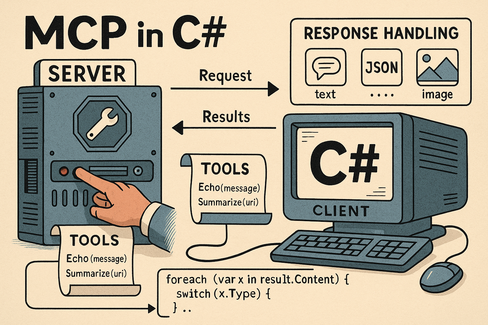

# 18



# Extending Applications with the Model Context Protocol (MCP)

As the landscape of application communication evolves, various protocols such as HTTP, WebSockets, and REST have emerged, each enhancing how software interacts. However, with the rise of AI-powered tools, a new challenge has arisen: ensuring safe and consistent interactions between these systems. The Model Context Protocol (MCP) addresses this challenge by providing a standardized framework for information exchange between applications and AI models. Instead of each tool developing its own API, MCP acts as a universal translator, enabling clients, like AI assistants, to communicate effectively with servers, such as C# applications.

What distinguishes MCP is its focus on context, allowing AI models to operate meaningfully while enabling applications to share information selectively and securely. This chapter will delve into the mechanics of MCP, its implementation in C#, and how it connects .NET applications to the expanding ecosystem of AI-driven technologies. By the end, you will understand the significance of MCP in facilitating interactions within this new technological landscape.

In this chapter, we will explore what MCP is, how it works, and how you can start building MCP servers and clients in C#. By the end, you will have a clear understanding of how to expose your application's resources and tools in a standardized way and how to connect them to clients that can utilize them. More importantly, you will discover why this protocol might be the missing piece in bridging .NET applications with the new generation of AI-driven systems.

## Introduction to the Model Context Protocol

Looking back at the history of network programming, each major protocol has addressed a specific problem of its time. HTTP enabled the sharing of documents and the development of the web as we know it. WebSockets provided real-time, bidirectional communication, while SignalR built on that to simplify real-time capabilities for .NET developers. Now, QUIC is emerging to enhance speed and strengthen security.

With the rise of AI-powered assistants, we face a new challenge: how can we enable these tools to interact with our applications in a safe, standardized, and reliable manner? This is where the Model Context Protocol (MCP) comes into play. MCP is not intended to replace HTTP or WebSockets; rather, it aims to complement them by facilitating how AI clients and software applications share context and tools without the need to reinvent solutions each time.

### Why Context Matters More Than Ever

Large language models are impressive, but they are not mind readers. They rely on context to provide accurate and useful results. Without the right information, even the most advanced AI can produce vague or irrelevant answers. For example, asking an AI to “help debug my app” without providing access to your application logs is similar to asking a mechanic to fix your car without allowing them to look under the hood. The potential for assistance is there, but the lack of context makes it nearly impossible for the AI to fulfill the request effectively.

This is where the Model Context Protocol (MCP) comes in. It offers a structured way to provide context in a safe and consistent manner. Imagine you're running a C# web service and want an AI assistant to help troubleshoot issues. Through MCP, your server could expose log files as resources or even provide a tool that runs health checks on demand. The AI assistant can then request these resources or trigger those tools, gaining the context it needs to diagnose problems effectively.

Another use case is in database-driven applications. Let’s say you're building a reporting tool that integrates with an AI assistant. Without knowledge of your database schema, the AI would struggle to generate meaningful queries. With MCP, your server can expose metadata about the database schema as a resource. Now, when you ask the assistant to “generate a query that shows the top five customers by revenue,” it has the context necessary to construct a valid query against your actual data structure.

Context is not just important for technical debugging or data queries; it also matters in productivity workflows. For instance, a project management app built in .NET could expose tasks, deadlines, and team assignments as resources through MCP. An AI assistant could then use this context to summarize project status, suggest priorities, or even create new tasks. By carefully controlling what context is shared, developers can empower AI to be genuinely useful while ensuring that sensitive information remains protected.

### Meet MCP: A Universal Translator for Apps and AI

The easiest way to understand MCP is to think of it as a universal translator. Instead of requiring every application to create its own custom API for AI clients, MCP establishes a shared framework. Clients know exactly how to request resources, utilize tools, and interpret responses, all without needing to implement special case logic for each application.

This is what makes MCP so powerful: its interoperability. Any MCP-compatible client can connect to any MCP server and immediately understand what is available. For example, an AI assistant might integrate with your C# application to retrieve logs, or a productivity tool could access configuration data without needing to familiarize itself with the specifics of your API.

### What We’ll Build and Explore Together

In this chapter, we will go beyond theory and get practical. You will learn how to create a simple MCP server in C# that exposes a resource. Additionally, you will build a client that connects to and interacts with that server, and understand how this fits into real-world workflows. We will also discuss the challenges, security considerations, and the potential future of MCP as its adoption increases.

By the end of this chapter, you will not only understand what MCP is and why it matters, but you will also be prepared to start experimenting with it in your own .NET projects. Consider this your first step into a new layer of communication—one that bridges the gap between your applications and the AI-driven tools that are becoming essential in every developer's workflow.

## Core Concepts of MCP

Before we dive into the code, it's important to grasp the essential components that make this protocol function. Think of it like learning the rules of a board game before you start rolling the dice: while the pieces may seem simple, their interactions are what make the game engaging. By understanding the roles, the types of exchanges that can occur, and how messages flow, you'll be prepared to create something meaningful rather than just connecting the components.

In the upcoming sections, we will explore the key players involved in the communication process, the types of resources and actions they share, and the messaging style that ensures consistency. Although these foundational elements may seem straightforward individually, together they form a flexible framework that allows clients and servers to communicate in a predictable and effective manner.

### Tools vs. Prompts: Choosing the Right Approach

When designing an MCP server, there are two main methods for exposing functionality: tools and prompts. At first glance, they may appear similar—both provide structured ways for clients to interact with your system—but they serve different purposes and excel in different situations.

**Tools** are ideal for exposing clear, callable actions. They function like methods: you input parameters, and in return, you receive a structured response. Examples include fetching the latest orders from a database, running a health check, or generating a report. Tools are strongly typed, easy to validate, and are perfect for business logic or data retrieval where precision and repeatability are essential. In .NET, tools naturally correspond to static methods or functions that take arguments and return results.

**Prompts**, on the other hand, are designed to facilitate conversations with AI models. Instead of executing logic directly, a prompt serves as a template that guides clients in constructing meaningful interactions. For instance, you might define a prompt that summarizes meeting notes, generates a customer support reply, or reformats text into a specific style. Prompts focus less on providing deterministic outcomes and more on influencing the assistant’s behavior. In code, they typically return a ChatMessage that integrates into the ongoing dialogue with the model.

In summary, use tools when you need reliable operations with predictable results, and use prompts when you want to incorporate reusable patterns into conversations with AI. Many applications will utilize a combination of both: tools to provide data and actions, and prompts to assist the assistant in phrasing or interpreting the results. By selecting the appropriate method for each scenario, you can ensure that your server remains both powerful and flexible.

### Servers and Clients: Who’s at the Table?

Every meaningful conversation requires at least two participants, and in this context, those roles are clearly defined. On one side, you have the server, which is responsible for providing what is available. On the other side, you have the client, which consumes those offerings and decides how to utilize them. The interaction is cooperative yet structured, similar to a host presenting a menu and a guest choosing what to order.

The server’s role goes beyond merely delivering data; it also defines the boundaries of what is possible. By registering resources and tools, the server indicates what it is willing to share and enforces those boundaries precisely. For a .NET developer, this may involve exposing a set of log files, configuration values, or database queries in a controlled manner, ensuring that nothing outside of that scope is ever made available.

In contrast, the client is the active participant. It connects to the server, requests information, and utilizes the tools that the server provides. You can think of the client as the one asking questions and interpreting the answers. In practice, the client could be an AI assistant seeking context, a monitoring utility collecting metrics, or a productivity tool accessing your application’s state. The key point is that the client does not need to understand how the server is built; it only needs to know that the server communicates using the correct protocol.

This clear separation of roles offers two significant benefits. First, it simplifies complexity by clarifying responsibilities. Second, it enables interoperability. Any client that understands the protocol can interact with any server, regardless of the language or platform the server was developed on. This is advantageous for C# developers who want to integrate their applications into a larger ecosystem without needing to create custom integrations for each new tool.

As you progress through the following sections, keep these roles in mind. Everything else builds upon this simple relationship: one side defines and provides, while the other side requests and consumes. This is a familiar pattern for anyone who has worked with APIs before, but it has been refined into a predictable and reusable model.

### Resources and Tools: The Currency of MCP

If the relationship between a client and a server is like a dining table setting, then the essence of their interaction lies in what is exchanged. This exchange comes in two forms: resources and tools. Together, these represent the currency that flows back and forth, determining what can be seen and what actions can be taken.

Resources refer to items that can be retrieved. Think of them as structured pieces of information that the server is willing to share. This might include a set of log entries, a configuration file, or a database schema. In a .NET application, exposing resources could involve making specific system metrics available or publishing an object model that the client can query. The key point is that resources are consistent and predictable, ensuring that clients always know what to expect.

Tools, on the other hand, represent actions. Unlike resources, which are primarily static, tools enable clients to trigger behavior on the server. A tool could be as simple as “run a health check” or as complex as “compile a report from yesterday’s sales.” In C# terms, tools correspond to functions or methods that you are willing to expose for remote use. The client calls the tool, the server executes it, and the result is sent back over the network.

This distinction between resources and tools helps maintain clarity in the model. Resources provide context, while tools facilitate action. By offering both, a server becomes more than just a data source; it transforms into an interactive participant capable of supporting workflows rather than merely answering questions. For clients, this duality means they can gather information and perform meaningful operations without needing to understand the internal workings of the server.

Understanding this distinction is crucial for building effective applications on top of the protocol. In the next section, we will explore how these exchanges actually occur, focusing on the messaging style that ensures smooth communication between the client and server.

### Speaking in JSON-RPC: How Messages Flow

Every interaction between client and server is built on a steady rhythm of requests and responses, and the format that makes this possible is JSON-RPC. It is lightweight, easy to parse, and flexible enough to handle both simple queries and more complex operations. Think of it as the shared grammar that keeps the conversation polite and unambiguous.

A typical request starts with a JSON message that includes an identifier, the method to call, and any parameters needed. For example, a client asking for a list of available resources might send something like this:

```json
{
  "jsonrpc": "2.0",
  "id": 1,
  "method": "listResources",
  "params": {}
}
```

On the C# side, you can represent this structure using record types or classes that map directly to the JSON fields. With `System.Text.Json`, the serialization and deserialization become almost effortless:

```C#
public record JsonRpcRequest(
    string Jsonrpc,
    int Id,
    string Method,
    object? Params
);

var request = new JsonRpcRequest("2.0", 1, "listResources", new { });
string json = JsonSerializer.Serialize(request);
Console.WriteLine(json);
```

The response follows the same pattern. A server might answer with a result containing the resources:

```json
{
  "jsonrpc": "2.0",
  "id": 1,
  "result": ["logs", "config", "metrics"]
}
```

Again, in C#, this maps cleanly to a strongly typed structure:

```C#
public record JsonRpcResponse<T>(
    string Jsonrpc,
    int Id,
    T Result
);

string jsonResponse = @"{
    "jsonrpc: "2.0",
    "id": 1,
    "result": [logs, "config", metrics]
}";

var response = JsonSerializer.Deserialize<JsonRpcResponse<string[]>>(jsonResponse);
Console.WriteLine(string.Join(", ", response?.Result ?? []));
```

By keeping everything framed in JSON-RPC, the protocol ensures that both sides can exchange data and actions without needing custom translation logic. For .NET developers, this means that with just a few simple record types and the built-in JSON serializer, you can participate fully in the conversation. In the next section we will take these building blocks and put them to work in a real MCP server.

## Bringing the Server to Life in .NET

Now that we have a clear understanding of the various components involved, it's time to dive in and see how they come together in a functioning application. The most effective way to grasp this protocol is to build a server that exposes some resources and tools, while observing how a client interacts with it. Starting small makes the task manageable, while still establishing a foundation for more complex scenarios in the future.

In the following steps, we will guide you through creating a minimal server in .NET 8 that communicates effectively, responds to requests, and makes resources available in a predictable manner. Along the way, you will learn how to structure message handling, implement JSON-RPC serialization, and design endpoints that feel intuitive for both the server and the client. By the end of this section, you will have a working example that you can expand into something useful for your own applications.

### Laying the Foundation: Project Setup and Dependencies

Before we can handle requests or expose functionality, we need to get a project in place that has the right dependencies and structure. Fortunately, the [MCP C# SDK](https://github.com/modelcontextprotocol/csharp-sdk) makes this straightforward, giving us the scaffolding to focus on what our server actually provides. We will start by creating a new console application that uses the hosting model you may already know from ASP.NET Core or background services.

First, create a new .NET console project:

```bash
dotnet new console -n McpServerDemo
cd McpServerDemo
```

Next, add the required NuGet packages. The `ModelContextProtocol` package contains the SDK itself, and `Microsoft.Extensions.Hosting` provides the familiar hosting abstractions for dependency injection, configuration, and logging:

```bash
dotnet add package ModelContextProtocol --prerelease
dotnet add package Microsoft.Extensions.Hosting
```

With those packages installed, you can set up the server in your `Program.cs` file. The SDK integrates with the hosting builder, so you can configure logging, choose transports, and automatically register tools from your assembly:

```C#
using Microsoft.Extensions.DependencyInjection;
using Microsoft.Extensions.Hosting;
using Microsoft.Extensions.Logging;
using ModelContextProtocol.Server;
using System.ComponentModel;

var builder = Host.CreateApplicationBuilder(args);
builder.Logging.AddConsole(options =>
{
    options.LogToStandardErrorThreshold = LogLevel.Trace;
});

builder.Services
    .AddMcpServer()
    .WithStdioServerTransport()
    .WithToolsFromAssembly();

await builder.Build().RunAsync();
```

At this point the server will start, but it is not very interesting without tools. Tools are simply methods marked with attributes so that the SDK can discover and expose them to clients. A simple example is an reply tool that just returns whatever text the client sends:

```C#
[McpServerToolType]
public static class ReplyTool
{
    [McpServerTool, Description("Replies the message back to the client.")]
    public static string Reply(string message) => $"hello {message}";
}
```

By running the server with this tool registered, any MCP client can call the reply method and get a predictable response. The magic here is that you did not have to manually wire JSON handling or method discovery; the SDK does it for you by scanning the assembly and building the tool catalog automatically.

This foundation gives you a solid starting point. You now have a working server that can register tools, handle logging, and speak over standard input and output. From here we will expand into more advanced tools that use dependency injection, make external calls, and even expose prompts, showing just how flexible this model can be.

### Listening for Conversations: Wiring Up Connections

Once the project is in place and the basic scaffolding added, the next step is to make the server capable of listening for incoming requests and sending responses. The SDK takes care of the heavy lifting here, so instead of manually parsing JSON or juggling sockets, you can focus on defining the transport and the tools that clients will call.

A minimal setup can be achieved by adding a standard input/output transport and registering tools from the current assembly. This allows the server to immediately begin accepting requests and dispatching them to any methods annotated as tools:

```C#
using Microsoft.Extensions.DependencyInjection;
using Microsoft.Extensions.Hosting;
using Microsoft.Extensions.Logging;
using ModelContextProtocol.Server;
using System.ComponentModel;

var builder = Host.CreateApplicationBuilder(args);
builder.Logging.AddConsole(options =>
{
    options.LogToStandardErrorThreshold = LogLevel.Trace;
});

builder.Services
    .AddMcpServer()
    .WithStdioServerTransport()
    .WithToolsFromAssembly();

await builder.Build().RunAsync();

[McpServerToolType]
public static class ReplyTool
{
    [McpServerTool, Description("Replies the message back to the client.")]
    public static string Reply(string message) => $"hello {message}";
}
```

Here the server uses WithStdioServerTransport, which is perfect for development since many MCP clients use stdio during integration. The call to `WithToolsFromAssembly()` scans the current assembly for any classes and methods decorated with the right attributes and makes them available as callable tools. In this case, the Reply tool simply returns a friendly greeting with the text supplied by the client.

Listening for conversations is not limited to static responses. Because the hosting model integrates with dependency injection, you can build tools that take advantage of services like `HttpClient` or even the server itself. For example, the following tool downloads content from a URL and uses the connected MCP client to summarize it:

```C#
[McpServerTool(Name = "SummarizeContentFromUrl"), Description("Summarizes content downloaded from a specific URI")]
public static async Task<string> SummarizeDownloadedContent(
    IMcpServer thisServer,
    HttpClient httpClient,
    string url,
    CancellationToken cancellationToken)
{
    string content = await httpClient.GetStringAsync(url);

    ChatMessage[] messages =
    [
        new(ChatRole.User, "Briefly summarize the following downloaded content:"),
        new(ChatRole.User, content),
    ];

    ChatOptions options = new() { MaxOutputTokens = 256, Temperature = 0.3f };

    return $"Summary: {await thisServer.AsSamplingChatClient().GetResponseAsync(messages, options, cancellationToken)}";
}
```

The conversation here is much richer: the server is not just replying a string, but actively collaborating with the client. This demonstrates how the server can orchestrate external calls, wrap results, and feed them back to the requesting client with minimal boilerplate.

You are not limited to tools. Prompts can also be defined in a similar way, exposing reusable patterns of interaction. By decorating a class with `[McpServerPromptType]` and methods with `[McpServerPrompt]`, you can make predefined message templates available to clients. For example:

```C#
[McpServerPromptType]
public static class MyPrompts
{
    [McpServerPrompt, Description("Creates a prompt to summarize the provided message.")]
    public static ChatMessage Summarize(string content) =>
    new(ChatRole.User, $"Please summarize this content into a single sentence: {content}");
}
```

At this stage, your server is no longer just a passive process but an active participant in the conversation, able to both listen and respond intelligently. In the next part we will move beyond the basics and look at how to expose richer resources and more complex tools, bringing your server closer to something production-ready.

### Sharing What You Have: Exposing Resources and Tools

Once the server is able to listen for incoming requests, the next question is what exactly it should make available. This is where resources and tools come into play. Resources represent data that can be fetched, while tools represent actions that can be performed. Together they form the vocabulary that clients rely on to make meaningful use of your application.

A simple example is the reply tool. By annotating a method with `[McpServerTool]` inside a class marked `[McpServerToolType]`, the SDK automatically discovers it and makes it available to any connected client:

```C#
[McpServerToolType]
public static class ReplyTool
{
    [McpServerTool, Description("Replies the message back to the client.")]
    public static string Reply(string message) => $"hello {message}";
}
```

This small snippet highlights the elegance of the SDK. You do not need to write JSON parsing logic or define routing tables; the server inspects your assembly and builds a catalog of tools based on the attributes. When a client calls the reply tool with a message, the method executes and the result flows back over the connection.

Of course, tools are not limited to trivial string manipulation. They can make use of dependency injection to access services like HttpClient, or even the IMcpServer itself. For example, here is a tool that downloads content from a URL and then translates it into the target language:

```C#
[McpServerTool(Name = "TranslateDownloadedContent"), Description("Downloads content from a URL and translates it into the target language.")]
public static async Task<string> TranslateDownloadedContent(
    IMcpServer thisServer,
    HttpClient httpClient,
    string url,
    string targetLanguage,
    CancellationToken cancellationToken)
{
    string content = await httpClient.GetStringAsync(url);

    ChatMessage[] messages =
    [
        new(ChatRole.User, $"Translate the following text into {targetLanguage}:"),
        new(ChatRole.User, content),
    ];

    ChatOptions options = new() { MaxOutputTokens = 512, Temperature = 0.4f };

    return $"Translation: {await thisServer.AsSamplingChatClient().GetResponseAsync(messages, options, cancellationToken)}";
}
```

Here the server does more than just reply input; it takes an external dependency, performs a network call, and then uses the MCP client to produce a higher-level summary. This is a good example of how tools can extend beyond raw data access into orchestration and automation.

You can also expose prompts in a similar fashion. A prompt acts like a reusable template for client interactions. By marking a method with `[McpServerPrompt]`, you give clients a way to request pre-defined message structures that can guide conversations:

```C#
[McpServerPromptType]
public static class MyPrompts
{
    [McpServerPrompt, Description("Creates a prompt to summarize the provided message.")]
    public static ChatMessage Summarize(string content) =>
    new(ChatRole.User, $"Please summarize this content into a single sentence: {content}");
}
```

For even finer control, you can bypass attribute-based discovery entirely and configure capabilities directly. By constructing McpServerOptions, you can define custom handlers for listing tools and handling calls, which gives you total control over the resource and tool lifecycle:

```C#
McpServerOptions options = new()
{
    ServerInfo = new Implementation { Name = "MyServer", Version = "1.0.0" },
    Capabilities = new ServerCapabilities
    {
        Tools = new ToolsCapability
        {
            ListToolsHandler = (request, ct) =>
                ValueTask.FromResult(new ListToolsResult
                {
                    Tools =
                    [
                        new Tool
                        {
                            Name = "reply",
                            Description = "Replies the input back to the client.",
                            InputSchema = JsonSerializer.Deserialize<JsonElement>("""
                                {
                                    "type": "object",
                                    "properties": { "message": { "type": "string" } },
                                    "required": ["message"]
                                }
                            """),
                        }
                    ]
                }),
        }
    }
};

await using IMcpServer server = McpServerFactory.Create(new StdioServerTransport("MyServer"), options);
await server.RunAsync();
```

This pattern is particularly useful if you want dynamic registration or need to enforce specific rules around how tools are advertised and invoked. By combining attribute discovery with custom handlers, you get both convenience and flexibility.

With these building blocks in place, your server can expose everything from simple helpers to complex workflows. In the next step we will look more closely at how to process requests and send structured results, ensuring that the conversation between client and server flows smoothly under all conditions.

### Handling the Flow: Processing Requests and Sending Results

Once tools are exposed, the real work begins: processing requests and delivering results back to the client. This is where the server shows its usefulness, not just by responding, but by doing so in a way that is predictable and structured. With the SDK, most of the plumbing is handled, leaving you free to focus on the logic that makes your application valuable.

The simplest case is the reply tool. When a client calls it with a message, the server receives the request, binds the parameter, executes the method, and serializes the result back to JSON. From the developer’s perspective, this is just a static method call wrapped with attributes:

```C#
[McpServerToolType]
public static class ReplyTool
{
    [McpServerTool, Description("Relies the message back to the client.")]
    public static string Reply(string message) => $"hello {message}";
}
```

Behind the scenes, the server matches the reply call to this method, extracts the message argument from the request, and writes a response that the client can interpret. This cycle is repeated for every request, whether it is a simple string operation or a more complex workflow.

For more advanced scenarios, the SDK allows tools to accept injected dependencies and interact directly with the connected client. Consider the summarization tool, which accepts both an HttpClient and the current IMcpServer instance. When invoked, it accepts raw input text (rather than downloading from a URL), and asks the MCP client to analyze sentiment.:

```C#
[McpServerTool(Name = "AnalyzeSentimentFromText"), Description("Analyzes the sentiment of the provided text.")]
public static async Task<string> AnalyzeSentimentFromText(
    IMcpServer thisServer,
    string input,
    CancellationToken cancellationToken)
{
    ChatMessage[] messages =
    [
        new(ChatRole.User, "Analyze the sentiment of the following text as Positive, Negative, or Neutral:"),
        new(ChatRole.User, input),
    ];

    ChatOptions options = new() { MaxOutputTokens = 128, Temperature = 0.2f };

    return $"Sentiment Analysis: {await thisServer.AsSamplingChatClient().GetResponseAsync(messages, options, cancellationToken)}";
}
```

This request-response flow demonstrates how tools can be more than local helpers. They can orchestrate multiple services, collaborate with the client, and return refined results. The server manages the lifecycle of the request, and your method focuses solely on what makes the response useful.

For even greater control, you can define handlers directly in the server options. Instead of relying on attribute discovery, you can explicitly handle listing tools and invoking them. This approach is especially valuable if you need to dynamically manage available tools at runtime:

```C#
McpServerOptions options = new()
{
    ServerInfo = new Implementation { Name = "MyServer", Version = "1.0.0" },
    Capabilities = new ServerCapabilities
    {
        Tools = new ToolsCapability
        {
            ListToolsHandler = (request, ct) =>
                ValueTask.FromResult(new ListToolsResult
                {
                    Tools =
                    [
                        new Tool
                        {
                            Name = "reply",
                            Description = "Replies the input back to the client.",
                            InputSchema = JsonSerializer.Deserialize<JsonElement>("""
                                {
                                    "type": "object",
                                    "properties": { "message": { "type": "string" } },
                                    "required": ["message"]
                                }
                            """),
                        }
                    ]
                }),

            CallToolHandler = (request, ct) =>
            {
                if (request.Params?.Name == "reply" &&
                    request.Params.Arguments?.TryGetValue("message", out var message) == true)
                {
                    return ValueTask.FromResult(new CallToolResult
                    {
                        Content = [new TextContentBlock { Text = $"ReplyReply: {message}", Type = "text" }]
                    });
                }

                throw new McpException("Unknown or missing tool arguments");
            },
        }
    }
};

await using IMcpServer server = McpServerFactory.Create(new StdioServerTransport("MyServer"), options);
await server.RunAsync();
```

With this setup, you see the entire flow: a request comes in, the server checks what tool was called, validates the arguments, executes the logic, and sends a structured response back. Whether you prefer the attribute-driven approach or custom handlers, the pattern remains the same: requests arrive, results are sent back, and the client gets exactly what it asked for.

By now you should have a good sense of how the server processes calls and generates responses. The next step is to connect this cycle to real-world resources and more advanced patterns, scaling from simple demonstrations into production-ready workflows.

## Sitting on the Other Side of the Table with a Client

Up to this point, we have focused on building the server and equipping it with valuable features. Now, it's time to shift our perspective and consider the client side of the conversation. The client is responsible for exploring what the server offers, making requests, and interpreting the results in a way that is both reliable and useful.

Working from the client side is just as crucial as the server work you have already completed. Without a client, the tools and resources on the server remain unused. In the upcoming steps, you will learn how to connect, request what you need, and handle the structured responses that are returned, all within a clean .NET workflow.

## Knocking on the Door: Connecting to a Server

Before you can list tools or call methods, the first step for any client is to establish a connection. In .NET this is done by creating a transport that defines how the client will reach the server, then handing it off to the McpClientFactory. Think of this like ringing the doorbell: you announce who you are, how you plan to communicate, and then wait for the server to open the door.

To get started, install the ModelContextProtocol package from NuGet

```bash
dotnet add package ModelContextProtocol --prerelease
```

The SDK provides several transport options, with standard input and output being one of the simplest to work with. Here is an example that connects to the sample “everything” server distributed via npm:

```C#
using ModelContextProtocol.Client;

var clientTransport = new StdioClientTransport(new StdioClientTransportOptions
{
    Name = "Everything",
    Command = "npx",
    Arguments = ["-y", "@modelcontextprotocol/server-everything"],
});

var client = await McpClientFactory.CreateAsync(clientTransport);
```

Once connected, you can immediately start interacting with the server. One of the most useful first steps is to enumerate all the tools the server exposes. This gives you a sense of the capabilities on offer, without needing to know anything about how the server was built:

```C#
foreach (var tool in await client.ListToolsAsync())
{
    Console.WriteLine($"{tool.Name} ({tool.Description})");
}
```

At this point, the client has successfully connected and is able to discover what is available. The next natural step is to try out one of the tools. Calling a tool is as simple as supplying its name and any required parameters. In this example, we invoke the reply tool, which always responds with the same text it received:

```C#
var result = await client.CallToolAsync(
    "reply",
    new Dictionary<string, object?>() { ["message"] = "Hello MCP!" },
    cancellationToken: CancellationToken.None);

Console.WriteLine(result.Content.First(c => c.Type == "text").Text);
```

The cycle is clear: the client connects, requests a list of tools, and then calls one. Behind the scenes, the SDK manages the JSON-RPC messages, matches the request with the correct tool, and parses the structured response. All you see in your .NET code is a clean async call and a typed result.

This pattern scales beyond toy examples. A client can connect to any compliant server, whether it was built in .NET, Node.js, or another ecosystem entirely. The protocol ensures interoperability, and the SDK ensures you do not have to worry about the mechanics of serialization or message framing. From here, the conversation shifts from simply connecting to asking the right questions, where the client learns to work with resources and tools in a more systematic way.

## Asking the Right Questions: Requesting Resources and Tools

Before a client can start asking meaningful questions, it needs to first introduce itself and establish a reliable channel of communication. In practice this means setting up a transport and using it to create an `IMcpClient` with the `McpClientFactory`. Once that handshake is complete, the client is ready to explore the server’s offerings.

The simplest way to make that initial connection is to use the standard input/output transport. This allows the client to spin up a server process and communicate with it directly. Here is a minimal example that launches the sample “everything” server and creates a client against it:

```C#
using ModelContextProtocol.Client;

var clientTransport = new StdioClientTransport(new StdioClientTransportOptions
{
    Name = "Everything",
    Command = "npx",
    Arguments = ["-y", "@modelcontextprotocol/server-everything"],
});

var client = await McpClientFactory.CreateAsync(clientTransport);
```

Once connected, the first thing most clients do is ask what tools the server provides. This is like reading the menu before placing an order. The following snippet lists each tool name and description to the console:

```C#
foreach (var tool in await client.ListToolsAsync())
{
    Console.WriteLine($"{tool.Name} ({tool.Description})");
}
```

With this information in hand, the client can now start invoking tools. A request is sent with the tool name and any required arguments. For instance, here is how the reply tool can be called with a simple message:

```C#
var result = await client.CallToolAsync(
    "reply",
    new Dictionary<string, object?>() { ["message"] = "Hello MCP!" },
    cancellationToken: CancellationToken.None);

Console.WriteLine(result.Content.First(c => c.Type == "text").Text);
```

The key here is that the client does not need to know how the server implements reply, only that it exists and requires a message parameter. This clean separation allows clients to connect to any compliant server, whether it was written in .NET, Node.js, or another ecosystem entirely. The connection and the protocol itself guarantee a consistent experience.

This connection step is only the beginning. Once the client knows how to discover available tools, it can start asking deeper questions, pulling resources, and integrating results into larger workflows. In the next part we will see how to go beyond the basics of discovery and begin working with the server’s resources in a more deliberate way.

## Getting the Answers: Handling Responses in C#

Before a client can do anything useful, it has to connect. Without that first step, there are no requests to send and no responses to process. In .NET, this is handled through the `McpClientFactory`, which takes a transport definition and gives you an `IMcpClient`. From there, the client can interact with any MCP server that speaks the same protocol.

The simplest way to connect is through standard input and output, letting the client spawn a process and communicate directly with it. Here’s an example that launches the sample “everything” server and creates a connection:

```C#
using ModelContextProtocol.Client;

var clientTransport = new StdioClientTransport(new StdioClientTransportOptions
{
    Name = "Everything",
    Command = "npx",
    Arguments = ["-y", "@modelcontextprotocol/server-everything"],
});

var client = await McpClientFactory.CreateAsync(clientTransport);
```

Once the connection is alive, the client can ask the server for a list of tools. This is a discovery phase where you learn what functionality is available. The call returns structured objects containing both the name and description of each tool:

```C#
foreach (var tool in await client.ListToolsAsync())
{
    Console.WriteLine($"{tool.Name} ({tool.Description})");
}
```

Calling a tool is just as straightforward. The request specifies the tool name and parameters, and the response contains a structured result. Here’s an example with the reply tool:

```C#
var result = await client.CallToolAsync(
    "reply",
    new Dictionary<string, object?>() { ["message"] = "Hello MCP!" },
    cancellationToken: CancellationToken.None);
```

Responses are not limited to plain text. Each response contains a collection of content blocks, and you can filter by type. For example, you may receive text, JSON data, or other structured output. Handling that looks like this:

```C#
foreach (var content in result.Content)
{
    if (content.Type == "text")
    {
        Console.WriteLine($"Text: {content.Text}");
    }
    else if (content.Type == "json")
    {
        Console.WriteLine($"JSON: {content.Json}");
    }
}
```

Error handling is also built into the flow. If the client calls a tool with missing or invalid arguments, the server responds with a structured error that can be caught and logged. For instance:

```C#
try
{
    var badResult = await client.CallToolAsync(
        "reply",
        new Dictionary<string, object?>(), // missing 'message'
        cancellationToken: CancellationToken.None);
}
catch (McpException ex)
{
    Console.WriteLine($"Request failed: {ex.Message}");
}
```

In practice, responses may contain multiple content blocks, not just plain text. A server could return a mixture of text, JSON, or even binary/image content. Handling this requires branching on the content type, ensuring each piece is processed correctly. 

#### MCP Content Types and .NET Mappings

| MCP Content Type | Description                              | .NET Representation             | Example Usage                                      |
|------------------|------------------------------------------|----------------------------------|---------------------------------------------------|
| `text`           | Plain text message                       | `string`                         | Logging output, summaries, or simple responses    |
| `json`           | Structured JSON data                     | `object` / `record` / `dynamic`  | Deserialize into C# records for typed access      |
| `image`          | Base64-encoded binary image              | `byte[]`                         | Convert to image files (`File.WriteAllBytes`)     |
| `binary`         | Raw binary data (non-image)              | `byte[]` / `MemoryStream`        | Downloading files, exporting documents            |
| `markdown`       | Markdown-formatted text                  | `string`                         | Render in a Markdown viewer or convert to HTML    |
| `html`           | Rich text in HTML format                 | `string`                         | Render directly in web UI components              |
| `table`          | Tabular data, often JSON-structured      | `DataTable` / `List<T>`          | Reporting, metrics, dashboards                    |
| `error`          | Structured error details from the server | `McpException` / `Exception`     | Handle gracefully with try/catch                  |

Below is example code to handle the various content types in a structured way:

```C#
public static void HandleMcpResponse(CallToolResult result)
{
    foreach (var content in result.Content)
    {
        switch (content.Type)
        {
            case "text":
                Console.WriteLine($"Text: {content.Text}");
                break;

            case "json":
                var obj = JsonSerializer.Deserialize<object>(content.Json);
                Console.WriteLine($"JSON object: {JsonSerializer.Serialize(obj, new JsonSerializerOptions { WriteIndented = true })}");
                break;

            case "image":
                var imageBytes = Convert.FromBase64String(content.Data);
                File.WriteAllBytes("output.png", imageBytes);
                Console.WriteLine("Image saved as output.png");
                break;

            case "binary":
                var bytes = Convert.FromBase64String(content.Data);
                File.WriteAllBytes("output.bin", bytes);
                Console.WriteLine("Binary file saved as output.bin");
                break;

            case "markdown":
                Console.WriteLine($"Markdown: {content.Text}");
                break;

            case "html":
                Console.WriteLine($"HTML content: {content.Text}");
                break;

            case "table":
                Console.WriteLine($"Table data: {content.Json}");
                break;

            case "error":
                Console.WriteLine($"Error: {content.Text}");
                break;

            default:
                Console.WriteLine($"Unhandled content type: {content.Type}");
                break;
        }
    }
}

```

This pattern ensures that the client can gracefully handle whatever the server returns. A debugging tool might send both a text summary and a JSON payload of structured errors. A reporting tool might return text explanations along with an image chart encoded in base64. By differentiating content types in code, you transform raw protocol messages into meaningful outputs for your application.

The value here is that you are no longer tied to one-dimensional responses. Instead, you can treat the results as a bundle of useful artifacts, each with its own type and purpose. This sets the stage for richer client-side integrations, where handling multiple response formats is as natural as parsing JSON from a web API.

With the ability to connect, discover tools, invoke them, and process structured responses, the client side of the equation starts to feel natural. It is no longer just knocking on the door; it is listening carefully to what comes back and shaping that into useful behavior for your application. From here, the next step is to look at how those responses can be integrated into real-world workflows, where handling errors gracefully and combining multiple results becomes just as important as making the initial call.

### Making Responses Work for You: From Raw Data to Strongly Typed Models

Working directly with raw response content is fine for experimentation, but in real applications you usually want strongly typed models that fit cleanly into your domain. The MCP client library gives you structured results, but it is up to you to deserialize them into types that make sense for your app.

For example, suppose a server provides a tool that returns JSON data representing system metrics. The raw response may look like this:

```json
{
  "cpu": 0.42,
  "memory": 0.65,
  "uptime": 123456
}
```

Instead of working with generic JSON blocks, you can map this into a C# record for type safety:

```C#
public record SystemMetrics(double Cpu, double Memory, int Uptime);

// Handling the response
var metricsContent = result.Content.First(c => c.Type == "json");
var metrics = JsonSerializer.Deserialize<SystemMetrics>(metricsContent.Json);

Console.WriteLine($"CPU: {metrics?.Cpu}, Memory: {metrics?.Memory}, Uptime: {metrics?.Uptime}");
```

This approach transforms loosely typed responses into first-class citizens in your .NET code. The compiler now helps you catch mistakes, and your business logic can work with familiar constructs instead of juggling dictionaries and strings.

Error handling also benefits from strong typing. You might create a record to represent structured error payloads, so you can differentiate between validation errors, missing resources, or server-side failures. That way your client logic can decide whether to retry, prompt the user for input, or escalate the issue.

Finally, strongly typed responses make integration with higher-level workflows far smoother. Imagine piping MCP results into an ASP.NET Core API, logging them into a monitoring system, or using them to drive background jobs. By turning them into well-defined models, you unlock the full power of .NET’s ecosystem, where LINQ, async streams, and dependency injection can all play a role in shaping how responses are consumed.

By elevating raw protocol responses into meaningful abstractions, you are not just reading what the server says — you are making it part of your application’s story. This shift from protocol-level plumbing to domain-level modeling is what makes MCP integration sustainable in larger projects.

### Putting It All Together: Integrating MCP into an ASP.NET Core Workflow

A client that can call tools and handle responses is useful on its own, but the real power comes when you integrate it into larger applications. One natural fit is using MCP inside an ASP.NET Core Web API, where endpoints act as bridges between HTTP clients and MCP servers.

Imagine you have a server that exposes a getSystemMetrics tool returning JSON with CPU and memory usage. Instead of exposing raw MCP calls directly, you can create a controller that calls the tool and returns strongly typed results.

First, define a model that matches the expected JSON:

```C#
public record SystemMetrics(double Cpu, double Memory, int Uptime);
```

Next, set up an ASP.NET Core controller that invokes the MCP client and translates the response:

```C#
using Microsoft.AspNetCore.Mvc;
using ModelContextProtocol.Client;

[ApiController]
[Route("api/[controller]")]
public class MetricsController : ControllerBase
{
private readonly IMcpClient _client;

    public MetricsController(IMcpClient client)
    {
        _client = client;
    }

    [HttpGet]
    public async Task<ActionResult<SystemMetrics>> GetMetrics(CancellationToken cancellationToken)
    {
        var result = await _client.CallToolAsync(
            "getSystemMetrics",
            new Dictionary<string, object?>(),
            cancellationToken);

        var metricsContent = result.Content.First(c => c.Type == "json");
        var metrics = JsonSerializer.Deserialize<SystemMetrics>(metricsContent.Json);

        return metrics is not null
            ? Ok(metrics)
            : BadRequest("Could not retrieve system metrics");
    }
}
```

Now, when someone calls `GET /api/metrics`, your ASP.NET Core app translates that into an MCP call, processes the structured response, and sends back clean JSON. Clients of your API do not even need to know MCP exists; they simply see well-formed RESTful responses.

This workflow demonstrates how MCP can become part of your existing .NET ecosystem instead of sitting off to the side. It can feed monitoring dashboards, power real-time notifications, or integrate into background jobs. The key is that once responses are strongly typed, they behave like any other data source in .NET, whether that is a database, a REST API, or a message queue.

With this pattern in place, you can start thinking of MCP as another tool in your network programming toolbox. It is not only about connecting AI clients to your services, but also about weaving structured, standardized responses into the workflows your applications already support.

## Making It Real with MCP in Action

So far we have explored the mechanics of setting up servers, connecting clients, and handling structured responses. The building blocks are in place, but the real question is how these pieces come together in day-to-day development. This is where the protocol starts to shine, because it is not just a clever abstraction but a way to solve practical problems that developers and organizations face every day.

From smarter debugging sessions to secure data access and cross-system workflows, the possibilities are broad. By looking at real-world patterns, we can see how to apply what we have built so far and push beyond examples into scenarios that improve productivity and reduce complexity. In the next sections we will walk through a few use cases that demonstrate just how powerful this approach can be in .NET applications.

### Debugging Made Smarter: AI-Assisted Troubleshooting

One of the most practical applications of this protocol is in troubleshooting. Every developer knows the pain of digging through endless logs or sifting through stack traces in search of the root cause. By exposing logs, traces, and configuration as MCP resources, you can allow AI-driven clients to do the heavy lifting. Instead of manually scrolling through thousands of lines, a client can request the logs, analyze them, and suggest where things went wrong.

Let’s start by exposing logs as a resource. Using the SDK, you can register a tool that reads from a file or buffer and streams results back to the client. In this example, the server provides the contents of a log file that the client can query:

```C#
[McpServerToolType]
public static class LogTools
{
    [McpServerTool, Description("Fetches the last N lines from the application log.")]
    public static IEnumerable<string> GetRecentLogs(int lines = 50)
    {
        var logPath = "app.log";
        return File.ReadLines(logPath)
            .Reverse()
            .Take(lines)
            .Reverse()
            .ToArray();
    }
}
```

From the client side, fetching those logs is as simple as calling the tool and processing the structured response. Here we grab the last 20 lines and pass them into the console:

```C#
var logs = await client.CallToolAsync(
    "GetRecentLogs",
    new Dictionary<string, object?>() { ["lines"] = 20 },
    cancellationToken: CancellationToken.None);

foreach (var content in logs.Content.Where(c => c.Type == "text"))
{
    Console.WriteLine(content.Text);
}
```

This is where things get interesting. Instead of displaying logs directly to the user, the client could forward them into an AI model through a sampling request. The assistant can then highlight repeated error patterns, point out stack traces, or even suggest likely causes. With just a small amount of orchestration, the raw logs become actionable insights.

You can extend this idea by exposing configuration settings as well. If a connection string or feature flag is causing problems, surfacing these values as MCP resources allows the assistant to correlate logs with settings. For instance, if a service is failing authentication, the AI could note that the configuration points to the wrong endpoint and suggest a fix.

The pattern remains the same: the server exposes structured data as resources, and the client transforms those resources into intelligence by pairing them with AI-driven analysis. Instead of being buried in details, developers get focused summaries, suggested next steps, and often the critical clue they need to resolve the issue quickly.

By exposing logs, traces, and configuration in this way, you transform debugging into a collaborative effort between developer and AI. The protocol acts as the bridge, ensuring that only the right data is shared, while the client brings intelligence to the process. The result is smarter troubleshooting sessions that save time and reduce frustration, setting the stage for even richer integrations in business and operational contexts.

### Data on Demand: Integrating with Business Systems

Beyond debugging, one of the most compelling uses of this protocol is surfacing business data in a structured, secure way. Enterprises run on orders, customers, and metrics, and developers often need to expose this information to other systems, dashboards, or assistants. Traditionally this has been done with custom APIs, but that means more endpoints, more security policies, and more integration glue. With MCP, you can standardize the flow and decide exactly which data to share.

Consider a simple example of exposing customer data. In a .NET application, you can create a tool that queries a database or repository for customer records and makes them available as structured results:

```C#
[McpServerToolType]
public static class CustomerTools
{
    [McpServerTool, Description("Fetches the top N customers by revenue.")]
    public static IEnumerable<object> GetTopCustomers(int count = 5)
    {
        var customers = new[]
        {
            new { Id = 1, Name = "Alpha Co.", Revenue = 120000 },
            new { Id = 2, Name = "Beta Corp", Revenue = 95000 },
            new { Id = 3, Name = "Gamma Ltd.", Revenue = 88000 }
        };

        return customers.OrderByDescending(c => c.Revenue).Take(count).ToArray();
    }
}
```

On the client side, calling this tool and interpreting the structured JSON response is straightforward. By deserializing into a strongly typed record, you can use the results directly in business logic:

```C#
public record Customer(int Id, string Name, double Revenue);

var result = await client.CallToolAsync(
    "GetTopCustomers",
    new Dictionary<string, object?>() { ["count"] = 3 },
    cancellationToken: CancellationToken.None);

var customers = result.Content
    .Where(c => c.Type == "json")
    .Select(c => JsonSerializer.Deserialize<Customer[]>(c.Json))
    .FirstOrDefault();

foreach (var c in customers ?? Array.Empty<Customer>())
{
    Console.WriteLine($"{c.Name} - ${c.Revenue}");
}
```

Once the data is flowing, adding tools for higher-level actions becomes straightforward. For instance, you could implement a GenerateSalesReport tool that aggregates daily order values, or a GetMetrics tool that highlights key performance indicators (KPIs) such as order volume and churn rate. Each tool can enforce strict parameter validation and provide structured responses, ensuring that only the relevant subset of data is exposed.

Security is a significant advantage in this setup. By defining tools and resources explicitly, you minimize the risk of overexposing sensitive tables or endpoints. For example, an MCP server can share information about “top customers” without granting clients access to the entire customer database. This approach enables AI assistants or third-party integrations to work with meaningful insights while keeping raw data secure.

By adopting this pattern, you can seamlessly integrate business systems into workflows with minimal friction. Whether the objective is AI-powered analytics, smarter dashboards, or interactive assistants, MCP offers a clear framework: tools and resources are intentionally exposed, responses are structured, and .NET applications maintain control over what information is shared. This strategy reduces the complexity of developing one-off integrations while creating new opportunities for collaboration across systems.

### Coding Sidekick: Generating Unit Tests on Demand

One area where MCP can shine is developer productivity. Beyond debugging or surfacing business data, you can use MCP to let AI assistants help with everyday coding tasks. A simple but powerful example is automatically generating unit tests for existing .NET code. By exposing your source files or snippets as resources and adding a tool that packages them for analysis, you give the assistant the context it needs to suggest meaningful tests.

Here’s a lightweight tool that reads a C# file and asks the connected client to generate xUnit-style tests:

```C#
[McpServerToolType]
public static class TestTools
{
    [McpServerTool(Name = "GenerateUnitTests"), Description("Generates unit tests for the specified C# source file.")]
    public static async Task<string> GenerateUnitTests(
        IMcpServer thisServer,
        string filePath,
        CancellationToken cancellationToken)
    {
        string code = await File.ReadAllTextAsync(filePath, cancellationToken);

        ChatMessage[] messages =
        [
            new(ChatRole.User, "Generate xUnit unit tests for the following C# code:"),
            new(ChatRole.User, code),
        ];

        ChatOptions options = new() { MaxOutputTokens = 512, Temperature = 0.3f };

        return await thisServer.AsSamplingChatClient().GetResponseAsync(messages, options, cancellationToken);
    }
}
```

From the client’s perspective, invoking this tool is no different from calling echo or summarize. The difference lies in the payoff: instead of a simple string, you get a scaffold of ready-to-use tests that can be dropped directly into your project. Even if the assistant’s output is only a starting point, it saves developers time by providing the boilerplate and common cases up front.

This is the kind of workflow that makes MCP especially appealing in day-to-day development. By wrapping your own codebase as context and exposing AI-driven tools, you transform an assistant from a passive helper into an active coding sidekick that boosts productivity while keeping control firmly in the hands of the developer.

### Extending the Toolbox: Hybrid Workflows in the Enterprise

Modern enterprise systems rarely rely on a single communication pattern. A typical .NET application may already expose REST APIs for web clients, use gRPC for service-to-service calls, and rely on message queues for event-driven workflows. MCP does not replace these; instead, it complements them by giving AI-driven clients and orchestration layers a standard way to plug into existing infrastructure.

A straightforward example is layering MCP on top of an existing API. Suppose you already have a REST endpoint that retrieves order details. Instead of creating a parallel API for AI clients, you can register an MCP tool that simply wraps the existing service call:

```C#
[McpServerToolType]
public static class OrderTools
{
    [McpServerTool, Description("Fetches order details by order ID.")]
    public static async Task<object> GetOrderById(
        HttpClient httpClient,
        int orderId,
        CancellationToken cancellationToken)
    {
        var json = await httpClient.GetStringAsync(
            $"https://myapi.local/api/orders/{orderId}",
            cancellationToken);

        return JsonSerializer.Deserialize<JsonElement>(json);
    }
}
````

This pattern means you do not have to rebuild existing services. MCP acts as a thin layer that exposes exactly what an AI assistant or orchestration client needs, while the heavy lifting still happens in your REST or gRPC APIs.

Another integration pattern is combining MCP with message queues like Azure Service Bus or RabbitMQ. Imagine a tool that publishes a message to a queue when invoked. This allows an AI assistant to trigger downstream workflows without needing direct access to internal systems:

```C#
[McpServerTool, Description("Queues an order for processing.")]
public static async Task<string> QueueOrderForProcessing(
    string orderId,
    ServiceBusClient busClient,
    CancellationToken cancellationToken)
{
    var sender = busClient.CreateSender("orders");
    await sender.SendMessageAsync(new ServiceBusMessage(orderId), cancellationToken);
    return $"Order {orderId} has been queued for processing.";
}
```

By introducing tools like this, MCP integrates into a hybrid workflow. REST and gRPC continue to serve structured clients, message queues manage decoupled workloads, and MCP enables intelligent clients to interact without the need for custom integrations.

The main benefit is consistency. Clients that understand MCP can connect to any server, discover available resources, and invoke tools in a predictable manner. For .NET developers, this means reducing the amount of glue code usually needed to integrate AI or external automation into existing systems.

When viewed this way, MCP is not a replacement for your current toolbox but rather an extension of it. It allows you to incorporate AI and orchestration clients into your enterprise landscape without disrupting the already effective patterns. In the next section, we will take a step back and examine the challenges and future considerations involved in adopting this new model.

## Challenges, Security, and the Road Ahead

It is now clear that this protocol offers exciting new opportunities for .NET applications to share context and functionality. However, every tool comes with its trade-offs. While exposing logs, data, or actions can be incredibly powerful, it also raises important concerns regarding security, performance, and adoption. A robust implementation requires us to think beyond ideal scenarios and consider how the system operates under real-world conditions.

The good news is that these challenges are not insurmountable; instead, they present opportunities for intentional design. By identifying where boundaries should be established, balancing speed with structure, and anticipating the hurdles teams may encounter when adopting a new standard, you can position your applications to reap immediate benefits while remaining adaptable for future needs. With this in mind, let us explore the key considerations that will influence how this approach evolves in practice.

### Drawing the Lines: Security Boundaries and Access Control

When you expose tools and resources, you are effectively giving clients a set of keys to your system. Without careful boundaries, those keys might unlock more than you intended. It is tempting to expose logs, metrics, and even database queries to clients, but every new endpoint introduces potential risk. A secure server must decide what is safe to share, validate all inputs, and enforce clear rules around access.

Take the earlier log-fetching example. While convenient, a method that returns raw log data could accidentally expose sensitive information such as connection strings or personal data. To reduce this risk, you can sanitize logs before sending them back and enforce limits on how much data a client can request at once:

```C#
[McpServerToolType]
public static class SecureLogTools
{
    [McpServerTool, Description("Fetches sanitized log lines, with a maximum limit.")]
    public static IEnumerable<string> GetLogs(int lines = 50)
    {
        if (lines > 200) throw new McpException("Request too large.");

        return File.ReadLines("app.log")
            .TakeLast(lines)
            .Select(l => l.Replace("Password=", "Password=***"));
    }
}
```

Business data requires even stricter boundaries. For instance, exposing customer information might be useful for reporting, but sending full records including emails or payment details is dangerous. A safer approach is to define a projection that returns only the fields you want external clients to see:

```C#
[McpServerToolType]
public static class CustomerDataTools
{
    [McpServerTool, Description("Returns only non-sensitive customer data.")]
    public static IEnumerable<object> GetCustomerSummaries()
    {
        return new[]
        {
            new { Id = 1, Name = "Alice Co.", Revenue = 120000 },
            new { Id = 2, Name = "Beta Corp", Revenue = 95000 }
        };
    }
}
```

Input validation is another essential layer. If a client can request orders by ID, you must validate the ID to ensure it matches allowed formats and belongs to a tenant the client has access to. Without these checks, it is too easy for a malicious or buggy client to query data it should not see:

```C#
[McpServerTool, Description("Fetches an order by ID with validation.")]
public static object GetOrderById(int orderId)
{
    if (orderId <= 0) throw new McpException("Invalid order ID.");

    // In a multi-tenant system, you would also check that the user
    // has access to this order before returning it.
    return new { Id = orderId, Status = "Processed", Total = 200.50 };
}
```

Access control involves more than just validation. In a practical system, you might need to implement role-based permissions, allowing only specific clients or users to access certain tools. This can be accomplished by extending your server's dependency injection to include an authorization service. You would then check roles or claims before executing the logic for any tool.

The ultimate goal is to make intentional decisions about what information is exposed and how it is accessed. A secure design doesn't mean hiding everything; rather, it ensures that only the appropriate clients can access the right data in the correct manner. By combining input validation, selective data projections, and role-based checks, you can provide valuable resources through a Managed Control Plan (MCP) while maintaining the confidence that sensitive information remains protected.

### When Speed Meets Structure: Performance Considerations

Performance in distributed systems is rarely about a single slow method. It is usually the cumulative effect of serialization costs, transport overhead, and concurrency bottlenecks. MCP relies on JSON-RPC for communication, which is flexible and interoperable, but it introduces noticeable serialization and deserialization work in every request. When building high-throughput systems, developers need to balance the clarity of structured messages with the realities of CPU and memory overhead.

Consider a simple tool that fetches orders. While JSON makes this easy to expose, the cost grows when thousands of requests per second are involved. Each response must be serialized to JSON and streamed through the transport. To keep this efficient, you can batch results into a single response, reducing per-request overhead:

```C#
[McpServerTool, Description("Fetches multiple orders by ID in one call.")]
public static IEnumerable<object> GetOrders(int[] orderIds)
{
    return orderIds
        .Where(id => id > 0)
        .Select(id => new { Id = id, Status = "Processed", Total = 100 + id });
}
```

Transport choice also matters. Stdio transports are simple and effective for local processes or debugging, but they become a bottleneck when scaling across services. WebSockets are better suited for high-frequency communication because they maintain a persistent connection with lower per-message cost. Switching transports is as simple as reconfiguring the server:

```C#
builder.Services
    .AddMcpServer()
    .WithWebSocketServerTransport("http://localhost:5000/mcp")
    .WithToolsFromAssembly();
```

Concurrency is another critical dimension. By default, tool handlers can run synchronously, but in .NET it is straightforward to make them asynchronous and leverage Task.WhenAll to process multiple client requests concurrently. This approach avoids thread starvation and lets you fully utilize modern multicore processors:

```C#
[McpServerTool, Description("Fetches order statuses in parallel.")]
public static async Task<IEnumerable<object>> GetStatusesAsync(int[] orderIds)
{
    var tasks = orderIds.Select(id =>
    Task.Run(() => new { Id = id, Status = "Processed" }));
    return await Task.WhenAll(tasks);
}
```

For long-running operations, streaming results instead of buffering the entire response can improve both memory usage and responsiveness. Rather than forcing clients to wait until everything is ready, you can yield items as they are produced:

```C#
[McpServerTool, Description("Streams log lines as they are read.")]
public static async IAsyncEnumerable<string> StreamLogs()
{
    using var reader = new StreamReader("app.log");
    while (!reader.EndOfStream)
    {
        yield return await reader.ReadLineAsync() ?? string.Empty;
    }
}
```

The key lesson is that structured communication comes with trade-offs. JSON-RPC and MCP give you consistency and interoperability, but you must apply batching, streaming, and concurrency-aware design to keep throughput high. With the right balance of structure and speed, .NET can deliver both reliability and performance without leaving you drowning in overhead.

### Tomorrow’s Protocols: Evolving Beyond JSON

Standards like JSON-RPC have served developers well, but they were never designed with high-throughput, low-latency workloads in mind. As MCP adoption grows, the question becomes not only how to expose tools and resources, but also whether the format and transport layers can evolve to keep up with new demands. JSON is easy for humans to read and debug, but when performance matters, its text-based verbosity and serialization costs can become limiting factors.

Binary protocols are the first stop on the path forward. Formats like MessagePack or Protocol Buffers can significantly reduce payload size and parsing overhead. For example, replacing JSON with MessagePack in a .NET context can yield faster serialization and smaller network packets. It is entirely possible that future iterations of MCP could negotiate serialization formats dynamically. A developer-facing option might look something like this:

```C#
builder.Services
    .AddMcpServer(options =>
    {
        options.SerializationFormat = McpSerializationFormat.MessagePack;
    })
    .WithWebSocketServerTransport("http://localhost:5000/mcp")
    .WithToolsFromAssembly();
```

Transport is another area ripe for evolution. While WebSockets improve over stdio for real-time communication, newer protocols like QUIC promise even lower latency and better resilience in lossy networks. QUIC provides multiplexing, meaning multiple streams can flow independently within a single connection. That eliminates head-of-line blocking problems that plague TCP-based systems, a feature that could be game-changing for MCP workloads handling concurrent requests.

```C#
// Hypothetical QUIC-based transport for MCP
builder.Services
    .AddMcpServer()
    .WithQuicServerTransport("https://localhost:6001/mcp")
    .WithToolsFromAssembly();
```

Beyond serialization and transport, the protocol itself may expand. Today MCP is built on JSON-RPC’s request–response model, but streaming responses, push notifications, or event subscriptions could become first-class citizens. Imagine a client subscribing to “order.updated” events and receiving changes in near real time, rather than polling for updates.

The takeaway is that while MCP currently leans on JSON and familiar transports, the ecosystem is far from static. Developers working in .NET should design with adaptability in mind, because the same abstractions that let you swap stdio for WebSockets today could one day let you upgrade to QUIC or experiment with a binary serialization format tomorrow. Those who plan ahead will find their systems ready to evolve with the protocol instead of struggling to keep up.

## Key Takeaways

* **Servers define the menu**: In MCP, servers expose tools and resources intentionally, giving clients only what they need while keeping boundaries clear.
* **Clients drive the conversation**: Clients discover, invoke, and process results without knowing internal implementation details.
* **Structured responses matter**: Text, JSON, and even images can be bundled into a single response, and .NET makes it easy to handle them cleanly.
* **Security is deliberate**: Expose only safe subsets of logs, configuration, or business data, and always validate inputs before acting on them.
* **Performance is a balancing act**: Use batching, streaming, and concurrency to keep JSON-RPC communication fast and scalable in real-world scenarios.

## Wrapping It All Together

In this chapter, we explored how the MCP (Management Communication Protocol) provides structure and consistency for modern integration scenarios in .NET. Servers expose tools and resources, while clients discover and invoke these resources, with the protocol ensuring that interactions are both predictable and uniform. Rather than assembling various ad hoc APIs, MCP offers developers a common language to build upon.

We also examined practical patterns, such as surfacing logs to speed up debugging, exposing business data for on-demand insights, and integrating AI assistance into everyday workflows. Each example demonstrated how MCP can make applications more transparent, extensible, and responsive to both human and machine consumers.

However, with great power comes great responsibility. Careful consideration of boundaries, access controls, and performance strategies is crucial when exposing resources. JSON serialization, transport selection, and concurrency patterns all influence how well a system performs under real-world loads, and .NET provides the foundational elements needed to keep these interactions secure and efficient.

Looking ahead, the protocol is set to evolve as new formats and transports emerge. Whether through binary serialization, QUIC-based connections, or enhanced streaming semantics, MCP is designed to adapt. By prioritizing flexibility in design, developers can create systems today that are prepared for the demands of tomorrow.